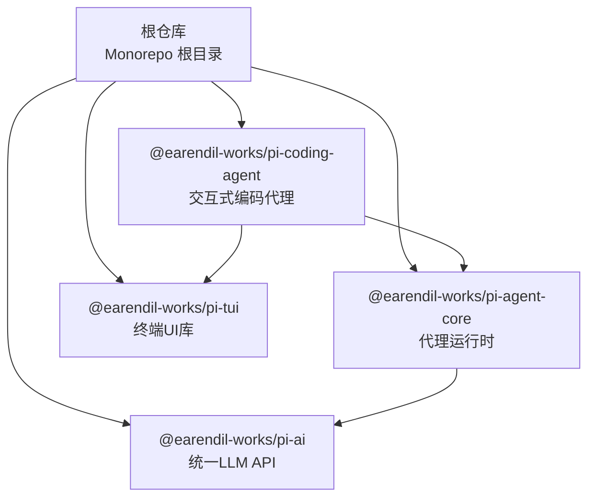
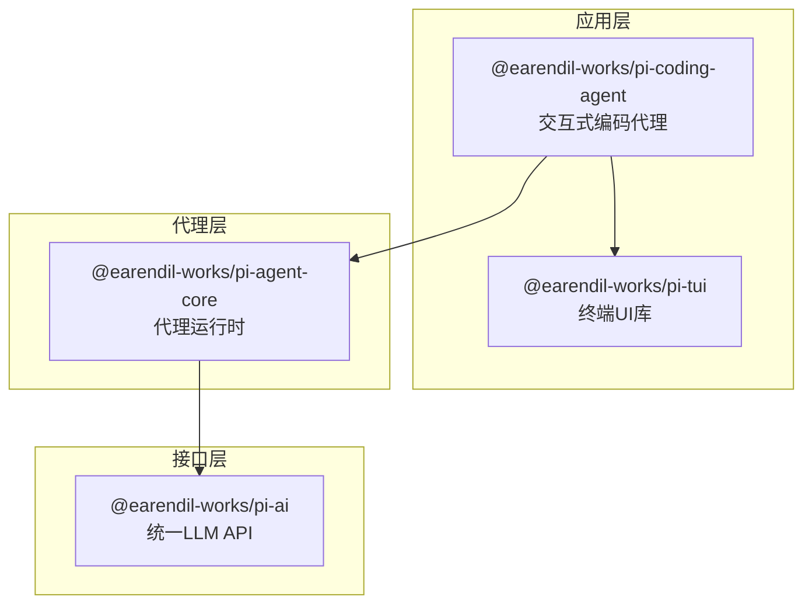
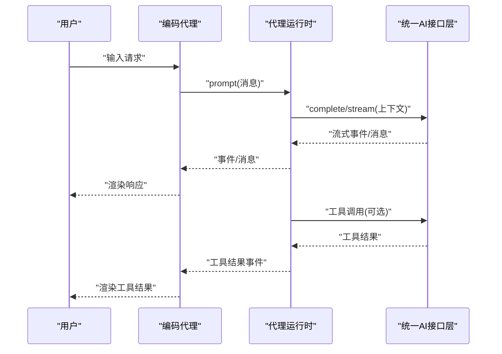
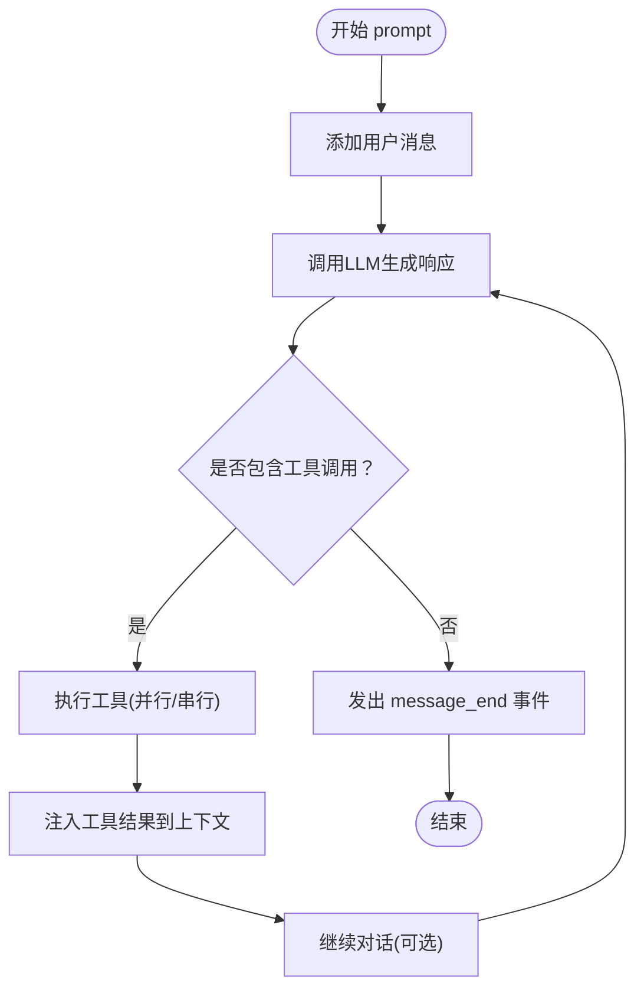
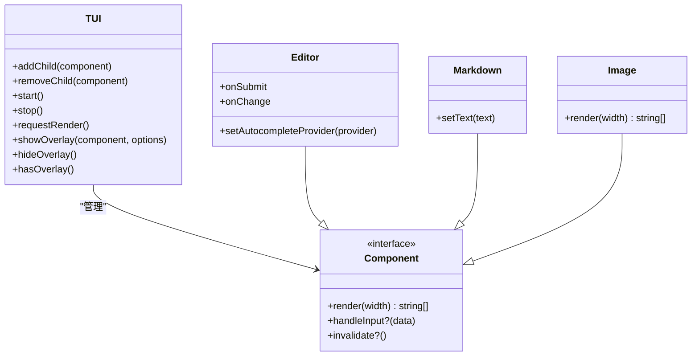
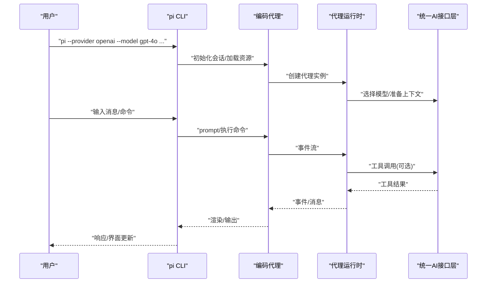
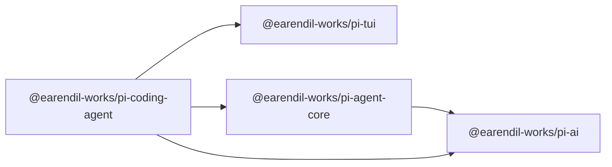

# 项目概述

<cite>
**本文档引用的文件**
- [README.md](file://README.md)
- [package.json](file://package.json)
- [CONTRIBUTING.md](file://CONTRIBUTING.md)
- [AGENTS.md](file://AGENTS.md)
- [packages/ai/README.md](file://packages/ai/README.md)
- [packages/agent/README.md](file://packages/agent/README.md)
- [packages/coding-agent/README.md](file://packages/coding-agent/README.md)
- [packages/tui/README.md](file://packages/tui/README.md)
- [scripts/sync-versions.js](file://scripts/sync-versions.js)
- [scripts/release.mjs](file://scripts/release.mjs)
- [tsconfig.base.json](file://tsconfig.base.json)
- [tsconfig.json](file://tsconfig.json)
</cite>

## 目录
1. [简介](#简介)
2. [项目结构](#项目结构)
3. [核心组件](#核心组件)
4. [架构总览](#架构总览)
5. [详细组件分析](#详细组件分析)
6. [依赖关系分析](#依赖关系分析)
7. [性能考量](#性能考量)
8. [故障排除指南](#故障排除指南)
9. [结论](#结论)
10. [附录](#附录)

## 简介
Pi 是一个现代化的 AI 代理开发平台，旨在通过统一的 AI 接口层、可扩展的智能代理系统与终端用户界面，为开发者提供一体化的 AI 编码与交互体验。项目采用 Monorepo 架构，围绕统一的 LLM API 抽象（@earendil-works/pi-ai）构建，向上支撑代理运行时（@earendil-works/pi-agent-core），向下提供终端 UI 能力（@earendil-works/pi-tui），并通过交互式编码代理（@earendil-works/pi-coding-agent）将这些能力整合到实际工作流中。

Pi 的核心价值在于：
- 统一多提供商 LLM API：屏蔽不同模型供应商的差异，提供一致的工具调用、思维/推理、流式事件与上下文管理能力。
- 可扩展代理框架：内置事件驱动的代理循环、工具执行管线、消息状态管理与会话树结构，支持并行/串行工具执行模式与动态思考预算。
- 终端优先的交互界面：基于差分渲染与同步输出的 TUI 框架，提供无闪烁、高性能的交互式编辑器、Markdown 渲染、图像内联显示与覆盖层等能力。
- 开放生态与最小核心：通过扩展、技能、提示模板与主题实现高度可定制；核心保持精简，避免在内部强加特定工作流。

## 项目结构
Pi 采用基于包的 Monorepo 结构，根目录包含统一的构建脚本、类型配置与发布流程，各子包位于 packages 目录下，分别承担不同职责：
- packages/ai：统一的多提供商 LLM API 与工具调用抽象，提供流式事件、思维/推理、图像输入/生成、OAuth 登录与跨提供商转接等能力。
- packages/agent：通用代理运行时，封装工具调用、状态管理、事件流与会话树，支持并行/串行工具执行与动态思考预算。
- packages/coding-agent：交互式编码代理 CLI，集成 TUI、会话管理、工具集（read、bash、edit、write 等）、扩展/技能/提示模板/主题生态与 RPC/SDK 模式。
- packages/tui：终端用户界面库，提供差分渲染、同步输出、覆盖层、组件体系与内联图像支持，用于构建无闪烁的交互式 CLI 应用。

**图表来源**
- [package.json:5-11](file://package.json#L5-L11)
- [packages/ai/package.json:1-107](file://packages/ai/package.json#L1-L107)
- [packages/agent/package.json:1-61](file://packages/agent/package.json#L1-L61)
- [packages/coding-agent/package.json:1-99](file://packages/coding-agent/package.json#L1-L99)
- [packages/tui/package.json:1-48](file://packages/tui/package.json#L1-L48)

**章节来源**
- [README.md:48-57](file://README.md#L48-L57)
- [package.json:5-11](file://package.json#L5-L11)

## 核心组件
- 统一的 AI 接口层（@earendil-works/pi-ai）
  - 支持多提供商（OpenAI、Anthropic、Google、Mistral、Bedrock 等）与兼容 API，提供统一的工具调用、思维/推理、流式事件与上下文序列化。
  - 提供类型安全的工具定义与参数校验，支持部分 JSON 流式解析与错误重试机制。
  - 支持图像输入与图像生成（通过专用 API），并提供 OAuth 登录与令牌管理。
- 智能代理系统（@earendil-works/pi-agent-core）
  - 基于事件驱动的代理循环，支持工具预检、并行/串行执行、工具结果注入与后续回合。
  - 提供消息状态管理、思考级别控制、会话树导航与分支/克隆能力。
  - 支持代理钩子（beforeToolCall/afterToolCall）、终止提示与动态 API 密钥解析。
- 终端用户界面（@earendil-works/pi-tui）
  - 差分渲染与同步输出，确保无闪烁原子更新；提供覆盖层、组件体系（文本、输入、编辑器、Markdown、选择列表、设置面板、图片等）。
  - 内置自动完成、括号粘贴模式、IME 光标定位支持与内联图像渲染。
- 交互式编码代理（@earendil-works/pi-coding-agent）
  - 提供交互式模式、打印/JSON/RPC/SDK 四种运行模式；内置 read、bash、edit、write 等工具与会话树管理。
  - 支持扩展、技能、提示模板与主题生态；提供包安装/卸载/更新与配置管理。

**章节来源**
- [packages/ai/README.md:1-1384](file://packages/ai/README.md#L1-L1384)
- [packages/agent/README.md:1-489](file://packages/agent/README.md#L1-L489)
- [packages/tui/README.md:1-780](file://packages/tui/README.md#L1-L780)
- [packages/coding-agent/README.md:1-660](file://packages/coding-agent/README.md#L1-L660)

## 架构总览
Pi 的架构以“统一 AI 接口层”为核心，向上为代理运行时提供一致的模型与工具调用抽象，向下为终端 UI 提供高效渲染与交互能力，并通过编码代理将这些能力整合到实际工作流中。

**图表来源**
- [packages/coding-agent/package.json:42-58](file://packages/coding-agent/package.json#L42-L58)
- [packages/agent/package.json:31-35](file://packages/agent/package.json#L31-L35)
- [packages/ai/package.json:69-80](file://packages/ai/package.json#L69-L80)

## 详细组件分析

### 组件 A：统一 AI 接口层（@earendil-works/pi-ai）
- 设计要点
  - 多提供商统一抽象：通过注册表与 API 实现，屏蔽供应商差异，提供一致的流式事件、工具调用与上下文序列化。
  - 类型安全工具：基于 TypeBox 的工具参数定义与验证，支持自动转换与序列化，便于分布式系统协作。
  - 思维/推理与图像能力：统一的 reasoning 选项与图像输入/生成 API，支持跨模型的思维过程展示与视觉分析。
  - 错误处理与中断：提供中断信号、错误事件与继续机制，支持会话续传与上下文合并。
- 数据流与处理逻辑
  - 工具调用：模型返回工具调用块 → 参数流式解析 → 验证后执行 → 结果注入上下文 → 继续对话。
  - 思维/推理：根据模型能力启用推理模式，流式或一次性返回思考内容与最终响应。
  - 图像输入/生成：图像数据经 Base64 编码传递，模型输入/输出支持混合文本与图像块。
- 依赖关系
  - 依赖 @anthropic-ai/sdk、@google/genai、@mistralai/mistralai、openai 等官方 SDK，以及 http/https 代理与类型校验库。

**图表来源**
- [packages/agent/README.md:58-100](file://packages/agent/README.md#L58-L100)
- [packages/ai/README.md:371-391](file://packages/ai/README.md#L371-L391)

**章节来源**
- [packages/ai/README.md:1-1384](file://packages/ai/README.md#L1-L1384)

### 组件 B：智能代理系统（@earendil-works/pi-agent-core）
- 设计要点
  - 事件驱动：提供 agent_start/turn_start/message_start/message_update/message_end/tool_execution_* 等事件，便于 UI 响应与日志追踪。
  - 工具执行模式：支持并行与串行两种模式，允许单个工具覆盖全局设置；支持 beforeToolCall/afterToolCall 钩子与 terminate 提示。
  - 上下文与会话：支持消息修剪、压缩与树形会话管理；支持思考预算与动态 API 密钥解析。
- 数据流与处理逻辑
  - prompt() 触发一轮对话 → 流式消息更新 → 工具调用（可并发） → 工具结果注入 → 继续对话或结束。
  - continue() 从现有上下文恢复，适用于错误重试与中断恢复。
- 低层 API
  - agentLoop/agentLoopContinue 提供直接控制，适合需要精确事件观察与自定义处理的场景。

**图表来源**
- [packages/agent/README.md:58-100](file://packages/agent/README.md#L58-L100)

**章节来源**
- [packages/agent/README.md:1-489](file://packages/agent/README.md#L1-L489)

### 组件 C：终端用户界面（@earendil-works/pi-tui）
- 设计要点
  - 差分渲染：三种策略（首次全量、宽度变化/越界、常规增量），配合同步输出实现无闪烁更新。
  - 组件体系：文本、截断文本、输入、编辑器、Markdown、加载器、选择列表、设置面板、图片、容器等。
  - 交互能力：覆盖层、自动完成、括号粘贴、IME 光标定位、键值检测与内联图像渲染。
- 使用场景
  - 编辑器与命令面板：支持多行编辑、斜杠命令、文件路径补全与大段粘贴处理。
  - 设置与对话：设置面板与 Markdown 渲染，提升交互效率与信息密度。
  - 图像展示：在支持的终端中内联渲染图片，增强可视化反馈。

**图表来源**
- [packages/tui/README.md:55-156](file://packages/tui/README.md#L55-L156)

**章节来源**
- [packages/tui/README.md:1-780](file://packages/tui/README.md#L1-L780)

### 组件 D：交互式编码代理（@earendil-works/pi-coding-agent）
- 设计要点
  - 运行模式：交互式、打印/JSON、RPC、SDK 四种模式，满足不同集成需求。
  - 工具集：内置 read、bash、edit、write、grep、find、ls 等工具，支持只读模式与工具白名单/黑名单。
  - 会话管理：树形会话存储，支持分支/克隆/压缩/导出/分享；支持消息队列（steering/follow-up）。
  - 生态扩展：扩展、技能、提示模板、主题与 Pi 包，支持 npm/git 安装与本地/全局共享。
- 快速开始
  - 全局安装后通过环境变量或登录命令配置提供商密钥，启动交互式会话。
  - 使用 /model、/settings、/tree、/fork、/clone 等命令管理模型与会话。

**图表来源**
- [packages/coding-agent/README.md:434-467](file://packages/coding-agent/README.md#L434-L467)

**章节来源**
- [packages/coding-agent/README.md:1-660](file://packages/coding-agent/README.md#L1-L660)

## 依赖关系分析
- 版本与发布
  - 采用锁步版本（lockstep）策略，所有包版本保持一致，通过脚本同步内部依赖版本并生成 shrinkwrap。
  - 发布流程自动化：检查工作区状态、更新变更日志、生成发布产物、提交标签并触发 CI 发布。
- 类型与路径映射
  - 根 tsconfig 提供统一编译选项与路径别名映射，确保跨包导入的一致性与类型完整性。
- 包间依赖
  - @earendil-works/pi-coding-agent 依赖 @earendil-works/pi-tui、@earendil-works/pi-agent-core、@earendil-works/pi-ai。
  - @earendil-works/pi-agent-core 依赖 @earendil-works/pi-ai 与通用工具库。
  - @earendil-works/pi-ai 提供多提供商 SDK 与工具调用基础设施。

**图表来源**
- [packages/coding-agent/package.json:42-58](file://packages/coding-agent/package.json#L42-L58)
- [packages/agent/package.json:31-35](file://packages/agent/package.json#L31-L35)
- [packages/ai/package.json:69-80](file://packages/ai/package.json#L69-L80)

**章节来源**
- [scripts/sync-versions.js:1-97](file://scripts/sync-versions.js#L1-L97)
- [scripts/release.mjs:1-204](file://scripts/release.mjs#L1-L204)
- [tsconfig.json:5-21](file://tsconfig.json#L5-L21)

## 性能考量
- 差分渲染与同步输出：TUI 的差分渲染策略与同步输出显著降低屏幕刷新开销，避免闪烁与重复绘制，适合长时间交互场景。
- 流式事件与工具调用：统一 AI 接口层的流式事件与部分 JSON 解析支持实时 UI 更新，减少等待时间；工具调用支持并行执行以提升吞吐。
- 会话压缩与缓存：代理运行时支持上下文修剪与压缩，结合提供商缓存（如会话 ID）减少重复计算与带宽消耗。
- 构建与发布优化：锁步版本与 shrinkwrap 保证依赖一致性，减少安装与解析成本；发布脚本自动化生成产物与变更日志，降低人为错误。

## 故障排除指南
- 认证与提供商问题
  - 使用 /login 或设置环境变量配置提供商密钥；若出现认证失败，检查密钥有效性与网络可达性。
  - 对于 OAuth 提供商，参考统一 AI 接口层的 OAuth 登录与令牌使用说明。
- 工具调用与参数校验
  - 若工具调用失败，检查工具参数 Schema 与类型；统一 AI 接口层提供参数校验与错误重试机制。
  - 在代理运行时中，beforeToolCall/afterToolCall 钩子可用于拦截与调试工具执行。
- 中断与恢复
  - 使用中断信号（AbortSignal）取消长请求；被中断的消息可作为上下文继续后续对话。
  - 会话树支持分支/克隆/压缩，必要时进行上下文修剪以避免上下文窗口溢出。
- 构建与发布
  - 发布前确保工作区干净，遵循发布脚本流程；若版本不一致，使用同步脚本修复内部依赖版本。

**章节来源**
- [packages/ai/README.md:597-696](file://packages/ai/README.md#L597-L696)
- [packages/agent/README.md:416-433](file://packages/agent/README.md#L416-L433)
- [scripts/release.mjs:145-204](file://scripts/release.mjs#L145-L204)

## 结论
Pi 通过统一的 AI 接口层、可扩展的代理系统与高效的终端 UI 能力，为开发者提供了从模型抽象到交互体验的完整链路。其 Monorepo 架构与锁步版本策略确保了跨包一致性与可维护性；生态化的扩展机制使平台既能保持核心精简，又能适应多样化的实际工作流。对于初学者，Pi 提供清晰的入门路径与丰富的示例；对于有经验的开发者，Pi 提供了深入的事件流、工具管线与会话管理能力，便于二次开发与深度定制。

## 附录

### 快速开始指南
- 系统要求
  - Node.js 版本要求：>= 22.19.0
  - 各包均声明相同引擎版本，确保一致的运行环境。
- 安装步骤
  - 全局安装编码代理：使用 npm 安装全局包，或通过安装脚本进行安装。
  - 配置提供商密钥：通过环境变量或登录命令配置所需提供商的密钥。
- 基本使用示例
  - 启动交互式会话：直接运行 pi 命令，进入交互界面。
  - 切换模型与思考级别：使用 /model 与 /settings 命令调整当前模型与思考级别。
  - 执行工具：在会话中直接使用内置工具（如 read、write、bash）完成任务。
  - 管理会话：使用 /tree、/fork、/clone 等命令管理会话树与分支。

**章节来源**
- [package.json:49-51](file://package.json#L49-L51)
- [packages/coding-agent/README.md:68-100](file://packages/coding-agent/README.md#L68-L100)

### 开源理念与社区贡献
- 开源理念
  - MIT 许可证，鼓励自由使用与二次开发；强调最小核心与高度可扩展的生态设计。
- 贡献方式
  - 新贡献者默认会被自动关闭问题与 PR，需达到质量标准后由维护者重新开启。
  - 贡献前需通过检查与测试：运行检查脚本与测试套件，确保代码风格、类型与依赖合规。
  - 遵循开发规则与质量门禁：严格的质量标准与行为准则，避免自动化低质量提交。
- 社区互动
  - 通过 Discord 获取帮助与讨论；问题与 PR 需遵循模板与质量标准。

**章节来源**
- [README.md:87-90](file://README.md#L87-L90)
- [CONTRIBUTING.md:1-94](file://CONTRIBUTING.md#L1-L94)
- [AGENTS.md:1-160](file://AGENTS.md#L1-L160)