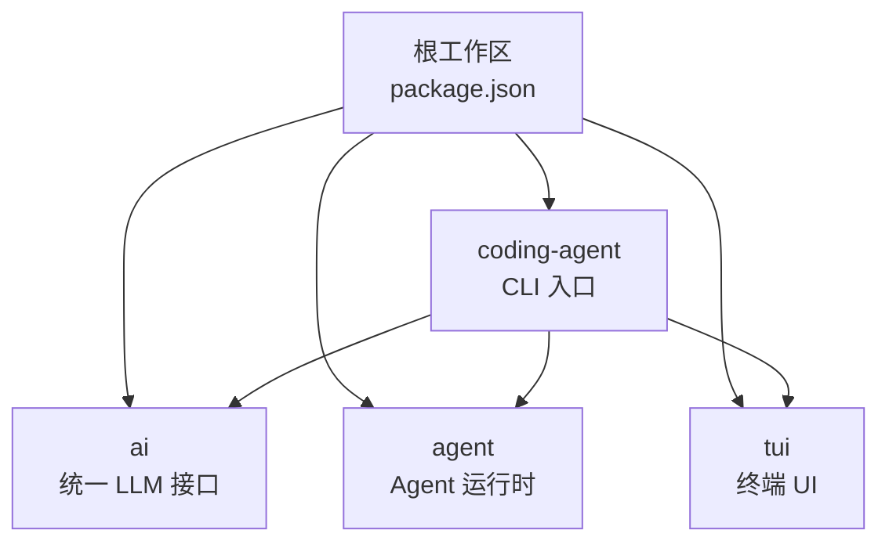
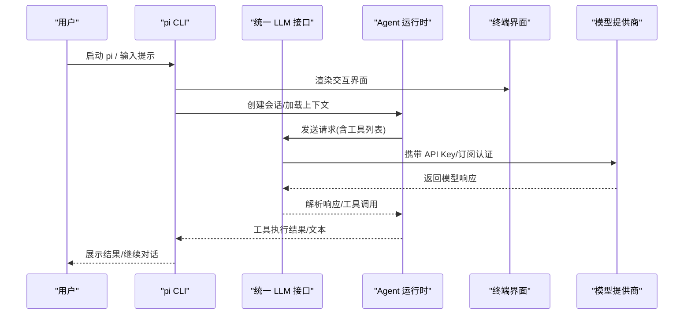
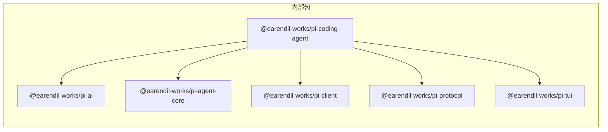

# 快速开始指南

<cite>
**本文引用的文件**
- [README.md](file://README.md)
- [package.json](file://package.json)
- [packages/coding-agent/README.md](file://packages/coding-agent/README.md)
- [packages/coding-agent/package.json](file://packages/coding-agent/package.json)
- [packages/coding-agent/docs/quickstart.md](file://packages/coding-agent/docs/quickstart.md)
- [packages/coding-agent/docs/environment-variables.md](file://packages/coding-agent/docs/environment-variables.md)
- [CONTRIBUTING.md](file://CONTRIBUTING.md)
- [packages/ai/src/providers/moonshotai-cn.ts](file://packages/ai/src/providers/moonshotai-cn.ts)
</cite>

## 目录
1. [简介](#简介)
2. [项目结构](#项目结构)
3. [核心组件](#核心组件)
4. [架构总览](#架构总览)
5. [详细组件分析](#详细组件分析)
6. [依赖分析](#依赖分析)
7. [性能注意事项](#性能注意事项)
8. [故障排除指南](#故障排除指南)
9. [结论](#结论)
10. [附录](#附录)

## 简介
本指南面向首次接触 Pi Agent Harness 的用户，目标是在 5 分钟内完成安装、配置并运行第一个示例。你将学会：
- 使用 npm 或 yarn 安装依赖
- 配置环境变量与 API Key
- 启动交互式编码代理并执行简单任务
- 查看输出结果
- 了解常用配置选项与环境设置
- 搭建开发环境（克隆仓库、安装依赖、构建、运行测试）
- 解决常见安装与配置问题

## 项目结构
Pi 是一个多包工作区（monorepo），核心 CLI 位于 packages/coding-agent，AI 能力封装在 packages/ai，Agent 运行时在 packages/agent，TUI 终端界面在 packages/tui。根目录提供统一的构建与检查脚本。

图表来源
- [package.json:1-13](file://package.json#L1-L13)
- [packages/coding-agent/package.json:1-13](file://packages/coding-agent/package.json#L1-L13)

章节来源
- [README.md:26-35](file://README.md#L26-L35)
- [package.json:1-13](file://package.json#L1-L13)

## 核心组件
- 交互编码代理 CLI：提供交互式会话、命令、会话管理、工具调用等能力
- 统一 LLM 接口：抽象多家模型提供商的认证与调用
- Agent 运行时：负责工具调用、状态管理与会话编排
- TUI：终端用户界面，支持消息流、编辑器、快捷键等

章节来源
- [packages/coding-agent/README.md:15-19](file://packages/coding-agent/README.md#L15-L19)
- [packages/coding-agent/package.json:1-13](file://packages/coding-agent/package.json#L1-L13)

## 架构总览
下图展示了从 CLI 到 LLM 调用的基本流程，包括认证、模型选择、工具调用与会话持久化。

图表来源
- [packages/coding-agent/README.md:147-233](file://packages/coding-agent/README.md#L147-L233)
- [packages/coding-agent/README.md:514-663](file://packages/coding-agent/README.md#L514-L663)
- [packages/ai/src/providers/moonshotai-cn.ts:6-14](file://packages/ai/src/providers/moonshotai-cn.ts#L6-L14)

## 详细组件分析

### 安装与运行（5 分钟上手）
- 全局安装 CLI
  - 使用 npm：npm install -g --ignore-scripts @earendil-works/pi-coding-agent
  - 或使用 curl 安装器：curl -fsSL https://pi.dev/install.sh | sh
- 进入你的项目目录并启动交互模式：cd /path/to/project && pi
- 认证方式二选一：
  - 通过订阅登录：在交互界面执行 /login 并选择提供商
  - 通过环境变量设置 API Key：export ANTHROPIC_API_KEY=sk-ant-... 然后启动 pi
- 首次会话：直接输入自然语言请求即可，例如“总结这个仓库并告诉我如何运行检查”

章节来源
- [packages/coding-agent/docs/quickstart.md:5-40](file://packages/coding-agent/docs/quickstart.md#L5-L40)
- [packages/coding-agent/docs/quickstart.md:42-67](file://packages/coding-agent/docs/quickstart.md#L42-L67)
- [packages/coding-agent/docs/quickstart.md:69-84](file://packages/coding-agent/docs/quickstart.md#L69-L84)

### 基本使用方法
- 启动交互式编码代理：pi
- 执行简单任务：
  - 列出当前目录下的 .ts 文件：pi "列出 src/ 下所有 .ts 文件"
  - 非交互一次性任务：pi -p "总结这段代码"
  - 读取管道输入：cat README.md | pi -p "总结此文本"
- 查看输出结果：
  - 交互模式下会实时显示模型回复、工具调用与结果
  - 非交互模式将直接打印结果并退出

章节来源
- [packages/coding-agent/README.md:63-93](file://packages/coding-agent/README.md#L63-L93)
- [packages/coding-agent/README.md:628-663](file://packages/coding-agent/README.md#L628-L663)

### 第一个示例：编写提示词获取代码建议
- 在项目根目录创建 AGENTS.md，写入你的项目约定与偏好，例如：
  - “修改后请运行 npm run check”
  - “保持回答简洁”
  - “不要本地执行生产迁移”
- 重启 pi 或执行 /reload 使上下文生效
- 向代理提问以获取代码建议，例如：“为当前模块添加单元测试”

章节来源
- [packages/coding-agent/docs/quickstart.md:86-105](file://packages/coding-agent/docs/quickstart.md#L86-L105)

### 常用配置与环境变量
- 进程级环境变量（控制 Pi 行为）
  - PI_OFFLINE：禁用启动时的网络操作（更新检查、包更新、遥测）
  - PI_SKIP_VERSION_CHECK：跳过版本更新检查
  - PI_TELEMETRY：控制安装/更新遥测与提供商归属头
  - PI_CODING_AGENT_DIR：覆盖配置目录（默认 ~/.pi/agent）
  - PI_CODING_AGENT_SESSION_DIR：覆盖会话存储目录
  - HTTP_PROXY/HTTPS_PROXY：设置出站 HTTP 代理
- Bash 工具会话环境变量（由 LLM 可调用的 bash 工具注入）
  - PI_SESSION_ID、PI_SESSION_FILE、PI_PROVIDER、PI_MODEL、PI_REASONING_LEVEL
- 提供商凭据
  - 各提供商的 API Key 环境变量见提供商文档；也可通过 /login 保存到 auth.json

章节来源
- [packages/coding-agent/docs/environment-variables.md:11-29](file://packages/coding-agent/docs/environment-variables.md#L11-L29)
- [packages/coding-agent/docs/environment-variables.md:70-88](file://packages/coding-agent/docs/environment-variables.md#L70-L88)
- [packages/coding-agent/README.md:665-690](file://packages/coding-agent/README.md#L665-L690)

### 开发环境搭建
- 克隆仓库并安装依赖
  - npm install --ignore-scripts
- 构建项目
  - npm run build
  - 离线构建：npm run build:offline
- 运行检查与测试
  - npm run check
  - ./test.sh
- 从源码运行 pi
  - ./pi-test.sh（可在任意目录运行）

章节来源
- [README.md:52-61](file://README.md#L52-L61)
- [CONTRIBUTING.md:56-67](file://CONTRIBUTING.md#L56-L67)

### 进阶：程序化使用与 RPC
- SDK 嵌入：通过 createAgentSession 与 ModelRuntime 在 Node 应用中集成
- RPC 模式：pi --mode rpc 用于进程间集成（严格 JSONL 帧）

章节来源
- [packages/coding-agent/README.md:460-490](file://packages/coding-agent/README.md#L460-L490)

## 依赖分析
- 工作区与包关系
  - 根 package.json 声明 workspaces，包含 packages/* 及若干扩展示例
  - coding-agent 依赖 ai、agent、client、protocol、tui 等内部包
- 外部依赖
  - 统一 LLM 接口支持多家提供商，认证通过环境变量或订阅登录
  - 示例中 moonshotai-cn 使用 envApiKeyAuth 读取 MOONSHOT_API_KEY

图表来源
- [package.json:1-13](file://package.json#L1-L13)
- [packages/coding-agent/package.json:45-66](file://packages/coding-agent/package.json#L45-L66)
- [packages/ai/src/providers/moonshotai-cn.ts:6-14](file://packages/ai/src/providers/moonshotai-cn.ts#L6-L14)

章节来源
- [package.json:1-13](file://package.json#L1-L13)
- [packages/coding-agent/package.json:45-66](file://packages/coding-agent/package.json#L45-L66)

## 性能注意事项
- 会话过长时启用自动压缩，避免超出上下文窗口
- 合理选择模型与思考级别（thinking level）平衡质量与成本
- 使用只读工具模式减少不必要的写操作
- 利用缓存保留策略（如 PI_CACHE_RETENTION）提升重复查询效率

[本节为通用指导，不直接分析具体文件]

## 故障排除指南
- 无法联网或更新检查失败
  - 设置 PI_OFFLINE=1 禁用所有启动网络操作
  - 或设置 PI_SKIP_VERSION_CHECK=1 仅跳过版本检查
- 提供商认证失败
  - 确认已正确设置对应 API Key 环境变量或通过 /login 保存至 auth.json
  - 参考提供商文档中的环境变量与云厂商配置
- 权限与隔离
  - 如需更强边界，使用容器或沙箱运行（详见容器化文档）
- 构建/测试失败
  - 确保 Node 版本满足要求（>=22.19.0）
  - 使用 npm run check 与 ./test.sh 定位问题
  - 若需离线构建，使用 npm run build:offline

章节来源
- [packages/coding-agent/docs/environment-variables.md:70-88](file://packages/coding-agent/docs/environment-variables.md#L70-L88)
- [packages/coding-agent/README.md:665-690](file://packages/coding-agent/README.md#L665-L690)
- [README.md:52-61](file://README.md#L52-L61)
- [CONTRIBUTING.md:56-67](file://CONTRIBUTING.md#L56-L67)

## 结论
通过以上步骤，你可以在 5 分钟内完成安装、配置并运行第一个示例。后续可根据需求调整会话、模型、工具与扩展，逐步构建符合你工作流的智能编码助手。

## 附录
- 快速参考
  - 安装：npm install -g --ignore-scripts @earendil-works/pi-coding-agent
  - 启动：pi
  - 认证：/login 或 export ANTHROPIC_API_KEY=...
  - 非交互：pi -p "你的提示"
  - 开发：npm run build && npm run check && ./test.sh

[本节为汇总信息，不直接分析具体文件]