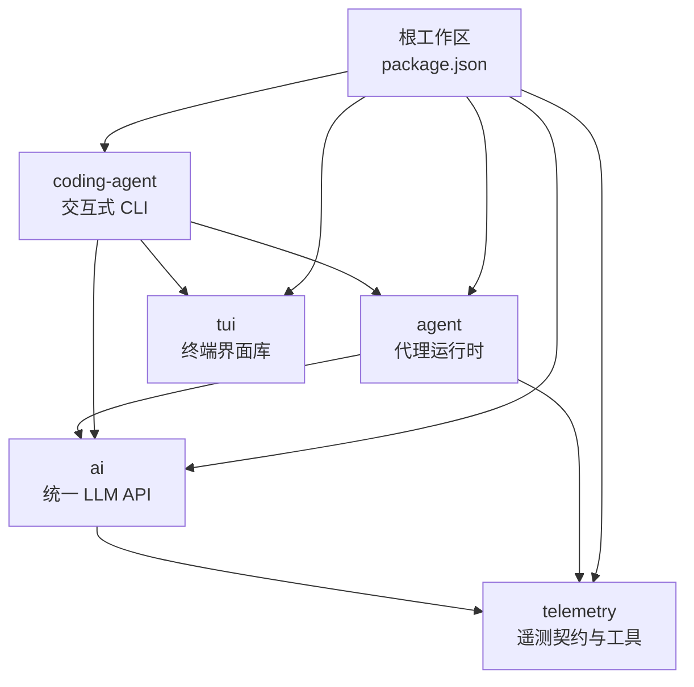
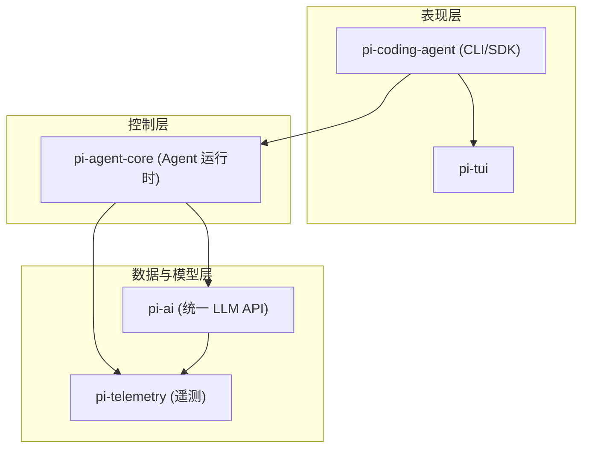
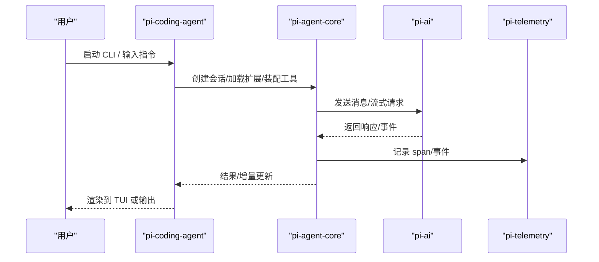
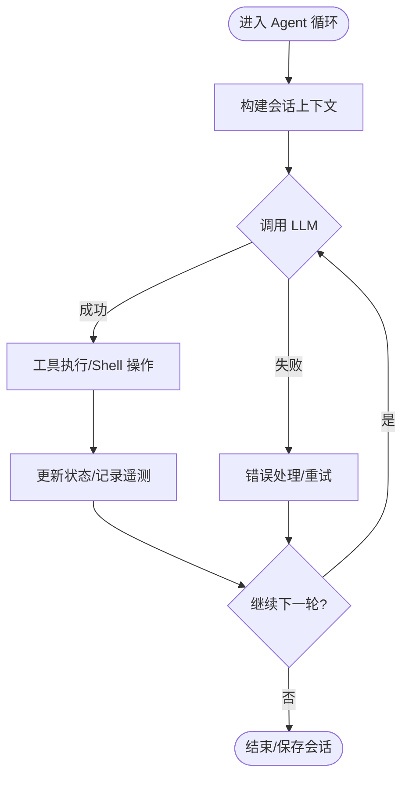
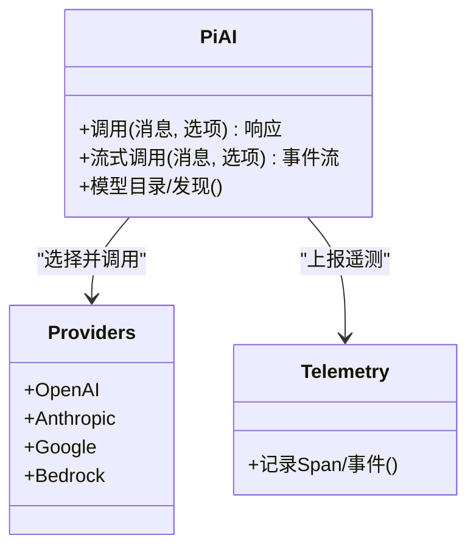
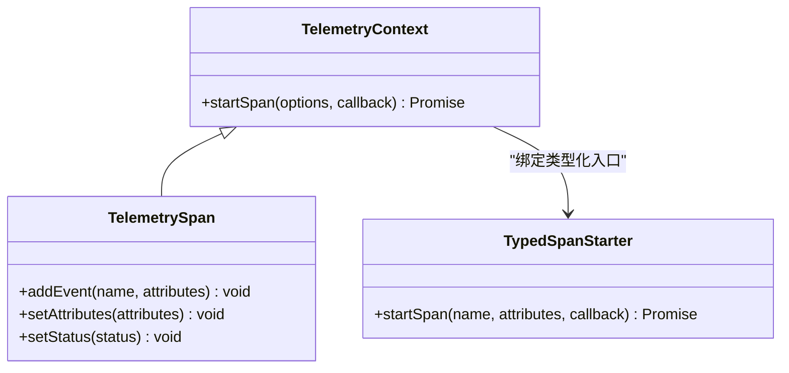
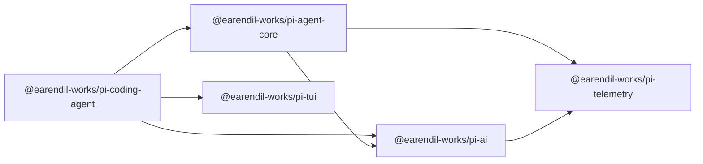

# 技术架构概览

<cite>
**本文引用的文件**
- [README.md](file://README.md)
- [package.json](file://package.json)
- [biome.json](file://biome.json)
- [tsconfig.base.json](file://tsconfig.base.json)
- [packages/coding-agent/package.json](file://packages/coding-agent/package.json)
- [packages/agent/package.json](file://packages/agent/package.json)
- [packages/ai/package.json](file://packages/ai/package.json)
- [packages/tui/package.json](file://packages/tui/package.json)
- [packages/telemetry/package.json](file://packages/telemetry/package.json)
- [packages/coding-agent/src/index.ts](file://packages/coding-agent/src/index.ts)
- [packages/agent/src/index.ts](file://packages/agent/src/index.ts)
- [packages/ai/src/index.ts](file://packages/ai/src/index.ts)
- [packages/telemetry/src/index.ts](file://packages/telemetry/src/index.ts)
</cite>

## 目录
1. [简介](#简介)
2. [项目结构](#项目结构)
3. [核心组件](#核心组件)
4. [架构总览](#架构总览)
5. [详细组件分析](#详细组件分析)
6. [依赖关系分析](#依赖关系分析)
7. [性能与运行时特性](#性能与运行时特性)
8. [故障排查指南](#故障排查指南)
9. [结论](#结论)
10. [附录](#附录)

## 简介
本技术架构概览面向 Pi Agent Harness，聚焦 monorepo 中多个独立 npm 包的协作方式与通信机制。重点覆盖：
- pi-coding-agent（交互式 CLI）
- pi-agent-core（代理运行时）
- pi-ai（统一 LLM API）
- pi-tui（终端界面库）
- pi-telemetry（遥测系统）

同时说明核心技术栈（TypeScript、Bun、Vitest、Biome）与架构原则（模块化、插件化、适配器模式、观察者模式），并提供架构图与交互流程图。

**章节来源**
- [README.md:13-36](file://README.md#L13-L36)

## 项目结构
仓库采用 npm workspaces 的 monorepo 组织方式，根 package.json 声明了 packages/* 等子包工作区，并通过脚本统一构建与检查。各包职责清晰、边界明确，形成“CLI → 运行时 → 模型接口 → 界面 → 遥测”的分层协作。

**图表来源**
- [package.json:5-13](file://package.json#L5-L13)

**章节来源**
- [package.json:1-75](file://package.json#L1-L75)

## 核心组件
- pi-coding-agent：提供交互式 CLI、会话管理、扩展系统、工具集、RPC/打印模式等能力，是用户入口与编排中心。
- pi-agent-core：通用代理运行时，封装传输抽象、状态管理、会话/压缩、提示模板、工具执行与遥测集成。
- pi-ai：统一多供应商 LLM API，屏蔽 OpenAI、Anthropic、Google、Bedrock 等差异，提供类型安全的配置与调用。
- pi-tui：高性能终端 UI 库，支持差分渲染与原生加速，为 CLI 提供流畅交互体验。
- pi-telemetry：厂商无关的遥测契约、类型化 Schema、内存上下文与测试工具，贯穿 AI 与 Agent 的可观测性。

**章节来源**
- [packages/coding-agent/package.json:1-109](file://packages/coding-agent/package.json#L1-L109)
- [packages/agent/package.json:1-69](file://packages/agent/package.json#L1-L69)
- [packages/ai/package.json:1-101](file://packages/ai/package.json#L1-L101)
- [packages/tui/package.json:1-56](file://packages/tui/package.json#L1-L56)
- [packages/telemetry/package.json:1-48](file://packages/telemetry/package.json#L1-L48)

## 架构总览
整体分层如下：
- 表现层：pi-tui 负责终端渲染与交互；pi-coding-agent 暴露 CLI 与 SDK。
- 控制层：pi-agent-core 驱动代理循环、会话与工具执行。
- 数据与模型层：pi-ai 统一 LLM 调用；pi-telemetry 提供可观测性。
- 扩展点：插件化扩展、工具注册、事件总线与 RPC 通道。

**图表来源**
- [packages/coding-agent/src/index.ts:199-351](file://packages/coding-agent/src/index.ts#L199-L351)
- [packages/agent/src/index.ts:1-146](file://packages/agent/src/index.ts#L1-L146)
- [packages/ai/src/index.ts:1-48](file://packages/ai/src/index.ts#L1-L48)
- [packages/telemetry/src/index.ts:1-358](file://packages/telemetry/src/index.ts#L1-L358)

## 详细组件分析

### pi-coding-agent（交互式 CLI）
- 角色：用户入口、会话编排、扩展加载、工具装配、RPC/打印模式、主题与 UI 组件。
- 关键能力：
  - 会话与上下文：会话管理、压缩、分支摘要、技能加载、信任策略。
  - 扩展系统：发现与运行扩展、工具定义包装、事件总线。
  - 模式：交互式、RPC、打印输出。
  - 资源与配置：模型解析、凭证同步、包管理器、资源加载器。
- 对外导出大量类型与工厂方法，便于程序化集成。

**图表来源**
- [packages/coding-agent/src/index.ts:199-351](file://packages/coding-agent/src/index.ts#L199-L351)
- [packages/agent/src/index.ts:1-146](file://packages/agent/src/index.ts#L1-L146)
- [packages/ai/src/index.ts:1-48](file://packages/ai/src/index.ts#L1-L48)
- [packages/telemetry/src/index.ts:1-358](file://packages/telemetry/src/index.ts#L1-L358)

**章节来源**
- [packages/coding-agent/src/index.ts:1-409](file://packages/coding-agent/src/index.ts#L1-L409)

### pi-agent-core（代理运行时）
- 角色：驱动 Agent 循环、会话生命周期、工具执行、压缩与摘要、遥测集成。
- 关键能力：
  - 会话与压缩：会话条目、分支摘要、上下文估算、序列化。
  - 工具与 Shell：文件系统、命令执行、错误封装。
  - 遥测：基于 pi-telemetry 的类型化 Span/事件。
  - 适配与代理：传输抽象、流式函数默认实现。
- 通过 harness 暴露统一的测试与集成入口。

**图表来源**
- [packages/agent/src/index.ts:1-146](file://packages/agent/src/index.ts#L1-L146)

**章节来源**
- [packages/agent/src/index.ts:1-146](file://packages/agent/src/index.ts#L1-L146)

### pi-ai（统一 LLM API）
- 角色：统一多供应商 LLM 调用，自动模型发现与配置，提供类型安全选项与事件流。
- 关键能力：
  - 提供商：OpenAI、Anthropic、Google、Bedrock 等。
  - 类型系统：基于 TypeBox 的强类型配置与校验。
  - 兼容层：旧版全局 API 与 OAuth 辅助。
  - 图像模型：图片生成与处理相关能力。
- 作为被调用的底层能力，向上层提供稳定接口。

**图表来源**
- [packages/ai/src/index.ts:1-48](file://packages/ai/src/index.ts#L1-L48)

**章节来源**
- [packages/ai/package.json:1-101](file://packages/ai/package.json#L1-L101)
- [packages/ai/src/index.ts:1-48](file://packages/ai/src/index.ts#L1-L48)

### pi-tui（终端界面库）
- 角色：为 CLI 提供高性能终端 UI，支持差分渲染与原生加速。
- 关键能力：跨平台原生预编译模块、Markdown 渲染、宽度计算等。
- 与 CLI 紧密耦合，提升交互体验与性能。

**章节来源**
- [packages/tui/package.json:1-56](file://packages/tui/package.json#L1-L56)

### pi-telemetry（遥测系统）
- 角色：厂商无关的遥测契约、类型化 Schema、内存上下文与测试工具。
- 关键能力：
  - 类型化 Span/事件：通过 defineTelemetrySchema 与 createTypedSpanStarter 获得强类型约束。
  - 上下文：InMemoryTelemetryContext 用于测试与本地调试。
  - 无副作用：纯契约与工具，便于在各包中复用。

**图表来源**
- [packages/telemetry/src/index.ts:1-358](file://packages/telemetry/src/index.ts#L1-L358)

**章节来源**
- [packages/telemetry/src/index.ts:1-358](file://packages/telemetry/src/index.ts#L1-L358)

## 依赖关系分析
- 工作区与构建：根 package.json 使用 workspaces 聚合所有包，统一 build/check/test 脚本。
- 包间依赖：
  - coding-agent 依赖 agent、ai、client、protocol、tui。
  - agent 依赖 ai、telemetry。
  - ai 依赖 telemetry。
  - tui 与 telemetry 为低层基础包，不反向依赖上层。
- 代码质量与类型：
  - Biome 统一 lint/format。
  - TypeScript 严格模式与 ES2022 目标。

**图表来源**
- [packages/coding-agent/package.json:45-67](file://packages/coding-agent/package.json#L45-L67)
- [packages/agent/package.json:37-44](file://packages/agent/package.json#L37-L44)
- [packages/ai/package.json:62-74](file://packages/ai/package.json#L62-L74)

**章节来源**
- [package.json:1-75](file://package.json#L1-L75)
- [packages/coding-agent/package.json:1-109](file://packages/coding-agent/package.json#L1-L109)
- [packages/agent/package.json:1-69](file://packages/agent/package.json#L1-L69)
- [packages/ai/package.json:1-101](file://packages/ai/package.json#L1-L101)
- [packages/tui/package.json:1-56](file://packages/tui/package.json#L1-L56)
- [packages/telemetry/package.json:1-48](file://packages/telemetry/package.json#L1-L48)

## 性能与运行时特性
- 运行时：Bun 用于构建与打包二进制，结合 esbuild 提升构建速度；Node 引擎要求 >=22.19.0。
- 类型与编译：TypeScript 严格模式、ES2022 目标、声明与 SourceMap 开启，利于调试与发布。
- 代码质量：Biome 统一格式化与规则，配合 pre-commit 钩子保障一致性。
- 测试：Vitest 在各包内运行单元测试；根脚本统一触发。
- 构建优化：离线构建、模型数据缓存、shrinkwrap 锁定依赖，确保可重复构建。

**章节来源**
- [package.json:14-49](file://package.json#L14-L49)
- [biome.json:1-42](file://biome.json#L1-L42)
- [tsconfig.base.json:1-26](file://tsconfig.base.json#L1-L26)
- [packages/coding-agent/package.json:35-44](file://packages/coding-agent/package.json#L35-L44)

## 故障排查指南
- 构建失败
  - 检查 Node 版本是否满足要求（>=22.19.0）。
  - 清理 dist 后重新构建，必要时使用 offline 构建避免网络问题。
- 类型检查失败
  - 使用根脚本 check 统一执行 Biome 与 TS 检查，定位具体包与文件。
- 遥测异常
  - 确认已正确初始化 TelemetryContext，并使用 createTypedSpanStarter 绑定类型化入口。
- 模型/供应商配置
  - 使用 pi-ai 的模型目录与配置工具，核对环境变量与凭据存储。
- 依赖冲突
  - 根 overrides 已固定部分第三方依赖版本；若出现冲突，优先遵循根锁定策略。

**章节来源**
- [package.json:63-73](file://package.json#L63-L73)
- [packages/telemetry/src/index.ts:324-358](file://packages/telemetry/src/index.ts#L324-L358)

## 结论
Pi Agent Harness 以清晰的 monorepo 分层与严格的类型系统为基础，将 CLI、运行时、模型接口、界面与遥测解耦为独立 npm 包，既保证可扩展性与可维护性，又通过适配器与观察者模式实现松耦合协作。借助 Bun 的高性能与 Vitest/Biome 的工程化能力，项目在开发效率与交付质量上具备良好平衡。

## 附录
- 快速开始
  - 安装依赖与构建：npm install && npm run build
  - 运行检查：npm run check
  - 运行测试：./test.sh
- 贡献与发布
  - 遵循 CONTRIBUTING.md 与 AGENTS.md
  - 使用 scripts 中的发布流程与本地发布脚本

**章节来源**
- [README.md:52-88](file://README.md#L52-L88)