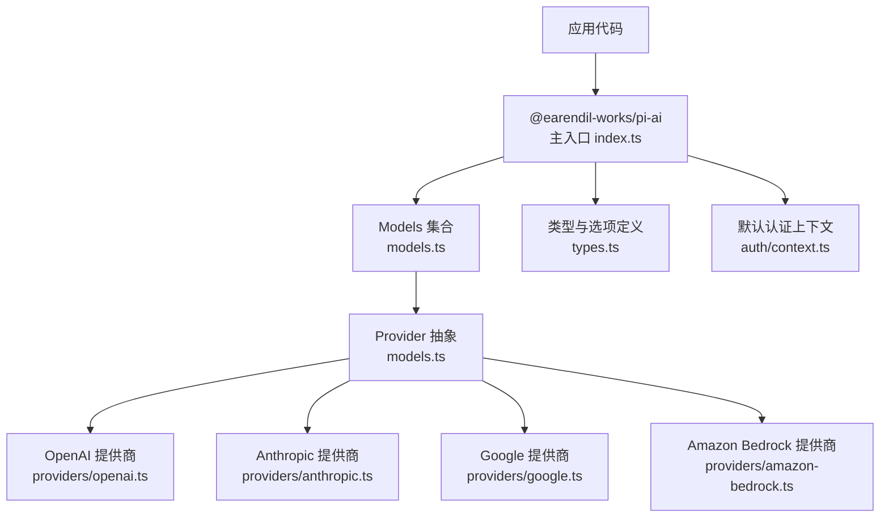
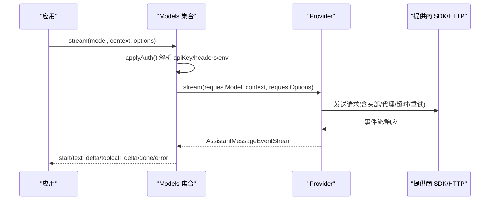
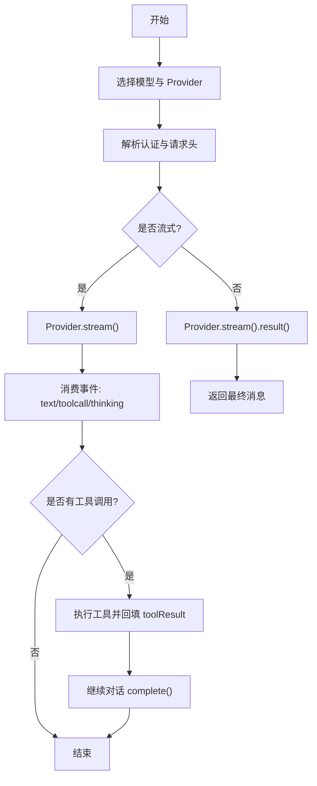
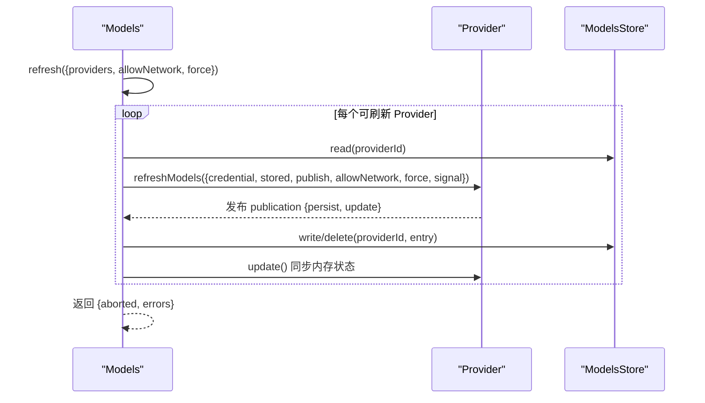
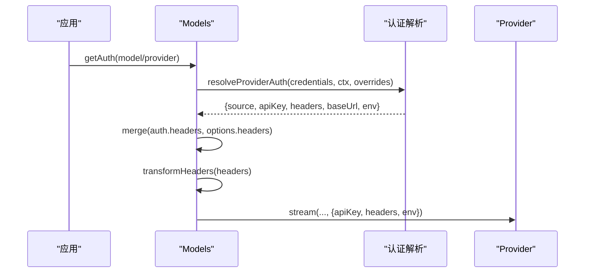
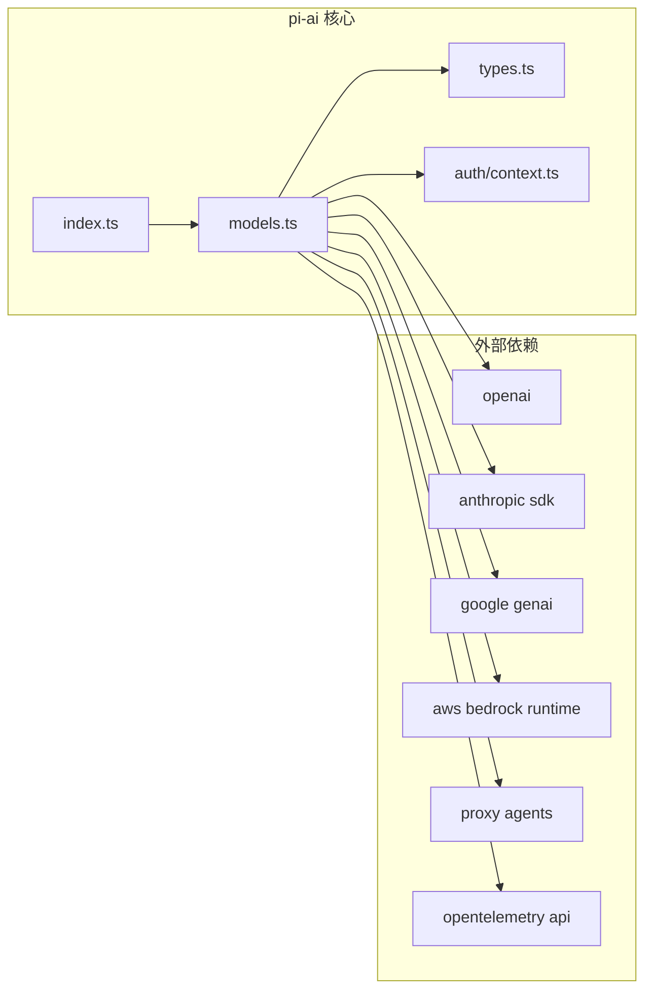

# AI 抽象层包 (pi-ai)

<cite>
**本文引用的文件**
- [README.md](file://packages/ai/README.md)
- [package.json](file://packages/ai/package.json)
- [index.ts](file://packages/ai/src/index.ts)
- [models.ts](file://packages/ai/src/models.ts)
- [types.ts](file://packages/ai/src/types.ts)
- [context.ts](file://packages/ai/src/auth/context.ts)
- [all.ts](file://packages/ai/src/providers/all.ts)
- [openai.ts](file://packages/ai/src/providers/openai.ts)
- [anthropic.ts](file://packages/ai/src/providers/anthropic.ts)
- [google.ts](file://packages/ai/src/providers/google.ts)
- [amazon-bedrock.ts](file://packages/ai/src/providers/amazon-bedrock.ts)
</cite>

## 目录
1. [简介](#简介)
2. [项目结构](#项目结构)
3. [核心组件](#核心组件)
4. [架构总览](#架构总览)
5. [详细组件分析](#详细组件分析)
6. [依赖关系分析](#依赖关系分析)
7. [性能考虑](#性能考虑)
8. [故障排查指南](#故障排查指南)
9. [结论](#结论)
10. [附录](#附录)

## 简介
pi-ai 是一个统一的多提供商 LLM API 抽象层，提供一致的聊天完成接口、模型发现机制、认证管理、流式响应处理与工具调用支持。它内置对 OpenAI、Anthropic Claude、Google Gemini、Amazon Bedrock 等主流服务的适配，并通过 Provider 工厂与 Models 集合将不同 API 的差异封装为统一的调用体验。同时支持图像生成、思考/推理能力、跨提供商上下文传递、OAuth 登录与凭据存储、请求头转换、重试与超时控制等高级特性。

## 项目结构
- 顶层入口导出类型与核心能力（无副作用），具体 Provider 工厂位于 providers/*，API 实现位于 api/*，兼容层在 compat。
- 通过 package.json 的 exports 暴露多个子路径：主入口、compat、providers/*、api/*、oauth、bedrock-provider、bun-oauth。
- 构建脚本包含模型数据生成、离线构建、测试等流程。

图表来源
- [index.ts:1-48](file://packages/ai/src/index.ts#L1-L48)
- [models.ts:88-149](file://packages/ai/src/models.ts#L88-L149)
- [types.ts:17-33](file://packages/ai/src/types.ts#L17-L33)
- [context.ts:19-45](file://packages/ai/src/auth/context.ts#L19-L45)

章节来源
- [package.json:1-101](file://packages/ai/package.json#L1-L101)
- [index.ts:1-48](file://packages/ai/src/index.ts#L1-L48)

## 核心组件
- Models 集合：统一管理 Provider 注册、模型查询、认证解析、流式/非流式调用、延迟响应、刷新动态模型列表等。
- Provider 抽象：每个 Provider 拥有自身模型目录、认证方式、流行为；可静态或动态提供模型列表。
- 类型系统：统一描述 Api、Model、Context、Message、Tool、Usage、StopReason、SimpleStreamOptions 等，屏蔽各提供商差异。
- 认证上下文：默认从进程环境变量读取，并支持文件存在性检查；可注入自定义环境/文件访问策略。

章节来源
- [models.ts:88-223](file://packages/ai/src/models.ts#L88-L223)
- [types.ts:17-33](file://packages/ai/src/types.ts#L17-L33)
- [types.ts:303-330](file://packages/ai/src/types.ts#L303-L330)
- [context.ts:19-45](file://packages/ai/src/auth/context.ts#L19-L45)

## 架构总览
pi-ai 以“Models + Provider”为核心组织：
- 应用通过 createModels/builtinModels 创建 Models 集合，注册一个或多个 Provider。
- 调用 models.stream/complete 时，Models 根据 model.provider 路由到对应 Provider，并自动解析认证、合并请求头、执行 transformHeaders，再委派给 Provider 的具体 stream 实现。
- 各 Provider 内部使用各自的 SDK/HTTP 客户端（如 openai、@anthropic-ai/sdk、@google/genai、@aws-sdk/client-bedrock-runtime）进行实际通信。

图表来源
- [models.ts:636-679](file://packages/ai/src/models.ts#L636-L679)
- [types.ts:268-277](file://packages/ai/src/types.ts#L268-L277)

章节来源
- [models.ts:636-733](file://packages/ai/src/models.ts#L636-L733)
- [types.ts:268-277](file://packages/ai/src/types.ts#L268-L277)

## 详细组件分析

### 统一聊天完成接口与流式协议
- 统一入口：stream/complete/streamSimple/completeSimple/fetchDeferred/cancelDeferred。
- 流式事件：start、text_start/text_delta/text_end、thinking_start/thinking_delta/thinking_end、toolcall_start/toolcall_delta/toolcall_end、done、error。
- 简单模式：streamSimple/completeSimple 支持 reasoning/thinking 级别、deferred 异步拉取、thinkingBudgets 等。

图表来源
- [models.ts:667-704](file://packages/ai/src/models.ts#L667-L704)
- [types.ts:523-539](file://packages/ai/src/types.ts#L523-L539)

章节来源
- [models.ts:667-733](file://packages/ai/src/models.ts#L667-L733)
- [types.ts:523-539](file://packages/ai/src/types.ts#L523-L539)

### 模型发现与动态刷新
- 同步查询：getModels/getModel/getProviders。
- 动态刷新：refresh(providers?, allowNetwork?, force?, signal?) 并发刷新指定 Provider 的动态模型列表，失败不抛错，返回 errors Map。
- 持久化：Provider 可通过 refreshModels.context.publish 写入 ModelsStore 并触发同步更新。

图表来源
- [models.ts:386-446](file://packages/ai/src/models.ts#L386-L446)
- [models.ts:338-384](file://packages/ai/src/models.ts#L338-L384)

章节来源
- [models.ts:386-446](file://packages/ai/src/models.ts#L386-L446)

### 认证管理与请求头转换
- 认证解析：getAuth(providerId|model) 解析 apiKey/OAuth/环境值，并可合并 model.headers。
- 请求头转换：transformHeaders 在 provider auth、model.headers、显式 headers 之后运行，最终控制发送到 Provider 的头部。
- 凭据存储：CredentialStore 提供 read/list/modify/delete；OAuth 刷新在 modify 中串行化，避免并发重复刷新。

图表来源
- [models.ts:544-563](file://packages/ai/src/models.ts#L544-L563)
- [models.ts:636-665](file://packages/ai/src/models.ts#L636-L665)
- [context.ts:19-45](file://packages/ai/src/auth/context.ts#L19-L45)

章节来源
- [models.ts:544-665](file://packages/ai/src/models.ts#L544-L665)
- [context.ts:19-45](file://packages/ai/src/auth/context.ts#L19-L45)

### 各提供商集成要点
- OpenAI：通过 openai 适配器，支持 Responses/Completions/Codex 等；可配置 thinking、语法约束工具、会话亲和头等。
- Anthropic：通过 anthropic-messages 适配器，支持 thinking、严格工具模式、缓存控制等。
- Google：通过 google-generative-ai 与 google-vertex 适配器，支持 Gemini 系列模型、Vertex 项目/位置/ADC。
- Amazon Bedrock：通过 bedrock-converse-stream 适配器，支持 Converse 流式、严格工具模式、SigV4 签名下的自定义头注入。

章节来源
- [openai.ts](file://packages/ai/src/providers/openai.ts)
- [anthropic.ts](file://packages/ai/src/providers/anthropic.ts)
- [google.ts](file://packages/ai/src/providers/google.ts)
- [amazon-bedrock.ts](file://packages/ai/src/providers/amazon-bedrock.ts)
- [types.ts:542-687](file://packages/ai/src/types.ts#L542-L687)

### 工具调用与参数校验
- 工具定义：使用 TypeBox Schema 声明参数，支持 constrainedSampling（json_schema strict 或 grammar variants）。
- 流式工具参数：toolcall_delta 携带部分 JSON，可在 UI 中渐进渲染；toolcall_end 提供完整参数。
- 参数校验：validateToolCall 在调用前校验，失败时以 toolResult 错误回传，让模型重试。

章节来源
- [README.md:458-671](file://packages/ai/README.md#L458-L671)
- [types.ts:480-507](file://packages/ai/src/types.ts#L480-L507)

### 图像输入与图像生成
- 图像输入：在 Context 的 messages 中插入 image 内容块，模型若不支持则静默忽略。
- 图像生成：独立 ImagesModels 集合与 generateImages API，返回 AssistantImages（output 可为文本+图片）。

章节来源
- [README.md:673-784](file://packages/ai/README.md#L673-L784)

### 思考/推理能力
- 统一接口：streamSimple/completeSimple 支持 reasoning/thinking 级别与 thinkingBudgets。
- 提供商差异：通过各 Provider 的 compat 设置映射 thinking 参数格式（如 openai、anthropic、google、bedrock 等）。

章节来源
- [README.md:786-800](file://packages/ai/README.md#L786-L800)
- [types.ts:303-310](file://packages/ai/src/types.ts#L303-L310)
- [types.ts:542-687](file://packages/ai/src/types.ts#L542-L687)

## 依赖关系分析
- 运行时依赖：openai、@anthropic-ai/sdk、@google/genai、@aws-sdk/client-bedrock-runtime、http-proxy-agent、https-proxy-agent、partial-json、typebox、@opentelemetry/api、@smithy/node-http-handler 等。
- 模块边界：index.ts 仅导出类型与核心能力；Provider 工厂与 API 实现按需加载，利于打包体积优化。

图表来源
- [package.json:62-74](file://packages/ai/package.json#L62-L74)
- [index.ts:1-48](file://packages/ai/src/index.ts#L1-L48)
- [models.ts:1-35](file://packages/ai/src/models.ts#L1-L35)

章节来源
- [package.json:62-74](file://packages/ai/package.json#L62-L74)

## 性能考虑
- 懒加载与分包：Provider 工厂与 API 实现按需导入，减少初始包体；首次请求时才加载对应 SDK。
- 流式传输：优先使用流式接口，降低首字节延迟与内存占用。
- 提示词缓存：通过 cacheRetention/sessionId 等选项利用提供商缓存能力，提升吞吐并降低成本。
- 超时与重试：timeoutMs/maxRetries/maxRetryDelayMs 控制网络稳定性与用户体验。
- 并发刷新：refresh() 并发刷新多个 Provider 的动态模型列表，失败隔离且不阻塞其他 Provider。

[本节为通用指导，不直接分析具体文件]

## 故障排查指南
- 认证失败：getAuth/checkAuth 返回 undefined 或抛出 ModelsError；确认环境变量、凭据存储、OAuth 刷新是否成功。
- 模型不可用：getAvailable 过滤未配置或未支持的模型；必要时调用 refresh 获取最新列表。
- 流式中断：error 事件包含 stopReason 与 errorMessage；检查信号中止、网络异常、提供商限流。
- 工具调用失败：validateToolCall 抛出异常时，将错误作为 toolResult 回传，让模型重试；确保工具参数符合 Schema。
- 调试载荷：onPayload/onResponse 回调可用于记录请求/响应，便于定位问题。

章节来源
- [models.ts:511-520](file://packages/ai/src/models.ts#L511-L520)
- [models.ts:636-665](file://packages/ai/src/models.ts#L636-L665)
- [types.ts:120-173](file://packages/ai/src/types.ts#L120-L173)

## 结论
pi-ai 通过 Providers 与 Models 的清晰分层，将多提供商 LLM 的能力统一到一致的接口之下，兼顾了易用性与扩展性。借助流式协议、工具调用、思考/推理、图像生成、认证与缓存等能力，开发者可以以最小成本接入多种 AI 服务，并在性能、成本与可靠性之间取得平衡。

[本节为总结性内容，不直接分析具体文件]

## 附录

### 快速开始（基于内置 Provider）
- 使用 builtinModels() 一次性注册所有内置 Provider，随后通过 getModel/stream/complete 进行调用。
- 如需更小的包体，可按需引入单个 Provider 工厂（如 openaiProvider、anthropicProvider、googleProvider、amazonBedrockProvider）。

章节来源
- [README.md:100-264](file://packages/ai/README.md#L100-L264)
- [all.ts](file://packages/ai/src/providers/all.ts)

### 各提供商配置与环境变量
- 环境变量：OPENAI_API_KEY、ANTHROPIC_API_KEY、GEMINI_API_KEY、AWS_*（Bedrock）、以及众多第三方网关/聚合平台密钥。
- OAuth：GitHub Copilot、OpenAI Codex 等需要 OAuth 登录流程；Provider 提供 login/logout/refresh。
- 自定义端点：baseUrl、headers、env 覆盖，适用于私有部署或网关转发。

章节来源
- [README.md:409-456](file://packages/ai/README.md#L409-L456)

### 成本与用量追踪
- Usage.cost 字段统计输入/输出/缓存读写费用；结合模型定价表可实现成本估算与告警。
- 通过 cacheRetention/sessionId 启用缓存，减少重复计算成本。

章节来源
- [types.ts:370-391](file://packages/ai/src/types.ts#L370-L391)

### 最佳实践
- 明确区分 chat 与 images 两套集合，避免混用。
- 使用 validateToolCall 保证工具参数安全与稳定。
- 合理设置 timeoutMs/maxRetries，避免雪崩与长尾。
- 使用 transformHeaders 注入追踪 ID、租户信息等，便于排障与审计。
- 对动态 Provider 定期 refresh，保持模型列表最新。

[本节为通用指导，不直接分析具体文件]