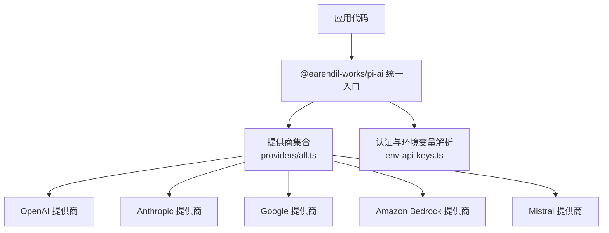
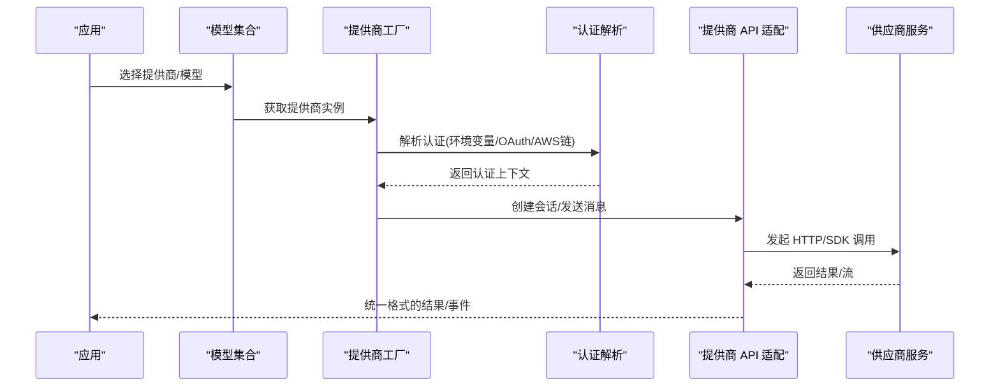
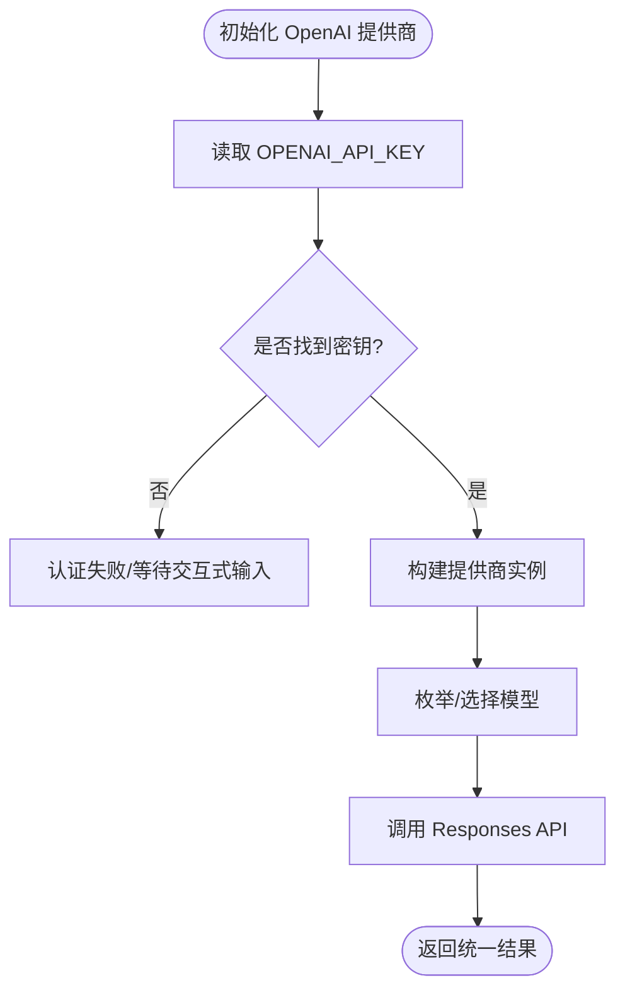
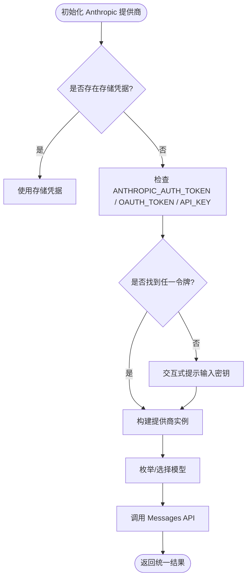
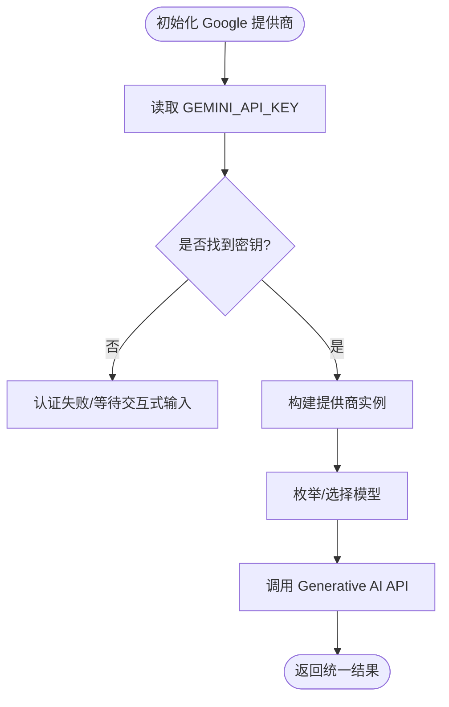
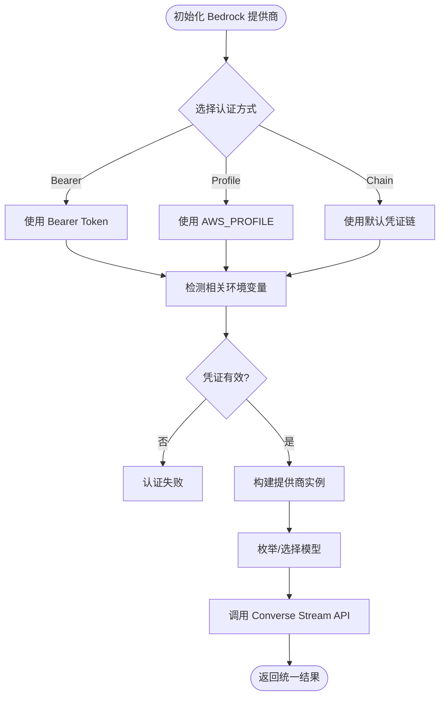
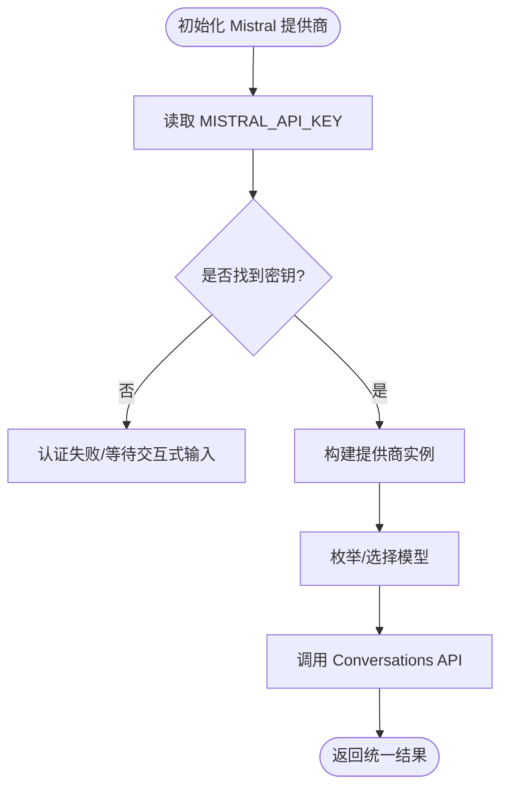
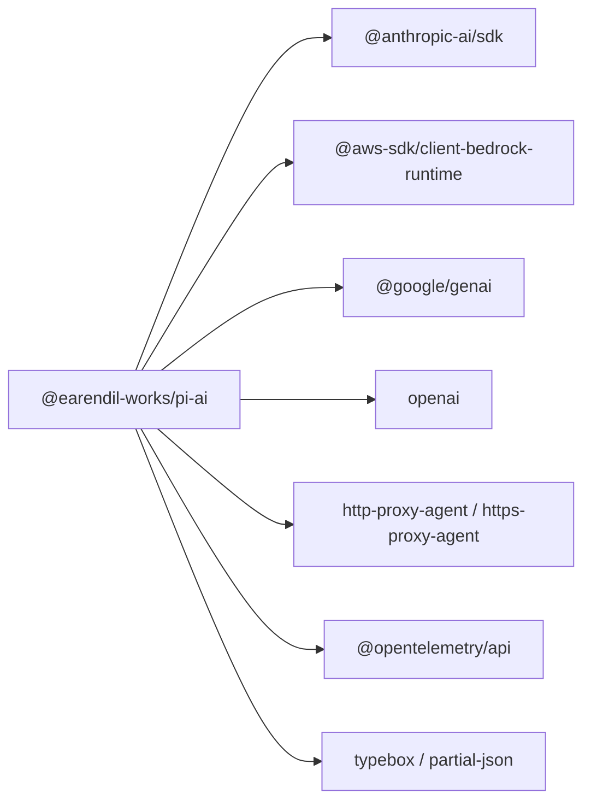

# AI 提供商适配器

<cite>
**本文引用的文件**
- [packages/ai/src/providers/all.ts](file://packages/ai/src/providers/all.ts)
- [packages/ai/src/providers/openai.ts](file://packages/ai/src/providers/openai.ts)
- [packages/ai/src/providers/anthropic.ts](file://packages/ai/src/providers/anthropic.ts)
- [packages/ai/src/providers/google.ts](file://packages/ai/src/providers/google.ts)
- [packages/ai/src/providers/amazon-bedrock.ts](file://packages/ai/src/providers/amazon-bedrock.ts)
- [packages/ai/src/providers/mistral.ts](file://packages/ai/src/providers/mistral.ts)
- [packages/ai/src/env-api-keys.ts](file://packages/ai/src/env-api-keys.ts)
- [packages/ai/package.json](file://packages/ai/package.json)
- [README.md](file://README.md)
</cite>

## 目录
1. [简介](#简介)
2. [项目结构](#项目结构)
3. [核心组件](#核心组件)
4. [架构总览](#架构总览)
5. [详细组件分析](#详细组件分析)
6. [依赖关系分析](#依赖关系分析)
7. [性能与可用性](#性能与可用性)
8. [故障排除指南](#故障排除指南)
9. [结论](#结论)
10. [附录：配置示例与最佳实践](#附录：配置示例与最佳实践)

## 简介
本仓库提供统一的 LLM API 抽象层，将多家 AI 提供商（OpenAI、Anthropic Claude、Google Gemini、AWS Bedrock、Azure OpenAI、Mistral 等）整合到一致的接口中。通过“提供商工厂 + 模型目录 + 认证解析”的设计，上层应用无需关心底层差异即可调用不同厂商的模型能力。同时支持流式响应、重试、诊断与事件流等通用能力。

## 项目结构
- 统一入口与类型导出集中在 ai 包根目录，屏蔽实现细节；具体提供商位于 providers 子目录。
- 每个提供商以工厂函数形式暴露，内部绑定 baseUrl、认证方式、模型清单与 API 实现。
- 环境变量与密钥发现逻辑集中管理，便于跨平台兼容与浏览器构建。

图表来源
- [packages/ai/src/providers/all.ts:88-131](file://packages/ai/src/providers/all.ts#L88-L131)
- [packages/ai/src/env-api-keys.ts:68-119](file://packages/ai/src/env-api-keys.ts#L68-L119)

章节来源
- [README.md:17-35](file://README.md#L17-L35)
- [packages/ai/src/providers/all.ts:88-131](file://packages/ai/src/providers/all.ts#L88-L131)

## 核心组件
- 提供商注册与发现：通过内置提供商列表一次性注册所有支持的厂商，并提供按提供商查询模型的 API。
- 认证与环境变量：为各提供商定义标准的环境变量名，并支持特殊认证流程（如 OAuth、AWS 默认凭证链）。
- 模型目录：每个提供商维护自身模型清单，供上层枚举与选择。
- 统一 API 适配：各提供商通过各自的 API 适配模块对接原生 SDK/HTTP 接口，对外暴露一致的消息/对话/图像生成等能力。

章节来源
- [packages/ai/src/providers/all.ts:50-141](file://packages/ai/src/providers/all.ts#L50-L141)
- [packages/ai/src/env-api-keys.ts:68-189](file://packages/ai/src/env-api-keys.ts#L68-L189)

## 架构总览
下图展示了从应用调用到具体提供商请求的关键路径，包括提供商选择、认证解析、API 适配与模型枚举。

图表来源
- [packages/ai/src/providers/all.ts:88-131](file://packages/ai/src/providers/all.ts#L88-L131)
- [packages/ai/src/providers/openai.ts:6-14](file://packages/ai/src/providers/openai.ts#L6-L14)
- [packages/ai/src/providers/anthropic.ts:43-58](file://packages/ai/src/providers/anthropic.ts#L43-L58)
- [packages/ai/src/providers/google.ts:6-14](file://packages/ai/src/providers/google.ts#L6-L14)
- [packages/ai/src/providers/amazon-bedrock.ts:82-89](file://packages/ai/src/providers/amazon-bedrock.ts#L82-L89)
- [packages/ai/src/providers/mistral.ts:6-14](file://packages/ai/src/providers/mistral.ts#L6-L14)

## 详细组件分析

### OpenAI 提供商
- 标识与基础 URL：id 为 openai，baseUrl 指向官方 v1 端点。
- 认证：优先读取 OPENAI_API_KEY 环境变量。
- 模型：使用内置模型清单。
- API：通过 Responses 适配层封装。

图表来源
- [packages/ai/src/providers/openai.ts:6-14](file://packages/ai/src/providers/openai.ts#L6-L14)
- [packages/ai/src/env-api-keys.ts:79-85](file://packages/ai/src/env-api-keys.ts#L79-L85)

章节来源
- [packages/ai/src/providers/openai.ts:6-14](file://packages/ai/src/providers/openai.ts#L6-L14)
- [packages/ai/src/env-api-keys.ts:79-85](file://packages/ai/src/env-api-keys.ts#L79-L85)

### Anthropic (Claude) 提供商
- 标识与基础 URL：id 为 anthropic，baseUrl 指向官方端点。
- 认证：支持 API Key、OAuth Token、以及专用 AUTH_TOKEN（作为 Bearer 头传递），并可通过交互提示输入密钥。
- 模型：使用内置模型清单。
- API：通过 Messages 适配层封装。

图表来源
- [packages/ai/src/providers/anthropic.ts:9-41](file://packages/ai/src/providers/anthropic.ts#L9-L41)
- [packages/ai/src/providers/anthropic.ts:43-58](file://packages/ai/src/providers/anthropic.ts#L43-L58)
- [packages/ai/src/env-api-keys.ts:29-31](file://packages/ai/src/env-api-keys.ts#L29-L31)
- [packages/ai/src/env-api-keys.ts:73-77](file://packages/ai/src/env-api-keys.ts#L73-L77)

章节来源
- [packages/ai/src/providers/anthropic.ts:9-58](file://packages/ai/src/providers/anthropic.ts#L9-L58)
- [packages/ai/src/env-api-keys.ts:29-31](file://packages/ai/src/env-api-keys.ts#L29-L31)
- [packages/ai/src/env-api-keys.ts:73-77](file://packages/ai/src/env-api-keys.ts#L73-L77)

### Google (Gemini) 提供商
- 标识与基础 URL：id 为 google，baseUrl 指向 Generative Language API。
- 认证：读取 GEMINI_API_KEY 环境变量。
- 模型：使用内置模型清单。
- API：通过 Generative AI 适配层封装。

图表来源
- [packages/ai/src/providers/google.ts:6-14](file://packages/ai/src/providers/google.ts#L6-L14)
- [packages/ai/src/env-api-keys.ts:88-88](file://packages/ai/src/env-api-keys.ts#L88-L88)

章节来源
- [packages/ai/src/providers/google.ts:6-14](file://packages/ai/src/providers/google.ts#L6-L14)
- [packages/ai/src/env-api-keys.ts:88-88](file://packages/ai/src/env-api-keys.ts#L88-L88)

### Amazon Bedrock 提供商
- 标识：id 为 amazon-bedrock。
- 认证：支持多种 AWS 认证方式——Bearer Token、AWS Profile、IAM 访问密钥、ECS 任务角色、Web Identity Token 等；也可通过交互选择认证方式。
- 模型：使用内置模型清单。
- API：通过 Converse Stream 适配层封装。

图表来源
- [packages/ai/src/providers/amazon-bedrock.ts:11-79](file://packages/ai/src/providers/amazon-bedrock.ts#L11-L79)
- [packages/ai/src/providers/amazon-bedrock.ts:82-89](file://packages/ai/src/providers/amazon-bedrock.ts#L82-L89)
- [packages/ai/src/env-api-keys.ts:167-185](file://packages/ai/src/env-api-keys.ts#L167-L185)

章节来源
- [packages/ai/src/providers/amazon-bedrock.ts:11-89](file://packages/ai/src/providers/amazon-bedrock.ts#L11-L89)
- [packages/ai/src/env-api-keys.ts:167-185](file://packages/ai/src/env-api-keys.ts#L167-L185)

### Mistral 提供商
- 标识与基础 URL：id 为 mistral，baseUrl 指向官方端点。
- 认证：读取 MISTRAL_API_KEY 环境变量。
- 模型：使用内置模型清单。
- API：通过 Conversations 适配层封装。

图表来源
- [packages/ai/src/providers/mistral.ts:6-14](file://packages/ai/src/providers/mistral.ts#L6-L14)
- [packages/ai/src/env-api-keys.ts:98-98](file://packages/ai/src/env-api-keys.ts#L98-L98)

章节来源
- [packages/ai/src/providers/mistral.ts:6-14](file://packages/ai/src/providers/mistral.ts#L6-L14)
- [packages/ai/src/env-api-keys.ts:98-98](file://packages/ai/src/env-api-keys.ts#L98-L98)

### Azure OpenAI 提供商
- 在提供商集合中已注册 Azure OpenAI Responses 提供商，用于统一接入 Azure 托管的 OpenAI 模型。
- 认证与环境变量：由对应提供商实现负责处理（例如 AZURE_OPENAI_API_KEY 等）。
- 模型：使用内置模型清单。
- API：通过 Responses 适配层封装。

章节来源
- [packages/ai/src/providers/all.ts:94-94](file://packages/ai/src/providers/all.ts#L94-L94)
- [packages/ai/src/env-api-keys.ts:85-85](file://packages/ai/src/env-api-keys.ts#L85-L85)

## 依赖关系分析
- 运行时依赖：包含各提供商官方 SDK（如 OpenAI、Anthropic、Google GenAI、AWS Bedrock Runtime 等），以及代理、遥测、类型校验等工具库。
- 包导出：除主入口外，还提供 compat、oauth、bedrock-provider、bun-oauth 等子路径导出，便于按需引入。

图表来源
- [packages/ai/package.json:62-74](file://packages/ai/package.json#L62-L74)

章节来源
- [packages/ai/package.json:13-41](file://packages/ai/package.json#L13-L41)
- [packages/ai/package.json:62-74](file://packages/ai/package.json#L62-L74)

## 性能与可用性
- 流式响应：Bedrock 等提供商通过流式 API 降低首字节延迟，适合长文本场景。
- 重试与诊断：框架提供重试与诊断工具，有助于在网络抖动或限流时提升稳定性。
- 模型选择策略：建议根据任务复杂度、成本与延迟要求选择合适模型；对高并发场景可考虑缓存与批处理。
- 多提供商切换：通过统一入口动态切换提供商，便于灰度发布与容灾。

[本节为通用指导，不直接分析具体文件]

## 故障排除指南
- 认证失败
  - 检查对应环境变量是否设置正确（如 OPENAI_API_KEY、GEMINI_API_KEY、MISTRAL_API_KEY、AZURE_OPENAI_API_KEY 等）。
  - Anthropic 需区分 API Key、OAuth Token 与 AUTH_TOKEN（后者作为 Bearer 头）。
  - Bedrock 需确认 AWS 凭证链或 Profile 配置有效。
- 网络与代理
  - 若处于受限网络环境，确保代理配置可用（依赖 http-proxy-agent / https-proxy-agent）。
- 模型不可用
  - 确认所选模型在提供商侧可用且配额充足。
- 调试与日志
  - 启用诊断与事件流输出，定位请求链路中的异常。

章节来源
- [packages/ai/src/env-api-keys.ts:68-189](file://packages/ai/src/env-api-keys.ts#L68-L189)
- [packages/ai/src/providers/anthropic.ts:9-41](file://packages/ai/src/providers/anthropic.ts#L9-L41)
- [packages/ai/src/providers/amazon-bedrock.ts:11-79](file://packages/ai/src/providers/amazon-bedrock.ts#L11-L79)

## 结论
该适配器通过统一的提供商抽象、集中的认证与环境变量管理、以及完善的模型目录，显著降低了接入多家 AI 服务的复杂度。推荐在生产环境中结合重试、流式响应与监控指标，制定合理的提供商选择策略与降级方案。

[本节为总结性内容，不直接分析具体文件]

## 附录：配置示例与最佳实践

- 环境变量参考（部分）
  - OpenAI：OPENAI_API_KEY
  - Anthropic：ANTHROPIC_API_KEY / ANTHROPIC_OAUTH_TOKEN / ANTHROPIC_AUTH_TOKEN
  - Google：GEMINI_API_KEY
  - Azure OpenAI：AZURE_OPENAI_API_KEY
  - Mistral：MISTRAL_API_KEY
  - Bedrock：AWS_PROFILE / AWS_ACCESS_KEY_ID / AWS_SECRET_ACCESS_KEY / AWS_BEARER_TOKEN_BEDROCK / ECS/WebIdentity 相关变量

- 提供商选择策略
  - 功能匹配：根据所需能力（对话、推理、图像生成）选择对应提供商与模型。
  - 成本与延迟：对比价格与延迟，结合业务 SLA 做权衡。
  - 合规与地域：根据数据合规与地域要求选择云厂商与区域。

- 最佳实践
  - 使用统一入口进行提供商切换，避免硬编码。
  - 对关键路径启用重试与超时控制。
  - 对敏感信息仅通过环境变量注入，避免写入代码仓库。
  - 利用诊断与事件流进行问题定位与性能优化。

章节来源
- [packages/ai/src/env-api-keys.ts:68-189](file://packages/ai/src/env-api-keys.ts#L68-L189)
- [packages/ai/src/providers/all.ts:88-131](file://packages/ai/src/providers/all.ts#L88-L131)