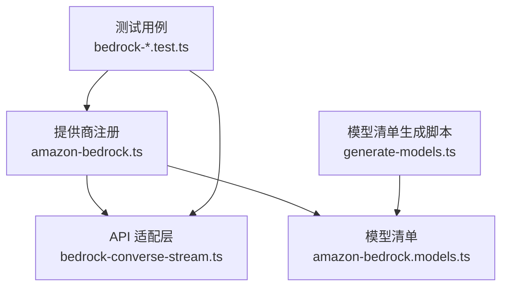
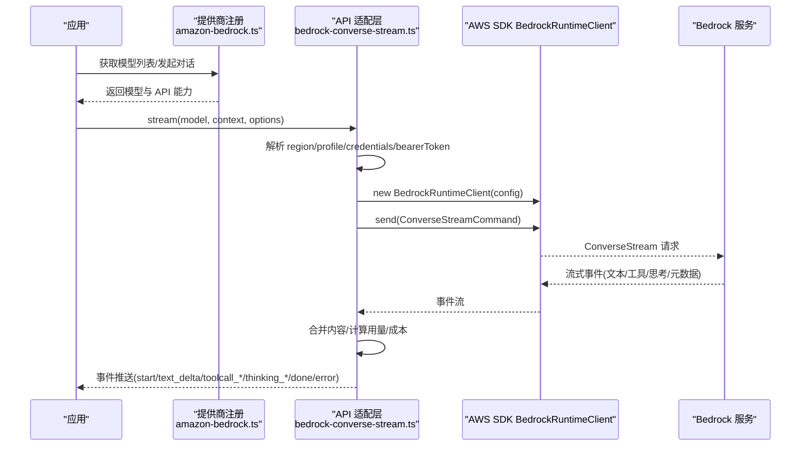
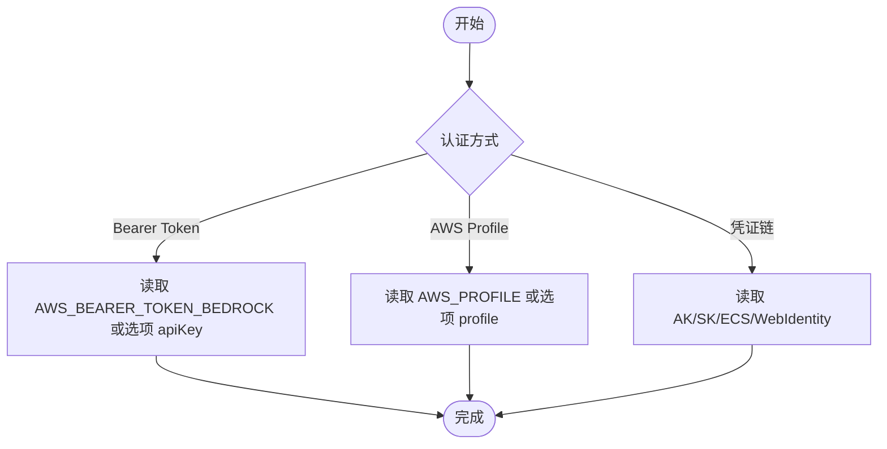
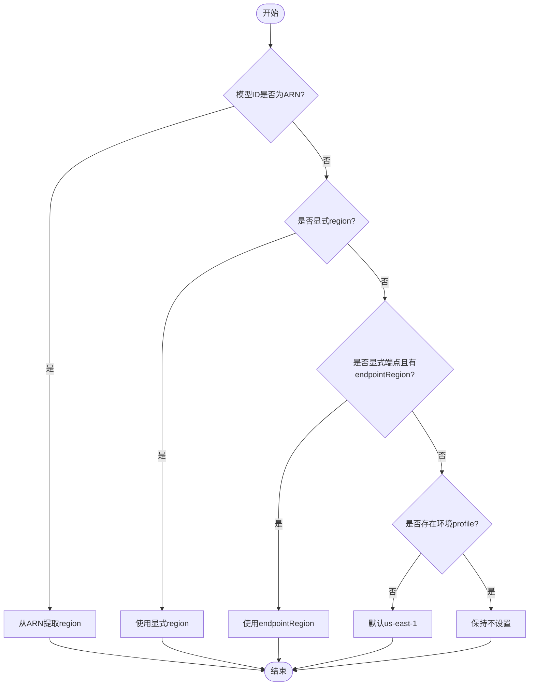
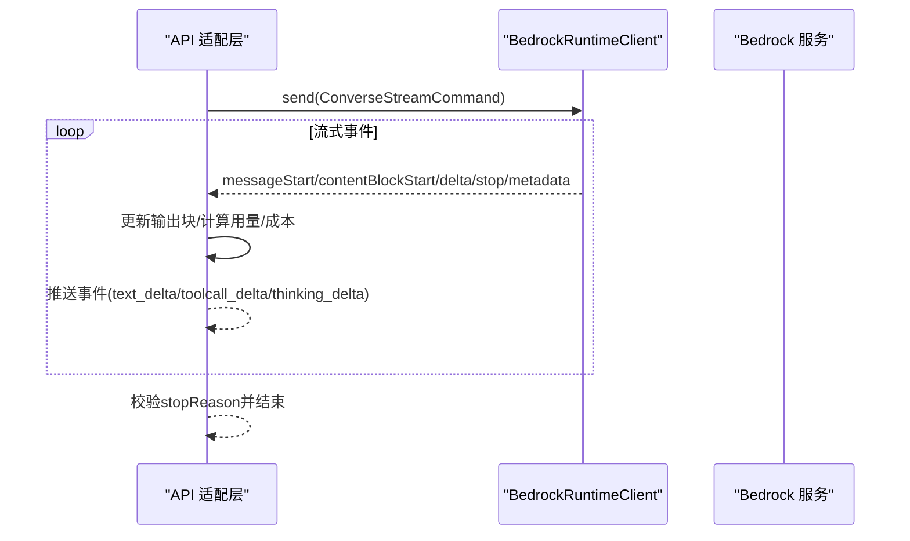
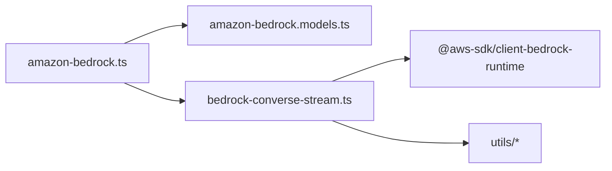

# AWS Bedrock 提供商适配器

<cite>
**本文引用的文件**
- [bedrock-provider.ts](file://packages/ai/src/bedrock-provider.ts)
- [amazon-bedrock.ts](file://packages/ai/src/providers/amazon-bedrock.ts)
- [amazon-bedrock.models.ts](file://packages/ai/src/providers/amazon-bedrock.models.ts)
- [bedrock-converse-stream.ts](file://packages/ai/src/api/bedrock-converse-stream.ts)
- [generate-models.ts](file://packages/ai/scripts/generate-models.ts)
- [bedrock-credentials.test.ts](file://packages/ai/test/bedrock-credentials.test.ts)
- [bedrock-models.test.ts](file://packages/ai/test/bedrock-models.test.ts)
</cite>

## 目录
1. [简介](#简介)
2. [项目结构](#项目结构)
3. [核心组件](#核心组件)
4. [架构总览](#架构总览)
5. [详细组件分析](#详细组件分析)
6. [依赖关系分析](#依赖关系分析)
7. [性能与优化](#性能与优化)
8. [故障排查指南](#故障排查指南)
9. [结论](#结论)
10. [附录：部署与安全配置](#附录部署与安全配置)

## 简介
本文件面向在项目中集成 Amazon Bedrock 的开发者，系统性说明如何启用并配置“Amazon Bedrock”提供商适配器，覆盖支持的模型（Claude、Llama、Titan 等）、认证与权限、区域选择、推理特性（思考/推理、工具调用、提示缓存）、成本计量与监控、以及部署与安全最佳实践。内容基于仓库内实现与测试用例进行归纳，确保与实际代码行为一致。

## 项目结构
Bedrock 适配相关代码主要位于 packages/ai 下，分为三层：
- 提供商注册层：定义 provider 元数据、认证流程与模型清单
- API 适配层：封装 Bedrock Converse Stream 流式调用、消息转换、错误处理与成本统计
- 模型清单生成：从 models.dev 等来源自动生成 Bedrock 模型清单

图表来源
- [amazon-bedrock.ts:1-91](file://packages/ai/src/providers/amazon-bedrock.ts#L1-L91)
- [bedrock-converse-stream.ts:1-120](file://packages/ai/src/api/bedrock-converse-stream.ts#L1-L120)
- [amazon-bedrock.models.ts:1-9](file://packages/ai/src/providers/amazon-bedrock.models.ts#L1-L9)
- [generate-models.ts:1300-1345](file://packages/ai/scripts/generate-models.ts#L1300-L1345)

章节来源
- [amazon-bedrock.ts:1-91](file://packages/ai/src/providers/amazon-bedrock.ts#L1-L91)
- [bedrock-provider.ts:1-7](file://packages/ai/src/bedrock-provider.ts#L1-L7)
- [amazon-bedrock.models.ts:1-9](file://packages/ai/src/providers/amazon-bedrock.models.ts#L1-L9)
- [generate-models.ts:1300-1345](file://packages/ai/scripts/generate-models.ts#L1300-L1345)

## 核心组件
- 提供商入口：导出 bedrockProviderModule，暴露 stream 与 streamSimple 两个流式接口
- 提供商注册：创建 amazon-bedrock 提供商，绑定认证策略与模型清单
- API 适配：基于 @aws-sdk/client-bedrock-runtime 的 ConverseStreamCommand 实现流式对话
- 模型清单：自动生成的 Bedrock 模型集合，包含 Claude、Llama、Titan 等可用模型

章节来源
- [bedrock-provider.ts:1-7](file://packages/ai/src/bedrock-provider.ts#L1-L7)
- [amazon-bedrock.ts:1-91](file://packages/ai/src/providers/amazon-bedrock.ts#L1-L91)
- [bedrock-converse-stream.ts:107-120](file://packages/ai/src/api/bedrock-converse-stream.ts#L107-L120)
- [amazon-bedrock.models.ts:1-9](file://packages/ai/src/providers/amazon-bedrock.models.ts#L1-L9)

## 架构总览
下图展示了从应用调用到 Bedrock 服务端的完整请求路径，包括认证、区域解析、代理、流式事件处理与成本统计。

图表来源
- [bedrock-converse-stream.ts:140-221](file://packages/ai/src/api/bedrock-converse-stream.ts#L140-L221)
- [bedrock-converse-stream.ts:227-323](file://packages/ai/src/api/bedrock-converse-stream.ts#L227-L323)
- [bedrock-converse-stream.ts:589-602](file://packages/ai/src/api/bedrock-converse-stream.ts#L589-L602)

## 详细组件分析

### 提供商注册与认证
- 认证方式支持：
  - Bearer Token（通过环境变量或选项注入）
  - AWS Profile（显式 profile 或环境变量）
  - 现有 AWS 凭证链（访问密钥、ECS 任务角色、Web Identity 等）
- 登录交互：提供交互式选择认证方法；若选择“现有凭证链”，会引导用户配置 AWS 凭证后继续
- 解析优先级：显式 profile > 作用域 AWS_PROFILE > 环境凭证链；当未配置 profile 时回退到环境变量中的访问密钥

图表来源
- [amazon-bedrock.ts:11-79](file://packages/ai/src/providers/amazon-bedrock.ts#L11-L79)
- [bedrock-converse-stream.ts:160-221](file://packages/ai/src/api/bedrock-converse-stream.ts#L160-L221)

章节来源
- [amazon-bedrock.ts:11-79](file://packages/ai/src/providers/amazon-bedrock.ts#L11-L79)
- [bedrock-credentials.test.ts:71-115](file://packages/ai/test/bedrock-credentials.test.ts#L71-L115)

### 区域与端点解析
- 区域解析顺序：
  - 若模型 ID 为 ARN，则从 ARN 提取区域
  - 否则使用显式 region 选项
  - 若使用显式端点且存在 endpointRegion，则使用该区域
  - 若无环境 profile 且未指定区域，默认 us-east-1
- 端点选择：
  - 当无区域或无环境 profile 时，可固定为标准 Bedrock 运行时端点
  - 支持自定义端点（VPC/代理），避免被内置目录默认值覆盖
- 代理支持：
  - Node/Bun 环境下可通过 HTTP(S) 代理访问
  - 某些自定义端点需强制使用 HTTP/1.1

图表来源
- [bedrock-converse-stream.ts:171-183](file://packages/ai/src/api/bedrock-converse-stream.ts#L171-L183)
- [bedrock-converse-stream.ts:147-158](file://packages/ai/src/api/bedrock-converse-stream.ts#L147-L158)
- [bedrock-converse-stream.ts:198-210](file://packages/ai/src/api/bedrock-converse-stream.ts#L198-L210)

章节来源
- [bedrock-converse-stream.ts:140-216](file://packages/ai/src/api/bedrock-converse-stream.ts#L140-L216)

### 模型清单与可用性
- 模型来源：通过 generate-models.ts 从 models.dev 拉取并过滤 Bedrock 模型，生成 amazon-bedrock.models.ts
- 过滤规则：
  - 仅包含支持 tool_call 的模型
  - 排除仅限推理档案的模型（如 claude-opus-5 仅通过推理档案可用）
  - 针对部分模型（如 mistral.mistral-7b-instruct-v0）跳过系统消息支持
- 模型能力：
  - 输入模态：text/image（根据模型能力）
  - 上下文窗口与最大输出 token 数
  - 结构化输出严格模式支持（部分模型）

章节来源
- [generate-models.ts:1306-1345](file://packages/ai/scripts/generate-models.ts#L1306-L1345)
- [amazon-bedrock.models.ts:1-9](file://packages/ai/src/providers/amazon-bedrock.models.ts#L1-L9)
- [bedrock-models.test.ts:24-35](file://packages/ai/test/bedrock-models.test.ts#L24-L35)

### 流式对话与事件处理
- 入口：stream 与 streamSimple
- 事件类型：
  - start：会话开始
  - text_start/text_delta/text_end：文本增量
  - thinking_start/thinking_delta/thinking_end：思考/推理内容（Claude 模型）
  - toolcall_start/toolcall_delta/toolcall_end：工具调用
  - done/error：结束或错误
- 元数据处理：
  - usage：inputTokens/outputTokens/cacheReadInputTokens/cacheWriteInputTokens/totalTokens
  - cost：按模型定价计算成本
- 停止原因映射：将 Bedrock 停止原因映射为统一语义（end_turn、stop_sequence、max_tokens、tool_use 等）

图表来源
- [bedrock-converse-stream.ts:227-323](file://packages/ai/src/api/bedrock-converse-stream.ts#L227-L323)
- [bedrock-converse-stream.ts:508-630](file://packages/ai/src/api/bedrock-converse-stream.ts#L508-L630)
- [bedrock-converse-stream.ts:589-602](file://packages/ai/src/api/bedrock-converse-stream.ts#L589-L602)

章节来源
- [bedrock-converse-stream.ts:107-120](file://packages/ai/src/api/bedrock-converse-stream.ts#L107-L120)
- [bedrock-converse-stream.ts:227-323](file://packages/ai/src/api/bedrock-converse-stream.ts#L227-L323)
- [bedrock-converse-stream.ts:508-630](file://packages/ai/src/api/bedrock-converse-stream.ts#L508-L630)

### 推理与思考（Thinking/Reasoning）
- 自适应思考：对特定 Claude 模型（如 Opus 4.6+/Sonnet 4.6+）支持自适应思考级别
- 思考预算：可按思考级别调整 token 预算，避免超出上下文限制
- 思考显示：支持 summarized/omitted 两种展示策略（Claude 模型）
- 签名字段：仅 Claude 模型支持 reasoningContent.reasoningText.signature

章节来源
- [bedrock-converse-stream.ts:460-506](file://packages/ai/src/api/bedrock-converse-stream.ts#L460-L506)
- [bedrock-converse-stream.ts:632-691](file://packages/ai/src/api/bedrock-converse-stream.ts#L632-L691)
- [bedrock-converse-stream.ts:757-767](file://packages/ai/src/api/bedrock-converse-stream.ts#L757-L767)

### 提示缓存（Prompt Caching）
- 支持模型：Claude 3.5 Haiku、Claude 3.7 Sonnet、Claude 4.x、Claude 5 系列
- 缓存保留：short/long（long 对应 ONE_HOUR TTL）
- 强制开关：对于应用推理档案（ARN 不含模型名），可通过环境变量强制启用缓存点

章节来源
- [bedrock-converse-stream.ts:724-755](file://packages/ai/src/api/bedrock-converse-stream.ts#L724-L755)
- [bedrock-converse-stream.ts:769-787](file://packages/ai/src/api/bedrock-converse-stream.ts#L769-L787)

### 工具调用（Tool Use）
- 工具配置：convertToolConfig 将上层工具描述转换为 Bedrock ToolConfiguration
- 工具选择：支持 auto/any/none 或指定工具名称
- 参数解析：流式 JSON 增量解析，最终在 toolcall_end 时提交完整参数

章节来源
- [bedrock-converse-stream.ts:235-246](file://packages/ai/src/api/bedrock-converse-stream.ts#L235-L246)
- [bedrock-converse-stream.ts:517-528](file://packages/ai/src/api/bedrock-converse-stream.ts#L517-L528)
- [bedrock-converse-stream.ts:555-558](file://packages/ai/src/api/bedrock-converse-stream.ts#L555-L558)
- [bedrock-converse-stream.ts:622-628](file://packages/ai/src/api/bedrock-converse-stream.ts#L622-L628)

### 成本计量与监控
- 用量统计：inputTokens、outputTokens、cacheReadInputTokens、cacheWriteInputTokens、totalTokens
- 成本计算：calculateCost 依据模型定价计算各阶段成本
- 请求元数据：requestMetadata 可用于成本分摊标签（键值对）

章节来源
- [bedrock-converse-stream.ts:589-602](file://packages/ai/src/api/bedrock-converse-stream.ts#L589-L602)
- [bedrock-converse-stream.ts:90-94](file://packages/ai/src/api/bedrock-converse-stream.ts#L90-L94)

## 依赖关系分析
- 外部依赖：@aws-sdk/client-bedrock-runtime（Bedrock 运行时客户端与命令）
- 内部依赖：
  - 提供商注册模块（amazon-bedrock.ts）
  - 模型清单（amazon-bedrock.models.ts）
  - 通用工具（错误归一化、事件流、JSON 解析、代理解析等）

图表来源
- [amazon-bedrock.ts:1-91](file://packages/ai/src/providers/amazon-bedrock.ts#L1-L91)
- [bedrock-converse-stream.ts:1-59](file://packages/ai/src/api/bedrock-converse-stream.ts#L1-L59)

章节来源
- [amazon-bedrock.ts:1-91](file://packages/ai/src/providers/amazon-bedrock.ts#L1-L91)
- [bedrock-converse-stream.ts:1-59](file://packages/ai/src/api/bedrock-converse-stream.ts#L1-L59)

## 性能与优化
- 区域与端点：
  - 优先使用 ARN 区域或显式 region，避免跨区延迟
  - 使用标准端点时可固定区域以减少解析开销
- 代理与协议：
  - 需要代理时使用 NodeHttpHandler 以兼容 HTTP(S) 代理
  - 自定义端点可强制 HTTP/1.1
- 提示缓存：
  - 对支持的 Claude 模型启用缓存点，降低重复请求成本
- 思考预算：
  - 合理设置 thinkingBudgets，避免超出上下文导致截断
- 工具调用：
  - 使用 toolChoice 减少不必要的工具尝试
- 并发与限流：
  - 结合上游重试与节流策略，避免触发 ThrottlingException

[本节为通用建议，无需具体文件引用]

## 故障排查指南
- 常见错误分类：
  - Internal server error / Model stream error / Validation error / Throttling error / Service unavailable
- 错误信息增强：
  - 格式化 Bedrock 异常，附加状态码、错误码、请求 ID
  - 数据保留模式错误时附带文档链接
- 诊断信息：
  - 失败时追加 bedrock_response_failure 诊断，便于定位
- 认证问题：
  - 检查 AWS_BEARER_TOKEN_BEDROCK、AWS_PROFILE、AK/SK、ECS/WebIdentity 等
  - 显式 profile 优先于环境 AK/SK

章节来源
- [bedrock-converse-stream.ts:335-422](file://packages/ai/src/api/bedrock-converse-stream.ts#L335-L422)
- [bedrock-credentials.test.ts:71-115](file://packages/ai/test/bedrock-credentials.test.ts#L71-L115)

## 结论
本项目提供了完整的 Amazon Bedrock 提供商适配器，涵盖多模型支持、灵活认证、区域与端点解析、流式事件处理、思考/推理、提示缓存、工具调用与成本计量。通过自动化模型清单生成与完善的测试覆盖，确保在不同环境与模型下的稳定性与可维护性。推荐在生产环境中结合 IAM 最小权限原则、合理的区域选择与缓存策略，以获得最佳性能与成本效益。

[本节为总结，无需具体文件引用]

## 附录：部署与安全配置

### 支持的模型
- Claude：Claude 3.5 Haiku、Claude 3.7 Sonnet、Claude 4.x、Claude 5 系列（含 Opus/Sonnet/Fable）
- Llama：通过 Bedrock 目录提供的 Llama 模型（由 generate-models.ts 自动发现）
- Titan：通过 Bedrock 目录提供的 Titan 模型（由 generate-models.ts 自动发现）
- 其他：Mistral、AI21 Jamba 等（受限于 streaming/tool/system 能力）

章节来源
- [generate-models.ts:1306-1345](file://packages/ai/scripts/generate-models.ts#L1306-L1345)
- [bedrock-models.test.ts:24-35](file://packages/ai/test/bedrock-models.test.ts#L24-L35)

### 认证配置
- Bearer Token：
  - 环境变量：AWS_BEARER_TOKEN_BEDROCK
  - 选项：bearerToken 或 apiKey
  - 需要 IAM 权限：bedrock:CallWithBearerToken
- AWS Profile：
  - 环境变量：AWS_PROFILE
  - 选项：profile
- 凭证链：
  - 环境变量：AWS_ACCESS_KEY_ID、AWS_SECRET_ACCESS_KEY
  - ECS 任务角色：AWS_CONTAINER_CREDENTIALS_RELATIVE_URI / AWS_CONTAINER_CREDENTIALS_FULL_URI
  - Web Identity：AWS_WEB_IDENTITY_TOKEN_FILE

章节来源
- [amazon-bedrock.ts:11-79](file://packages/ai/src/providers/amazon-bedrock.ts#L11-L79)
- [bedrock-converse-stream.ts:160-221](file://packages/ai/src/api/bedrock-converse-stream.ts#L160-L221)

### IAM 权限设置
- 基础权限：
  - bedrock:InvokeModel（或等效的 ConverseStream 权限）
- Bearer Token 模式：
  - bedrock:CallWithBearerToken
- 数据保留模式：
  - 根据模型要求配置数据保留模式，避免拒绝请求

章节来源
- [bedrock-converse-stream.ts:90-100](file://packages/ai/src/api/bedrock-converse-stream.ts#L90-L100)
- [bedrock-converse-stream.ts:343-348](file://packages/ai/src/api/bedrock-converse-stream.ts#L343-L348)

### 区域选择
- 优先使用 ARN 区域或显式 region
- 无 profile 且无 region 时默认 us-east-1
- 自定义端点场景：使用 endpointRegion 并避免被内置目录覆盖

章节来源
- [bedrock-converse-stream.ts:171-183](file://packages/ai/src/api/bedrock-converse-stream.ts#L171-L183)
- [bedrock-converse-stream.ts:147-158](file://packages/ai/src/api/bedrock-converse-stream.ts#L147-L158)

### 代理与网络
- 支持 HTTP(S) 代理：NodeHttpHandler + HttpProxyAgent/HttpsProxyAgent
- 强制 HTTP/1.1：AWS_BEDROCK_FORCE_HTTP1=1

章节来源
- [bedrock-converse-stream.ts:198-210](file://packages/ai/src/api/bedrock-converse-stream.ts#L198-L210)

### 推理优化
- 自适应思考：对支持的 Claude 模型启用 reasoning 与 thinkingBudgets
- 提示缓存：对支持的 Claude 模型启用 cacheRetention（short/long）
- 工具调用：使用 toolChoice 减少无效尝试

章节来源
- [bedrock-converse-stream.ts:460-506](file://packages/ai/src/api/bedrock-converse-stream.ts#L460-L506)
- [bedrock-converse-stream.ts:724-755](file://packages/ai/src/api/bedrock-converse-stream.ts#L724-L755)

### 成本监控
- 用量统计：input/output/cacheRead/cacheWrite/totalTokens
- 成本计算：calculateCost 依据模型定价
- 请求元数据：requestMetadata 用于成本分摊标签

章节来源
- [bedrock-converse-stream.ts:589-602](file://packages/ai/src/api/bedrock-converse-stream.ts#L589-L602)
- [bedrock-converse-stream.ts:90-94](file://packages/ai/src/api/bedrock-converse-stream.ts#L90-L94)

### 部署示例
- 步骤概览：
  - 安装依赖并构建项目
  - 配置认证（Bearer Token 或 AWS Profile/凭证链）
  - 选择区域与端点（必要时配置代理）
  - 启用推理与缓存（按需）
  - 运行测试验证模型可用性

章节来源
- [bedrock-models.test.ts:24-35](file://packages/ai/test/bedrock-models.test.ts#L24-L35)
- [bedrock-credentials.test.ts:71-115](file://packages/ai/test/bedrock-credentials.test.ts#L71-L115)

### 安全配置
- 最小权限原则：仅授予必要的 Bedrock 权限
- 敏感信息：使用环境变量或密钥管理服务存储凭据
- 审计与追踪：利用 requestMetadata 与诊断信息记录请求上下文

章节来源
- [bedrock-converse-stream.ts:90-100](file://packages/ai/src/api/bedrock-converse-stream.ts#L90-L100)
- [bedrock-converse-stream.ts:403-422](file://packages/ai/src/api/bedrock-converse-stream.ts#L403-L422)