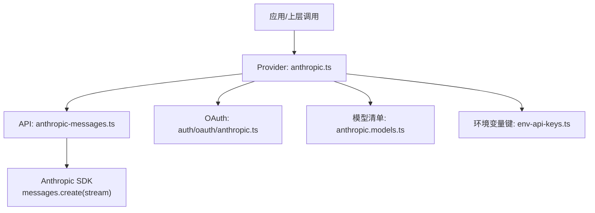
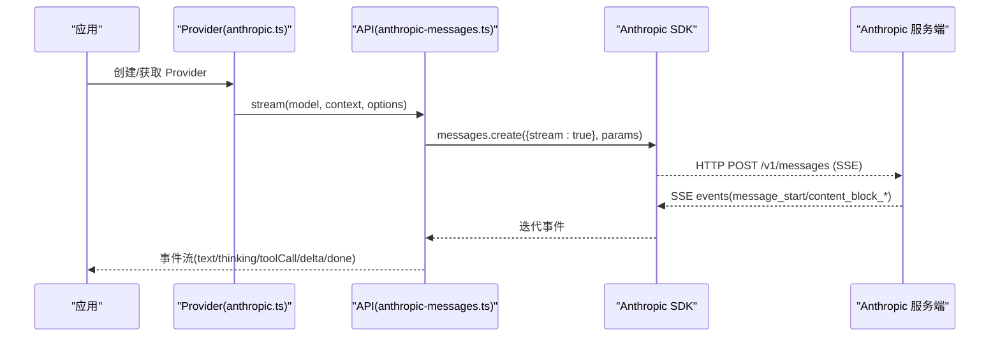
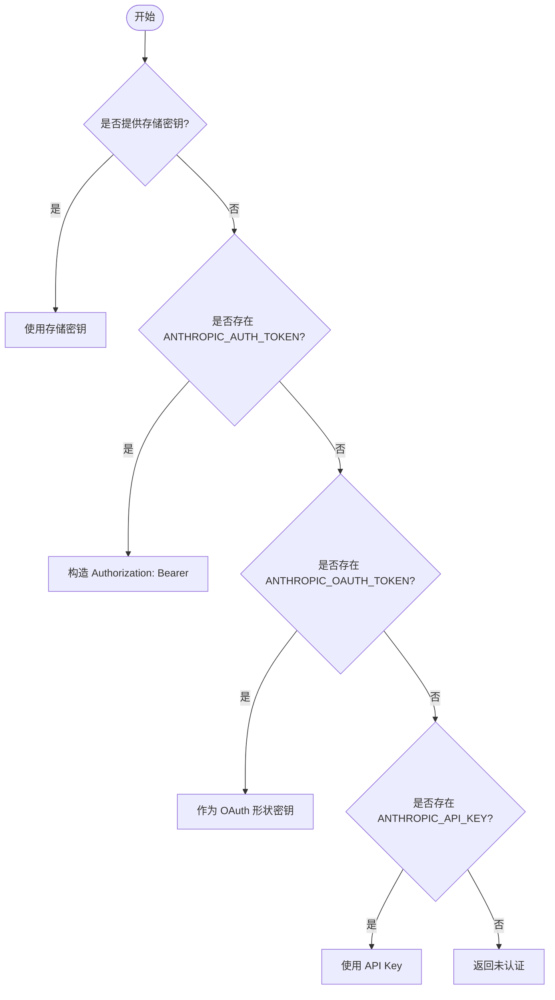
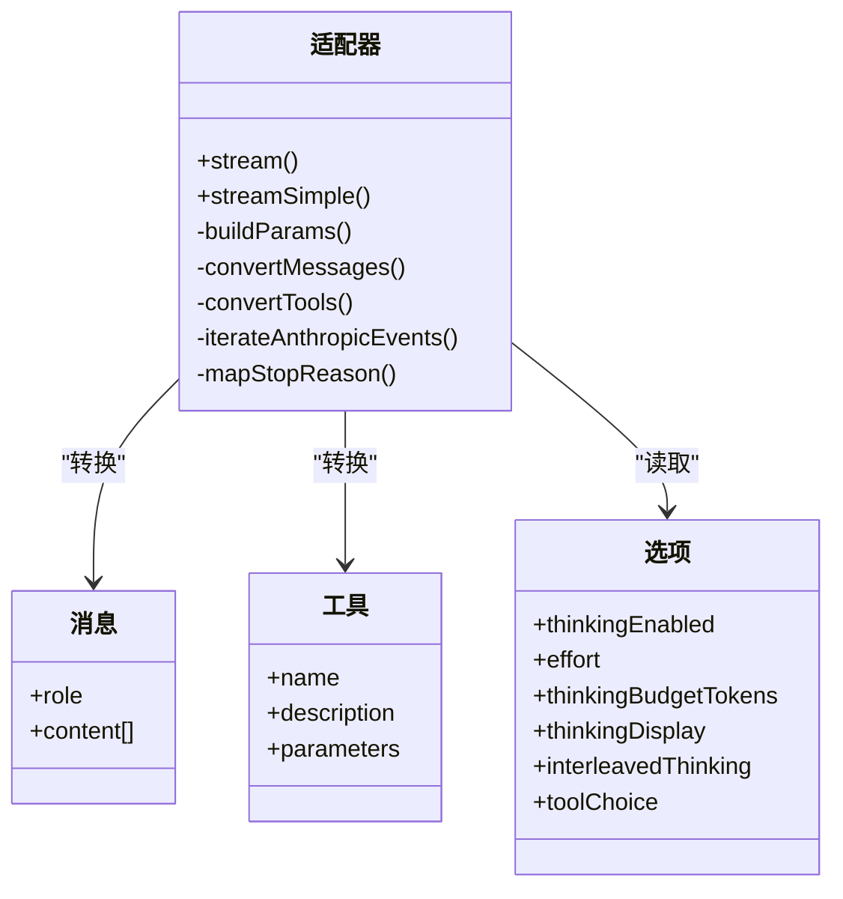
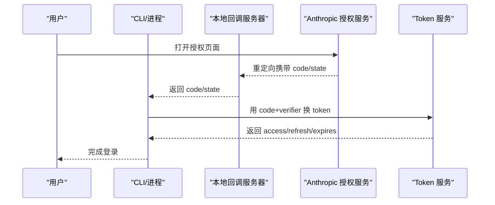
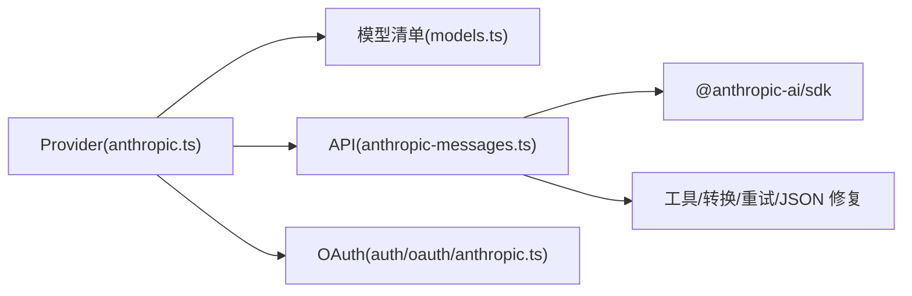

# Anthropic Claude 提供商适配器

<cite>
**本文引用的文件**
- [packages/ai/src/providers/anthropic.ts](file://packages/ai/src/providers/anthropic.ts)
- [packages/ai/src/providers/anthropic.models.ts](file://packages/ai/src/providers/anthropic.models.ts)
- [packages/ai/src/api/anthropic-messages.lazy.ts](file://packages/ai/src/api/anthropic-messages.lazy.ts)
- [packages/ai/src/api/anthropic-messages.ts](file://packages/ai/src/api/anthropic-messages.ts)
- [packages/ai/src/auth/oauth/anthropic.ts](file://packages/ai/src/auth/oauth/anthropic.ts)
- [packages/ai/src/env-api-keys.ts](file://packages/ai/src/env-api-keys.ts)
- [packages/ai/test/anthropic-adaptive-thinking-models.test.ts](file://packages/ai/test/anthropic-adaptive-thinking-models.test.ts)
</cite>

## 目录
1. [简介](#简介)
2. [项目结构](#项目结构)
3. [核心组件](#核心组件)
4. [架构总览](#架构总览)
5. [详细组件分析](#详细组件分析)
6. [依赖关系分析](#依赖关系分析)
7. [性能与成本](#性能与成本)
8. [故障排除指南](#故障排除指南)
9. [结论](#结论)
10. [附录：配置与最佳实践](#附录：配置与最佳实践)

## 简介
本文件面向在项目中集成 Anthropic Claude 系列模型（Claude 3、Claude 2 及更新的 Claude 4/5 家族）的开发者，提供从认证、消息格式转换、系统提示词处理到思考模式、安全护栏、长上下文缓存等特性的完整适配说明。文档基于仓库中已实现的 Anthropic 提供商与 API 适配器，给出可操作的配置步骤、调用流程、最佳实践与常见问题排查方法。

## 项目结构
围绕 Anthropic 适配的关键代码位于 packages/ai 下：
- 提供商注册与认证入口：providers/anthropic.ts
- 模型清单与扁平化：providers/anthropic.models.ts
- API 流式实现与消息转换：api/anthropic-messages.ts（懒加载入口：api/anthropic-messages.lazy.ts）
- OAuth 登录与刷新：auth/oauth/anthropic.ts
- 环境变量键定义：env-api-keys.ts
- 测试用例（如自适应思考模型标记）：test/anthropic-adaptive-thinking-models.test.ts

图表来源
- [packages/ai/src/providers/anthropic.ts:43-58](file://packages/ai/src/providers/anthropic.ts#L43-L58)
- [packages/ai/src/api/anthropic-messages.ts:487-573](file://packages/ai/src/api/anthropic-messages.ts#L487-L573)
- [packages/ai/src/auth/oauth/anthropic.ts:355-364](file://packages/ai/src/auth/oauth/anthropic.ts#L355-L364)
- [packages/ai/src/providers/anthropic.models.ts:1-9](file://packages/ai/src/providers/anthropic.models.ts#L1-L9)
- [packages/ai/src/env-api-keys.ts:29-31](file://packages/ai/src/env-api-keys.ts#L29-L31)

章节来源
- [packages/ai/src/providers/anthropic.ts:1-60](file://packages/ai/src/providers/anthropic.ts#L1-L60)
- [packages/ai/src/api/anthropic-messages.lazy.ts:1-5](file://packages/ai/src/api/anthropic-messages.lazy.ts#L1-L5)
- [packages/ai/src/providers/anthropic.models.ts:1-9](file://packages/ai/src/providers/anthropic.models.ts#L1-L9)

## 核心组件
- 提供商注册与认证
  - 创建 Provider，设置 baseUrl、鉴权方式（API Key / OAuth）、模型列表与 API 实现。
  - 支持多种鉴权来源：存储的密钥、环境变量中的 Auth Token、OAuth Token、API Key。
- 模型清单
  - 通过脚本生成的模型目录被扁平化为可用模型集合，供 Provider 使用。
- API 适配器
  - 负责将内部消息、工具、系统提示词转换为 Anthropic Messages API 请求体；解析 SSE 事件流并映射为统一的事件流。
  - 支持思考模式（自适应/预算型）、工具流式输入、工具引用、温度控制、元数据、工具选择策略等。
- OAuth 流程
  - 本地回调服务器 + PKCE，完成授权码换取访问令牌与刷新令牌，并将 OAuth token 转为 API 鉴权形式。

章节来源
- [packages/ai/src/providers/anthropic.ts:9-58](file://packages/ai/src/providers/anthropic.ts#L9-L58)
- [packages/ai/src/providers/anthropic.models.ts:1-9](file://packages/ai/src/providers/anthropic.models.ts#L1-L9)
- [packages/ai/src/api/anthropic-messages.ts:487-1074](file://packages/ai/src/api/anthropic-messages.ts#L487-L1074)
- [packages/ai/src/auth/oauth/anthropic.ts:234-364](file://packages/ai/src/auth/oauth/anthropic.ts#L234-L364)

## 架构总览
下图展示了从应用层到 Anthropic 服务端的端到端调用链，包括认证、消息构建、SSE 流式响应与事件分发。

图表来源
- [packages/ai/src/providers/anthropic.ts:43-58](file://packages/ai/src/providers/anthropic.ts#L43-L58)
- [packages/ai/src/api/anthropic-messages.ts:487-573](file://packages/ai/src/api/anthropic-messages.ts#L487-L573)
- [packages/ai/src/api/anthropic-messages.ts:573-773](file://packages/ai/src/api/anthropic-messages.ts#L573-L773)

## 详细组件分析

### 提供商与认证（anthropic.ts）
- 职责
  - 注册 Provider，指定 id、name、baseUrl、鉴权、模型与 API。
  - 鉴权优先级：存储的密钥 > ANTHROPIC_AUTH_TOKEN（Bearer）> ANTHROPIC_OAUTH_TOKEN > ANTHROPIC_API_KEY。
  - 支持 OAuth（Claude Pro/Max），通过 lazyOAuth 加载。
- 关键点
  - 支持浏览器直连头以兼容前端场景。
  - 支持注入自定义 headers/fetch，便于代理或网关接入。

图表来源
- [packages/ai/src/providers/anthropic.ts:9-41](file://packages/ai/src/providers/anthropic.ts#L9-L41)
- [packages/ai/src/env-api-keys.ts:29-31](file://packages/ai/src/env-api-keys.ts#L29-L31)

章节来源
- [packages/ai/src/providers/anthropic.ts:1-60](file://packages/ai/src/providers/anthropic.ts#L1-L60)
- [packages/ai/src/env-api-keys.ts:29-31](file://packages/ai/src/env-api-keys.ts#L29-L31)

### API 适配器与消息转换（anthropic-messages.ts）
- 职责
  - 将内部消息、工具、系统提示词转换为 Anthropic Messages API 的请求参数。
  - 解析 SSE 事件流，输出统一的文本、思考、工具调用事件。
  - 计算用量与成本，映射停止原因，处理安全拒绝与敏感内容。
- 关键能力
  - 思考模式
    - 自适应思考：对标记模型启用 adaptive thinking，并可设置 effort（low/medium/high/xhigh/max）。
    - 预算型思考：旧模型通过 budget_tokens 控制思考长度。
    - 显示控制：summarized 或 omitted。
  - 工具
    - 支持 eager tool input streaming、strict tools、tool references、延迟加载工具。
    - 工具名规范化以兼容 Claude Code 命名。
  - 缓存
    - 支持短/长保留的 ephemeral 缓存，可作用于系统提示词、工具与最后一条用户消息。
  - 其他
    - 温度仅在非思考模式下且模型支持时生效。
    - 支持 metadata.user_id、tool_choice、会话亲和头等。

图表来源
- [packages/ai/src/api/anthropic-messages.ts:487-1074](file://packages/ai/src/api/anthropic-messages.ts#L487-L1074)
- [packages/ai/src/api/anthropic-messages.ts:1116-1281](file://packages/ai/src/api/anthropic-messages.ts#L1116-L1281)
- [packages/ai/src/api/anthropic-messages.ts:1287-1323](file://packages/ai/src/api/anthropic-messages.ts#L1287-L1323)

章节来源
- [packages/ai/src/api/anthropic-messages.ts:487-1352](file://packages/ai/src/api/anthropic-messages.ts#L487-L1352)

### OAuth 流程（auth/oauth/anthropic.ts）
- 职责
  - 启动本地回调服务器，生成 PKCE，引导用户在浏览器完成授权。
  - 交换授权码为 access_token 与 refresh_token，并支持刷新。
  - 将 OAuth credential 转换为 API 鉴权形式（apiKey）。
- 要点
  - 仅 Node.js 环境可用。
  - 支持手动粘贴授权码/重定向 URL。
  - 错误信息格式化与超时保护。

图表来源
- [packages/ai/src/auth/oauth/anthropic.ts:99-168](file://packages/ai/src/auth/oauth/anthropic.ts#L99-L168)
- [packages/ai/src/auth/oauth/anthropic.ts:190-232](file://packages/ai/src/auth/oauth/anthropic.ts#L190-L232)
- [packages/ai/src/auth/oauth/anthropic.ts:317-353](file://packages/ai/src/auth/oauth/anthropic.ts#L317-L353)

章节来源
- [packages/ai/src/auth/oauth/anthropic.ts:1-365](file://packages/ai/src/auth/oauth/anthropic.ts#L1-L365)

### 模型清单与自适应思考标记（anthropic.models.ts 与测试）
- 模型清单由脚本生成并扁平化，供 Provider 暴露。
- 测试断言内置的 Anthropic Messages 模型中标记了“自适应思考”的模型集合，确保行为一致性。

章节来源
- [packages/ai/src/providers/anthropic.models.ts:1-9](file://packages/ai/src/providers/anthropic.models.ts#L1-L9)
- [packages/ai/test/anthropic-adaptive-thinking-models.test.ts:1-41](file://packages/ai/test/anthropic-adaptive-thinking-models.test.ts#L1-L41)

## 依赖关系分析
- 模块耦合
  - Provider 依赖模型清单、鉴权辅助与 API 适配器。
  - API 适配器依赖消息/工具转换、SSE 解析、重试、JSON 修复、成本计算等通用工具。
  - OAuth 模块独立于 API 适配器，但通过 Provider 的 lazyOAuth 接入。
- 外部依赖
  - @anthropic-ai/sdk 用于发起消息请求与接收 SSE。
  - Node http 模块用于 OAuth 回调服务器（仅 Node 环境）。
- 潜在循环依赖
  - 通过懒加载（lazyApi）避免启动时强依赖，降低耦合。

图表来源
- [packages/ai/src/providers/anthropic.ts:1-8](file://packages/ai/src/providers/anthropic.ts#L1-L8)
- [packages/ai/src/api/anthropic-messages.lazy.ts:1-5](file://packages/ai/src/api/anthropic-messages.lazy.ts#L1-L5)
- [packages/ai/src/auth/oauth/anthropic.ts:1-12](file://packages/ai/src/auth/oauth/anthropic.ts#L1-L12)

章节来源
- [packages/ai/src/providers/anthropic.ts:1-60](file://packages/ai/src/providers/anthropic.ts#L1-L60)
- [packages/ai/src/api/anthropic-messages.lazy.ts:1-5](file://packages/ai/src/api/anthropic-messages.lazy.ts#L1-L5)

## 性能与成本
- 流式传输
  - 使用 SSE 流式响应，尽早返回首 token，提升交互体验。
- 思考模式对性能的影响
  - 自适应思考可根据任务复杂度动态分配思考深度；budget 型可通过 thinkingBudgetTokens 控制上限。
  - 开启思考会增加推理开销与延迟，建议根据场景权衡。
- 缓存
  - 支持短/长保留的 ephemeral 缓存，可用于系统提示词、工具与最后一条用户消息，减少重复计算成本。
- 成本计算
  - 适配器在 message_start 与 message_delta 中累计输入/输出/缓存读写 token，并计算成本。

章节来源
- [packages/ai/src/api/anthropic-messages.ts:573-744](file://packages/ai/src/api/anthropic-messages.ts#L573-L744)
- [packages/ai/src/api/anthropic-messages.ts:49-73](file://packages/ai/src/api/anthropic-messages.ts#L49-L73)

## 故障排除指南
- 认证失败
  - 检查环境变量优先级：ANTHROPIC_AUTH_TOKEN（Bearer）> ANTHROPIC_OAUTH_TOKEN > ANTHROPIC_API_KEY。
  - 若通过 headers 提供鉴权，需包含 Authorization、x-api-key 或 cf-aig-authorization 之一。
- 流结束异常
  - 若未收到 message_stop，会抛出“流提前结束”错误；若 stop_reason 为 aborted/error，会抛出对应错误。
- 安全拒绝
  - 当模型拒绝请求（refusal/sensitive），会映射为错误并附带解释或提示。
- 工具调用问题
  - 工具名大小写与规范：OAuth 路径下会映射为 Claude Code 标准命名。
  - 工具参数严格模式：根据模型能力启用 strict 模式。
- 思考模式不生效
  - 确认模型是否支持自适应思考或预算型思考；temperature 与思考模式互斥。
- OAuth 回调端口冲突
  - 默认监听 127.0.0.1:53692，如遇占用请调整回调主机或端口。

章节来源
- [packages/ai/src/providers/anthropic.ts:18-38](file://packages/ai/src/providers/anthropic.ts#L18-L38)
- [packages/ai/src/api/anthropic-messages.ts:283-293](file://packages/ai/src/api/anthropic-messages.ts#L283-L293)
- [packages/ai/src/api/anthropic-messages.ts:747-773](file://packages/ai/src/api/anthropic-messages.ts#L747-L773)
- [packages/ai/src/api/anthropic-messages.ts:1325-1351](file://packages/ai/src/api/anthropic-messages.ts#L1325-L1351)
- [packages/ai/src/api/anthropic-messages.ts:1002-1056](file://packages/ai/src/api/anthropic-messages.ts#L1002-L1056)
- [packages/ai/src/auth/oauth/anthropic.ts:32-35](file://packages/ai/src/auth/oauth/anthropic.ts#L32-L35)

## 结论
本项目提供了完整的 Anthropic Claude 提供商适配器，覆盖认证、消息转换、思考模式、工具调用、缓存与成本统计等关键能力。通过清晰的 Provider 抽象与流式 API，可在多模型、多环境中稳定集成 Claude 系列模型。结合本文的配置与排错建议，可快速落地生产级应用。

## 附录：配置与最佳实践
- 环境变量与鉴权
  - 优先使用 ANTHROPIC_AUTH_TOKEN（Bearer）或 ANTHROPIC_OAUTH_TOKEN（OAuth），其次为 ANTHROPIC_API_KEY。
  - 也可通过存储的密钥或 headers 注入鉴权。
- 思考模式
  - 自适应思考：对标记模型启用 thinkingEnabled=true，并通过 effort 控制强度。
  - 预算型思考：设置 thinkingBudgetTokens 限制思考 token 数。
  - 显示策略：thinkingDisplay=“summarized” 或 “omitted”。
- 工具与系统提示词
  - 系统提示词可附加缓存控制以减少重复成本。
  - 工具声明建议使用严格模式（strict）以提升稳定性。
- 缓存
  - 使用 PI_CACHE_RETENTION 或显式 cacheRetention 控制短/长保留。
  - 将缓存应用于系统提示词、工具与最后一条用户消息。
- 安全护栏
  - 关注 refusal/sensitive 等停止原因，并在上层做相应处理。
- 示例调用路径（无代码）
  - 创建 Provider -> 调用 stream/streamSimple -> 订阅事件 -> 消费文本/思考/工具调用 -> 处理 done/error。

章节来源
- [packages/ai/src/env-api-keys.ts:29-31](file://packages/ai/src/env-api-keys.ts#L29-L31)
- [packages/ai/src/providers/anthropic.ts:18-38](file://packages/ai/src/providers/anthropic.ts#L18-L38)
- [packages/ai/src/api/anthropic-messages.ts:202-262](file://packages/ai/src/api/anthropic-messages.ts#L202-L262)
- [packages/ai/src/api/anthropic-messages.ts:1002-1056](file://packages/ai/src/api/anthropic-messages.ts#L1002-L1056)
- [packages/ai/src/api/anthropic-messages.ts:1256-1278](file://packages/ai/src/api/anthropic-messages.ts#L1256-L1278)
- [packages/ai/src/api/anthropic-messages.ts:1325-1351](file://packages/ai/src/api/anthropic-messages.ts#L1325-L1351)