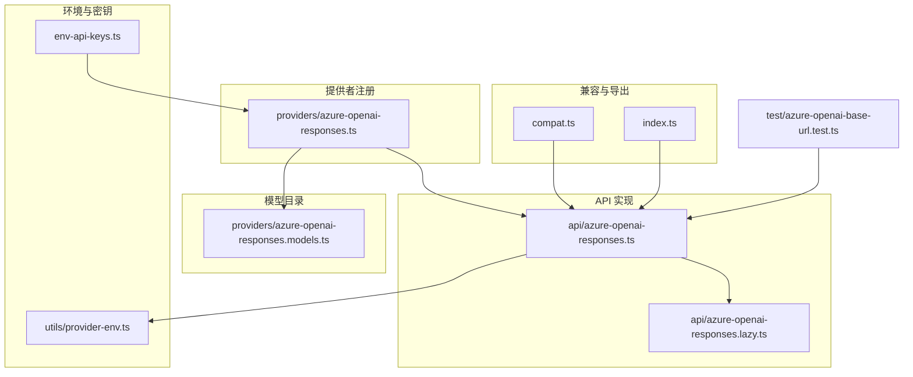
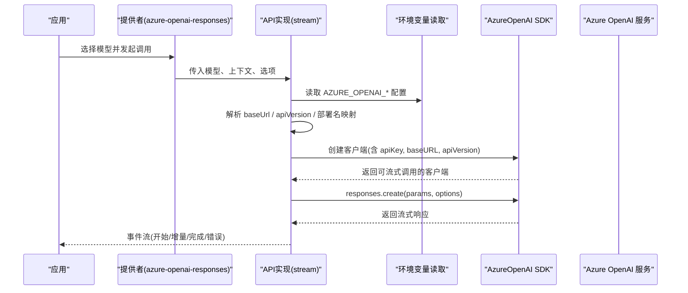
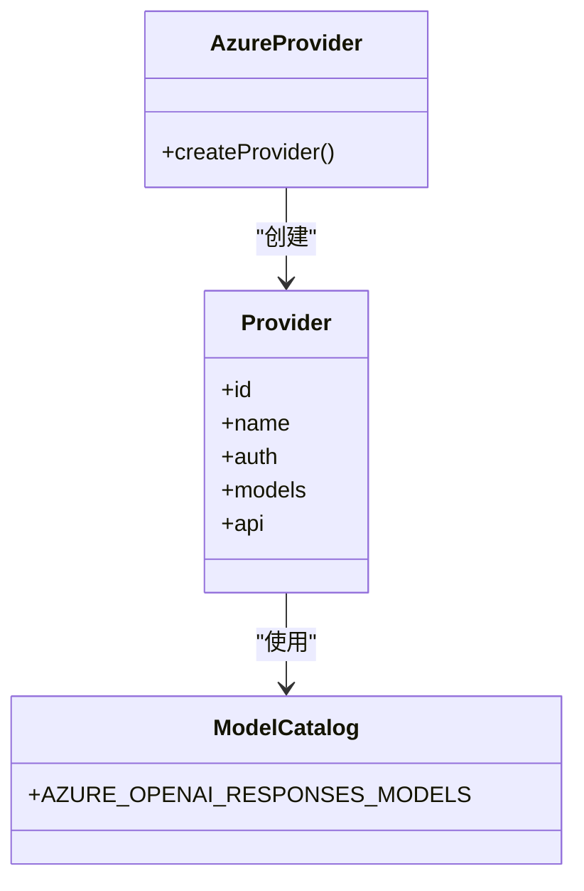
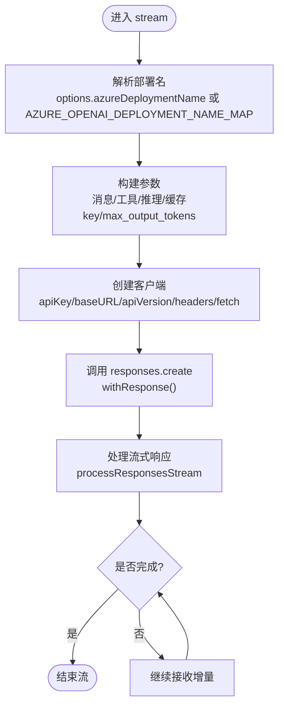
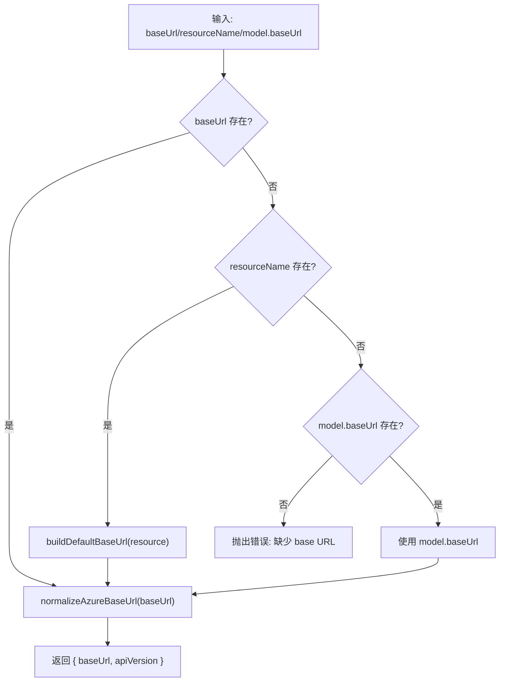
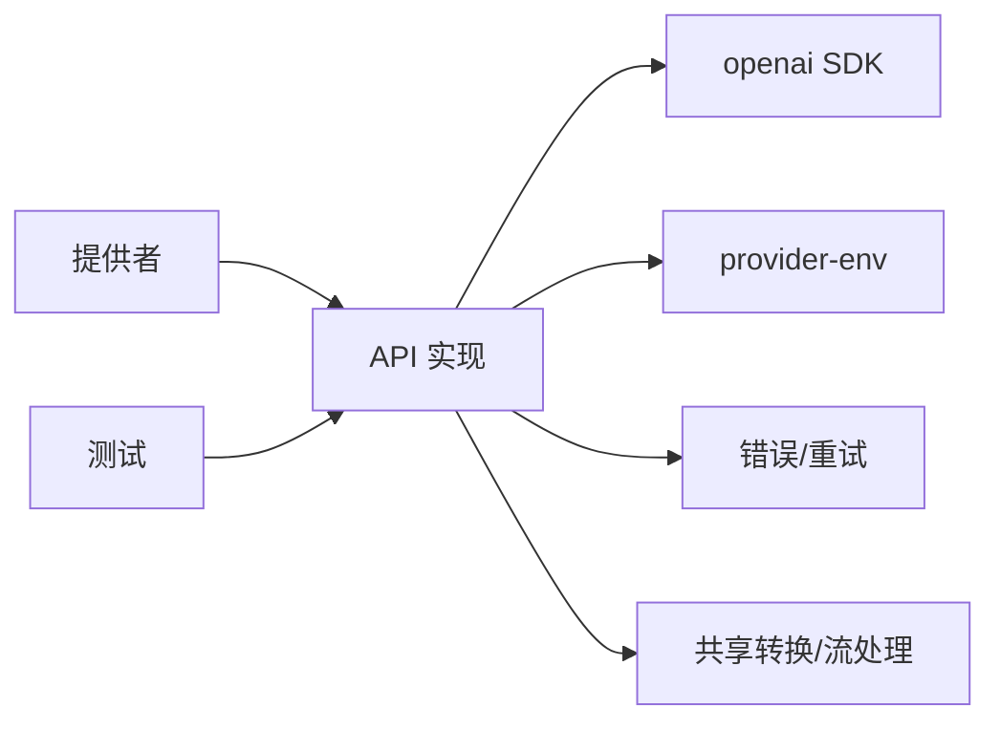

# Azure OpenAI 提供商适配器

<cite>
**本文引用的文件**
- [azure-openai-responses.ts](file://packages/ai/src/api/azure-openai-responses.ts)
- [azure-openai-responses.lazy.ts](file://packages/ai/src/api/azure-openai-responses.lazy.ts)
- [azure-openai-responses.models.ts](file://packages/ai/src/providers/azure-openai-responses.models.ts)
- [azure-openai-responses.provider.ts](file://packages/ai/src/providers/azure-openai-responses.ts)
- [env-api-keys.ts](file://packages/ai/src/env-api-keys.ts)
- [provider-env.ts](file://packages/ai/src/utils/provider-env.ts)
- [compat.ts](file://packages/ai/src/compat.ts)
- [index.ts](file://packages/ai/src/index.ts)
- [generate-models.ts](file://packages/ai/scripts/generate-models.ts)
- [azure-openai-base-url.test.ts](file://packages/ai/test/azure-openai-base-url.test.ts)
</cite>

## 目录
1. [简介](#简介)
2. [项目结构](#项目结构)
3. [核心组件](#核心组件)
4. [架构总览](#架构总览)
5. [详细组件分析](#详细组件分析)
6. [依赖关系分析](#依赖关系分析)
7. [性能与可靠性](#性能与可靠性)
8. [部署与配置指南](#部署与配置指南)
9. [合规与安全](#合规与安全)
10. [监控与告警](#监控与告警)
11. [故障排查](#故障排查)
12. [结论](#结论)

## 简介
本文件面向在企业 Azure 环境中集成 Azure OpenAI 服务的开发者，提供 Azure OpenAI 提供商适配器的完整说明。内容涵盖：
- 资源组与端点配置、API 版本管理
- 与企业 Azure 环境的集成方式（环境变量、密钥、网络访问）
- 身份认证与鉴权
- 完整的部署示例、合规性配置建议与监控告警设置
- 基于代码实现的原理说明与排错指引

## 项目结构
Azure OpenAI 适配位于 packages/ai 中，采用“提供者 + API 实现 + 模型目录”的分层组织：
- 提供者注册：providers/azure-openai-responses.ts
- API 实现：api/azure-openai-responses.ts（流式 Responses API）
- 模型目录：providers/azure-openai-responses.models.ts（由脚本生成）
- 环境键映射：env-api-keys.ts
- 环境读取工具：utils/provider-env.ts
- 兼容导出：compat.ts、index.ts
- 测试用例：test/azure-openai-base-url.test.ts

图表来源
- [azure-openai-responses.provider.ts:1-15](file://packages/ai/src/providers/azure-openai-responses.ts#L1-L15)
- [azure-openai-responses.ts:1-331](file://packages/ai/src/api/azure-openai-responses.ts#L1-L331)
- [azure-openai-responses.models.ts:1-9](file://packages/ai/src/providers/azure-openai-responses.models.ts#L1-L9)
- [env-api-keys.ts:68-120](file://packages/ai/src/env-api-keys.ts#L68-L120)
- [provider-env.ts:41-53](file://packages/ai/src/utils/provider-env.ts#L41-L53)
- [compat.ts:14-183](file://packages/ai/src/compat.ts#L14-L183)
- [index.ts:10-10](file://packages/ai/src/index.ts#L10-L10)
- [azure-openai-base-url.test.ts:47-57](file://packages/ai/test/azure-openai-base-url.test.ts#L47-L57)

章节来源
- [azure-openai-responses.provider.ts:1-15](file://packages/ai/src/providers/azure-openai-responses.ts#L1-L15)
- [azure-openai-responses.ts:1-331](file://packages/ai/src/api/azure-openai-responses.ts#L1-L331)
- [azure-openai-responses.models.ts:1-9](file://packages/ai/src/providers/azure-openai-responses.models.ts#L1-L9)
- [env-api-keys.ts:68-120](file://packages/ai/src/env-api-keys.ts#L68-L120)
- [provider-env.ts:41-53](file://packages/ai/src/utils/provider-env.ts#L41-L53)
- [compat.ts:14-183](file://packages/ai/src/compat.ts#L14-L183)
- [index.ts:10-10](file://packages/ai/src/index.ts#L10-L10)
- [azure-openai-base-url.test.ts:47-57](file://packages/ai/test/azure-openai-base-url.test.ts#L47-L57)

## 核心组件
- 提供者注册器：创建并暴露 azure-openai-responses 提供者，绑定 API 与模型目录，并通过环境变量注入 API Key。
- API 实现：封装 Azure OpenAI Responses 的流式调用，处理参数构建、重试、错误格式化、推理能力开关等。
- 模型目录：由脚本生成的模型清单，供运行时选择可用模型。
- 环境键与环境读取：统一从进程环境或沙箱环境读取 Azure 相关配置。
- 兼容导出：将 Azure OpenAI 适配器以兼容方式暴露给上层模块。

章节来源
- [azure-openai-responses.provider.ts:1-15](file://packages/ai/src/providers/azure-openai-responses.ts#L1-L15)
- [azure-openai-responses.ts:55-179](file://packages/ai/src/api/azure-openai-responses.ts#L55-L179)
- [azure-openai-responses.models.ts:1-9](file://packages/ai/src/providers/azure-openai-responses.models.ts#L1-L9)
- [env-api-keys.ts:68-120](file://packages/ai/src/env-api-keys.ts#L68-L120)
- [provider-env.ts:41-53](file://packages/ai/src/utils/provider-env.ts#L41-L53)
- [compat.ts:14-183](file://packages/ai/src/compat.ts#L14-L183)

## 架构总览
下图展示了从应用调用到 Azure OpenAI 服务请求的端到端流程，包括配置解析、客户端创建、流式响应处理与错误处理。

图表来源
- [azure-openai-responses.ts:68-159](file://packages/ai/src/api/azure-openai-responses.ts#L68-L159)
- [azure-openai-responses.ts:216-268](file://packages/ai/src/api/azure-openai-responses.ts#L216-L268)
- [provider-env.ts:41-53](file://packages/ai/src/utils/provider-env.ts#L41-L53)

章节来源
- [azure-openai-responses.ts:68-159](file://packages/ai/src/api/azure-openai-responses.ts#L68-L159)
- [azure-openai-responses.ts:216-268](file://packages/ai/src/api/azure-openai-responses.ts#L216-L268)
- [provider-env.ts:41-53](file://packages/ai/src/utils/provider-env.ts#L41-L53)

## 详细组件分析

### 提供者注册与模型目录
- 提供者通过 createProvider 注册，指定 id、name、auth（apiKey 来自环境变量）、models（来自模型目录）以及 api（懒加载）。
- 模型目录由 generate-models 脚本生成，确保模型清单与后端能力一致。

图表来源
- [azure-openai-responses.provider.ts:1-15](file://packages/ai/src/providers/azure-openai-responses.ts#L1-L15)
- [azure-openai-responses.models.ts:1-9](file://packages/ai/src/providers/azure-openai-responses.models.ts#L1-L9)
- [generate-models.ts:742-801](file://packages/ai/scripts/generate-models.ts#L742-L801)

章节来源
- [azure-openai-responses.provider.ts:1-15](file://packages/ai/src/providers/azure-openai-responses.ts#L1-L15)
- [azure-openai-responses.models.ts:1-9](file://packages/ai/src/providers/azure-openai-responses.models.ts#L1-L9)
- [generate-models.ts:742-801](file://packages/ai/scripts/generate-models.ts#L742-L801)

### API 实现与流式处理
- 入口函数 stream 负责：
  - 解析部署名（支持显式传入或环境变量映射）
  - 构建请求参数（消息、工具、推理能力、缓存 key、最大输出 token 下限）
  - 创建 AzureOpenAI 客户端（baseUrl、apiVersion、headers、fetch）
  - 执行带重试的请求，处理响应头回调与事件流
  - 标准化错误与停止原因，清理临时字段后结束流
- streamSimple 为简化接口，自动处理推理级别压缩。

图表来源
- [azure-openai-responses.ts:41-49](file://packages/ai/src/api/azure-openai-responses.ts#L41-L49)
- [azure-openai-responses.ts:68-159](file://packages/ai/src/api/azure-openai-responses.ts#L68-L159)
- [azure-openai-responses.ts:270-331](file://packages/ai/src/api/azure-openai-responses.ts#L270-L331)

章节来源
- [azure-openai-responses.ts:41-49](file://packages/ai/src/api/azure-openai-responses.ts#L41-L49)
- [azure-openai-responses.ts:68-159](file://packages/ai/src/api/azure-openai-responses.ts#L68-L159)
- [azure-openai-responses.ts:270-331](file://packages/ai/src/api/azure-openai-responses.ts#L270-L331)

### 端点与 API 版本解析
- 支持三种方式确定 base URL：
  - 显式传入 azureBaseUrl
  - 环境变量 AZURE_OPENAI_BASE_URL
  - 通过 AZURE_OPENAI_RESOURCE_NAME 构造默认端点 https://{resource}.openai.azure.com/openai/v1
- 若未提供任一，则抛出明确错误提示。
- API 版本优先级：options.azureApiVersion > AZURE_OPENAI_API_VERSION > 默认 v1。
- 对 Azure 主机进行路径规范化，确保 SDK 能正确拼接 /deployments/<model>/... 与查询参数 api-version。

图表来源
- [azure-openai-responses.ts:181-249](file://packages/ai/src/api/azure-openai-responses.ts#L181-L249)

章节来源
- [azure-openai-responses.ts:181-249](file://packages/ai/src/api/azure-openai-responses.ts#L181-L249)

### 身份认证与环境变量
- API Key 来源：
  - 环境变量 AZURE_OPENAI_API_KEY（由 env-api-keys.ts 映射）
  - 或通过 options.apiKey 显式传入
- 其他关键环境变量：
  - AZURE_OPENAI_BASE_URL：自定义基础端点
  - AZURE_OPENAI_RESOURCE_NAME：用于构造默认端点
  - AZURE_OPENAI_API_VERSION：API 版本
  - AZURE_OPENAI_DEPLOYMENT_NAME_MAP：模型 ID 到部署名的映射（逗号分隔的 key=value）
- 环境读取顺序：优先使用传入的 env 覆盖，其次 process.env，最后 Bun 沙箱回退读取 /proc/self/environ。

章节来源
- [env-api-keys.ts:68-120](file://packages/ai/src/env-api-keys.ts#L68-L120)
- [provider-env.ts:41-53](file://packages/ai/src/utils/provider-env.ts#L41-L53)
- [azure-openai-responses.ts:97-103](file://packages/ai/src/api/azure-openai-responses.ts#L97-L103)
- [azure-openai-responses.ts:216-249](file://packages/ai/src/api/azure-openai-responses.ts#L216-L249)

### 工具调用与推理能力
- 工具调用：根据上下文中的 tools 转换为 Responses 工具的参数，支持严格模式与语法工具。
- 推理能力：
  - reasoningEffort：最小/低/中/高/极高/最大，或关闭
  - reasoningSummary：auto/detailed/concise/null
  - 当开启推理时，会包含加密推理内容的 include 字段
  - 对 max_output_tokens 有最小值限制（低于阈值会被钳制）

章节来源
- [azure-openai-responses.ts:270-331](file://packages/ai/src/api/azure-openai-responses.ts#L270-L331)

### 兼容性与导出
- compat.ts 将 Azure OpenAI Responses API 以兼容方式注册到系统。
- index.ts 导出类型定义，便于外部消费。

章节来源
- [compat.ts:14-183](file://packages/ai/src/compat.ts#L14-L183)
- [index.ts:10-10](file://packages/ai/src/index.ts#L10-L10)

## 依赖关系分析
- 提供者依赖 API 实现与模型目录
- API 实现依赖：
  - openai SDK（AzureOpenAI）
  - 环境读取工具（provider-env.ts）
  - 错误处理与重试工具
  - 消息/工具转换与流处理共享逻辑
- 测试覆盖 base URL 解析逻辑，确保不同输入下的行为一致性

图表来源
- [azure-openai-responses.ts:1-22](file://packages/ai/src/api/azure-openai-responses.ts#L1-L22)
- [azure-openai-responses.ts:118-126](file://packages/ai/src/api/azure-openai-responses.ts#L118-L126)
- [azure-openai-base-url.test.ts:47-57](file://packages/ai/test/azure-openai-base-url.test.ts#L47-L57)

章节来源
- [azure-openai-responses.ts:1-22](file://packages/ai/src/api/azure-openai-responses.ts#L1-L22)
- [azure-openai-responses.ts:118-126](file://packages/ai/src/api/azure-openai-responses.ts#L118-L126)
- [azure-openai-base-url.test.ts:47-57](file://packages/ai/test/azure-openai-base-url.test.ts#L47-L57)

## 性能与可靠性
- 流式响应：减少首字节延迟，提升交互体验。
- 重试策略：通过 retryProviderRequest 控制最大重试次数与延迟，避免瞬时抖动导致失败。
- 最小输出 token 限制：防止服务端拒绝过小的 max_output_tokens。
- 请求超时与取消：支持 signal 与 timeoutMs，便于在长耗时场景下及时中断。
- 头部透传：允许注入自定义 headers，便于企业网关追踪与审计。

章节来源
- [azure-openai-responses.ts:113-126](file://packages/ai/src/api/azure-openai-responses.ts#L113-L126)
- [azure-openai-responses.ts:292-294](file://packages/ai/src/api/azure-openai-responses.ts#L292-L294)
- [azure-openai-responses.ts:251-268](file://packages/ai/src/api/azure-openai-responses.ts#L251-L268)

## 部署与配置指南

### 环境变量与配置项
- 必需
  - AZURE_OPENAI_API_KEY：API 密钥
  - 以下二者之一：
    - AZURE_OPENAI_BASE_URL：自定义基础端点（如企业内部代理或私有域）
    - AZURE_OPENAI_RESOURCE_NAME：资源名，将构造默认端点 https://{resource}.openai.azure.com/openai/v1
- 可选
  - AZURE_OPENAI_API_VERSION：API 版本（默认 v1）
  - AZURE_OPENAI_DEPLOYMENT_NAME_MAP：模型 ID 到部署名的映射（例如：gpt-4o=deployment-gpt4o,gpt-35-turbo=deployment-35t）
  - 运行时选项：
    - azureBaseUrl、azureResourceName、azureApiVersion、azureDeploymentName
    - headers、fetch、signal、timeoutMs、maxRetries、maxRetryDelayMs
    - reasoningEffort、reasoningSummary、maxTokens、temperature、samplingParams

### 端点与资源组
- 标准 Azure 云：使用 AZURE_OPENAI_RESOURCE_NAME 或 AZURE_OPENAI_BASE_URL 指向 .openai.azure.com 域名。
- 企业私有化/代理：通过 AZURE_OPENAI_BASE_URL 指向内部网关或反向代理；适配器会对 Azure 主机进行路径规范化，确保 SDK 正确拼接路径与查询参数。
- 资源组：适配器不直接操作资源组，建议在 Azure 门户或 IaC 中管理资源组、命名空间与网络规则，并在环境变量中引用对应资源名或端点。

### 身份验证
- 使用 AZURE_OPENAI_API_KEY 或运行时 apiKey 选项进行认证。
- 如需企业级网关鉴权，可通过 headers 注入额外令牌或追踪标识。

### 网络访问控制
- 确保运行环境可访问目标端点（公网或内网）。
- 若使用代理或防火墙，请保证 HTTPS 出站可达，且证书链有效。
- 对于浏览器环境，适配器设置了 dangerouslyAllowBrowser=true，需结合网关策略限制访问范围。

### 部署示例（概念步骤）
- 准备环境变量：
  - 设置 AZURE_OPENAI_API_KEY
  - 设置 AZURE_OPENAI_RESOURCE_NAME 或 AZURE_OPENAI_BASE_URL
  - 可选设置 AZURE_OPENAI_API_VERSION 与 AZURE_OPENAI_DEPLOYMENT_NAME_MAP
- 启动应用并选择 azure-openai-responses 提供者与具体模型
- 验证连接：发起一次简单流式请求，观察 start/增量/done 事件
- 生产环境：
  - 使用密钥管理服务托管 API Key
  - 配置日志与指标采集（见监控与告警）
  - 启用重试与超时保护

章节来源
- [azure-openai-responses.ts:97-103](file://packages/ai/src/api/azure-openai-responses.ts#L97-L103)
- [azure-openai-responses.ts:216-249](file://packages/ai/src/api/azure-openai-responses.ts#L216-L249)
- [azure-openai-responses.ts:251-268](file://packages/ai/src/api/azure-openai-responses.ts#L251-L268)
- [env-api-keys.ts:68-120](file://packages/ai/src/env-api-keys.ts#L68-L120)
- [provider-env.ts:41-53](file://packages/ai/src/utils/provider-env.ts#L41-L53)

## 合规与安全
- 数据最小化：仅传递必要消息与工具定义，避免敏感信息进入提示。
- 传输安全：强制 HTTPS；企业环境建议使用受信任的 CA 与证书。
- 密钥管理：使用密钥管理服务（如 Azure Key Vault）注入 AZURE_OPENAI_API_KEY，避免硬编码。
- 访问控制：结合企业网关与网络策略，限制对 Azure OpenAI 端点的访问来源与频率。
- 审计与追踪：通过 headers 注入租户/用户标识，配合网关日志进行审计。
- 合规基线：遵循企业数据安全规范，必要时启用数据驻留与区域限制（在 Azure 侧配置）。

[本节为通用指导，不直接分析具体文件]

## 监控与告警
- 指标采集：
  - 记录请求耗时、成功/失败率、token 用量（input/output/total）
  - 关注 stopReason 分布（completed/error/aborted）
- 日志记录：
  - 记录请求参数摘要（脱敏）、响应状态码、错误消息
  - 保留 traceId 以便跨系统追踪
- 告警策略：
  - 错误率突增、超时比例升高、token 用量异常增长
  - 上游服务不可用或证书过期
- 健康检查：
  - 定期发起轻量请求验证连通性
  - 结合网关健康探针与负载均衡

[本节为通用指导，不直接分析具体文件]

## 故障排查
- 常见错误与定位
  - 缺少 base URL：检查 AZURE_OPENAI_BASE_URL 或 AZURE_OPENAI_RESOURCE_NAME，或传入 azureBaseUrl/azureResourceName
  - 缺少 API Key：检查 AZURE_OPENAI_API_KEY 或运行时 apiKey
  - 无效 base URL：确认域名与路径格式，适配器会规范化 Azure 主机路径
  - 流结束无停止原因：检查服务端响应与网络中断情况
  - 请求被中止：检查 signal 与超时设置
- 调试建议
  - 打印 onPayload/onResponse 钩子中的请求与响应头
  - 逐步缩小问题范围：先使用默认端点与最小参数，再逐步增加复杂特性
  - 参考测试用例验证 base URL 解析逻辑

章节来源
- [azure-openai-responses.ts:118-159](file://packages/ai/src/api/azure-openai-responses.ts#L118-L159)
- [azure-openai-responses.ts:181-249](file://packages/ai/src/api/azure-openai-responses.ts#L181-L249)
- [azure-openai-base-url.test.ts:47-57](file://packages/ai/test/azure-openai-base-url.test.ts#L47-L57)

## 结论
本适配器为企业集成 Azure OpenAI 提供了稳定、可扩展的实现：
- 清晰的配置层次与环境变量管理
- 灵活的端点与 API 版本控制
- 完善的流式处理、重试与错误处理机制
- 易于扩展的工具调用与推理能力
在生产环境中，建议结合密钥管理、网络策略、监控告警与合规要求，确保安全可靠地提供服务。