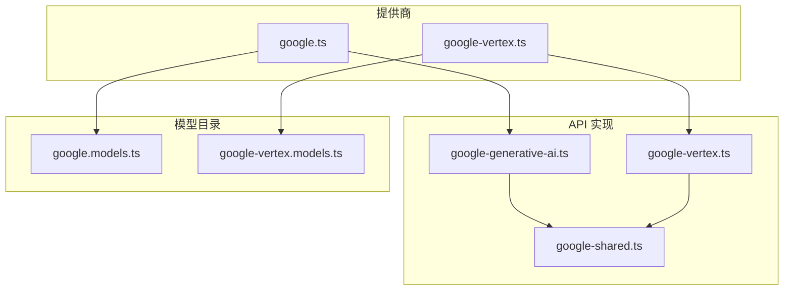
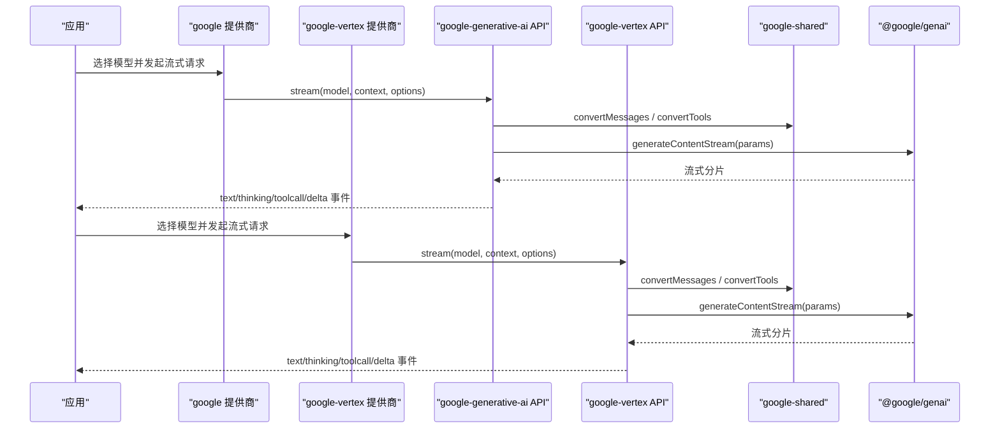
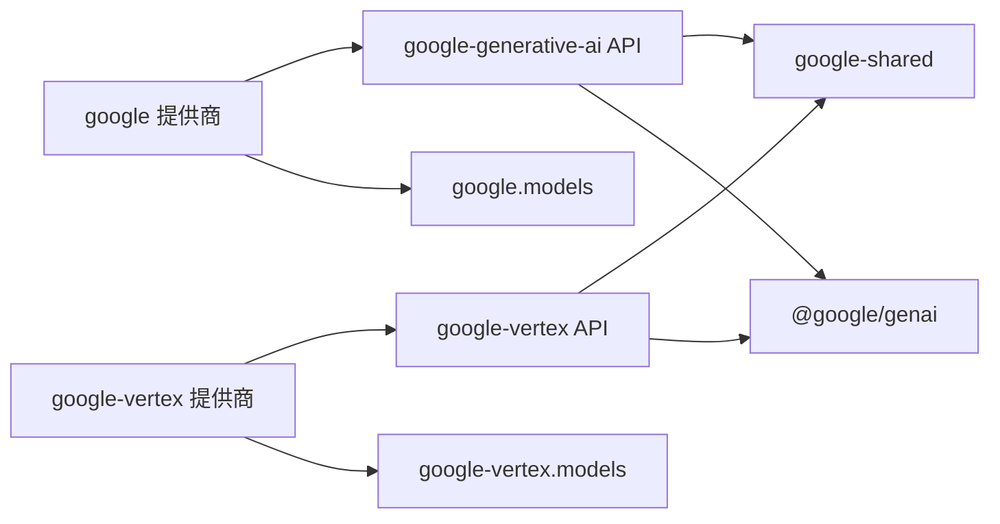

# Google Gemini 提供商适配器

<cite>
**本文引用的文件**
- [google.ts](file://packages/ai/src/providers/google.ts)
- [google-vertex.ts](file://packages/ai/src/providers/google-vertex.ts)
- [google-generative-ai.ts](file://packages/ai/src/api/google-generative-ai.ts)
- [google-vertex.ts](file://packages/ai/src/api/google-vertex.ts)
- [google-shared.ts](file://packages/ai/src/api/google-shared.ts)
- [google.models.ts](file://packages/ai/src/providers/google.models.ts)
- [google-vertex.models.ts](file://packages/ai/src/providers/google-vertex.models.ts)
</cite>

## 目录
1. [简介](#简介)
2. [项目结构](#项目结构)
3. [核心组件](#核心组件)
4. [架构总览](#架构总览)
5. [详细组件分析](#详细组件分析)
6. [依赖关系分析](#依赖关系分析)
7. [性能与调优](#性能与调优)
8. [故障排查指南](#故障排查指南)
9. [结论](#结论)
10. [附录：配置清单与最佳实践](#附录配置清单与最佳实践)

## 简介
本文件为 Google Gemini 提供商适配器的完整技术文档，覆盖以下主题：
- 模型支持：Gemini Pro、Gemini Ultra（通过 Vertex AI）、以及 Gemini Flash/Lite 等模型的配置与使用。
- 认证方式：Google Cloud API Key、Application Default Credentials（ADC）、服务账号密钥文件。
- 集成点：Google Generative AI 直接接入与 Google Vertex AI 平台接入。
- 多模态输入：文本、图片在消息与工具结果中的处理策略。
- 配置项：API Key、项目与区域设置、请求头、自定义 baseUrl、思考模式（thinking）预算与级别。
- 集成示例：流式调用、简单调用、工具调用、多轮对话。
- 性能调优：重试、超时、思考预算、温度与最大输出长度、严格函数调用模式。
- 错误处理：停止原因映射、异常归一化、可观测性字段。

## 项目结构
围绕 Google Gemini 的适配实现主要分布在 packages/ai/src 下：
- providers：提供“google”和“google-vertex”两个提供商入口，负责鉴权、模型列表与 API 绑定。
- api：分别实现 google-generative-ai 与 google-vertex 的流式生成逻辑与参数构建。
- shared：共享的消息转换、工具声明、停止原因映射、重试封装等通用能力。
- models：自动生成的模型目录，用于枚举可用模型并注入到提供商。

图表来源
- [google.ts:6-14](file://packages/ai/src/providers/google.ts#L6-L14)
- [google-vertex.ts:92-99](file://packages/ai/src/providers/google-vertex.ts#L92-L99)
- [google-generative-ai.ts:52-93](file://packages/ai/src/api/google-generative-ai.ts#L52-L93)
- [google-vertex.ts:70-110](file://packages/ai/src/api/google-vertex.ts#L70-L110)
- [google-shared.ts:98-248](file://packages/ai/src/api/google-shared.ts#L98-L248)
- [google.models.ts:7-8](file://packages/ai/src/providers/google.models.ts#L7-L8)
- [google-vertex.models.ts:7-8](file://packages/ai/src/providers/google-vertex.models.ts#L7-L8)

章节来源
- [google.ts:6-14](file://packages/ai/src/providers/google.ts#L6-L14)
- [google-vertex.ts:92-99](file://packages/ai/src/providers/google-vertex.ts#L92-L99)
- [google-generative-ai.ts:52-93](file://packages/ai/src/api/google-generative-ai.ts#L52-L93)
- [google-vertex.ts:70-110](file://packages/ai/src/api/google-vertex.ts#L70-L110)
- [google-shared.ts:98-248](file://packages/ai/src/api/google-shared.ts#L98-L248)
- [google.models.ts:7-8](file://packages/ai/src/providers/google.models.ts#L7-L8)
- [google-vertex.models.ts:7-8](file://packages/ai/src/providers/google-vertex.models.ts#L7-L8)

## 核心组件
- 提供商注册
  - “google”提供商：绑定 Google Generative AI 基础地址、API Key 鉴权、模型目录与 API 实现。
  - “google-vertex”提供商：支持 API Key 或 ADC/服务账号鉴权，要求 project/location，绑定 Vertex API 实现与模型目录。
- API 流式接口
  - google-generative-ai：基于 @google/genai 的 generateContentStream，统一事件流输出（文本、思考、工具调用、用量）。
  - google-vertex：同样基于 @google/genai，但通过 vertexai=true 与 project/location 访问 Vertex AI。
- 共享能力
  - 消息与工具转换、停止原因映射、重试封装、思考签名保留、多模态工具结果路由。

章节来源
- [google.ts:6-14](file://packages/ai/src/providers/google.ts#L6-L14)
- [google-vertex.ts:13-89](file://packages/ai/src/providers/google-vertex.ts#L13-L89)
- [google-generative-ai.ts:52-93](file://packages/ai/src/api/google-generative-ai.ts#L52-L93)
- [google-vertex.ts:70-110](file://packages/ai/src/api/google-vertex.ts#L70-L110)
- [google-shared.ts:98-248](file://packages/ai/src/api/google-shared.ts#L98-L248)

## 架构总览
下图展示从上层调用到下游 Google 服务的整体流程，包括两种接入路径（Generative AI 直连与 Vertex AI），以及共享的消息/工具转换与重试机制。

图表来源
- [google.ts:6-14](file://packages/ai/src/providers/google.ts#L6-L14)
- [google-vertex.ts:92-99](file://packages/ai/src/providers/google-vertex.ts#L92-L99)
- [google-generative-ai.ts:52-93](file://packages/ai/src/api/google-generative-ai.ts#L52-L93)
- [google-vertex.ts:70-110](file://packages/ai/src/api/google-vertex.ts#L70-L110)
- [google-shared.ts:98-248](file://packages/ai/src/api/google-shared.ts#L98-L248)

## 详细组件分析

### 提供商：Google Generative AI（google）
- 职责
  - 定义提供商 id/name/baseUrl。
  - 通过环境变量读取 API Key。
  - 注入模型目录与 API 实现。
- 关键行为
  - 使用 createProvider 将 id="google" 与 google-generative-ai API 绑定。
  - baseUrl 指向官方 Generative Language API 端点。
- 适用场景
  - 快速接入 Gemini 模型，无需 GCP 项目与区域配置。

章节来源
- [google.ts:6-14](file://packages/ai/src/providers/google.ts#L6-L14)
- [google.models.ts:7-8](file://packages/ai/src/providers/google.models.ts#L7-L8)

### 提供商：Google Vertex AI（google-vertex）
- 职责
  - 支持三种鉴权：API Key、ADC、服务账号文件。
  - 解析 project/location 与环境变量。
  - 注入模型目录与 API 实现。
- 关键行为
  - login 交互引导用户选择鉴权方式并收集必要信息。
  - resolve 阶段优先读取存储凭据或环境变量，再回退到 gcloud ADC。
  - 创建客户端时根据是否传入 apiKey 选择不同构造方式。
- 适用场景
  - 企业级部署、私有网络、合规审计、配额与计费管理。

章节来源
- [google-vertex.ts:13-89](file://packages/ai/src/providers/google-vertex.ts#L13-L89)
- [google-vertex.ts:92-99](file://packages/ai/src/providers/google-vertex.ts#L92-L99)
- [google-vertex.models.ts:7-8](file://packages/ai/src/providers/google-vertex.models.ts#L7-L8)

### API：Google Generative AI 流式实现
- 职责
  - 构建请求参数（消息、工具、系统提示、thinking 配置、信号）。
  - 调用 SDK 流式接口，并将分片转换为统一事件流。
  - 计算用量与成本，映射停止原因。
- 关键点
  - 不支持自定义 fetch。
  - 对 Gemini 3.x 系列采用 thinkingLevel；其他模型使用 thinkingBudget。
  - 工具调用 ID 去重与唯一性保障。
  - 支持 abortSignal 取消。
- 输出事件
  - start/text_start/text_delta/text_end
  - thinking_start/thinking_delta/thinking_end
  - toolcall_start/toolcall_delta/toolcall_end
  - done/error

章节来源
- [google-generative-ai.ts:52-93](file://packages/ai/src/api/google-generative-ai.ts#L52-L93)
- [google-generative-ai.ts:334-409](file://packages/ai/src/api/google-generative-ai.ts#L334-L409)
- [google-generative-ai.ts:417-517](file://packages/ai/src/api/google-generative-ai.ts#L417-L517)

### API：Google Vertex AI 流式实现
- 职责
  - 与 Generative AI 类似，但通过 vertexai=true、project/location 访问 Vertex。
  - 支持自定义 baseUrl 与版本路径检测。
  - 鉴权优先级：options.apiKey > GOOGLE_APPLICATION_CREDENTIALS > ADC。
- 关键点
  - 强制要求 project/location，未设置会抛出错误。
  - 对 Gemini 3.x 系列采用 thinkingLevel；其他模型使用 thinkingBudget。
  - 工具调用与消息转换复用共享逻辑。
- 输出事件
  - 与 Generative AI 一致的事件流。

章节来源
- [google-vertex.ts:70-110](file://packages/ai/src/api/google-vertex.ts#L70-L110)
- [google-vertex.ts:349-378](file://packages/ai/src/api/google-vertex.ts#L349-L378)
- [google-vertex.ts:416-452](file://packages/ai/src/api/google-vertex.ts#L416-L452)
- [google-vertex.ts:454-507](file://packages/ai/src/api/google-vertex.ts#L454-L507)

### 共享：消息与工具转换、多模态、停止原因、重试
- 消息转换
  - 将内部消息转为 Gemini Content[]，支持文本、图片 inlineData。
  - 工具结果中，若模型支持多模态函数响应，则将图片嵌入 functionResponse.parts；否则追加独立 user 消息。
- 工具声明
  - 默认使用 parametersJsonSchema；可选降级为 OpenAPI 兼容的 parameters。
- 停止原因映射
  - 将 FinishReason 映射为 stop/length/error。
- 重试封装
  - 对 408/409/429/5xx 进行指数退避重试，尊重 Retry-After。
- 思考签名
  - 保留 thoughtSignature 以维持跨轮推理上下文。

章节来源
- [google-shared.ts:98-248](file://packages/ai/src/api/google-shared.ts#L98-L248)
- [google-shared.ts:285-336](file://packages/ai/src/api/google-shared.ts#L285-L336)
- [google-shared.ts:341-382](file://packages/ai/src/api/google-shared.ts#L341-L382)
- [google-shared.ts:393-414](file://packages/ai/src/api/google-shared.ts#L393-L414)

## 依赖关系分析
- 提供商依赖
  - google 提供商依赖 google-generative-ai API 与 google.models。
  - google-vertex 提供商依赖 google-vertex API 与 google-vertex.models。
- API 层依赖
  - 两者均依赖 google-shared 完成消息/工具/停止原因/重试等公共逻辑。
- 外部依赖
  - @google/genai SDK 提供统一的 GenerateContentParameters/Config 与流式接口。
  - 运行时环境提供环境变量（API Key、Project、Location、Credentials）。

图表来源
- [google.ts:6-14](file://packages/ai/src/providers/google.ts#L6-L14)
- [google-vertex.ts:92-99](file://packages/ai/src/providers/google-vertex.ts#L92-L99)
- [google-generative-ai.ts:52-93](file://packages/ai/src/api/google-generative-ai.ts#L52-L93)
- [google-vertex.ts:70-110](file://packages/ai/src/api/google-vertex.ts#L70-L110)
- [google-shared.ts:98-248](file://packages/ai/src/api/google-shared.ts#L98-L248)
- [google.models.ts:7-8](file://packages/ai/src/providers/google.models.ts#L7-L8)
- [google-vertex.models.ts:7-8](file://packages/ai/src/providers/google-vertex.models.ts#L7-L8)

章节来源
- [google.ts:6-14](file://packages/ai/src/providers/google.ts#L6-L14)
- [google-vertex.ts:92-99](file://packages/ai/src/providers/google-vertex.ts#L92-L99)
- [google-generative-ai.ts:52-93](file://packages/ai/src/api/google-generative-ai.ts#L52-L93)
- [google-vertex.ts:70-110](file://packages/ai/src/api/google-vertex.ts#L70-L110)
- [google-shared.ts:98-248](file://packages/ai/src/api/google-shared.ts#L98-L248)
- [google.models.ts:7-8](file://packages/ai/src/providers/google.models.ts#L7-L8)
- [google-vertex.models.ts:7-8](file://packages/ai/src/providers/google-vertex.models.ts#L7-L8)

## 性能与调优
- 重试与稳定性
  - 使用共享重试封装，自动处理 408/409/429/5xx 并尊重 Retry-After。
- 思考模式（thinking）
  - Gemini 3.x 系列：通过 thinkingLevel（MINIMAL/LOW/MEDIUM/HIGH）控制。
  - 其他模型：通过 thinkingBudget 控制，可按 effort 档位设置默认预算。
  - 关闭思考：对 Gemini 3.x 使用最低 level 且不含 includeThoughts；对 2.x 使用 budget=0。
- 并发与吞吐
  - 合理设置 temperature 与 maxTokens，避免过长输出导致延迟。
  - 利用流式事件逐步渲染，降低首字延迟。
- 工具调用
  - 对需要严格校验的工具启用 VALIDATED 模式，减少无效调用。
  - 确保工具参数 JSON Schema 正确，避免反复重试。
- 缓存与成本
  - 关注 usageMetadata 中的 cachedContentTokenCount，合理利用缓存命中。
  - 通过 calculateCost 统计成本，结合业务阈值做限流。

[本节为通用指导，不直接分析具体文件]

## 故障排查指南
- 常见错误与定位
  - 缺少 API Key：在 Generative AI 路径会直接报错；Vertex 路径需检查 GOOGLE_CLOUD_API_KEY 或 ADC。
  - 缺少 Project/Location：Vertex 路径必须提供，未设置会抛出明确错误。
  - 自定义 fetch：Google 适配器不支持自定义 fetch，需移除该选项。
  - 流结束无 finish reason：视为错误，检查上游状态码与重试策略。
- 停止原因
  - 将 FinishReason 映射为 stop/length/error，便于上层统一处理。
- 调试建议
  - 开启 onPayload 钩子打印请求体。
  - 监听 error 事件获取 errorMessage 与原始错误信息。
  - 检查 thoughtSignature 是否正确保留，避免多轮推理中断。

章节来源
- [google-generative-ai.ts:78-85](file://packages/ai/src/api/google-generative-ai.ts#L78-L85)
- [google-generative-ai.ts:267-289](file://packages/ai/src/api/google-generative-ai.ts#L267-L289)
- [google-vertex.ts:96-104](file://packages/ai/src/api/google-vertex.ts#L96-L104)
- [google-vertex.ts:433-452](file://packages/ai/src/api/google-vertex.ts#L433-L452)
- [google-shared.ts:341-382](file://packages/ai/src/api/google-shared.ts#L341-L382)

## 结论
本项目为 Google Gemini 提供了两套稳定、一致的接入方式：
- 面向个人与快速集成的 Google Generative AI 直连。
- 面向企业与合规的 Google Vertex AI 平台接入。
两者共享消息/工具/停止原因/重试等核心能力，并通过 thinking 配置灵活适配不同模型特性。配合完善的错误处理与可观测性字段，可满足生产环境的稳定性与可维护性要求。

[本节为总结性内容，不直接分析具体文件]

## 附录：配置清单与最佳实践

- 认证与环境变量
  - Google Generative AI
    - 必需：GEMINI_API_KEY
  - Google Vertex AI
    - 方式一：GOOGLE_CLOUD_API_KEY
    - 方式二：GOOGLE_APPLICATION_CREDENTIALS + GOOGLE_CLOUD_PROJECT + GOOGLE_CLOUD_LOCATION
    - 方式三：gcloud application-default login（ADC）+ 项目与区域环境变量
- 项目与区域
  - Vertex 路径必须设置 project 与 location，未设置将抛出错误。
- 请求头与自定义端点
  - 可通过 model.headers 注入额外请求头。
  - Vertex 支持自定义 baseUrl，并自动识别是否包含版本号。
- 思考模式
  - Gemini 3.x：使用 thinking.level（MINIMAL/LOW/MEDIUM/HIGH）。
  - 其他模型：使用 thinking.budgetTokens，可按 effort 档位配置。
  - 关闭思考：对 3.x 使用最低 level 且不 includeThoughts；对 2.x 使用 budget=0。
- 工具调用
  - 推荐启用严格采样（VALIDATED）以提升参数校验质量。
  - 工具参数建议使用 JSON Schema，必要时可降级为 OpenAPI 兼容的 parameters。
- 多模态
  - 用户消息支持文本与图片 inlineData。
  - 工具结果支持图片返回；Gemini 3+ 可直接嵌套在 functionResponse.parts，旧版需追加独立 user 消息。
- 配额与成本
  - 关注 usageMetadata 中的 token 计数与缓存命中。
  - 结合 calculateCost 统计成本，按业务阈值限制并发与输出长度。
- 集成示例（步骤说明）
  - 流式调用：选择模型与提供商，传入 context 与 options，订阅事件流处理文本/思考/工具调用增量。
  - 简单调用：通过 streamSimple 自动推导 thinking 配置，适合非流式场景。
  - 工具调用：声明 tools 与 toolChoice，接收 toolcall_* 事件并执行后回填 toolResult。
  - 多轮对话：保持消息历史，注意同 provider/model 的 thinkingSignature 保留规则。

[本节为配置与实践指引，不直接分析具体文件]