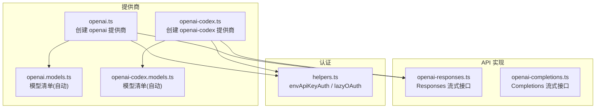
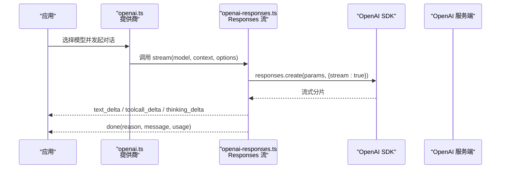
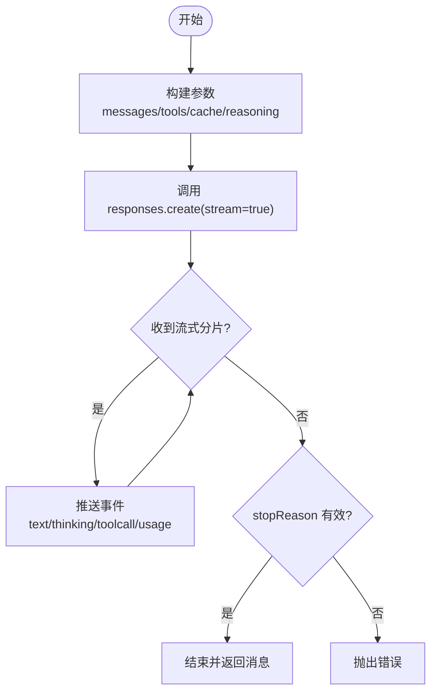
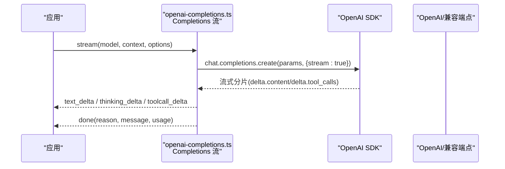
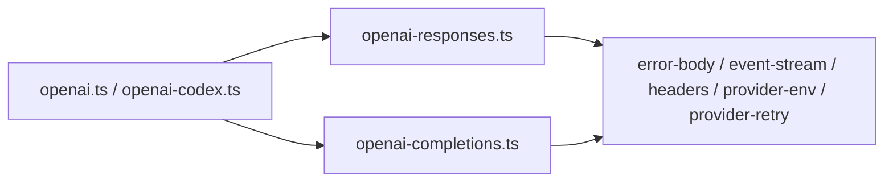

# OpenAI 提供商适配器

<cite>
**本文引用的文件**
- [openai.ts](file://packages/ai/src/providers/openai.ts)
- [openai.models.ts](file://packages/ai/src/providers/openai.models.ts)
- [openai-responses.ts](file://packages/ai/src/api/openai-responses.ts)
- [openai-completions.ts](file://packages/ai/src/api/openai-completions.ts)
- [openai-codex.ts](file://packages/ai/src/providers/openai-codex.ts)
- [openai-codex.models.ts](file://packages/ai/src/providers/openai-codex.models.ts)
- [helpers.ts](file://packages/ai/src/auth/helpers.ts)
</cite>

## 目录
1. [简介](#简介)
2. [项目结构](#项目结构)
3. [核心组件](#核心组件)
4. [架构总览](#架构总览)
5. [详细组件分析](#详细组件分析)
6. [依赖关系分析](#依赖关系分析)
7. [性能考量](#性能考量)
8. [故障排查指南](#故障排查指南)
9. [结论](#结论)
10. [附录：配置与使用示例](#附录：配置与使用示例)

## 简介
本文件面向需要在项目中集成 OpenAI GPT 系列模型（包括 ChatGPT、GPT-4、GPT-3.5-turbo 等）的开发者，提供 OpenAI 提供商适配器的完整说明。内容涵盖：
- API Key 认证与环境变量注入
- 请求参数设置（温度、最大输出 token、工具调用、推理强度等）
- 流式响应处理（文本、思考过程、工具调用增量）
- 错误重试机制与异常归一化
- 与 OpenAI Codex（ChatGPT Plus/Pro）的 OAuth 集成方式与典型场景
- 性能优化建议与常见问题解决方案

## 项目结构
OpenAI 相关能力在 packages/ai 中按“提供商 + API 实现”分层组织：
- 提供商定义：负责注册 provider id、名称、baseUrl、鉴权方式、模型清单与底层 API 实现
- API 实现：封装 OpenAI SDK 调用、消息/工具转换、流式解析、成本与用量统计、错误处理
- 认证辅助：统一的环境变量读取与 OAuth 懒加载封装

图表来源
- [openai.ts:6-14](file://packages/ai/src/providers/openai.ts#L6-L14)
- [openai-codex.ts:7-21](file://packages/ai/src/providers/openai-codex.ts#L7-L21)
- [openai.models.ts:4-8](file://packages/ai/src/providers/openai.models.ts#L4-L8)
- [openai-codex.models.ts:4-8](file://packages/ai/src/providers/openai-codex.models.ts#L4-L8)
- [openai-responses.ts:102-195](file://packages/ai/src/api/openai-responses.ts#L102-L195)
- [openai-completions.ts:200-614](file://packages/ai/src/api/openai-completions.ts#L200-L614)
- [helpers.ts:9-31](file://packages/ai/src/auth/helpers.ts#L9-L31)

章节来源
- [openai.ts:6-14](file://packages/ai/src/providers/openai.ts#L6-L14)
- [openai-codex.ts:7-21](file://packages/ai/src/providers/openai-codex.ts#L7-L21)
- [openai.models.ts:4-8](file://packages/ai/src/providers/openai.models.ts#L4-L8)
- [openai-codex.models.ts:4-8](file://packages/ai/src/providers/openai-codex.models.ts#L4-L8)
- [openai-responses.ts:102-195](file://packages/ai/src/api/openai-responses.ts#L102-L195)
- [openai-completions.ts:200-614](file://packages/ai/src/api/openai-completions.ts#L200-L614)
- [helpers.ts:9-31](file://packages/ai/src/auth/helpers.ts#L9-L31)

## 核心组件
- OpenAI 提供商（Responses）：通过 createProvider 注册 openai 提供商，绑定 baseUrl、鉴权、模型清单与 Responses API 实现
- OpenAI 提供商（Codex）：通过 createProvider 注册 openai-codex 提供商，绑定 baseUrl、OAuth 鉴权、模型清单与 Responses API 实现
- Responses API 流式实现：封装 OpenAI responses.create 流式调用、消息/工具转换、推理与缓存控制、用量与成本计算、错误处理
- Completions API 流式实现：兼容旧版 chat.completions 流式接口，支持多厂商兼容（如 Moonshot），包含工具调用、思考字段、停止原因映射等

章节来源
- [openai.ts:6-14](file://packages/ai/src/providers/openai.ts#L6-L14)
- [openai-codex.ts:7-21](file://packages/ai/src/providers/openai-codex.ts#L7-L21)
- [openai-responses.ts:102-195](file://packages/ai/src/api/openai-responses.ts#L102-L195)
- [openai-completions.ts:200-614](file://packages/ai/src/api/openai-completions.ts#L200-L614)

## 架构总览
OpenAI 提供商适配器采用“提供商声明 + API 实现”解耦设计：
- 提供商层：声明 id、name、baseUrl、auth、models、api
- API 层：根据提供商选择 Responses 或 Completions 流式实现
- 认证层：环境变量 API Key 或 OAuth（Codex）
- 数据流：上下文消息 → 参数构建 → 流式请求 → 增量事件 → 最终消息与用量

图表来源
- [openai.ts:6-14](file://packages/ai/src/providers/openai.ts#L6-L14)
- [openai-responses.ts:102-195](file://packages/ai/src/api/openai-responses.ts#L102-L195)

## 详细组件分析

### OpenAI 提供商（Responses）
- 职责：注册 openai 提供商，绑定官方 baseUrl、API Key 鉴权、模型清单与 Responses API 实现
- 关键点：
  - baseUrl 指向官方端点
  - 鉴权通过 envApiKeyAuth 从环境变量读取 OPENAI_API_KEY
  - 模型清单由自动生成脚本维护，避免手工维护偏差

章节来源
- [openai.ts:6-14](file://packages/ai/src/providers/openai.ts#L6-L14)
- [openai.models.ts:4-8](file://packages/ai/src/providers/openai.models.ts#L4-L8)
- [helpers.ts:9-31](file://packages/ai/src/auth/helpers.ts#L9-L31)

### OpenAI 提供商（Codex）
- 职责：注册 openai-codex 提供商，绑定 ChatGPT Plus/Pro 后端 baseUrl、OAuth 鉴权、模型清单与 Responses API 实现
- 关键点：
  - baseUrl 指向 ChatGPT 后端
  - 鉴权使用 lazyOAuth 延迟加载 OAuth 流程，标注为订阅型
  - 模型清单由自动生成脚本维护

章节来源
- [openai-codex.ts:7-21](file://packages/ai/src/providers/openai-codex.ts#L7-L21)
- [openai-codex.models.ts:4-8](file://packages/ai/src/providers/openai-codex.models.ts#L4-L8)
- [helpers.ts:40-59](file://packages/ai/src/auth/helpers.ts#L40-L59)

### Responses 流式 API 实现
- 职责：将高层上下文转换为 OpenAI Responses 请求，处理流式事件，产出统一的事件流与最终消息
- 关键流程：
  - 构建客户端与请求参数（含 prompt_cache_key、prompt_cache_retention、max_output_tokens、temperature、service_tier、reasoning 等）
  - 通过 retryProviderRequest 包装请求，支持 maxRetries、maxRetryDelayMs、signal 取消
  - 流式处理：文本增量、思考增量、工具调用增量、用量统计、停止原因判定
  - 错误处理：标准化错误信息，区分中止与错误状态

图表来源
- [openai-responses.ts:102-195](file://packages/ai/src/api/openai-responses.ts#L102-L195)
- [openai-responses.ts:258-343](file://packages/ai/src/api/openai-responses.ts#L258-L343)

章节来源
- [openai-responses.ts:102-195](file://packages/ai/src/api/openai-responses.ts#L102-L195)
- [openai-responses.ts:258-343](file://packages/ai/src/api/openai-responses.ts#L258-L343)

### Completions 流式 API 实现（兼容模式）
- 职责：兼容旧版 chat.completions 流式接口，支持多厂商（如 Moonshot）与复杂工具调用、思考字段、停止原因映射
- 关键流程：
  - 构建客户端与请求参数（含 prompt_cache_key、prompt_cache_retention、max_tokens/max_completion_tokens、temperature、tools/tool_choice）
  - 通过 retryProviderRequest 包装请求，支持重试与取消
  - 流式处理：文本增量、thinking 增量（兼容 reasoning_content/reasoning/reasoning_text）、tool_calls 增量、用量统计、停止原因映射
  - 错误处理：标准化错误信息，区分中止与错误状态

图表来源
- [openai-completions.ts:200-614](file://packages/ai/src/api/openai-completions.ts#L200-L614)

章节来源
- [openai-completions.ts:200-614](file://packages/ai/src/api/openai-completions.ts#L200-L614)

### 认证机制
- API Key 认证：通过 envApiKeyAuth 从存储凭证或环境变量读取，优先使用显式传入的 apiKey，其次检查 Authorization 头以跳过密钥校验（用于代理场景）
- OAuth 认证（Codex）：通过 lazyOAuth 延迟加载 OAuth 流程，支持登录、刷新与生成鉴权信息；适用于需要订阅权限的场景

章节来源
- [helpers.ts:9-31](file://packages/ai/src/auth/helpers.ts#L9-L31)
- [helpers.ts:40-59](file://packages/ai/src/auth/helpers.ts#L40-L59)
- [openai-responses.ts:43-47](file://packages/ai/src/api/openai-responses.ts#L43-L47)
- [openai-completions.ts:72-76](file://packages/ai/src/api/openai-completions.ts#L72-L76)

## 依赖关系分析
- 提供商与 API 的耦合度低：提供商仅声明 api 工厂函数，具体实现位于独立模块
- 外部依赖：OpenAI SDK 用于创建客户端与发起请求；事件流与工具类用于解析与组装
- 内部依赖：消息/工具转换、错误处理、重试、缓存键生成等通用能力

图表来源
- [openai.ts:6-14](file://packages/ai/src/providers/openai.ts#L6-L14)
- [openai-codex.ts:7-21](file://packages/ai/src/providers/openai-codex.ts#L7-L21)
- [openai-responses.ts:102-195](file://packages/ai/src/api/openai-responses.ts#L102-L195)
- [openai-completions.ts:200-614](file://packages/ai/src/api/openai-completions.ts#L200-L614)

章节来源
- [openai.ts:6-14](file://packages/ai/src/providers/openai.ts#L6-L14)
- [openai-codex.ts:7-21](file://packages/ai/src/providers/openai-codex.ts#L7-L21)
- [openai-responses.ts:102-195](file://packages/ai/src/api/openai-responses.ts#L102-L195)
- [openai-completions.ts:200-614](file://packages/ai/src/api/openai-completions.ts#L200-L614)

## 性能考量
- 提示词缓存：通过 prompt_cache_key 与 prompt_cache_retention 启用短/长缓存，减少重复输入成本与延迟
- 服务等级（service_tier）：可指定 flex/priority 等层级，影响排队与成本
- 推理强度（reasoningEffort）：按需开启或调整推理深度，平衡质量与耗时
- 流式传输：增量事件降低首字节延迟，提升交互体验
- 工具调用：仅在必要时声明 tools，减少无效开销
- 超时与取消：通过 signal 与 timeoutMs 控制请求生命周期，避免资源浪费

[本节为通用指导，不直接分析具体文件]

## 故障排查指南
- 缺少 API Key：当未提供 apiKey 且无 Authorization 头时，会抛出“无 API Key”的错误
- 流结束无停止原因：若流结束但未检测到 stop_reason，将抛出错误
- 请求被中止：当信号中止或 stopReason 为 aborted 时，抛出中止错误
- 错误信息标准化：错误会被规范化并附加元数据，便于定位问题

章节来源
- [openai-responses.ts:43-47](file://packages/ai/src/api/openai-responses.ts#L43-L47)
- [openai-responses.ts:167-176](file://packages/ai/src/api/openai-responses.ts#L167-L176)
- [openai-completions.ts:571-586](file://packages/ai/src/api/openai-completions.ts#L571-L586)
- [openai-completions.ts:590-609](file://packages/ai/src/api/openai-completions.ts#L590-L609)

## 结论
本适配器通过清晰的提供商声明与统一的 API 实现，提供了对 OpenAI GPT 系列模型的稳定集成。其流式处理、缓存控制、推理强度调节与错误重试机制，能够满足高可用与高性能需求。对于需要订阅权限的场景，可通过 Codex 提供商的 OAuth 流程无缝接入 ChatGPT Plus/Pro 能力。

[本节为总结性内容，不直接分析具体文件]

## 附录：配置与使用示例
- 环境变量
  - OPENAI_API_KEY：用于 OpenAI 官方提供商的 API Key 认证
- 提供商配置
  - OpenAI 提供商：id=openai，baseUrl=https://api.openai.com/v1，鉴权=API Key，模型清单来自自动生成
  - OpenAI Codex 提供商：id=openai-codex，baseUrl=https://chatgpt.com/backend-api，鉴权=OAuth（订阅型），模型清单来自自动生成
- 请求参数要点
  - temperature：控制创造性
  - maxTokens/max_output_tokens：限制输出长度
  - service_tier：flex/priority 等，影响排队与成本
  - reasoningEffort：控制推理深度（minimal/low/medium/high/xhigh/max）
  - prompt_cache_key/prompt_cache_retention：启用提示词缓存
  - tools/tool_choice：声明工具与调用策略
- 流式响应
  - 文本增量：text_delta
  - 思考增量：thinking_delta（兼容 reasoning_content/reasoning/reasoning_text）
  - 工具调用增量：toolcall_delta
  - 完成事件：done(reason, message, usage)
- 错误与重试
  - 通过 maxRetries 与 maxRetryDelayMs 控制重试策略
  - 通过 signal 与 timeoutMs 控制取消与超时
- 与 OpenAI Codex 的集成
  - 使用 openai-codex 提供商，基于 OAuth 获取访问令牌
  - 适用于 ChatGPT Plus/Pro 用户的高级功能与私有化场景

章节来源
- [openai.ts:6-14](file://packages/ai/src/providers/openai.ts#L6-L14)
- [openai-codex.ts:7-21](file://packages/ai/src/providers/openai-codex.ts#L7-L21)
- [openai-responses.ts:258-343](file://packages/ai/src/api/openai-responses.ts#L258-L343)
- [openai-completions.ts:681-800](file://packages/ai/src/api/openai-completions.ts#L681-L800)
- [helpers.ts:9-31](file://packages/ai/src/auth/helpers.ts#L9-L31)
- [helpers.ts:40-59](file://packages/ai/src/auth/helpers.ts#L40-L59)