# 其他 AI 提供商适配器

<cite>
**本文引用的文件**
- [README.md](file://packages/ai/README.md)
- [models.ts](file://packages/ai/src/models.ts)
- [helpers.ts](file://packages/ai/src/auth/helpers.ts)
- [mistral.ts](file://packages/ai/src/providers/mistral.ts)
- [groq.ts](file://packages/ai/src/providers/groq.ts)
- [fireworks.ts](file://packages/ai/src/providers/fireworks.ts)
- [huggingface.ts](file://packages/ai/src/providers/huggingface.ts)
- [together.ts](file://packages/ai/src/providers/together.ts)
- [xai.ts](file://packages/ai/src/providers/xai.ts)
- [cerebras.ts](file://packages/ai/src/providers/cerebras.ts)
- [deepseek.ts](file://packages/ai/src/providers/deepseek.ts)
- [nvidia.ts](file://packages/ai/src/providers/nvidia.ts)
</cite>

## 目录
1. [简介](#简介)
2. [项目结构](#项目结构)
3. [核心组件](#核心组件)
4. [架构总览](#架构总览)
5. [详细组件分析](#详细组件分析)
6. [依赖关系分析](#依赖关系分析)
7. [性能与适用场景](#性能与适用场景)
8. [故障排查指南](#故障排查指南)
9. [选型建议与迁移指南](#选型建议与迁移指南)
10. [结论](#结论)

## 简介
本文件面向“其他 AI 提供商适配器”，系统梳理 Mistral、Groq、Fireworks、HuggingFace、Together AI、xAI、Cerebras、DeepSeek、NVIDIA 等提供商在统一 LLM 框架中的集成方式。文档说明各提供商的认证方式、基础 URL、API 协议适配、模型清单来源，以及统一的配置接口、错误处理模式。同时给出选型建议与从旧全局 API 迁移到当前 Models/Provider 模式的实践路径。

## 项目结构
该仓库通过 packages/ai 提供统一的 LLM 多提供商抽象：每个提供商以独立工厂函数注册，声明 id、name、baseUrl、auth、models 和 api 实现；Models 层负责鉴权解析、请求头合并、流式分发与错误封装。

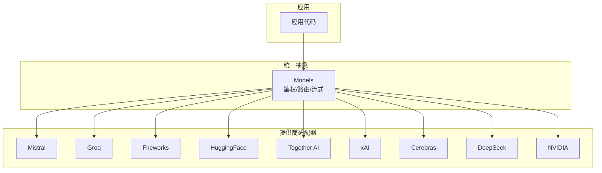

图表来源
- [models.ts:254-737](file://packages/ai/src/models.ts#L254-L737)
- [mistral.ts:1-16](file://packages/ai/src/providers/mistral.ts#L1-L16)
- [groq.ts:1-16](file://packages/ai/src/providers/groq.ts#L1-L16)
- [fireworks.ts:1-20](file://packages/ai/src/providers/fireworks.ts#L1-L20)
- [huggingface.ts:1-16](file://packages/ai/src/providers/huggingface.ts#L1-L16)
- [together.ts:1-16](file://packages/ai/src/providers/together.ts#L1-L16)
- [xai.ts:1-29](file://packages/ai/src/providers/xai.ts#L1-L29)
- [cerebras.ts:1-16](file://packages/ai/src/providers/cerebras.ts#L1-L16)
- [deepseek.ts:1-16](file://packages/ai/src/providers/deepseek.ts#L1-L16)
- [nvidia.ts:1-16](file://packages/ai/src/providers/nvidia.ts#L1-L16)

章节来源
- [README.md:57-90](file://packages/ai/README.md#L57-L90)
- [models.ts:254-737](file://packages/ai/src/models.ts#L254-L737)

## 核心组件
- Provider（提供商）：定义 id、name、baseUrl、auth、models、api 实现，是运行时最小单元。
- Models（模型集合）：维护 Provider 列表，负责鉴权解析、请求头合并、流式分发、错误封装与刷新动态模型。
- Auth（鉴权）：envApiKeyAuth 提供标准 API Key 解析（存储凭证优先，其次环境变量），支持 login 交互；OAuth 通过 lazyOAuth 懒加载。
- API 适配：不同提供商可能使用 openai-completions、anthropic-messages、openai-responses 或 mistral-conversations 等协议适配。

章节来源
- [models.ts:97-149](file://packages/ai/src/models.ts#L97-L149)
- [models.ts:254-737](file://packages/ai/src/models.ts#L254-L737)
- [helpers.ts:1-60](file://packages/ai/src/auth/helpers.ts#L1-L60)

## 架构总览
下图展示一次调用从应用到具体提供商的完整流程，包括鉴权解析、请求头合并、流式分发与错误返回。

```mermaid
sequenceDiagram
participant App as "应用"
participant Models as "Models"
participant Prov as "Provider"
participant API as "API 适配"
participant End as "提供商端点"
App->>Models : stream(model, context, options)
Models->>Models : applyAuth()<br/>getAuth()/mergeHeaders()
Models->>Prov : stream(model, context, requestOptions)
Prov->>API : 选择协议适配(openai-completions/anthropic-messages/openai-responses/mistral-conversations)
API->>End : HTTP 请求(携带鉴权头/自定义头)
End-->>API : 响应/流
API-->>Prov : 事件流/结果
Prov-->>Models : 事件流/结果
Models-->>App : 事件流/最终消息
```

图表来源
- [models.ts:636-688](file://packages/ai/src/models.ts#L636-L688)
- [mistral.ts:1-16](file://packages/ai/src/providers/mistral.ts#L1-L16)
- [groq.ts:1-16](file://packages/ai/src/providers/groq.ts#L1-L16)
- [fireworks.ts:1-20](file://packages/ai/src/providers/fireworks.ts#L1-L20)
- [xai.ts:1-29](file://packages/ai/src/providers/xai.ts#L1-L29)

## 详细组件分析

### Mistral 适配器
- 标识与基础信息
  - id: "mistral"
  - name: "Mistral"
  - baseUrl: "https://api.mistral.ai"
- 认证方式
  - envApiKeyAuth，读取存储凭证或环境变量（如 MISTRAL_API_KEY）
- 模型清单
  - 静态模型来自 mistral.models.ts
- API 协议
  - mistral-conversations.lazy 协议适配
- 适用场景
  - 需要原生 Mistral 对话协议的模型与服务

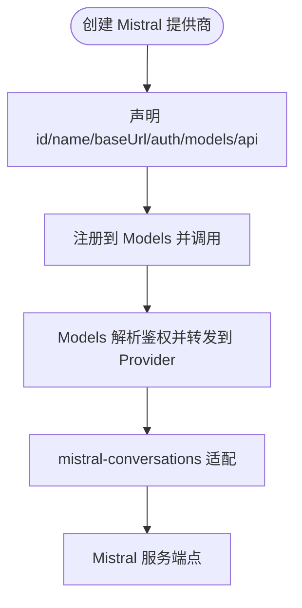

图表来源
- [mistral.ts:1-16](file://packages/ai/src/providers/mistral.ts#L1-L16)
- [models.ts:636-688](file://packages/ai/src/models.ts#L636-L688)

章节来源
- [mistral.ts:1-16](file://packages/ai/src/providers/mistral.ts#L1-L16)

### Groq 适配器
- 标识与基础信息
  - id: "groq"
  - name: "Groq"
  - baseUrl: "https://api.groq.com/openai/v1"
- 认证方式
  - envApiKeyAuth，读取存储凭证或环境变量（如 GROQ_API_KEY）
- 模型清单
  - 静态模型来自 groq.models.ts
- API 协议
  - openai-completions.lazy 协议适配
- 适用场景
  - 兼容 OpenAI Completions 接口的推理服务，强调低延迟

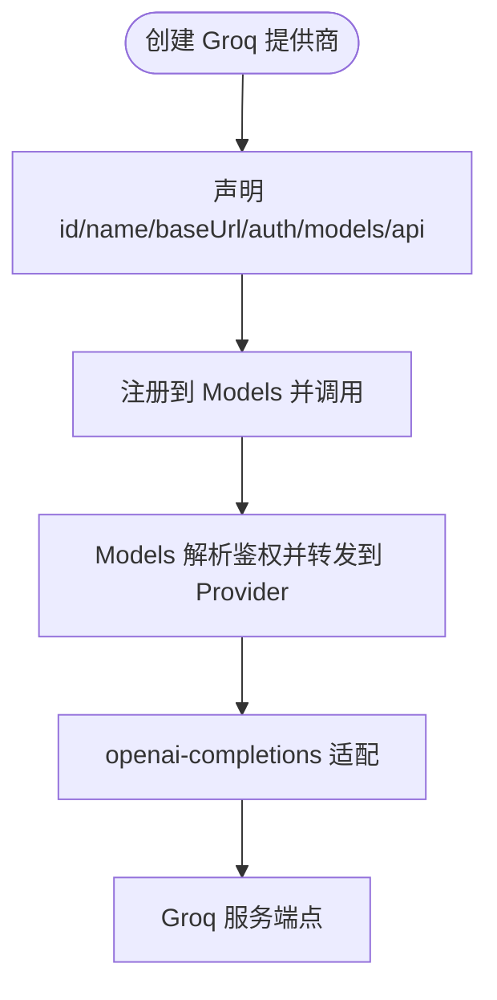

图表来源
- [groq.ts:1-16](file://packages/ai/src/providers/groq.ts#L1-L16)
- [models.ts:636-688](file://packages/ai/src/models.ts#L636-L688)

章节来源
- [groq.ts:1-16](file://packages/ai/src/providers/groq.ts#L1-L16)

### Fireworks 适配器
- 标识与基础信息
  - id: "fireworks"
  - name: "Fireworks"
  - baseUrl: "https://api.fireworks.ai/inference"
- 认证方式
  - envApiKeyAuth，读取存储凭证或环境变量（如 FIREWORKS_API_KEY）
- 模型清单
  - 静态模型来自 fireworks.models.ts
- API 协议
  - 多协议：anthropic-messages.lazy 与 openai-completions.lazy 并存，按 model.api 分派
- 适用场景
  - 同一提供商下混合 Anthropic 与 OpenAI 兼容模型的部署

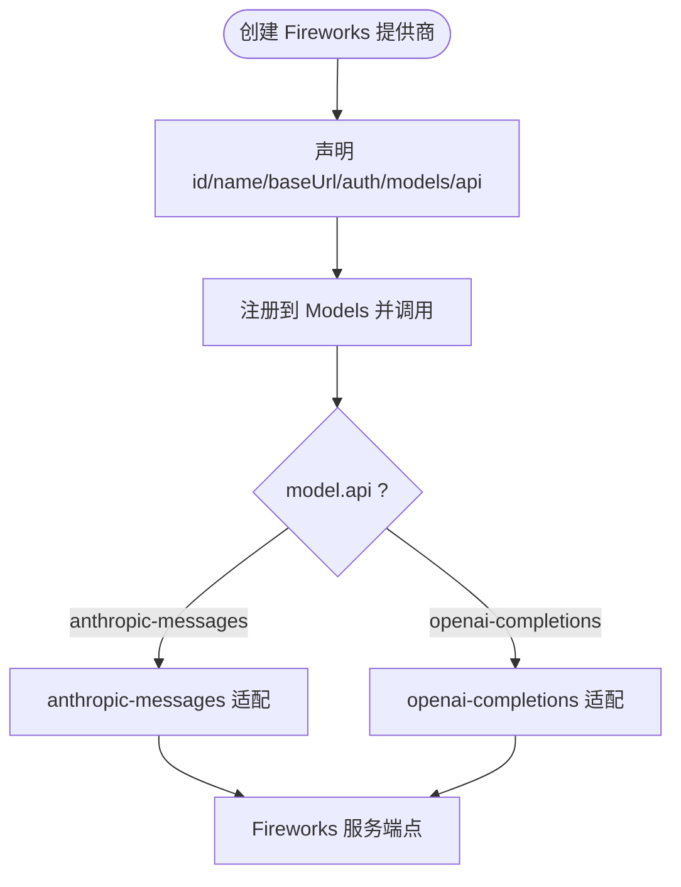

图表来源
- [fireworks.ts:1-20](file://packages/ai/src/providers/fireworks.ts#L1-L20)
- [models.ts:775-792](file://packages/ai/src/models.ts#L775-L792)

章节来源
- [fireworks.ts:1-20](file://packages/ai/src/providers/fireworks.ts#L1-L20)

### Hugging Face 适配器
- 标识与基础信息
  - id: "huggingface"
  - name: "Hugging Face"
  - baseUrl: "https://router.huggingface.co/v1"
- 认证方式
  - envApiKeyAuth，读取存储凭证或环境变量（如 HF_TOKEN）
- 模型清单
  - 静态模型来自 huggingface.models.ts
- API 协议
  - openai-completions.lazy 协议适配
- 适用场景
  - 通过 Router 访问开源模型，兼容 OpenAI Completions 接口

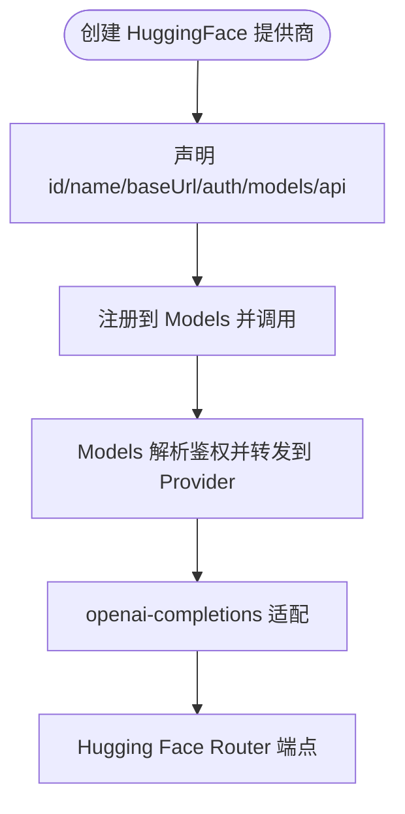

图表来源
- [huggingface.ts:1-16](file://packages/ai/src/providers/huggingface.ts#L1-L16)
- [models.ts:636-688](file://packages/ai/src/models.ts#L636-L688)

章节来源
- [huggingface.ts:1-16](file://packages/ai/src/providers/huggingface.ts#L1-L16)

### Together AI 适配器
- 标识与基础信息
  - id: "together"
  - name: "Together"
  - baseUrl: "https://api.together.ai/v1"
- 认证方式
  - envApiKeyAuth，读取存储凭证或环境变量（如 TOGETHER_API_KEY）
- 模型清单
  - 静态模型来自 together.models.ts
- API 协议
  - openai-completions.lazy 协议适配
- 适用场景
  - 兼容 OpenAI Completions 的开源模型托管平台

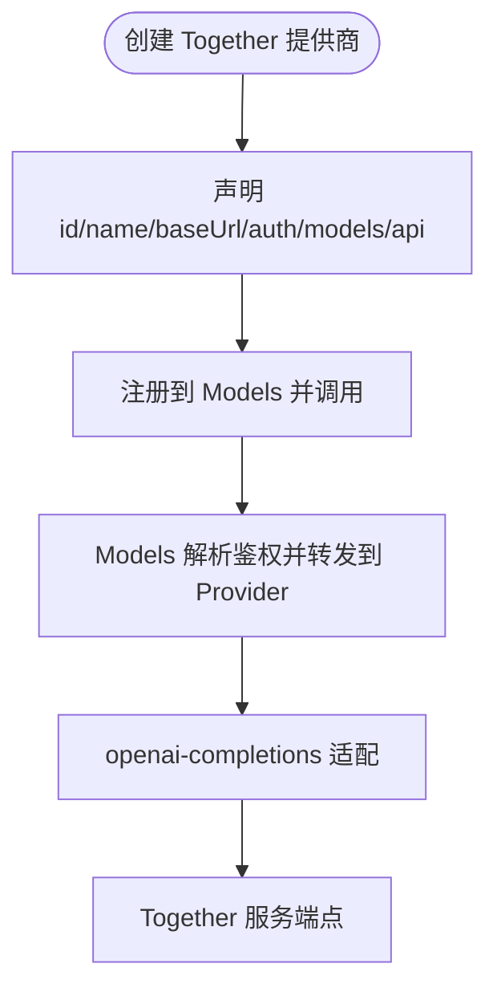

图表来源
- [together.ts:1-16](file://packages/ai/src/providers/together.ts#L1-L16)
- [models.ts:636-688](file://packages/ai/src/models.ts#L636-L688)

章节来源
- [together.ts:1-16](file://packages/ai/src/providers/together.ts#L1-L16)

### xAI 适配器
- 标识与基础信息
  - id: "xai"
  - name: "xAI"
  - baseUrl: "https://api.x.ai/v1"
- 认证方式
  - envApiKeyAuth（XAI_API_KEY）
  - OAuth（订阅型登录，lazyOAuth 懒加载）
- 模型清单
  - 静态模型来自 xai.models.ts
- API 协议
  - 多协议：openai-completions.lazy 与 openai-responses.lazy 并存，按 model.api 分派
- 适用场景
  - 同时支持 Completions 与 Responses 协议的 Grok/X 订阅模型

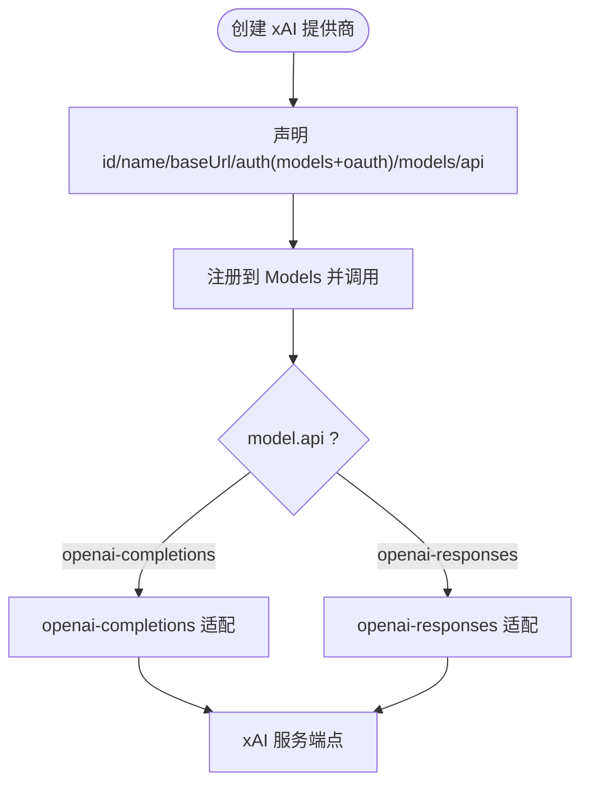

图表来源
- [xai.ts:1-29](file://packages/ai/src/providers/xai.ts#L1-L29)
- [models.ts:775-792](file://packages/ai/src/models.ts#L775-L792)

章节来源
- [xai.ts:1-29](file://packages/ai/src/providers/xai.ts#L1-L29)

### Cerebras 适配器
- 标识与基础信息
  - id: "cerebras"
  - name: "Cerebras"
  - baseUrl: "https://api.cerebras.ai/v1"
- 认证方式
  - envApiKeyAuth，读取存储凭证或环境变量（如 CEREBRAS_API_KEY）
- 模型清单
  - 静态模型来自 cerebras.models.ts
- API 协议
  - openai-completions.lazy 协议适配
- 适用场景
  - 基于 Cerebras 硬件的高吞吐推理服务

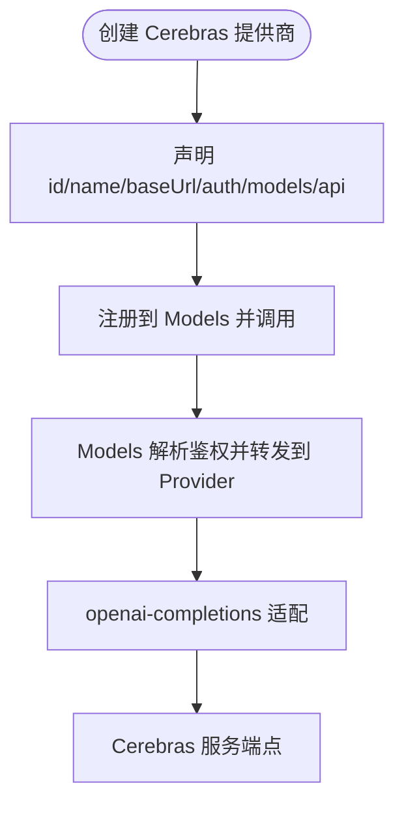

图表来源
- [cerebras.ts:1-16](file://packages/ai/src/providers/cerebras.ts#L1-L16)
- [models.ts:636-688](file://packages/ai/src/models.ts#L636-L688)

章节来源
- [cerebras.ts:1-16](file://packages/ai/src/providers/cerebras.ts#L1-L16)

### DeepSeek 适配器
- 标识与基础信息
  - id: "deepseek"
  - name: "DeepSeek"
  - baseUrl: "https://api.deepseek.com"
- 认证方式
  - envApiKeyAuth，读取存储凭证或环境变量（如 DEEPSEEK_API_KEY）
- 模型清单
  - 静态模型来自 deepseek.models.ts
- API 协议
  - openai-completions.lazy 协议适配
- 适用场景
  - 兼容 OpenAI Completions 的 DeepSeek 模型服务

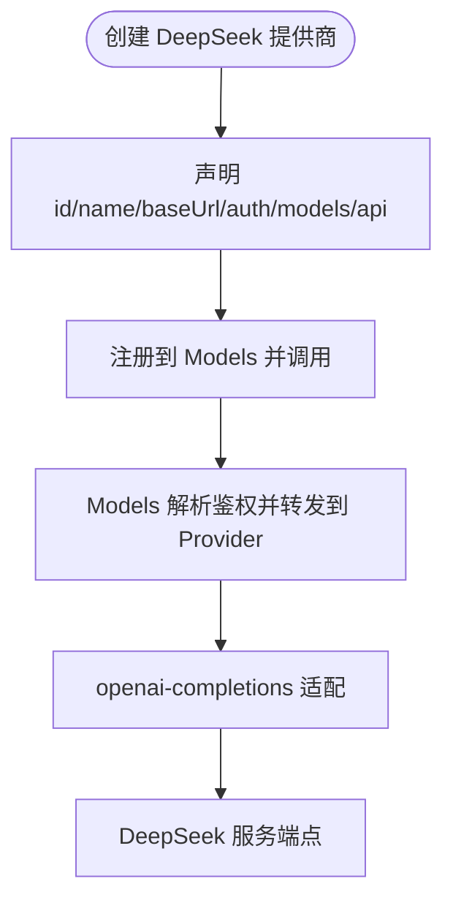

图表来源
- [deepseek.ts:1-16](file://packages/ai/src/providers/deepseek.ts#L1-L16)
- [models.ts:636-688](file://packages/ai/src/models.ts#L636-L688)

章节来源
- [deepseek.ts:1-16](file://packages/ai/src/providers/deepseek.ts#L1-L16)

### NVIDIA 适配器
- 标识与基础信息
  - id: "nvidia"
  - name: "NVIDIA"
  - baseUrl: "https://integrate.api.nvidia.com/v1"
- 认证方式
  - envApiKeyAuth，读取存储凭证或环境变量（如 NVIDIA_API_KEY）
- 模型清单
  - 静态模型来自 nvidia.models.ts
- API 协议
  - openai-completions.lazy 协议适配
- 适用场景
  - NVIDIA NIM 推理服务，兼容 OpenAI Completions 接口

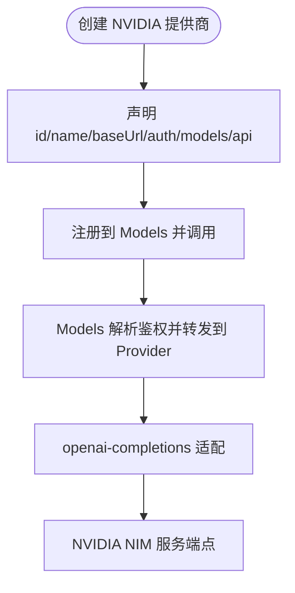

图表来源
- [nvidia.ts:1-16](file://packages/ai/src/providers/nvidia.ts#L1-L16)
- [models.ts:636-688](file://packages/ai/src/models.ts#L636-L688)

章节来源
- [nvidia.ts:1-16](file://packages/ai/src/providers/nvidia.ts#L1-L16)

## 依赖关系分析
- 所有适配器均依赖统一的 createProvider 构建器与 models 层进行鉴权与路由。
- 多数适配器复用 openai-completions.lazy 协议适配；Fireworks 与 xAI 为多协议适配。
- 认证统一由 envApiKeyAuth 提供，支持存储凭证优先与环境变量回退；xAI 额外支持 OAuth。

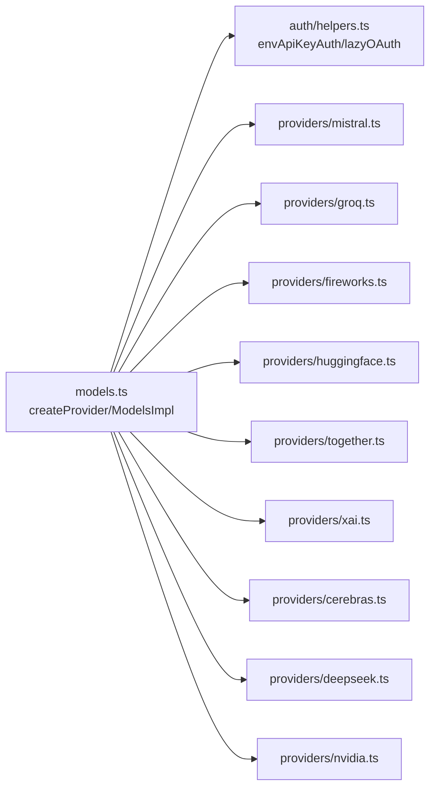

图表来源
- [models.ts:254-737](file://packages/ai/src/models.ts#L254-L737)
- [helpers.ts:1-60](file://packages/ai/src/auth/helpers.ts#L1-L60)
- [mistral.ts:1-16](file://packages/ai/src/providers/mistral.ts#L1-L16)
- [groq.ts:1-16](file://packages/ai/src/providers/groq.ts#L1-L16)
- [fireworks.ts:1-20](file://packages/ai/src/providers/fireworks.ts#L1-L20)
- [huggingface.ts:1-16](file://packages/ai/src/providers/huggingface.ts#L1-L16)
- [together.ts:1-16](file://packages/ai/src/providers/together.ts#L1-L16)
- [xai.ts:1-29](file://packages/ai/src/providers/xai.ts#L1-L29)
- [cerebras.ts:1-16](file://packages/ai/src/providers/cerebras.ts#L1-L16)
- [deepseek.ts:1-16](file://packages/ai/src/providers/deepseek.ts#L1-L16)
- [nvidia.ts:1-16](file://packages/ai/src/providers/nvidia.ts#L1-L16)

章节来源
- [models.ts:254-737](file://packages/ai/src/models.ts#L254-L737)
- [helpers.ts:1-60](file://packages/ai/src/auth/helpers.ts#L1-L60)

## 性能与适用场景
- 低延迟高吞吐：Groq、Cerebras、NVIDIA 通常适合对时延敏感或高并发推理场景。
- 多协议兼容：Fireworks、xAI 可同时接入 Anthropic 与 OpenAI 兼容协议，便于混合模型编排。
- 开源生态：HuggingFace Router、Together AI 便于接入广泛开源模型，且保持 OpenAI 兼容。
- 原生协议：Mistral 使用原生对话协议，适合深度优化与特性对齐。
- 统一抽象优势：通过 Models 层统一鉴权、流式与错误处理，降低多供应商切换成本。

[本节为通用指导，不直接分析具体文件]

## 故障排查指南
- 鉴权未配置
  - 现象：调用时报错提示提供商未配置。
  - 原因：未设置存储凭证或环境变量，或未通过 getAuth 成功解析。
  - 处理：检查对应环境变量或存储凭证；必要时使用 login 交互输入密钥。
- 模型不可用
  - 现象：getModels 为空或 getModel 找不到。
  - 原因：动态提供商尚未 refresh；或模型不在静态清单中。
  - 处理：调用 models.refresh() 刷新动态模型；确认模型 ID 正确。
- 协议不支持
  - 现象：报错提示 Provider 无对应 API 实现。
  - 原因：model.api 未在 Provider 的 api 映射中注册。
  - 处理：确保 Provider 已注册对应协议适配（如 openai-completions、anthropic-messages）。
- 请求头冲突
  - 现象：自定义头未生效或被覆盖。
  - 原因：头名大小写合并规则与优先级问题。
  - 处理：使用 transformHeaders 在 Models 层统一注入；注意显式选项优先级最高。

章节来源
- [models.ts:636-688](file://packages/ai/src/models.ts#L636-L688)
- [models.ts:775-792](file://packages/ai/src/models.ts#L775-L792)
- [helpers.ts:1-60](file://packages/ai/src/auth/helpers.ts#L1-L60)

## 选型建议与迁移指南
- 选型建议
  - 追求极致延迟与吞吐：优先考虑 Groq、Cerebras、NVIDIA。
  - 需要多协议与混合模型：Fireworks、xAI。
  - 开源生态丰富：HuggingFace、Together AI。
  - 原生协议与深度优化：Mistral。
- 迁移指南（从旧全局 API 到 Models/Provider）
  - 引入统一入口：使用 builtinModels() 或 createModels() 并注册所需 provider 工厂。
  - 替换调用方式：将旧的全局方法改为 models.stream()/complete()，并通过 model.provider + model.id 定位模型。
  - 鉴权与头处理：利用 getAuth() 与 transformHeaders 统一管理鉴权与请求头。
  - 工具与上下文：沿用 Context/Tool 体系，结合流式事件处理工具调用与思考内容。
  - 参考文档：详见 README 中的“从旧全局 API 迁移”部分。

章节来源
- [README.md:100-228](file://packages/ai/README.md#L100-L228)
- [README.md:324-380](file://packages/ai/README.md#L324-L380)

## 结论
本仓库通过统一的 Provider/Models 抽象，将多个 AI 提供商以一致的方式接入，屏蔽底层协议差异与鉴权细节。对于 Mistral、Groq、Fireworks、HuggingFace、Together AI、xAI、Cerebras、DeepSeek、NVIDIA 等提供商，开发者只需注册对应工厂函数即可获得一致的流式调用、鉴权解析与错误处理能力。结合性能特点与适用场景，可灵活选择最合适的提供商组合，并通过迁移指南平滑过渡到新的统一 API。