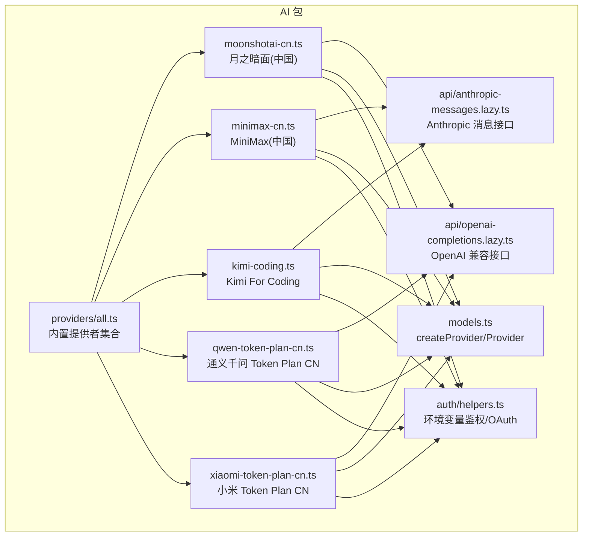
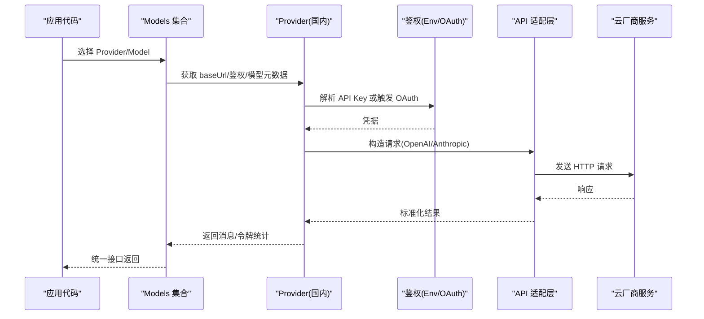
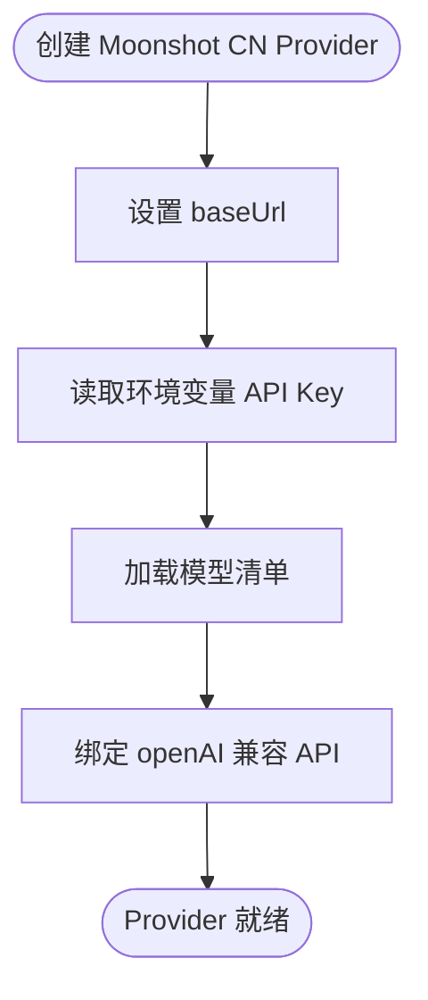
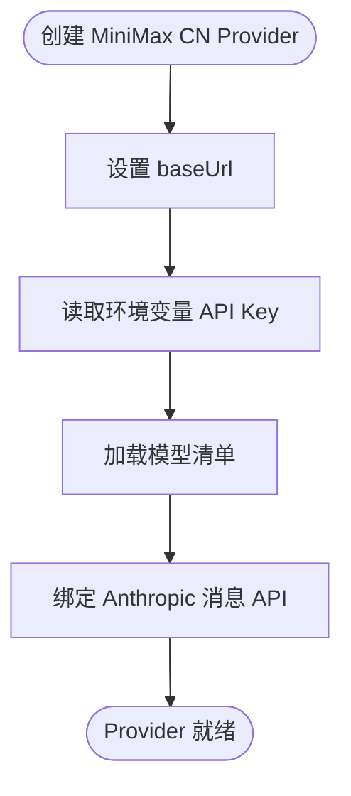
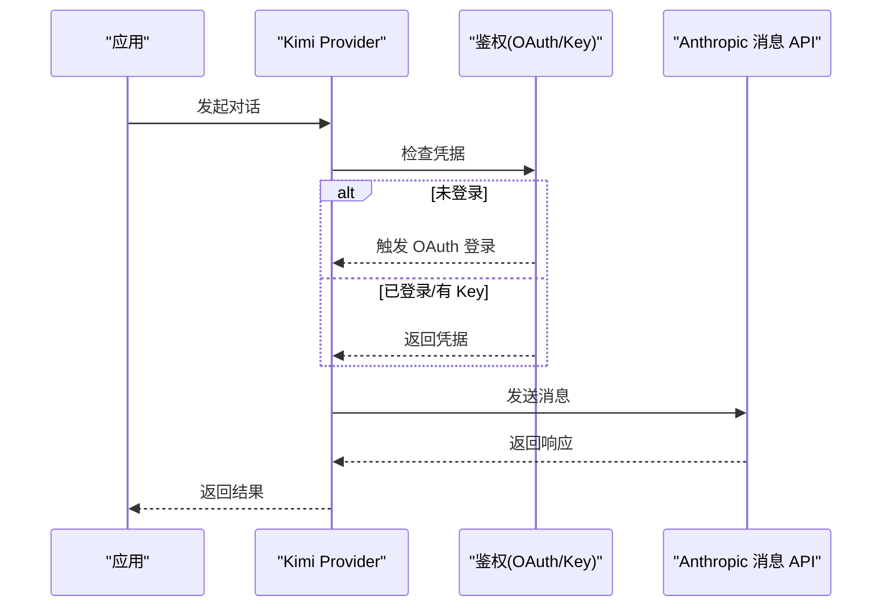
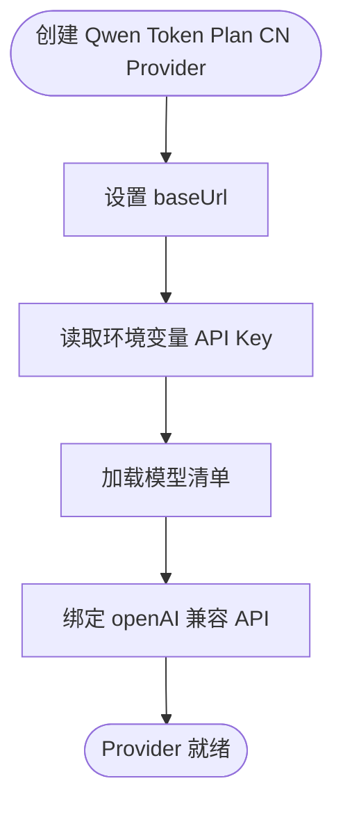
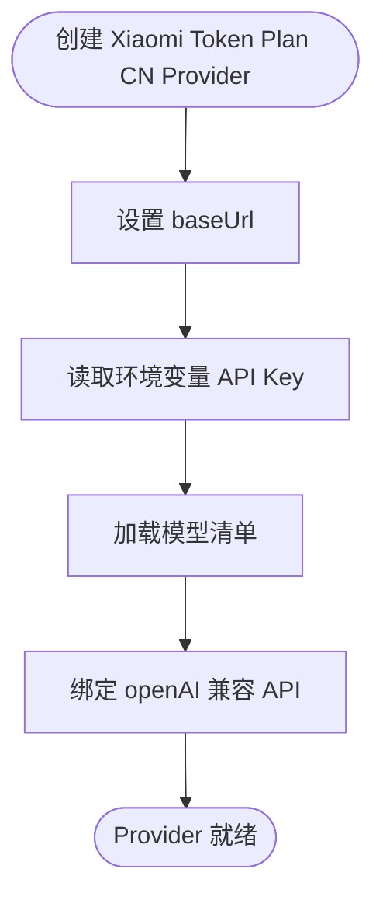
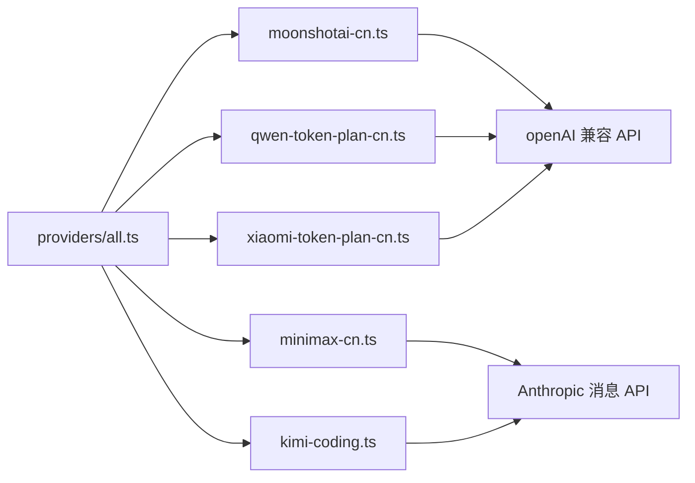

# 国内 AI 提供商适配器

<cite>
**本文引用的文件**
- [packages/ai/src/providers/all.ts](file://packages/ai/src/providers/all.ts)
- [packages/ai/src/providers/moonshotai-cn.ts](file://packages/ai/src/providers/moonshotai-cn.ts)
- [packages/ai/src/providers/minimax-cn.ts](file://packages/ai/src/providers/minimax-cn.ts)
- [packages/ai/src/providers/kimi-coding.ts](file://packages/ai/src/providers/kimi-coding.ts)
- [packages/ai/src/providers/qwen-token-plan-cn.ts](file://packages/ai/src/providers/qwen-token-plan-cn.ts)
- [packages/ai/src/providers/xiaomi-token-plan-cn.ts](file://packages/ai/src/providers/xiaomi-token-plan-cn.ts)
- [packages/ai/src/auth/helpers.ts](file://packages/ai/src/auth/helpers.ts)
- [packages/ai/src/api/openai-completions.lazy.ts](file://packages/ai/src/api/openai-completions.lazy.ts)
- [packages/ai/src/api/anthropic-messages.lazy.ts](file://packages/ai/src/api/anthropic-messages.lazy.ts)
- [packages/ai/src/models.ts](file://packages/ai/src/models.ts)
- [packages/ai/src/auth/oauth/load.ts](file://packages/ai/src/auth/oauth/load.ts)
</cite>

## 目录
1. [简介](#简介)
2. [项目结构](#项目结构)
3. [核心组件](#核心组件)
4. [架构总览](#架构总览)
5. [详细组件分析](#详细组件分析)
6. [依赖关系分析](#依赖关系分析)
7. [性能与网络优化](#性能与网络优化)
8. [计费、限流与合规](#计费限流与合规)
9. [故障排查指南](#故障排查指南)
10. [结论](#结论)
11. [附录：配置与示例](#附录配置与示例)

## 简介
本文件面向在国内生产环境中集成主流大模型服务的开发者，系统梳理通义千问（阿里云百炼/Token Plan CN）、MiniMax（国内版）、月之暗面（Moonshot CN）、Kimi（Kimi For Coding）、智谱 AI（通过统一接口接入）、小米（Token Plan CN）等国内服务商的适配器实现。文档聚焦于：
- 中文优化特性与本地化配置
- 认证方式与环境变量
- 计费模式与限流策略建议
- 网络优化与高可用实践
- 完整中文应用场景与最佳实践

## 项目结构
本项目采用“按功能域组织”的多包仓库结构，AI 能力集中在 packages/ai。国内提供商以独立模块形式提供，统一通过 createProvider 注册到内置提供者集合中，并由统一的 API 适配层（OpenAI Completions / Anthropic Messages）进行调用。

图表来源
- [packages/ai/src/providers/all.ts:89-131](file://packages/ai/src/providers/all.ts#L89-L131)
- [packages/ai/src/providers/moonshotai-cn.ts:6-14](file://packages/ai/src/providers/moonshotai-cn.ts#L6-L14)
- [packages/ai/src/providers/minimax-cn.ts:6-14](file://packages/ai/src/providers/minimax-cn.ts#L6-L14)
- [packages/ai/src/providers/kimi-coding.ts:7-23](file://packages/ai/src/providers/kimi-coding.ts#L7-L23)
- [packages/ai/src/providers/qwen-token-plan-cn.ts:6-14](file://packages/ai/src/providers/qwen-token-plan-cn.ts#L6-L14)
- [packages/ai/src/providers/xiaomi-token-plan-cn.ts:6-14](file://packages/ai/src/providers/xiaomi-token-plan-cn.ts#L6-L14)
- [packages/ai/src/models.ts:1-200](file://packages/ai/src/models.ts#L1-L200)
- [packages/ai/src/auth/helpers.ts:1-200](file://packages/ai/src/auth/helpers.ts#L1-L200)
- [packages/ai/src/api/openai-completions.lazy.ts:1-200](file://packages/ai/src/api/openai-completions.lazy.ts#L1-L200)
- [packages/ai/src/api/anthropic-messages.lazy.ts:1-200](file://packages/ai/src/api/anthropic-messages.lazy.ts#L1-L200)

章节来源
- [packages/ai/src/providers/all.ts:89-131](file://packages/ai/src/providers/all.ts#L89-L131)

## 核心组件
- 统一提供者工厂：createProvider 用于声明 provider id、名称、baseUrl、鉴权、模型列表与底层 API 适配。
- 内置提供者集合：builtinProviders() 集中注册所有内置 provider，包括国内多家厂商。
- 鉴权助手：envApiKeyAuth 从环境变量读取密钥；OAuth 支持懒加载登录流程。
- API 适配层：openAICompletionsApi 与 anthropicMessagesApi 分别对接 OpenAI 兼容与 Anthropic 消息协议。

章节来源
- [packages/ai/src/models.ts:1-200](file://packages/ai/src/models.ts#L1-L200)
- [packages/ai/src/providers/all.ts:89-131](file://packages/ai/src/providers/all.ts#L89-L131)
- [packages/ai/src/auth/helpers.ts:1-200](file://packages/ai/src/auth/helpers.ts#L1-L200)
- [packages/ai/src/api/openai-completions.lazy.ts:1-200](file://packages/ai/src/api/openai-completions.lazy.ts#L1-L200)
- [packages/ai/src/api/anthropic-messages.lazy.ts:1-200](file://packages/ai/src/api/anthropic-messages.lazy.ts#L1-L200)

## 架构总览
下图展示国内提供商在运行时如何被装配并调用底层 API。

图表来源
- [packages/ai/src/providers/all.ts:89-131](file://packages/ai/src/providers/all.ts#L89-L131)
- [packages/ai/src/providers/moonshotai-cn.ts:6-14](file://packages/ai/src/providers/moonshotai-cn.ts#L6-L14)
- [packages/ai/src/providers/minimax-cn.ts:6-14](file://packages/ai/src/providers/minimax-cn.ts#L6-L14)
- [packages/ai/src/providers/kimi-coding.ts:7-23](file://packages/ai/src/providers/kimi-coding.ts#L7-L23)
- [packages/ai/src/providers/qwen-token-plan-cn.ts:6-14](file://packages/ai/src/providers/qwen-token-plan-cn.ts#L6-L14)
- [packages/ai/src/providers/xiaomi-token-plan-cn.ts:6-14](file://packages/ai/src/providers/xiaomi-token-plan-cn.ts#L6-L14)
- [packages/ai/src/auth/helpers.ts:1-200](file://packages/ai/src/auth/helpers.ts#L1-L200)
- [packages/ai/src/api/openai-completions.lazy.ts:1-200](file://packages/ai/src/api/openai-completions.lazy.ts#L1-L200)
- [packages/ai/src/api/anthropic-messages.lazy.ts:1-200](file://packages/ai/src/api/anthropic-messages.lazy.ts#L1-L200)

## 详细组件分析

### 月之暗面（Moonshot CN）
- 标识与名称：id="moonshotai-cn"，name="Moonshot AI CN"
- 基础地址：https://api.moonshot.cn/v1
- 鉴权：通过环境变量注入 API Key
- 模型：使用 moonshotai-cn.models.ts 中的模型清单
- 底层 API：openAICompletionsApi（OpenAI 兼容）

图表来源
- [packages/ai/src/providers/moonshotai-cn.ts:6-14](file://packages/ai/src/providers/moonshotai-cn.ts#L6-L14)
- [packages/ai/src/api/openai-completions.lazy.ts:1-200](file://packages/ai/src/api/openai-completions.lazy.ts#L1-L200)

章节来源
- [packages/ai/src/providers/moonshotai-cn.ts:6-14](file://packages/ai/src/providers/moonshotai-cn.ts#L6-L14)

### MiniMax（国内版）
- 标识与名称：id="minimax-cn"，name="MiniMax CN"
- 基础地址：https://api.minimaxi.com/anthropic
- 鉴权：通过环境变量注入 API Key
- 模型：使用 minimax-cn.models.ts 中的模型清单
- 底层 API：anthropicMessagesApi（Anthropic 消息协议）

图表来源
- [packages/ai/src/providers/minimax-cn.ts:6-14](file://packages/ai/src/providers/minimax-cn.ts#L6-L14)
- [packages/ai/src/api/anthropic-messages.lazy.ts:1-200](file://packages/ai/src/api/anthropic-messages.lazy.ts#L1-L200)

章节来源
- [packages/ai/src/providers/minimax-cn.ts:6-14](file://packages/ai/src/providers/minimax-cn.ts#L6-L14)

### Kimi（Kimi For Coding）
- 标识与名称：id="kimi-coding"，name="Kimi For Coding"
- 基础地址：https://api.kimi.com/coding
- 鉴权：支持 API Key 与订阅式 OAuth（懒加载登录）
- 模型：使用 kimi-coding.models.ts 中的模型清单
- 底层 API：anthropicMessagesApi（Anthropic 消息协议）

图表来源
- [packages/ai/src/providers/kimi-coding.ts:7-23](file://packages/ai/src/providers/kimi-coding.ts#L7-L23)
- [packages/ai/src/auth/oauth/load.ts:1-200](file://packages/ai/src/auth/oauth/load.ts#L1-L200)
- [packages/ai/src/api/anthropic-messages.lazy.ts:1-200](file://packages/ai/src/api/anthropic-messages.lazy.ts#L1-L200)

章节来源
- [packages/ai/src/providers/kimi-coding.ts:7-23](file://packages/ai/src/providers/kimi-coding.ts#L7-L23)

### 通义千问（阿里云 Token Plan CN）
- 标识与名称：id="qwen-token-plan-cn"，name="Qwen Token Plan CN"
- 基础地址：https://token-plan.cn-beijing.maas.aliyuncs.com/compatible-mode/v1
- 鉴权：通过环境变量注入 API Key
- 模型：使用 qwen-token-plan-cn.models.ts 中的模型清单
- 底层 API：openAICompletionsApi（OpenAI 兼容）

图表来源
- [packages/ai/src/providers/qwen-token-plan-cn.ts:6-14](file://packages/ai/src/providers/qwen-token-plan-cn.ts#L6-L14)
- [packages/ai/src/api/openai-completions.lazy.ts:1-200](file://packages/ai/src/api/openai-completions.lazy.ts#L1-L200)

章节来源
- [packages/ai/src/providers/qwen-token-plan-cn.ts:6-14](file://packages/ai/src/providers/qwen-token-plan-cn.ts#L6-L14)

### 小米（Token Plan CN）
- 标识与名称：id="xiaomi-token-plan-cn"，name="Xiaomi Token Plan CN"
- 基础地址：https://token-plan-cn.xiaomimimo.com/v1
- 鉴权：通过环境变量注入 API Key
- 模型：使用 xiaomi-token-plan-cn.models.ts 中的模型清单
- 底层 API：openAICompletionsApi（OpenAI 兼容）

图表来源
- [packages/ai/src/providers/xiaomi-token-plan-cn.ts:6-14](file://packages/ai/src/providers/xiaomi-token-plan-cn.ts#L6-L14)
- [packages/ai/src/api/openai-completions.lazy.ts:1-200](file://packages/ai/src/api/openai-completions.lazy.ts#L1-L200)

章节来源
- [packages/ai/src/providers/xiaomi-token-plan-cn.ts:6-14](file://packages/ai/src/providers/xiaomi-token-plan-cn.ts#L6-L14)

### 智谱 AI（Zhipu）
当前仓库未包含独立的 zhipu 适配器。若需接入智谱，可参考现有 OpenAI 兼容或 Anthropic 消息协议的适配器模式，使用 createProvider 定义 baseUrl、鉴权与模型清单，并通过 openAICompletionsApi 或 anthropicMessagesApi 进行调用。

[本节为概念性说明，不直接分析具体文件]

## 依赖关系分析
- 统一入口：providers/all.ts 集中注册所有内置 Provider，确保模型目录与运行时一致。
- 鉴权解耦：所有 Provider 通过 envApiKeyAuth 或 OAuth 获取凭据，避免硬编码。
- API 抽象：OpenAI 兼容与 Anthropic 消息协议作为两大适配层，屏蔽下游差异。
- 模型清单：各 Provider 对应 models.ts 风格的清单文件，便于生成与维护。

图表来源
- [packages/ai/src/providers/all.ts:89-131](file://packages/ai/src/providers/all.ts#L89-L131)
- [packages/ai/src/providers/moonshotai-cn.ts:6-14](file://packages/ai/src/providers/moonshotai-cn.ts#L6-L14)
- [packages/ai/src/providers/minimax-cn.ts:6-14](file://packages/ai/src/providers/minimax-cn.ts#L6-L14)
- [packages/ai/src/providers/kimi-coding.ts:7-23](file://packages/ai/src/providers/kimi-coding.ts#L7-L23)
- [packages/ai/src/providers/qwen-token-plan-cn.ts:6-14](file://packages/ai/src/providers/qwen-token-plan-cn.ts#L6-L14)
- [packages/ai/src/providers/xiaomi-token-plan-cn.ts:6-14](file://packages/ai/src/providers/xiaomi-token-plan-cn.ts#L6-L14)

章节来源
- [packages/ai/src/providers/all.ts:89-131](file://packages/ai/src/providers/all.ts#L89-L131)

## 性能与网络优化
- 连接复用与超时控制：建议使用具备连接池能力的 HTTP 客户端，合理设置连接与读写超时，避免长尾请求阻塞。
- 重试与退避：对瞬时错误（如 429、5xx）实施指数退避重试，限制最大重试次数，防止雪崩。
- 并发与限流：结合业务 QPS 与供应商配额，设置全局或 per-provider 的并发上限与令牌桶限流。
- 缓存策略：对相似提示词或工具调用结果做短期缓存，减少重复请求与成本。
- 就近部署：将服务部署至靠近供应商数据中心的地域，降低时延与丢包率。
- 监控与告警：记录延迟分位、错误率、令牌用量，设置阈值告警以便快速定位瓶颈。

[本节提供通用指导，不直接分析具体文件]

## 计费、限流与合规
- 计费模式
  - 按量计费：多数国内厂商按输入/输出 token 计费，部分提供缓存读/写折扣。
  - 套餐/预付费：Token Plan 类通道通常提供套餐包或企业级结算方式。
  - 订阅制：部分编程场景（如 Kimi For Coding）支持订阅账户与 OAuth 授权。
- 限流策略
  - 速率限制：遵循供应商 QPM/RPM 限制，结合业务峰值设计自适应限流。
  - 队列与背压：在高并发下引入任务队列与背压机制，保证稳定性。
  - 熔断降级：当错误率或延迟超限时自动降级到备用模型或本地策略。
- 合规要求
  - 数据出境：优先选择境内节点与域名，避免敏感数据跨境传输。
  - 内容安全：接入内容审核与过滤，确保输出符合监管要求。
  - 审计与留痕：记录关键操作日志与模型版本，满足可追溯性。

[本节提供通用指导，不直接分析具体文件]

## 故障排查指南
- 鉴权失败
  - 检查环境变量是否已正确设置（例如 Moonshot、MiniMax、Kimi、Qwen、Xiaomi 对应的 API Key）。
  - 对于 Kimi For Coding，确认 OAuth 流程是否成功完成。
- 网络异常
  - 验证 baseUrl 可达性与 DNS 解析。
  - 检查代理/防火墙策略是否放行目标域名。
- 限流与配额
  - 遇到 429 或配额不足时，降低并发或等待配额恢复。
  - 开启重试与退避，避免瞬时抖动导致失败。
- 模型不可用
  - 核对模型清单与实际可用模型是否一致。
  - 切换至同系列其他模型进行对比测试。

章节来源
- [packages/ai/src/auth/helpers.ts:1-200](file://packages/ai/src/auth/helpers.ts#L1-L200)
- [packages/ai/src/providers/kimi-coding.ts:7-23](file://packages/ai/src/providers/kimi-coding.ts#L7-L23)
- [packages/ai/src/providers/moonshotai-cn.ts:6-14](file://packages/ai/src/providers/moonshotai-cn.ts#L6-L14)
- [packages/ai/src/providers/minimax-cn.ts:6-14](file://packages/ai/src/providers/minimax-cn.ts#L6-L14)
- [packages/ai/src/providers/qwen-token-plan-cn.ts:6-14](file://packages/ai/src/providers/qwen-token-plan-cn.ts#L6-L14)
- [packages/ai/src/providers/xiaomi-token-plan-cn.ts:6-14](file://packages/ai/src/providers/xiaomi-token-plan-cn.ts#L6-L14)

## 结论
该仓库为国内多家 AI 提供商提供了标准化的适配器实现，通过统一的 createProvider 与 API 适配层，屏蔽了不同厂商的差异。开发者只需配置环境变量与模型清单，即可在多厂商间灵活切换。结合合理的限流、重试与监控策略，可在保障稳定性的同时优化成本与性能。

[本节为总结性内容，不直接分析具体文件]

## 附录：配置与示例
- 环境变量（示例键名）
  - Moonshot CN：MOONSHOT_API_KEY
  - MiniMax CN：MINIMAX_CN_API_KEY
  - Kimi：KIMI_API_KEY（或走 OAuth）
  - 通义千问 Token Plan CN：QWEN_TOKEN_PLAN_CN_API_KEY
  - 小米 Token Plan CN：XIAOMI_TOKEN_PLAN_CN_API_KEY
- 典型调用流程（以 OpenAI 兼容为例）
  - 选择 Provider 与 Model
  - 读取环境变量鉴权
  - 构造消息与参数
  - 发送请求并处理响应
  - 记录用量与延迟
- 中文场景示例
  - 智能客服：多轮对话 + 意图识别 + 知识库检索
  - 代码助手：代码补全、解释与重构（适合 Kimi For Coding）
  - 内容创作：文案生成、摘要与改写（注意内容安全）
  - 数据分析：自然语言转 SQL/图表（结合工具调用）
- 最佳实践
  - 多模型路由：根据任务类型与成本自动选择最优模型
  - 提示词工程：结构化提示词、Few-shot 示例与约束条件
  - 安全与合规：敏感信息脱敏、输出审核与审计日志
  - 观测性：指标上报、链路追踪与错误归因

[本节提供通用指导，不直接分析具体文件]