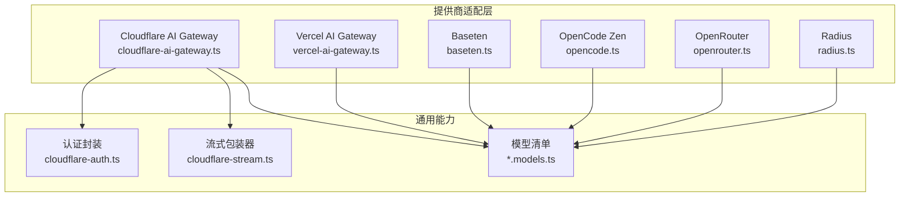
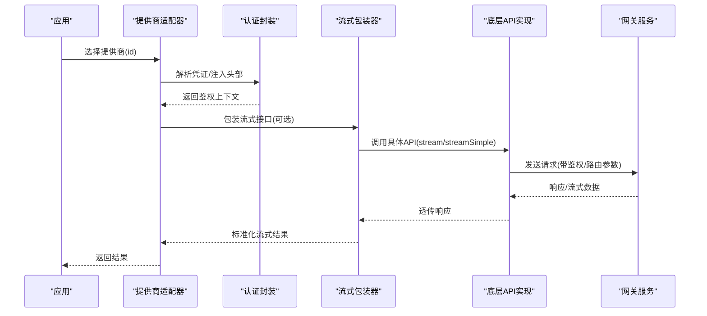
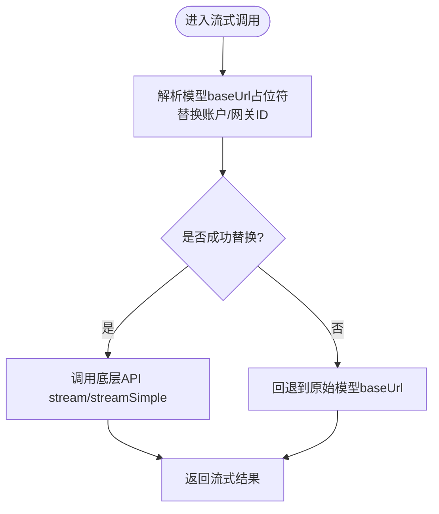
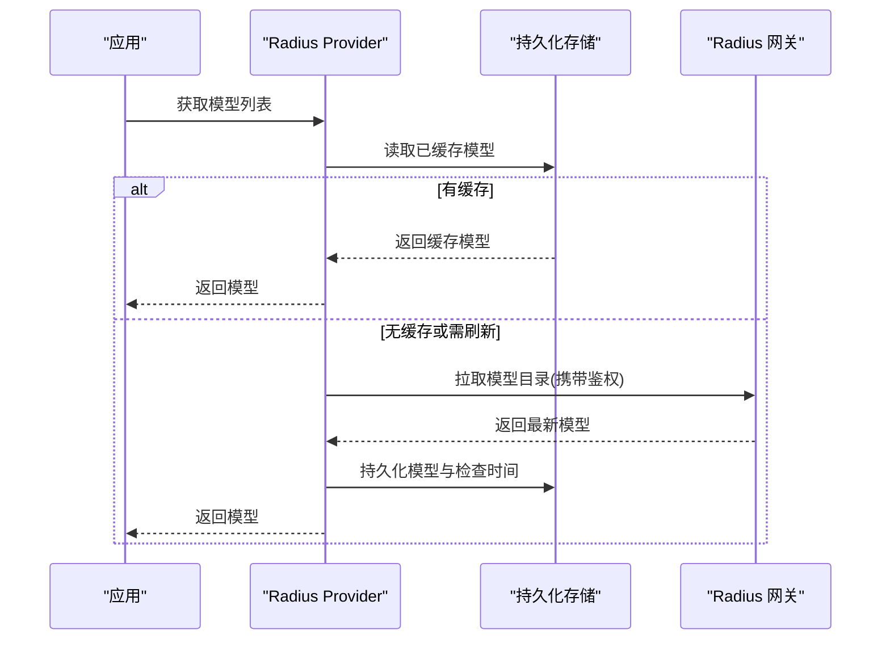
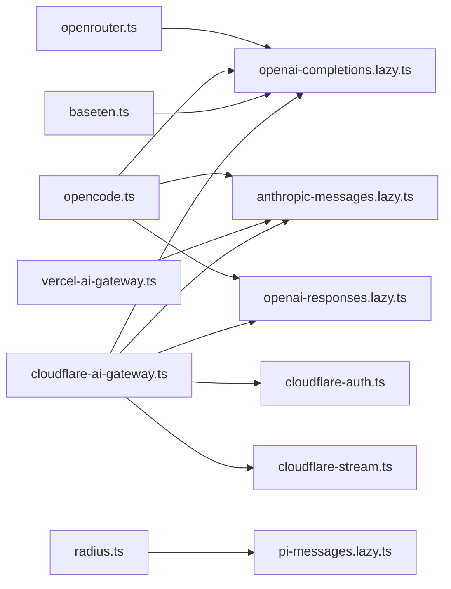

# 网关类提供商适配器

<cite>
**本文引用的文件**
- [cloudflare-ai-gateway.ts](file://packages/ai/src/providers/cloudflare-ai-gateway.ts)
- [cloudflare-auth.ts](file://packages/ai/src/providers/cloudflare-auth.ts)
- [cloudflare-stream.ts](file://packages/ai/src/providers/cloudflare-stream.ts)
- [cloudflare-ai-gateway.models.ts](file://packages/ai/src/providers/cloudflare-ai-gateway.models.ts)
- [vercel-ai-gateway.ts](file://packages/ai/src/providers/vercel-ai-gateway.ts)
- [vercel-ai-gateway.models.ts](file://packages/ai/src/providers/vercel-ai-gateway.models.ts)
- [baseten.ts](file://packages/ai/src/providers/baseten.ts)
- [opencode.ts](file://packages/ai/src/providers/opencode.ts)
- [openrouter.ts](file://packages/ai/src/providers/openrouter.ts)
- [radius.ts](file://packages/ai/src/providers/radius.ts)
</cite>

## 目录
1. [简介](#简介)
2. [项目结构](#项目结构)
3. [核心组件](#核心组件)
4. [架构总览](#架构总览)
5. [详细组件分析](#详细组件分析)
6. [依赖关系分析](#依赖关系分析)
7. [性能考虑](#性能考虑)
8. [故障排查指南](#故障排查指南)
9. [结论](#结论)
10. [附录](#附录)

## 简介
本文件面向“网关类提供商适配器”的集成与使用，覆盖 Cloudflare AI Gateway、Vercel AI Gateway、Radius、Baseten、OpenCode、OpenRouter 等网关服务的接入方式。文档从系统架构、组件关系、数据流、处理逻辑、集成点、错误处理与性能特性等方面展开，并提供配置要点、监控指标建议、故障转移策略以及部署示例与优化建议，帮助读者以统一的方式对接多种网关后端。

## 项目结构
本项目在 packages/ai/src/providers 下按网关/服务维度组织提供商实现：
- 每个网关通常包含一个 provider 入口（如 cloudflare-ai-gateway.ts），负责声明 id、name、baseUrl、auth、models、api 等元信息。
- 模型清单通过 models.*.ts 文件集中管理，由脚本生成并扁平化导出。
- 认证与流式转发封装在独立的 auth/stream 模块中，便于复用与扩展。

图表来源
- [cloudflare-ai-gateway.ts:1-24](file://packages/ai/src/providers/cloudflare-ai-gateway.ts#L1-L24)
- [vercel-ai-gateway.ts:1-16](file://packages/ai/src/providers/vercel-ai-gateway.ts#L1-L16)
- [baseten.ts:1-16](file://packages/ai/src/providers/baseten.ts#L1-L16)
- [opencode.ts:1-25](file://packages/ai/src/providers/opencode.ts#L1-L25)
- [openrouter.ts:1-24](file://packages/ai/src/providers/openrouter.ts#L1-L24)
- [radius.ts:1-83](file://packages/ai/src/providers/radius.ts#L1-L83)
- [cloudflare-auth.ts:1-104](file://packages/ai/src/providers/cloudflare-auth.ts#L1-L104)
- [cloudflare-stream.ts:1-29](file://packages/ai/src/providers/cloudflare-stream.ts#L1-L29)
- [cloudflare-ai-gateway.models.ts:1-9](file://packages/ai/src/providers/cloudflare-ai-gateway.models.ts#L1-L9)
- [vercel-ai-gateway.models.ts:1-9](file://packages/ai/src/providers/vercel-ai-gateway.models.ts#L1-L9)

章节来源
- [cloudflare-ai-gateway.ts:1-24](file://packages/ai/src/providers/cloudflare-ai-gateway.ts#L1-L24)
- [vercel-ai-gateway.ts:1-16](file://packages/ai/src/providers/vercel-ai-gateway.ts#L1-L16)
- [baseten.ts:1-16](file://packages/ai/src/providers/baseten.ts#L1-L16)
- [opencode.ts:1-25](file://packages/ai/src/providers/opencode.ts#L1-L25)
- [openrouter.ts:1-24](file://packages/ai/src/providers/openrouter.ts#L1-L24)
- [radius.ts:1-83](file://packages/ai/src/providers/radius.ts#L1-L83)
- [cloudflare-auth.ts:1-104](file://packages/ai/src/providers/cloudflare-auth.ts#L1-L104)
- [cloudflare-stream.ts:1-29](file://packages/ai/src/providers/cloudflare-stream.ts#L1-L29)
- [cloudflare-ai-gateway.models.ts:1-9](file://packages/ai/src/providers/cloudflare-ai-gateway.models.ts#L1-L9)
- [vercel-ai-gateway.models.ts:1-9](file://packages/ai/src/providers/vercel-ai-gateway.models.ts#L1-L9)

## 核心组件
- 提供商注册与路由：各 provider 通过 createProvider 暴露统一的 id、name、auth、models、api，上层调用方可按 id 选择网关。
- 认证抽象：envApiKeyAuth 用于读取环境变量；Cloudflare 提供专用认证封装，注入特定请求头与环境变量。
- 流式转发与端点解析：Cloudflare 通过 cloudflareStreams 将模型 baseUrl 中的占位符替换为实际账户/网关 ID，再分发给底层 API。
- 动态模型目录：Radius 支持从网关拉取并缓存模型目录，结合持久化存储实现动态刷新。

章节来源
- [cloudflare-ai-gateway.ts:1-24](file://packages/ai/src/providers/cloudflare-ai-gateway.ts#L1-L24)
- [cloudflare-auth.ts:1-104](file://packages/ai/src/providers/cloudflare-auth.ts#L1-L104)
- [cloudflare-stream.ts:1-29](file://packages/ai/src/providers/cloudflare-stream.ts#L1-L29)
- [radius.ts:1-83](file://packages/ai/src/providers/radius.ts#L1-L83)

## 架构总览
下图展示了不同网关提供商如何统一接入到同一套 API 抽象，并通过各自的认证与流式包装进行请求分发。

图表来源
- [cloudflare-ai-gateway.ts:1-24](file://packages/ai/src/providers/cloudflare-ai-gateway.ts#L1-L24)
- [cloudflare-auth.ts:1-104](file://packages/ai/src/providers/cloudflare-auth.ts#L1-L104)
- [cloudflare-stream.ts:1-29](file://packages/ai/src/providers/cloudflare-stream.ts#L1-L29)
- [vercel-ai-gateway.ts:1-16](file://packages/ai/src/providers/vercel-ai-gateway.ts#L1-L16)
- [baseten.ts:1-16](file://packages/ai/src/providers/baseten.ts#L1-L16)
- [opencode.ts:1-25](file://packages/ai/src/providers/opencode.ts#L1-L25)
- [openrouter.ts:1-24](file://packages/ai/src/providers/openrouter.ts#L1-L24)
- [radius.ts:1-83](file://packages/ai/src/providers/radius.ts#L1-L83)

## 详细组件分析

### Cloudflare AI Gateway 适配器
- 功能要点
  - 支持多协议 API：anthropic-messages、openai-completions、openai-responses。
  - 认证：通过 cloudflareAIGatewayAuth 注入 cf-aig-authorization 等头部，并从环境或凭据中解析 API Key、Account ID、Gateway ID。
  - 流式转发：cloudflareStreams 将模型 baseUrl 中的 {CLOUDFLARE_ACCOUNT_ID}、{CLOUDFLARE_GATEWAY_ID} 占位符替换为实际值后再分发。
  - 模型清单：CLOUDFLARE_AI_GATEWAY_MODELS 由脚本生成并扁平化导出。

图表来源
- [cloudflare-stream.ts:1-29](file://packages/ai/src/providers/cloudflare-stream.ts#L1-L29)
- [cloudflare-ai-gateway.ts:1-24](file://packages/ai/src/providers/cloudflare-ai-gateway.ts#L1-L24)
- [cloudflare-auth.ts:1-104](file://packages/ai/src/providers/cloudflare-auth.ts#L1-L104)
- [cloudflare-ai-gateway.models.ts:1-9](file://packages/ai/src/providers/cloudflare-ai-gateway.models.ts#L1-L9)

章节来源
- [cloudflare-ai-gateway.ts:1-24](file://packages/ai/src/providers/cloudflare-ai-gateway.ts#L1-L24)
- [cloudflare-auth.ts:1-104](file://packages/ai/src/providers/cloudflare-auth.ts#L1-L104)
- [cloudflare-stream.ts:1-29](file://packages/ai/src/providers/cloudflare-stream.ts#L1-L29)
- [cloudflare-ai-gateway.models.ts:1-9](file://packages/ai/src/providers/cloudflare-ai-gateway.models.ts#L1-L9)

### Vercel AI Gateway 适配器
- 功能要点
  - 固定 baseUrl 指向 ai-gateway.vercel.sh。
  - 认证：通过 envApiKeyAuth 读取 AI_GATEWAY_API_KEY。
  - 模型清单：VERCEL_AI_GATEWAY_MODELS 由脚本生成并扁平化导出。
  - 当前暴露 anthropic-messages 协议。

章节来源
- [vercel-ai-gateway.ts:1-16](file://packages/ai/src/providers/vercel-ai-gateway.ts#L1-L16)
- [vercel-ai-gateway.models.ts:1-9](file://packages/ai/src/providers/vercel-ai-gateway.models.ts#L1-L9)

### Radius 适配器
- 功能要点
  - 支持 OAuth 与 API Key 两种认证方式。
  - 动态模型目录：可从网关加载模型目录并持久化缓存，支持网络刷新与离线恢复。
  - 流式接口：基于 pi-messages 协议。

图表来源
- [radius.ts:1-83](file://packages/ai/src/providers/radius.ts#L1-L83)

章节来源
- [radius.ts:1-83](file://packages/ai/src/providers/radius.ts#L1-L83)

### Baseten 适配器
- 功能要点
  - 固定 baseUrl 指向 inference.baseten.co/v1。
  - 认证：通过 envApiKeyAuth 读取 BASETEN_API_KEY。
  - 暴露 openai-completions 协议。

章节来源
- [baseten.ts:1-16](file://packages/ai/src/providers/baseten.ts#L1-L16)

### OpenCode Zen 适配器
- 功能要点
  - 同时暴露 anthropic-messages、google-generative-ai、openai-completions、openai-responses 多个协议。
  - 认证：通过 envApiKeyAuth 读取 OPENCODE_API_KEY。

章节来源
- [opencode.ts:1-25](file://packages/ai/src/providers/opencode.ts#L1-L25)

### OpenRouter 适配器
- 功能要点
  - 固定 baseUrl 指向 openrouter.ai/api/v1。
  - 认证：支持 API Key 与 OAuth（延迟加载）。
  - 暴露 openai-completions 协议。

章节来源
- [openrouter.ts:1-24](file://packages/ai/src/providers/openrouter.ts#L1-L24)

## 依赖关系分析
- 提供商与 API 抽象：各 provider 仅依赖统一的 createProvider 与对应协议的 API 实现，解耦了网关差异。
- 认证与流式封装：Cloudflare 通过独立模块注入头部与替换 baseUrl，降低业务代码耦合度。
- 模型清单：所有 providers 通过 *.models.ts 集中管理模型，便于统一维护与脚本生成。

图表来源
- [cloudflare-ai-gateway.ts:1-24](file://packages/ai/src/providers/cloudflare-ai-gateway.ts#L1-L24)
- [vercel-ai-gateway.ts:1-16](file://packages/ai/src/providers/vercel-ai-gateway.ts#L1-L16)
- [baseten.ts:1-16](file://packages/ai/src/providers/baseten.ts#L1-L16)
- [opencode.ts:1-25](file://packages/ai/src/providers/opencode.ts#L1-L25)
- [openrouter.ts:1-24](file://packages/ai/src/providers/openrouter.ts#L1-L24)
- [radius.ts:1-83](file://packages/ai/src/providers/radius.ts#L1-L83)

章节来源
- [cloudflare-ai-gateway.ts:1-24](file://packages/ai/src/providers/cloudflare-ai-gateway.ts#L1-L24)
- [vercel-ai-gateway.ts:1-16](file://packages/ai/src/providers/vercel-ai-gateway.ts#L1-L16)
- [baseten.ts:1-16](file://packages/ai/src/providers/baseten.ts#L1-L16)
- [opencode.ts:1-25](file://packages/ai/src/providers/opencode.ts#L1-L25)
- [openrouter.ts:1-24](file://packages/ai/src/providers/openrouter.ts#L1-L24)
- [radius.ts:1-83](file://packages/ai/src/providers/radius.ts#L1-L83)

## 性能考虑
- 流式传输优先：优先使用 stream/streamSimple 接口以降低首字节延迟，提升交互体验。
- 模型目录缓存：Radius 支持持久化模型目录，减少重复网络请求。
- 占位符替换开销：Cloudflare 的 baseUrl 占位符替换发生在流式调用前，影响极小，但应避免频繁重建模型对象。
- 连接复用与超时：建议在网关侧启用连接池与合理的超时/重试策略，避免雪崩。
- 并发控制：对高并发场景限制单实例并发数，防止下游过载。

[本节为通用性能建议，不直接分析具体文件]

## 故障排查指南
- 认证失败
  - Cloudflare：确认已设置 CLOUDFLARE_API_KEY、CLOUDFLARE_ACCOUNT_ID、CLOUDFLARE_GATEWAY_ID，且请求头 cf-aig-authorization 正确注入。
  - Vercel/Baseten/OpenRouter/OpenCode：确认对应环境变量存在且有效。
- 模型不可用
  - 检查 *.models.ts 是否最新；必要时重新运行模型生成脚本。
  - Radius：若本地缓存过期，触发 refreshModels 拉取最新目录。
- 流式异常
  - 确认底层 API 实现可用；检查网络与代理设置；关注网关限流与配额。

章节来源
- [cloudflare-auth.ts:1-104](file://packages/ai/src/providers/cloudflare-auth.ts#L1-L104)
- [cloudflare-stream.ts:1-29](file://packages/ai/src/providers/cloudflare-stream.ts#L1-L29)
- [radius.ts:1-83](file://packages/ai/src/providers/radius.ts#L1-L83)

## 结论
通过统一的提供商适配层，项目能够以一致的方式接入多家网关服务。Cloudflare 提供了强大的流式包装与认证注入能力；Radius 具备动态模型目录与持久化能力；其他网关则以最小成本接入现有生态。建议在生产环境中结合网关侧的负载均衡、缓存与监控能力，配合本项目的流式与缓存机制，获得稳定高效的推理服务。

[本节为总结性内容，不直接分析具体文件]

## 附录

### 配置要点速查
- Cloudflare AI Gateway
  - 环境变量：CLOUDFLARE_API_KEY、CLOUDFLARE_ACCOUNT_ID、CLOUDFLARE_GATEWAY_ID
  - 请求头：cf-aig-authorization 自动注入
  - 模型：CLOUDFLARE_AI_GATEWAY_MODELS
- Vercel AI Gateway
  - 环境变量：AI_GATEWAY_API_KEY
  - baseUrl：https://ai-gateway.vercel.sh
  - 模型：VERCEL_AI_GATEWAY_MODELS
- Baseten
  - 环境变量：BASETEN_API_KEY
  - baseUrl：https://inference.baseten.co/v1
- OpenCode Zen
  - 环境变量：OPENCODE_API_KEY
- OpenRouter
  - 环境变量：OPENROUTER_API_KEY
  - baseUrl：https://openrouter.ai/api/v1
  - 支持 OAuth
- Radius
  - 环境变量：RADIUS_API_KEY
  - 支持 OAuth 与动态模型目录刷新

章节来源
- [cloudflare-auth.ts:1-104](file://packages/ai/src/providers/cloudflare-auth.ts#L1-L104)
- [cloudflare-ai-gateway.ts:1-24](file://packages/ai/src/providers/cloudflare-ai-gateway.ts#L1-L24)
- [vercel-ai-gateway.ts:1-16](file://packages/ai/src/providers/vercel-ai-gateway.ts#L1-L16)
- [baseten.ts:1-16](file://packages/ai/src/providers/baseten.ts#L1-L16)
- [opencode.ts:1-25](file://packages/ai/src/providers/opencode.ts#L1-L25)
- [openrouter.ts:1-24](file://packages/ai/src/providers/openrouter.ts#L1-L24)
- [radius.ts:1-83](file://packages/ai/src/providers/radius.ts#L1-L83)

### 部署示例（步骤）
- 准备环境变量
  - 根据所选网关设置对应的 API Key 与必要的环境变量。
- 初始化提供商
  - 在应用中按需引入对应 provider 工厂函数并创建实例。
- 选择模型
  - 从对应 models.*.ts 导出的模型集合中选择目标模型。
- 发起请求
  - 使用 stream/streamSimple 接口发起流式请求，获取实时响应。
- 监控与告警
  - 在网关与应用层采集延迟、吞吐、错误率、令牌用量等指标，设置阈值告警。

[本节为通用部署指导，不直接分析具体文件]

### 监控指标建议
- 网关侧
  - 请求延迟（P50/P95/P99）、QPS、错误率、限流次数、配额使用量。
- 应用侧
  - 首字节延迟、流式事件速率、重试次数、熔断触发次数。
- 业务侧
  - 用户会话时长、任务完成率、成本统计。

[本节为通用监控建议，不直接分析具体文件]

### 故障转移策略
- 多网关冗余
  - 在同一协议下配置多个提供商，当主网关不可用时自动切换到备用网关。
- 降级策略
  - 当流式失败时回退为简单请求；当某模型不可用时切换至同类型替代模型。
- 重试与退避
  - 对瞬时错误实施指数退避重试，限制最大重试次数。

[本节为通用策略建议，不直接分析具体文件]