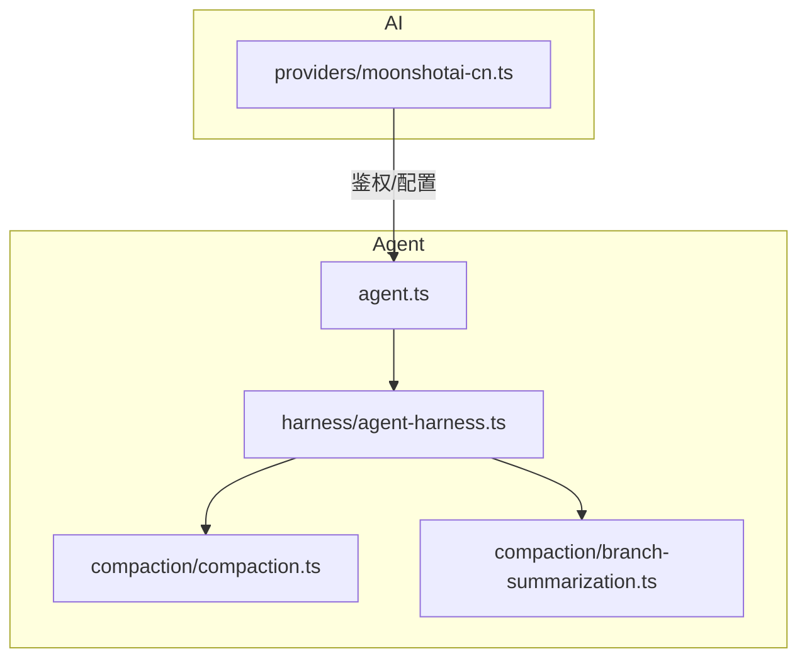
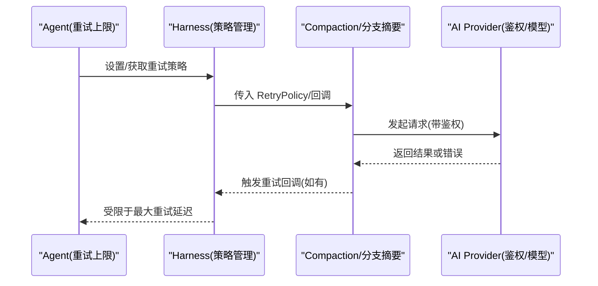
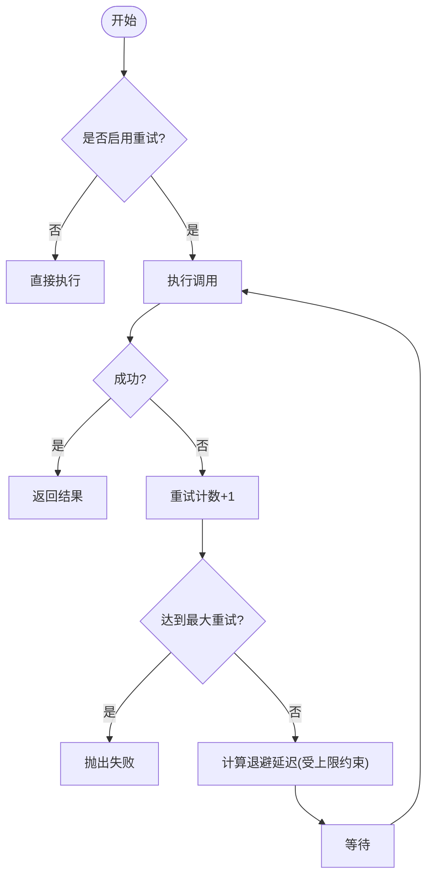
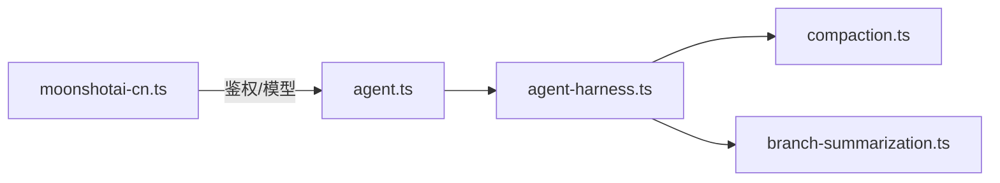

# 工具函数与辅助模块

<cite>
**本文引用的文件**
- [packages/agent/src/agent.ts](file://packages/agent/src/agent.ts)
- [packages/agent/src/harness/agent-harness.ts](file://packages/agent/src/harness/agent-harness.ts)
- [packages/agent/src/harness/compaction/branch-summarization.ts](file://packages/agent/src/harness/compaction/branch-summarization.ts)
- [packages/agent/src/harness/compaction/compaction.ts](file://packages/agent/src/harness/compaction/compaction.ts)
- [packages/ai/src/providers/moonshotai-cn.ts](file://packages/ai/src/providers/moonshotai-cn.ts)
</cite>

## 目录
1. [简介](#简介)
2. [项目结构](#项目结构)
3. [核心组件](#核心组件)
4. [架构总览](#架构总览)
5. [详细组件分析](#详细组件分析)
6. [依赖关系分析](#依赖关系分析)
7. [性能考量](#性能考量)
8. [故障排查指南](#故障排查指南)
9. [结论](#结论)
10. [附录](#附录)

## 简介
本章节聚焦于仓库中的“工具函数与辅助模块”，围绕以下主题提供系统化说明：重试机制、事件流处理、数据验证、诊断工具、流式响应处理、JSON 解析优化、溢出处理、UUID 生成、错误处理策略、性能监控与调试。文档以代码级为依据，给出调用流程、关键参数与使用场景，帮助读者快速掌握并正确集成这些能力。

## 项目结构
本次文档重点涉及两个子包：
- agent：包含智能体运行时的重试策略、压缩（compaction）与分支摘要等辅助能力。
- ai：包含模型提供者配置与鉴权辅助，便于统一接入不同后端。

图表来源
- [packages/agent/src/agent.ts:121-236](file://packages/agent/src/agent.ts#L121-L236)
- [packages/agent/src/harness/agent-harness.ts:317-482](file://packages/agent/src/harness/agent-harness.ts#L317-L482)
- [packages/agent/src/harness/compaction/compaction.ts:8-107](file://packages/agent/src/harness/compaction/compaction.ts#L8-L107)
- [packages/agent/src/harness/compaction/branch-summarization.ts:6-78](file://packages/agent/src/harness/compaction/branch-summarization.ts#L6-L78)
- [packages/ai/src/providers/moonshotai-cn.ts:1-15](file://packages/ai/src/providers/moonshotai-cn.ts#L1-L15)

章节来源
- [packages/agent/src/agent.ts:121-236](file://packages/agent/src/agent.ts#L121-L236)
- [packages/agent/src/harness/agent-harness.ts:317-482](file://packages/agent/src/harness/agent-harness.ts#L317-L482)
- [packages/agent/src/harness/compaction/compaction.ts:8-107](file://packages/agent/src/harness/compaction/compaction.ts#L8-L107)
- [packages/agent/src/harness/compaction/branch-summarization.ts:6-78](file://packages/agent/src/harness/compaction/branch-summarization.ts#L6-L78)
- [packages/ai/src/providers/moonshotai-cn.ts:1-15](file://packages/ai/src/providers/moonshotai-cn.ts#L1-L15)

## 核心组件
- 重试策略与上限控制
  - agent 层暴露最大重试延迟上限，用于限制下游请求方建议的重试间隔，避免无限等待。
  - harness 层维护可配置的 RetryPolicy，支持启用/禁用、最大重试次数、基础延迟等。
  - compaction 与 branch-summarization 在需要时接受可选的 RetryPolicy 与回调，用于上报重试过程。
- 流式与事件流
  - 通过 provider 抽象与统一的 API 封装，便于在不同后端间切换；结合重试策略可在网络抖动时保持稳定性。
- 数据验证与鉴权
  - 通过环境密钥鉴权辅助函数，集中管理 API Key，减少硬编码风险。
- 诊断与监控
  - 通过重试回调与策略暴露点，可接入日志、指标采集，形成端到端可观测性。

章节来源
- [packages/agent/src/agent.ts:121-236](file://packages/agent/src/agent.ts#L121-L236)
- [packages/agent/src/harness/agent-harness.ts:317-482](file://packages/agent/src/harness/agent-harness.ts#L317-L482)
- [packages/agent/src/harness/compaction/compaction.ts:8-107](file://packages/agent/src/harness/compaction/compaction.ts#L8-L107)
- [packages/agent/src/harness/compaction/branch-summarization.ts:6-78](file://packages/agent/src/harness/compaction/branch-summarization.ts#L6-L78)
- [packages/ai/src/providers/moonshotai-cn.ts:1-15](file://packages/ai/src/providers/moonshotai-cn.ts#L1-L15)

## 架构总览
下图展示了从高层到具体实现的调用链：agent 持有重试上限，harness 维护策略并驱动 compaction/branch-summarization 执行；AI 侧通过 provider 注入鉴权与模型能力。

图表来源
- [packages/agent/src/agent.ts:121-236](file://packages/agent/src/agent.ts#L121-L236)
- [packages/agent/src/harness/agent-harness.ts:317-482](file://packages/agent/src/harness/agent-harness.ts#L317-L482)
- [packages/agent/src/harness/compaction/compaction.ts:8-107](file://packages/agent/src/harness/compaction/compaction.ts#L8-L107)
- [packages/agent/src/harness/compaction/branch-summarization.ts:6-78](file://packages/agent/src/harness/compaction/branch-summarization.ts#L6-L78)
- [packages/ai/src/providers/moonshotai-cn.ts:1-15](file://packages/ai/src/providers/moonshotai-cn.ts#L1-L15)

## 详细组件分析

### 重试机制
- 重试策略对象
  - 字段通常包括：是否启用、最大重试次数、基础延迟毫秒数等。
  - 可通过 harness 的 getter/setter 动态调整，便于运行时调优。
- 重试上限控制
  - agent 层提供最大重试延迟上限，防止下游请求方建议的退避时间过长。
- 重试回调
  - 在 compaction/branch-summarization 中可传入回调，用于记录每次重试的原因、次数、耗时等，便于诊断。

图表来源
- [packages/agent/src/harness/agent-harness.ts:317-482](file://packages/agent/src/harness/agent-harness.ts#L317-L482)
- [packages/agent/src/agent.ts:121-236](file://packages/agent/src/agent.ts#L121-L236)

章节来源
- [packages/agent/src/agent.ts:121-236](file://packages/agent/src/agent.ts#L121-L236)
- [packages/agent/src/harness/agent-harness.ts:317-482](file://packages/agent/src/harness/agent-harness.ts#L317-L482)
- [packages/agent/src/harness/compaction/compaction.ts:8-107](file://packages/agent/src/harness/compaction/compaction.ts#L8-L107)
- [packages/agent/src/harness/compaction/branch-summarization.ts:6-78](file://packages/agent/src/harness/compaction/branch-summarization.ts#L6-L78)

### 事件流处理与流式响应
- 事件流处理
  - 通过 provider 抽象与统一的 API 封装，将不同后端的差异隐藏，上层以一致的事件流方式消费增量数据。
- 流式响应处理
  - 在 AI 侧，provider 负责建立连接、鉴权与协议适配；在 agent 侧，结合重试策略保障弱网下的连续性。
- 使用要点
  - 合理设置超时与重试策略，避免长时间阻塞。
  - 对上游事件进行背压控制，防止内存增长。

章节来源
- [packages/ai/src/providers/moonshotai-cn.ts:1-15](file://packages/ai/src/providers/moonshotai-cn.ts#L1-L15)
- [packages/agent/src/harness/agent-harness.ts:317-482](file://packages/agent/src/harness/agent-harness.ts#L317-L482)

### 数据验证与鉴权
- 鉴权辅助
  - 通过环境密钥鉴权函数集中读取 API Key，降低泄露风险。
- 数据验证
  - 建议在进入核心逻辑前对输入进行最小化校验（类型、必填项），并在异常路径统一捕获与上报。

章节来源
- [packages/ai/src/providers/moonshotai-cn.ts:1-15](file://packages/ai/src/providers/moonshotai-cn.ts#L1-L15)

### 诊断工具与性能监控
- 诊断入口
  - 利用重试回调输出重试原因、次数、耗时；结合日志与指标系统，形成可观测链路。
- 性能监控
  - 关注重试率、平均延迟、P95/P99 延迟、错误分布等指标，指导容量与策略调优。

章节来源
- [packages/agent/src/harness/agent-harness.ts:317-482](file://packages/agent/src/harness/agent-harness.ts#L317-L482)
- [packages/agent/src/harness/compaction/compaction.ts:8-107](file://packages/agent/src/harness/compaction/compaction.ts#L8-L107)
- [packages/agent/src/harness/compaction/branch-summarization.ts:6-78](file://packages/agent/src/harness/compaction/branch-summarization.ts#L6-L78)

### JSON 解析优化
- 建议实践
  - 对大体积 JSON 采用流式解析或分块处理，降低峰值内存占用。
  - 对关键字段做按需解析，避免全量反序列化带来的开销。
  - 为解析失败增加明确错误码与上下文，便于定位问题。

[本节为通用优化建议，不直接引用具体源码]

### 溢出处理
- 建议实践
  - 对缓冲区与队列设置上限，超限后进行丢弃或降级策略。
  - 对递归/深度遍历类操作设置最大深度，防止栈溢出。
  - 对超大消息进行分片与合并，保证吞吐与稳定性。

[本节为通用稳定性建议，不直接引用具体源码]

### UUID 生成
- 建议实践
  - 选择合适版本的 UUID（如 v4），确保唯一性与性能平衡。
  - 在高并发场景下考虑本地 ID 生成器或分布式 ID 方案，减少中心瓶颈。

[本节为通用标识符建议，不直接引用具体源码]

## 依赖关系分析
- 松耦合设计
  - agent 仅关心重试上限，具体策略由 harness 管理，降低耦合。
  - compaction/branch-summarization 通过可选策略与回调接入，具备良好扩展性。
- 外部依赖
  - AI provider 通过鉴权与模型接口与外部服务交互，屏蔽协议细节。

图表来源
- [packages/agent/src/agent.ts:121-236](file://packages/agent/src/agent.ts#L121-L236)
- [packages/agent/src/harness/agent-harness.ts:317-482](file://packages/agent/src/harness/agent-harness.ts#L317-L482)
- [packages/agent/src/harness/compaction/compaction.ts:8-107](file://packages/agent/src/harness/compaction/compaction.ts#L8-L107)
- [packages/agent/src/harness/compaction/branch-summarization.ts:6-78](file://packages/agent/src/harness/compaction/branch-summarization.ts#L6-L78)
- [packages/ai/src/providers/moonshotai-cn.ts:1-15](file://packages/ai/src/providers/moonshotai-cn.ts#L1-L15)

章节来源
- [packages/agent/src/agent.ts:121-236](file://packages/agent/src/agent.ts#L121-L236)
- [packages/agent/src/harness/agent-harness.ts:317-482](file://packages/agent/src/harness/agent-harness.ts#L317-L482)
- [packages/agent/src/harness/compaction/compaction.ts:8-107](file://packages/agent/src/harness/compaction/compaction.ts#L8-L107)
- [packages/agent/src/harness/compaction/branch-summarization.ts:6-78](file://packages/agent/src/harness/compaction/branch-summarization.ts#L6-L78)
- [packages/ai/src/providers/moonshotai-cn.ts:1-15](file://packages/ai/src/providers/moonshotai-cn.ts#L1-L15)

## 性能考量
- 重试策略调优
  - 根据业务容忍度设置最大重试次数与基础延迟，结合指数退避与抖动，避免雪崩。
  - 通过 agent 的最大重试延迟上限保护系统不被长尾延迟拖垮。
- 流式与内存
  - 流式处理大响应，及时释放中间态；对事件流实施背压，避免内存暴涨。
- 解析与序列化
  - 对热点路径进行 JSON 解析优化，必要时引入流式解析或选择性字段解析。
- 监控与告警
  - 基于重试回调与日志埋点，构建重试率、延迟分布、错误类型的看板与告警。

[本节为通用性能建议，不直接引用具体源码]

## 故障排查指南
- 常见问题
  - 重试风暴：检查重试策略是否过激，确认是否有退避与抖动。
  - 长尾延迟：核对 agent 的最大重试延迟上限是否合理。
  - 鉴权失败：确认环境变量与密钥注入是否正确。
- 定位步骤
  - 查看重试回调日志，定位失败原因与重试次数。
  - 结合指标系统观察重试率与延迟分布，识别异常时段。
  - 对 AI provider 的鉴权与模型调用进行链路追踪，确认问题边界。

章节来源
- [packages/agent/src/harness/agent-harness.ts:317-482](file://packages/agent/src/harness/agent-harness.ts#L317-L482)
- [packages/agent/src/agent.ts:121-236](file://packages/agent/src/agent.ts#L121-L236)
- [packages/ai/src/providers/moonshotai-cn.ts:1-15](file://packages/ai/src/providers/moonshotai-cn.ts#L1-L15)

## 结论
本仓库在 agent 与 ai 子包中提供了稳健的重试机制、可扩展的事件流处理与鉴权辅助。通过 harness 的策略管理与 compaction/branch-summarization 的可插拔实现，系统具备良好的弹性与可观测性。配合流式处理、JSON 解析优化与溢出防护，可在高负载与不稳定网络环境下保持稳定与高效。

[本节为总结性内容，不直接引用具体源码]

## 附录
- 常用工具函数与使用场景
  - 重试策略：适用于网络抖动、临时不可用等场景，提升整体可用性。
  - 流式响应：适用于大文本、长对话等场景，降低首字节延迟与内存占用。
  - 鉴权辅助：集中管理密钥，减少硬编码与泄露风险。
  - 诊断与监控：通过回调与指标采集，快速定位问题与评估效果。

[本节为补充说明，不直接引用具体源码]