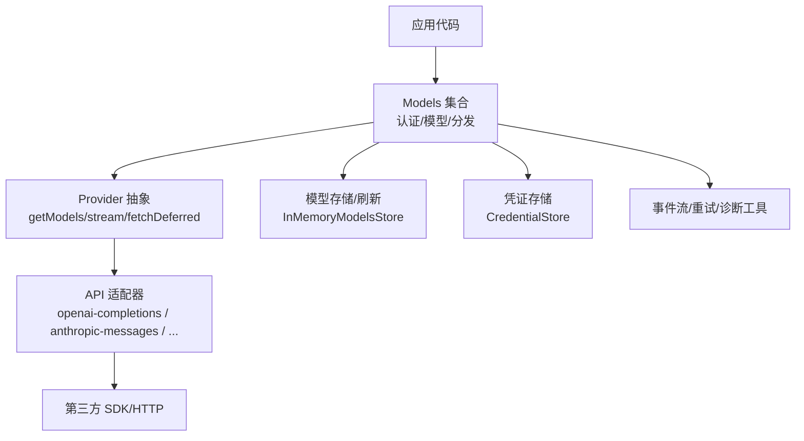
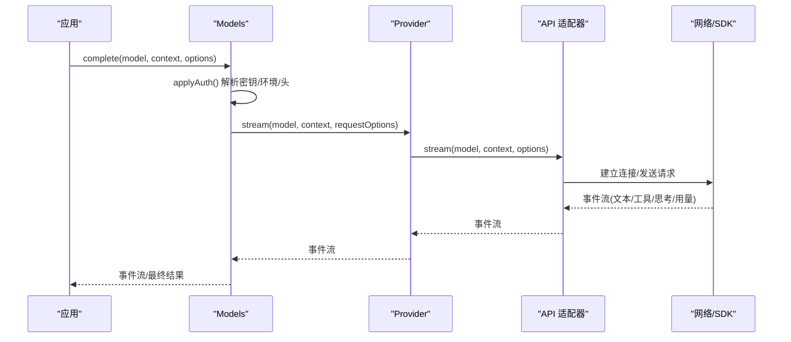
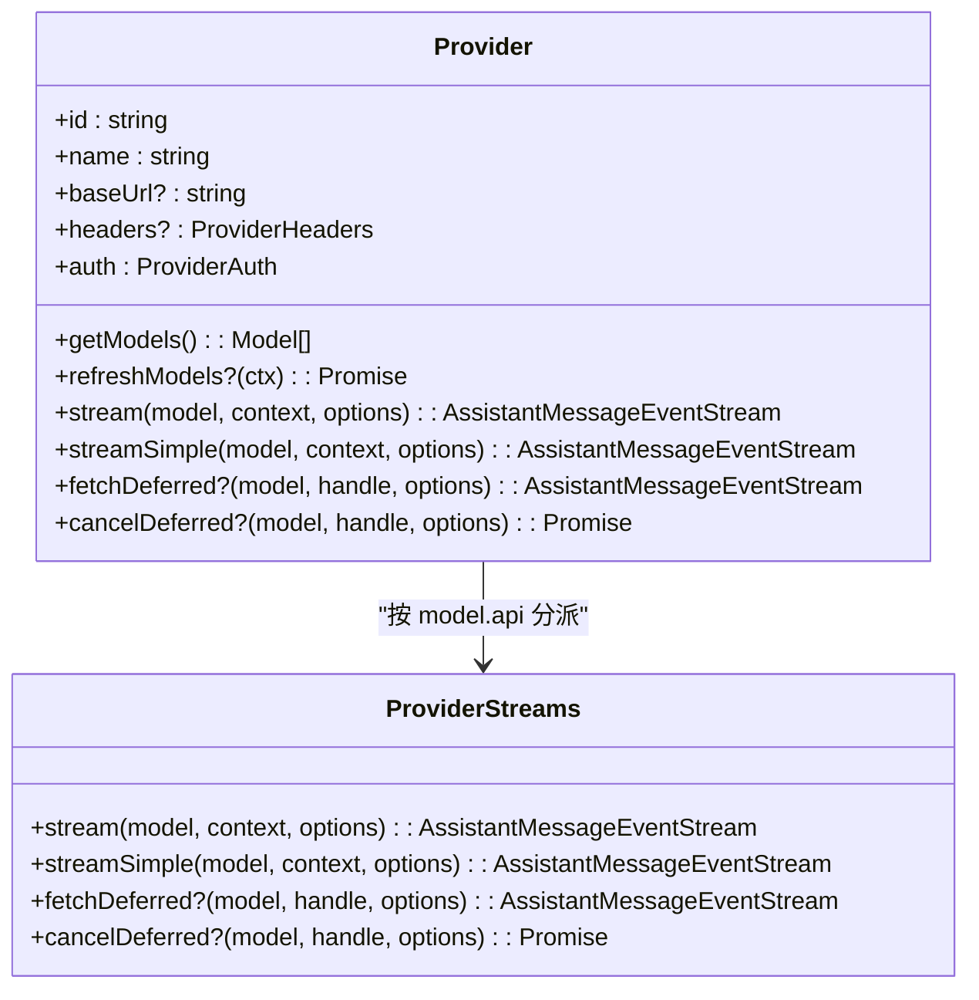
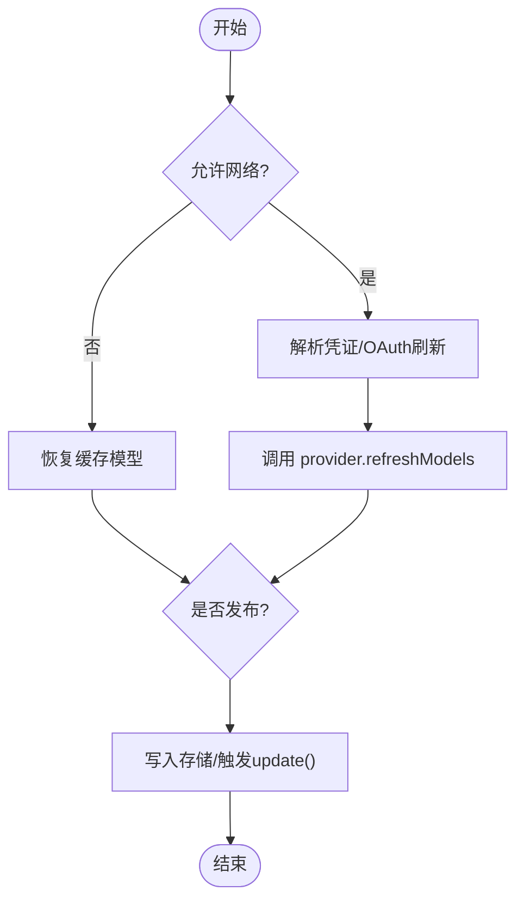
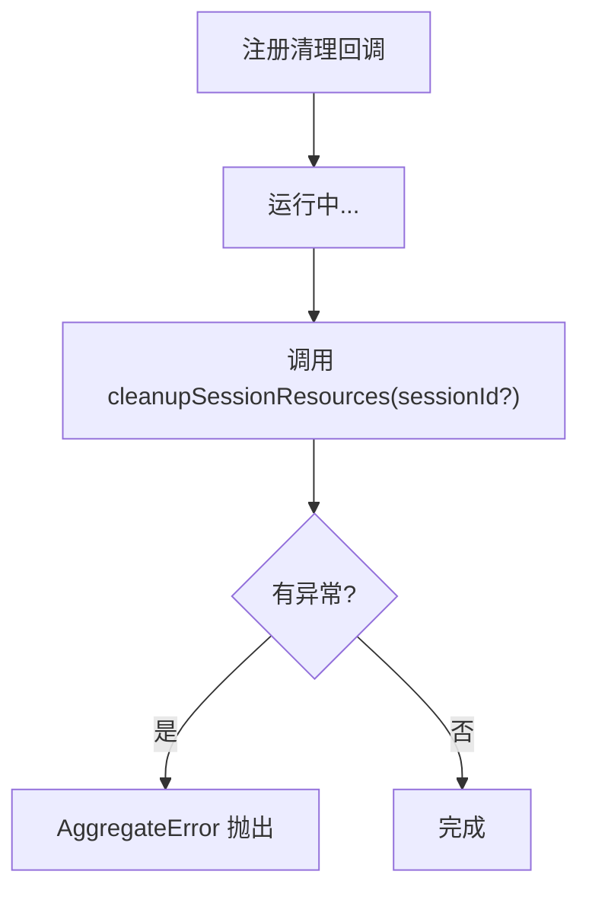
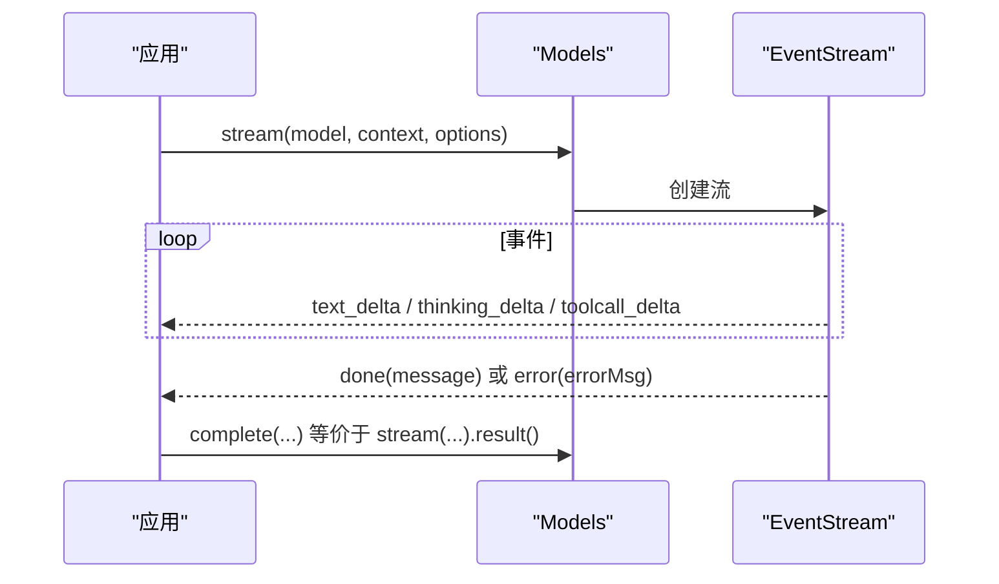
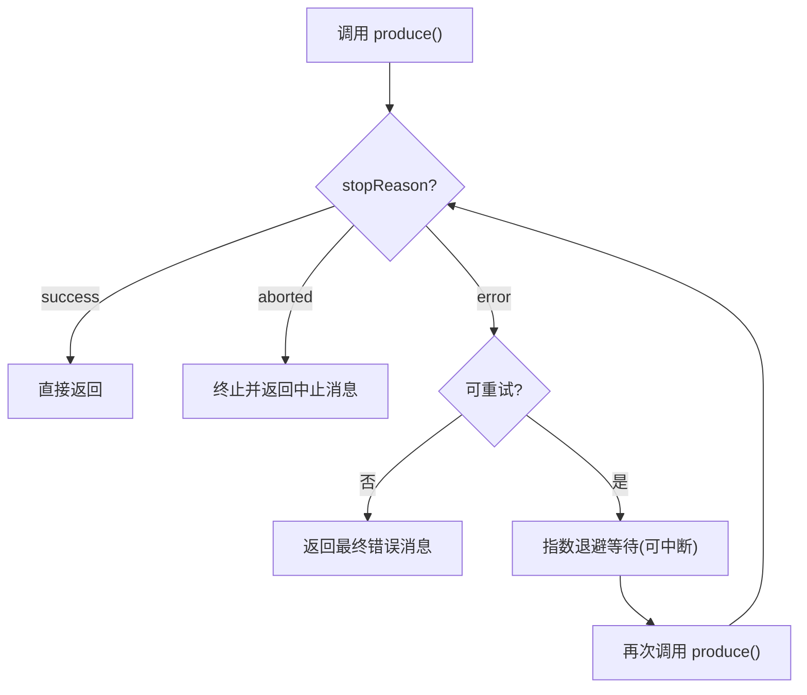
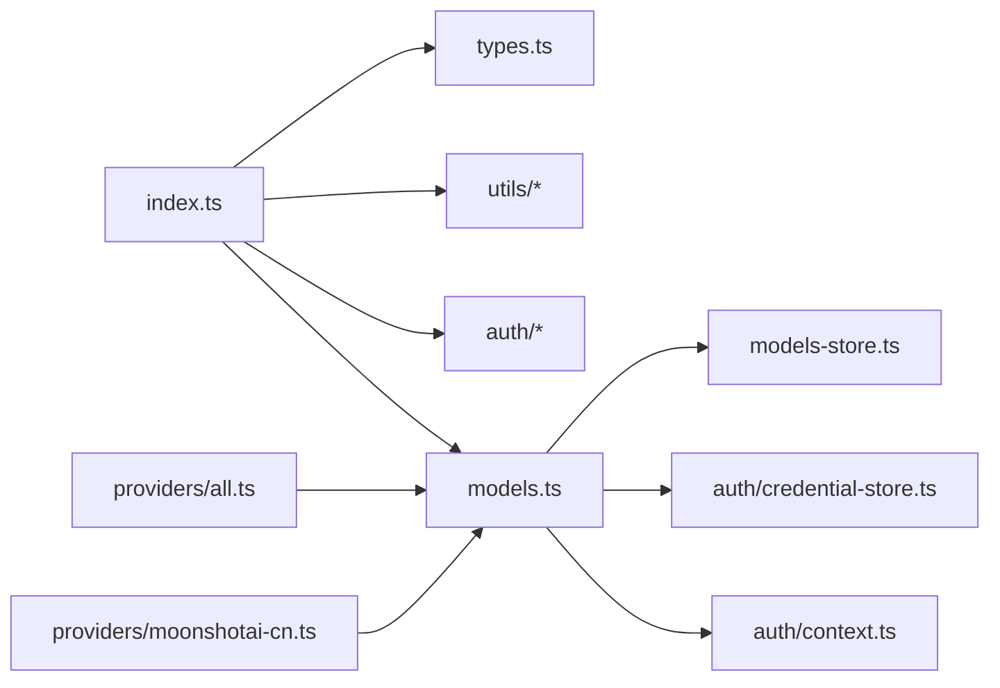

# 核心概念与架构

<cite>
**本文引用的文件**
- [packages/ai/src/index.ts](file://packages/ai/src/index.ts)
- [packages/ai/src/models.ts](file://packages/ai/src/models.ts)
- [packages/ai/src/types.ts](file://packages/ai/src/types.ts)
- [packages/ai/src/session-resources.ts](file://packages/ai/src/session-resources.ts)
- [packages/ai/src/utils/event-stream.ts](file://packages/ai/src/utils/event-stream.ts)
- [packages/ai/src/utils/retry.ts](file://packages/ai/src/utils/retry.ts)
- [packages/ai/src/auth/types.ts](file://packages/ai/src/auth/types.ts)
- [packages/ai/src/providers/all.ts](file://packages/ai/src/providers/all.ts)
- [packages/ai/src/providers/moonshotai-cn.ts](file://packages/ai/src/providers/moonshotai-cn.ts)
- [packages/ai/package.json](file://packages/ai/package.json)
</cite>

## 目录
1. [简介](#简介)
2. [项目结构](#项目结构)
3. [核心组件](#核心组件)
4. [架构总览](#架构总览)
5. [详细组件分析](#详细组件分析)
6. [依赖关系分析](#依赖关系分析)
7. [性能考量](#性能考量)
8. [故障排查指南](#故障排查指南)
9. [结论](#结论)
10. [附录](#附录)

## 简介
本文件面向开发者，系统化阐述 AI 抽象层的核心概念与整体设计：统一 API 抽象、提供商适配模式、模型发现机制、会话资源管理、聊天完成接口、流式响应处理、错误重试机制、成本优化策略、类型系统、事件流处理与诊断工具。文档通过架构图与流程图帮助读者快速理解从调用方到具体提供商的完整数据与控制流。

## 项目结构
- 包入口暴露核心类型、工具与模块导出，屏蔽实现细节与副作用（如模型目录生成、OAuth 实现等），将提供商工厂与 API 实现隔离在子路径下。
- 核心运行时由“模型集合 Models”统一管理提供商、认证、模型列表刷新与请求分发；每个 Provider 负责自身模型的获取、流式行为与可选的延迟响应能力。
- 统一的类型系统定义了消息、上下文、选项、事件协议、使用量与成本等跨提供商一致的数据结构。
- 工具层提供事件流封装、重试策略、诊断与验证等通用能力。
- 提供商层以工厂函数注册各云厂商或网关，复用统一的 API 适配器（如 OpenAI Completions、Anthropic Messages 等）。

图表来源
- [packages/ai/src/models.ts:156-223](file://packages/ai/src/models.ts#L156-L223)
- [packages/ai/src/types.ts:268-277](file://packages/ai/src/types.ts#L268-L277)
- [packages/ai/src/providers/all.ts:89-141](file://packages/ai/src/providers/all.ts#L89-L141)

章节来源
- [packages/ai/src/index.ts:1-48](file://packages/ai/src/index.ts#L1-L48)
- [packages/ai/package.json:1-101](file://packages/ai/package.json#L1-L101)

## 核心组件
- 统一模型集合 Models：集中管理提供商注册、认证解析、模型列表查询与刷新、请求分发、简单/完整流式接口、延迟响应支持。
- 提供商抽象 Provider：声明 id/name/baseUrl/auth、同步模型列表、动态刷新、按 model.api 分派到具体 API 适配器、实现 stream/streamSimple/fetchDeferred/cancelDeferred。
- 类型系统与事件协议：定义消息、上下文、选项、流事件、使用量与成本、受限采样、会话亲和等跨提供商一致契约。
- 事件流 EventStream：基于队列与等待者队列的异步迭代器，封装最终结果 Promise，统一结束条件与结果提取。
- 重试策略 RetryPolicy：指数退避、可配置最大重试次数、可中断睡眠、对“可重试/不可重试”错误的分类。
- 会话资源清理：全局注册清理回调，支持按 sessionId 清理并聚合异常。

章节来源
- [packages/ai/src/models.ts:88-223](file://packages/ai/src/models.ts#L88-L223)
- [packages/ai/src/types.ts:17-33, 114-173, 239-277, 303-330, 370-435, 509-539:17-33](file://packages/ai/src/types.ts#L17-L33)
- [packages/ai/src/utils/event-stream.ts:1-89](file://packages/ai/src/utils/event-stream.ts#L1-L89)
- [packages/ai/src/utils/retry.ts:92-229](file://packages/ai/src/utils/retry.ts#L92-L229)
- [packages/ai/src/session-resources.ts:1-25](file://packages/ai/src/session-resources.ts#L1-L25)

## 架构总览
下图展示一次聊天完成的端到端流程：调用方通过 Models.complete/stream 发起请求，Models 解析认证并合并请求头与环境，选择对应 Provider，再委派给具体 API 适配器执行流式请求；事件经 EventStream 推送，最终汇聚为 AssistantMessage。

图表来源
- [packages/ai/src/models.ts:636-688](file://packages/ai/src/models.ts#L636-L688)
- [packages/ai/src/types.ts:268-277](file://packages/ai/src/types.ts#L268-L277)

## 详细组件分析

### 统一 API 抽象与提供商适配模式
- 统一抽象：所有 API 实现遵循 ProviderStreams 接口，必须提供 stream 与 streamSimple，可选提供 fetchDeferred/cancelDeferred。这样 Models 可以以统一方式调度不同提供商的不同 API。
- 适配模式：Provider 通过 createProvider 组装 id/name/baseUrl/auth/models/api，内部根据 model.api 路由到具体适配器；若未实现则返回错误流。
- 示例：moonshotai-cn 提供商复用 openai-completions 适配器，仅注入 baseUrl、鉴权与模型清单。

图表来源
- [packages/ai/src/models.ts:88-149](file://packages/ai/src/models.ts#L88-L149)
- [packages/ai/src/types.ts:268-277](file://packages/ai/src/types.ts#L268-L277)
- [packages/ai/src/providers/moonshotai-cn.ts:1-15](file://packages/ai/src/providers/moonshotai-cn.ts#L1-L15)

章节来源
- [packages/ai/src/providers/moonshotai-cn.ts:1-15](file://packages/ai/src/providers/moonshotai-cn.ts#L1-L15)
- [packages/ai/src/models.ts:739-800](file://packages/ai/src/models.ts#L739-L800)

### 模型发现机制
- 静态模型清单：每个 Provider 提供 getModels() 返回当前已知模型（静态或上次刷新后的快照）。
- 动态刷新：动态 Provider 实现 refreshModels(context)，可从上游拉取最新模型并通过 context.publish 持久化与更新内存状态；Models.refresh 并发刷新多个 Provider，支持 allowNetwork/force/signal 控制。
- 可用模型过滤：Provider 可实现 filterModels 基于凭证进一步过滤可用模型。

图表来源
- [packages/ai/src/models.ts:367-446](file://packages/ai/src/models.ts#L367-L446)

章节来源
- [packages/ai/src/models.ts:113-127](file://packages/ai/src/models.ts#L113-L127)
- [packages/ai/src/models.ts:386-446](file://packages/ai/src/models.ts#L386-L446)

### 会话资源管理
- 全局注册清理回调：registerSessionResourceCleanup 用于注册会话级资源的清理逻辑。
- 批量清理：cleanupSessionResources 按顺序调用所有清理回调，收集异常并以 AggregateError 抛出，支持按 sessionId 清理。

图表来源
- [packages/ai/src/session-resources.ts:1-25](file://packages/ai/src/session-resources.ts#L1-L25)

章节来源
- [packages/ai/src/session-resources.ts:1-25](file://packages/ai/src/session-resources.ts#L1-L25)

### 聊天完成接口与流式响应
- 统一接口：Models.stream/complete 与 streamSimple/completeSimple 提供流式与非流式两种风格；complete 内部基于 stream.result() 聚合最终消息。
- 事件协议：AssistantMessageEventStream 基于 EventStream，事件包括 start/text/thinking/toolcall/done/error 等，done/error 作为终止事件并携带最终消息。
- 延迟响应：Provider 可选择实现 fetchDeferred/cancelDeferred，Models 会透传并包装为流式结果。

图表来源
- [packages/ai/src/models.ts:667-704](file://packages/ai/src/models.ts#L667-L704)
- [packages/ai/src/utils/event-stream.ts:1-89](file://packages/ai/src/utils/event-stream.ts#L1-L89)
- [packages/ai/src/types.ts:515-539](file://packages/ai/src/types.ts#L515-L539)

章节来源
- [packages/ai/src/models.ts:667-704](file://packages/ai/src/models.ts#L667-L704)
- [packages/ai/src/utils/event-stream.ts:1-89](file://packages/ai/src/utils/event-stream.ts#L1-L89)
- [packages/ai/src/types.ts:515-539](file://packages/ai/src/types.ts#L515-L539)

### 错误重试机制
- 重试策略：RetryPolicy 支持 enabled/maxRetries/baseDelayMs；retryAssistantCall 实现指数退避与可中断睡眠。
- 错误分类：isRetryableAssistantError 依据错误信息匹配“可重试/不可重试”模式（如配额耗尽、网络抖动、服务端错误等）。
- 回调钩子：onRetryScheduled/onRetryAttemptStart/onRetryFinished 便于上层观测与上报。

图表来源
- [packages/ai/src/utils/retry.ts:92-229](file://packages/ai/src/utils/retry.ts#L92-L229)

章节来源
- [packages/ai/src/utils/retry.ts:92-229](file://packages/ai/src/utils/retry.ts#L92-L229)

### 成本优化策略
- 使用量与成本：Usage 包含 input/output/cacheRead/cacheWrite/reasoning/totalTokens 及 cost 明细；ModelCostRates/ModelCostTier/ModelCost 支持分层计价。
- 提示缓存：StreamOptions.cacheRetention 与 SessionAffinityFormat 等选项可提升缓存命中；部分提供商支持长保留（如 1h）与亲和头部。
- 推理预算：SimpleStreamOptions.thinkingBudgets 可为 token-based 提供商限制推理令牌，避免答案被吞没。
- 传输与超时：transport/timeoutMs/websocketConnectTimeoutMs 等选项可用于优化连接与等待行为。

章节来源
- [packages/ai/src/types.ts:175-219, 303-310, 370-391, 776-791:175-219](file://packages/ai/src/types.ts#L175-L219)
- [packages/ai/src/types.ts:303-310](file://packages/ai/src/types.ts#L303-L310)
- [packages/ai/src/types.ts:370-391](file://packages/ai/src/types.ts#L370-L391)
- [packages/ai/src/types.ts:776-791](file://packages/ai/src/types.ts#L776-L791)

### 类型系统与诊断工具
- 类型系统：KnownApi/KnownProvider/ApiOptionsMap 等类型确保编译期对 API 与提供商的约束；Tool/Context/Message 等统一数据结构。
- 诊断：AssistantMessage.diagnostics 可记录失败与恢复的诊断信息；utils/diagnostics 提供诊断相关工具导出。
- 校验与 JSON：utils/validation 与 utils/json-parse 提供辅助能力。

章节来源
- [packages/ai/src/types.ts:17-33, 239-258, 409-455:17-33](file://packages/ai/src/types.ts#L17-L33)
- [packages/ai/src/types.ts:409-455](file://packages/ai/src/types.ts#L409-L455)
- [packages/ai/src/index.ts:39-47](file://packages/ai/src/index.ts#L39-L47)

## 依赖关系分析
- 包导出边界：index.ts 仅暴露核心类型、工具与必要导出，将副作用（模型目录、OAuth、兼容层）隔离在子路径。
- 提供商装配：providers/all.ts 集中构建内置提供商实例并注册到 Models；moonshotai-cn 等通过 createProvider 复用 openai-completions 适配器。
- 运行时依赖：models.ts 组合 models-store、credential-store、auth/context、utils/abort 等；event-stream 与 retry 提供基础能力。

图表来源
- [packages/ai/src/index.ts:1-48](file://packages/ai/src/index.ts#L1-L48)
- [packages/ai/src/providers/all.ts:89-141](file://packages/ai/src/providers/all.ts#L89-L141)
- [packages/ai/src/models.ts:254-267](file://packages/ai/src/models.ts#L254-L267)

章节来源
- [packages/ai/src/index.ts:1-48](file://packages/ai/src/index.ts#L1-L48)
- [packages/ai/src/providers/all.ts:89-141](file://packages/ai/src/providers/all.ts#L89-L141)
- [packages/ai/src/models.ts:254-267](file://packages/ai/src/models.ts#L254-L267)

## 性能考量
- 并发刷新：Models.refresh 并发刷新多个 Provider，支持 abort 信号与去重 generation，避免重复工作。
- 流式优先：默认推荐 stream 接口，减少首字节延迟；complete 仅在需要最终消息时聚合。
- 重试与退避：合理设置 maxRetries 与 baseDelayMs，结合 isRetryableAssistantError 避免对配额耗尽类错误重试。
- 缓存与亲和：利用 cacheRetention 与 sessionAffinity 提升缓存命中率；必要时调整 transport 与超时参数。
- 推理预算：为支持推理的提供商设置 thinkingBudgets，防止推理内容占用过多输出空间。

[本节为通用指导，不直接分析具体文件]

## 故障排查指南
- 认证问题：检查 ProviderAuth 是否配置完整；Models.getAuth/getAvailable/checkAuth 可定位未配置或 OAuth 过期情况。
- 模型不可用：确认 Provider.getModels 与 filterModels 是否正确；必要时调用 refresh(force=true) 强制刷新。
- 流式异常：关注事件中的 error 类型与 errorMessage；结合 isRetryableAssistantError 判断是否应重试。
- 重试失败：查看 onRetryScheduled/onRetryFinished 回调日志，确认退避策略与中断信号。
- 会话资源泄漏：确保在会话结束时调用 cleanupSessionResources，捕获并处理 AggregateError。

章节来源
- [packages/ai/src/models.ts:511-542](file://packages/ai/src/models.ts#L511-L542)
- [packages/ai/src/utils/retry.ts:163-229](file://packages/ai/src/utils/retry.ts#L163-L229)
- [packages/ai/src/session-resources.ts:12-24](file://packages/ai/src/session-resources.ts#L12-L24)

## 结论
该 AI 抽象层通过 Provider 与 Models 的清晰分工，实现了多提供商的统一接入、类型安全的选项与消息模型、可扩展的模型发现与刷新、健壮的流式事件协议以及可配置的重试与成本优化策略。借助统一的类型系统与工具库，开发者可以以最小代价集成新的提供商与 API，并在复杂场景下获得一致的体验与可控的行为。

## 附录
- 快速上手：使用 builtinModels() 获取预置提供商集合，或直接 createModels() 自定义 Provider。
- 扩展点：新增 Provider 时，实现 getModels/stream/streamSimple，按需实现 refreshModels/fetchDeferred/cancelDeferred。
- 调试建议：启用 diagnostics 与重试回调，结合事件流观察中间态；必要时降低并发或关闭网络刷新进行隔离测试。

[本节为补充说明，不直接分析具体文件]