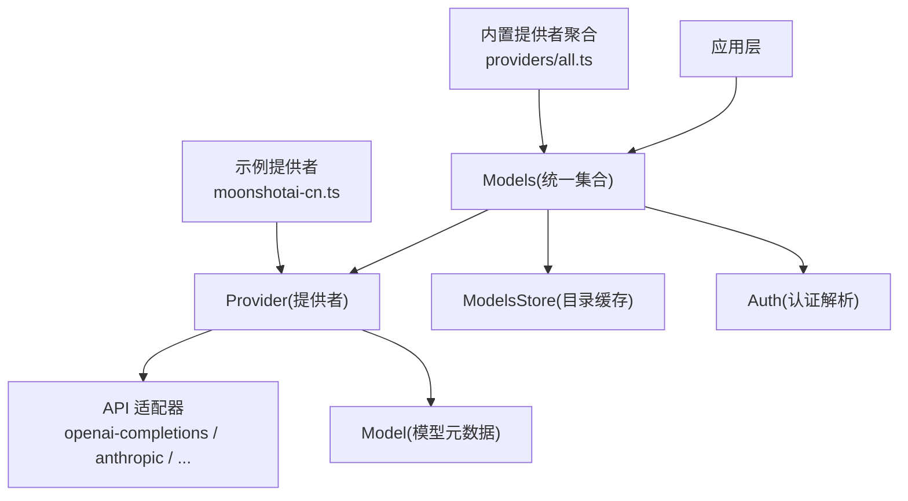
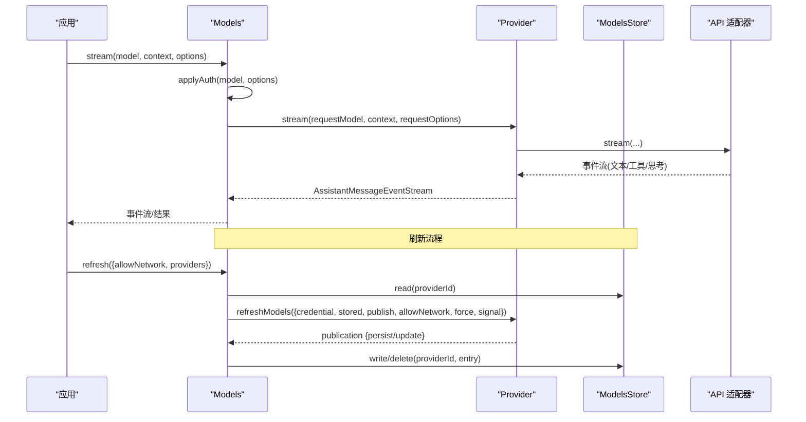
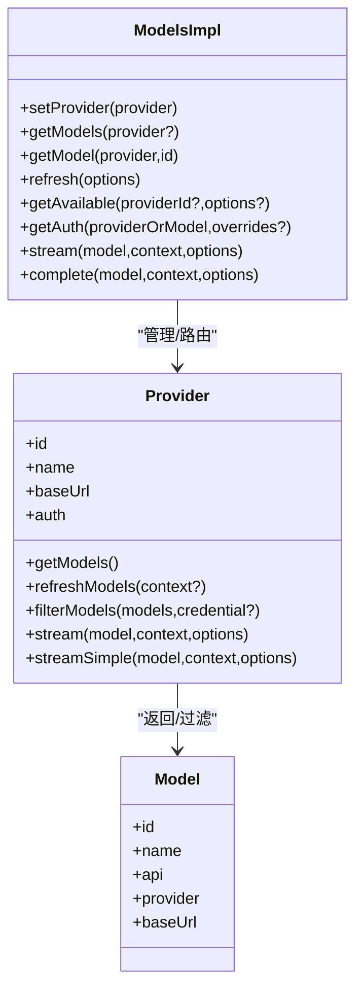
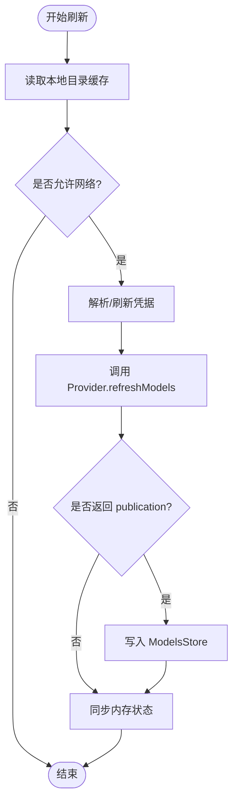
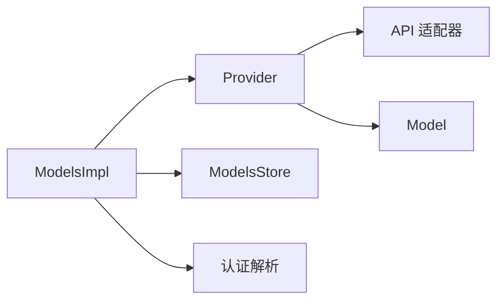

# 模型发现与管理

<cite>
**本文引用的文件**
- [packages/ai/src/models.ts](file://packages/ai/src/models.ts)
- [packages/ai/src/types.ts](file://packages/ai/src/types.ts)
- [packages/ai/src/models-store.ts](file://packages/ai/src/models-store.ts)
- [packages/ai/src/model-catalog.ts](file://packages/ai/src/model-catalog.ts)
- [packages/ai/src/providers/all.ts](file://packages/ai/src/providers/all.ts)
- [packages/ai/src/providers/moonshotai-cn.ts](file://packages/ai/src/providers/moonshotai-cn.ts)
- [packages/ai/src/image-models.generated.ts](file://packages/ai/src/image-models.generated.ts)
- [packages/ai/src/images-models.ts](file://packages/ai/src/images-models.ts)
</cite>

## 目录
1. [简介](#简介)
2. [项目结构](#项目结构)
3. [核心组件](#核心组件)
4. [架构总览](#架构总览)
5. [详细组件分析](#详细组件分析)
6. [依赖关系分析](#依赖关系分析)
7. [性能与成本](#性能与成本)
8. [故障排查指南](#故障排查指南)
9. [结论](#结论)
10. [附录](#附录)

## 简介
本文件面向“模型发现与管理”能力，系统性说明：
- 模型注册机制：如何声明 Provider、将静态/动态模型纳入统一集合。
- 能力检测与版本兼容性：通过类型化 API、兼容配置项与可用模型过滤实现。
- 文本生成与图像生成的发现与选择策略：内置提供者聚合、按能力筛选、流式调用。
- 性能指标、成本估算与缓存机制：Usage/cost 字段、提示词缓存、会话亲和与刷新策略。
- 配置模板、自定义注册与切换最佳实践：提供可复用的模板与操作建议。

## 项目结构
围绕模型管理的关键代码集中在 packages/ai 中：
- 统一模型集合与提供者抽象：models.ts
- 类型与选项（含成本、缓存、传输等）：types.ts
- 模型目录持久化存储接口与内存实现：models-store.ts
- 模型目录扁平化工具：model-catalog.ts
- 内置提供者聚合入口：providers/all.ts
- 示例提供者（OpenAI 兼容）：providers/moonshotai-cn.ts
- 图像生成模型相关：images-models.ts、image-models.generated.ts

图表来源
- [packages/ai/src/models.ts:254-737](file://packages/ai/src/models.ts#L254-L737)
- [packages/ai/src/providers/all.ts:88-141](file://packages/ai/src/providers/all.ts#L88-L141)
- [packages/ai/src/providers/moonshotai-cn.ts:6-14](file://packages/ai/src/providers/moonshotai-cn.ts#L6-L14)

章节来源
- [packages/ai/src/models.ts:254-737](file://packages/ai/src/models.ts#L254-L737)
- [packages/ai/src/providers/all.ts:88-141](file://packages/ai/src/providers/all.ts#L88-L141)
- [packages/ai/src/providers/moonshotai-cn.ts:6-14](file://packages/ai/src/providers/moonshotai-cn.ts#L6-L14)

## 核心组件
- Models（统一集合）：集中管理 Provider 注册、模型列表读取、认证解析、请求转发、并发刷新与发布。
- Provider（提供者）：封装 id/name/baseUrl/auth、getModels/refreshModels/filterModels、stream/streamSimple/fetchDeferred/cancelDeferred。
- Model（模型）：描述 id/name/api/provider/baseUrl 及能力、成本、思考级别等元信息。
- ModelsStore（目录存储）：以 providerId 为键持久化模型目录快照（含 lastModified/etag/checkedAt）。
- 类型系统（types.ts）：定义 Api、ImagesApi、StreamOptions、Usage、ModelCostRates、ThinkingLevel 等。

章节来源
- [packages/ai/src/models.ts:97-223](file://packages/ai/src/models.ts#L97-L223)
- [packages/ai/src/models-store.ts:1-46](file://packages/ai/src/models-store.ts#L1-L46)
- [packages/ai/src/types.ts:17-33](file://packages/ai/src/types.ts#L17-L33)
- [packages/ai/src/types.ts:119-219](file://packages/ai/src/types.ts#L119-L219)
- [packages/ai/src/types.ts:370-391](file://packages/ai/src/types.ts#L370-L391)
- [packages/ai/src/types.ts:776-791](file://packages/ai/src/types.ts#L776-L791)

## 架构总览
下图展示从应用到具体上游 API 的完整调用链，以及模型目录刷新与发布的时序。

图表来源
- [packages/ai/src/models.ts:667-732](file://packages/ai/src/models.ts#L667-L732)
- [packages/ai/src/models.ts:386-446](file://packages/ai/src/models.ts#L386-L446)
- [packages/ai/src/models-store.ts:20-45](file://packages/ai/src/models-store.ts#L20-L45)

## 详细组件分析

### 模型注册机制
- 通过 createProvider 构造 Provider，注入 id/name/baseUrl/auth/models/api，并可选 fetchModels 实现动态覆盖。
- 使用 builtinProviders() 一次性注册所有内置 Provider；也可按需 setProvider 自定义 Provider。
- 示例：moonshotaiCnProvider 使用 OpenAI 兼容 API 适配器，并挂载一组模型。

图表来源
- [packages/ai/src/models.ts:254-737](file://packages/ai/src/models.ts#L254-L737)
- [packages/ai/src/models.ts:739-800](file://packages/ai/src/models.ts#L739-L800)

章节来源
- [packages/ai/src/providers/all.ts:88-141](file://packages/ai/src/providers/all.ts#L88-L141)
- [packages/ai/src/providers/moonshotai-cn.ts:6-14](file://packages/ai/src/providers/moonshotai-cn.ts#L6-L14)
- [packages/ai/src/models.ts:739-800](file://packages/ai/src/models.ts#L739-L800)

### 能力检测与版本兼容性检查
- 类型化 API：KnownApi/KnownImagesApi 约束支持的文本/图像 API 种类。
- 兼容配置：OpenAICompletionsCompat/OpenAIResponsesCompat/AnthropicMessagesCompat 等用于控制特性开关（如 thinking 格式、严格模式、长缓存保留、会话亲和等）。
- 可用模型过滤：Provider.filterModels 可在认证后按凭据裁剪可见模型；Models.getAvailable 会先校验认证再返回可用模型。

章节来源
- [packages/ai/src/types.ts:17-33](file://packages/ai/src/types.ts#L17-L33)
- [packages/ai/src/types.ts:542-625](file://packages/ai/src/types.ts#L542-L625)
- [packages/ai/src/types.ts:627-687](file://packages/ai/src/types.ts#L627-L687)
- [packages/ai/src/models.ts:129-134](file://packages/ai/src/models.ts#L129-L134)
- [packages/ai/src/models.ts:522-542](file://packages/ai/src/models.ts#L522-L542)

### 文本生成模型的发现与选择策略
- 发现：Models.getModels(provider?) 同步读取各 Provider 的已知模型；builtinModels() 预注册全部内置 Provider。
- 选择：
  - 基于 Provider 与 model.id 精确查找 getModel(provider,id)。
  - 基于认证状态 getAvailable() 仅返回已配置的 Provider 的模型。
  - 通过 Model.api 区分不同 API 实现，由 Provider 内部按 model.api 分派到对应流式实现。
- 调用：stream/complete 经 applyAuth 合并 headers/env/baseUrl 后交由 Provider.stream 执行。

章节来源
- [packages/ai/src/models.ts:294-318](file://packages/ai/src/models.ts#L294-L318)
- [packages/ai/src/models.ts:522-542](file://packages/ai/src/models.ts#L522-L542)
- [packages/ai/src/models.ts:636-680](file://packages/ai/src/models.ts#L636-L680)
- [packages/ai/src/providers/all.ts:88-141](file://packages/ai/src/providers/all.ts#L88-L141)

### 图像生成模型的发现与选择策略
- 图像模型集合 ImagesModels 与文本模型集合 Models 对称，支持 setProvider/getModels/getAvailable 等操作。
- 内置图像提供者：builtinImagesProviders() 暴露 openrouter-images 等图像提供者；可通过 createImagesModels 组合。
- 图像生成函数：ProviderImages.generateImages 统一返回 AssistantImages，包含 usage 与 stopReason。

章节来源
- [packages/ai/src/images-models.ts:1-200](file://packages/ai/src/images-models.ts#L1-L200)
- [packages/ai/src/image-models.generated.ts:1-200](file://packages/ai/src/image-models.generated.ts#L1-L200)
- [packages/ai/src/providers/all.ts:143-155](file://packages/ai/src/providers/all.ts#L143-L155)
- [packages/ai/src/types.ts:279-301](file://packages/ai/src/types.ts#L279-L301)

### 模型目录刷新与缓存机制
- 刷新流程：Models.refresh 并发刷新指定或全部 Provider；先恢复本地缓存，再在允许网络时解析凭据并拉取最新目录。
- 持久化：Provider.refreshModels 通过 context.publish 提交 ModelsPublication（persist/update），ModelsImpl 写入 ModelsStore 并触发同步更新。
- 缓存语义：ModelsStoreEntry 包含 models/lastModified/etag/checkedAt，支持条件请求与增量更新。
- 传输与提示词缓存：StreamOptions.cacheRetention、sessionId、transport 等影响提示词缓存命中与会话亲和。

图表来源
- [packages/ai/src/models.ts:386-446](file://packages/ai/src/models.ts#L386-L446)
- [packages/ai/src/models-store.ts:1-46](file://packages/ai/src/models-store.ts#L1-L46)
- [packages/ai/src/types.ts:175-219](file://packages/ai/src/types.ts#L175-L219)

章节来源
- [packages/ai/src/models.ts:386-446](file://packages/ai/src/models.ts#L386-L446)
- [packages/ai/src/models-store.ts:1-46](file://packages/ai/src/models-store.ts#L1-L46)
- [packages/ai/src/types.ts:175-219](file://packages/ai/src/types.ts#L175-L219)

### 性能指标、成本估算与缓存
- 性能指标：AssistantMessage.usage 包含 input/output/cacheRead/cacheWrite/reasoning/totalTokens。
- 成本估算：ModelCostRates/ModelCostTier/ModelCost 提供按输入阈值分层计价；Usage.cost 汇总本次请求成本。
- 缓存机制：
  - 提示词缓存：StreamOptions.cacheRetention 控制短/长保留；部分 Provider 支持 sessionAffinityFormat 提升命中率。
  - 目录缓存：ModelsStore 保存 lastModified/etag，支持 If-None-Match 等条件请求。
  - 传输优化：transport 支持 sse/websocket/websocket-cached/auto。

章节来源
- [packages/ai/src/types.ts:370-391](file://packages/ai/src/types.ts#L370-L391)
- [packages/ai/src/types.ts:776-791](file://packages/ai/src/types.ts#L776-L791)
- [packages/ai/src/types.ts:175-219](file://packages/ai/src/types.ts#L175-L219)
- [packages/ai/src/models-store.ts:1-46](file://packages/ai/src/models-store.ts#L1-L46)

### 配置模板、自定义注册与切换最佳实践
- 文本生成 Provider 模板要点：
  - id/name/baseUrl/auth(models.models) 必填；api 指向对应适配器。
  - 可选 fetchModels 实现动态覆盖；filterModels 按凭据裁剪可见模型。
- 自定义注册：
  - 使用 createProvider 构建 Provider，并通过 Models.setProvider 注册。
  - 使用 builtinModels() 快速初始化并追加自定义 Provider。
- 模型切换：
  - 通过 getAvailable() 获取已配置模型列表，结合业务策略（延迟/吞吐/成本）选择目标模型。
  - 使用 getModel(provider,id) 精确锁定模型；必要时通过 transformHeaders/env 做请求级定制。
- 图像生成：
  - 使用 createImagesModels 组合 Providers；通过 builtinImagesProviders() 快速启用内置图像提供者。

章节来源
- [packages/ai/src/models.ts:739-800](file://packages/ai/src/models.ts#L739-L800)
- [packages/ai/src/providers/all.ts:88-141](file://packages/ai/src/providers/all.ts#L88-L141)
- [packages/ai/src/providers/moonshotai-cn.ts:6-14](file://packages/ai/src/providers/moonshotai-cn.ts#L6-L14)
- [packages/ai/src/providers/all.ts:143-155](file://packages/ai/src/providers/all.ts#L143-L155)

## 依赖关系分析
- 低耦合：Models 仅依赖 Provider 抽象；Provider 仅依赖 API 适配器与 Model 元数据。
- 内聚性：每个 Provider 聚焦单一上游服务；Models 负责跨 Provider 的统一调度与认证。
- 外部依赖：
  - 认证：envApiKeyAuth 等解析环境变量或 OAuth。
  - 存储：ModelsStore 默认 InMemoryModelsStore，可替换为持久化实现。
  - 网络：StreamOptions.fetch/timeoutMs/maxRetries 等控制 HTTP 行为。

图表来源
- [packages/ai/src/models.ts:254-737](file://packages/ai/src/models.ts#L254-L737)
- [packages/ai/src/models-store.ts:20-45](file://packages/ai/src/models-store.ts#L20-L45)
- [packages/ai/src/types.ts:119-219](file://packages/ai/src/types.ts#L119-L219)

章节来源
- [packages/ai/src/models.ts:254-737](file://packages/ai/src/models.ts#L254-L737)
- [packages/ai/src/types.ts:119-219](file://packages/ai/src/types.ts#L119-L219)

## 性能与成本
- 流式优先：优先使用 stream/streamSimple 以获得更低首包延迟与更好的中断体验。
- 传输选择：根据 Provider 能力选择 websocket/websocket-cached 以提升吞吐与稳定性。
- 缓存利用：合理设置 cacheRetention 与 sessionId，配合 Provider 的会话亲和头提高命中。
- 成本优化：依据 Usage.cost 与 ModelCostRates 评估不同模型/提供商的成本；对长上下文采用分层计价策略。
- 重试与超时：通过 maxRetries/timeoutMs/maxRetryDelayMs 平衡可靠性与时延。

[本节为通用指导，不直接分析具体文件]

## 故障排查指南
- 认证失败：
  - 现象：getAuth 返回 undefined 或抛出 ModelsError。
  - 排查：确认 Provider.auth 配置与环境变量；必要时调用 login/logout 管理凭据。
- 模型不可用：
  - 现象：getAvailable 返回空或模型缺失。
  - 排查：检查 filterModels 逻辑与凭据有效性；确保已调用 refresh 更新目录。
- 刷新异常：
  - 现象：refresh 返回 errors Map。
  - 排查：查看错误码与 cause；检查网络与凭据刷新；必要时强制刷新 force=true。
- 流式错误：
  - 现象：事件流终止于 error，stopReason 为 error/aborted。
  - 排查：检查 onPayload/onResponse 回调、headers/env 合并是否正确；确认 Provider 是否支持所选 API。

章节来源
- [packages/ai/src/models.ts:511-563](file://packages/ai/src/models.ts#L511-L563)
- [packages/ai/src/models.ts:565-626](file://packages/ai/src/models.ts#L565-L626)
- [packages/ai/src/models.ts:386-446](file://packages/ai/src/models.ts#L386-L446)
- [packages/ai/src/models.ts:636-732](file://packages/ai/src/models.ts#L636-L732)

## 结论
该模型管理系统以 Provider/Model/Models 为核心，提供统一的注册、发现、认证与调用通道；通过类型化 API 与兼容配置实现能力检测与版本适配；借助 ModelsStore 与 StreamOptions 实现高效的目录缓存与提示词缓存；并提供文本与图像两类模型的完整生命周期管理。遵循本文的最佳实践，可在多供应商环境中稳定、低成本地调度模型资源。

## 附录
- 关键类型速查：
  - Api/ImagesApi：支持的文本/图像 API 集合。
  - StreamOptions：传输、缓存、会话、超时、重试等请求级选项。
  - Usage/ModelCostRates：用量与成本字段。
  - ThinkingLevel/ThinkingBudgets：推理/思考强度与预算。
- 常用入口：
  - builtinModels()/builtinProviders()：快速初始化。
  - createProvider()/createModels()：自定义扩展。
  - createImagesModels()/builtinImagesProviders()：图像模型。

章节来源
- [packages/ai/src/types.ts:17-33](file://packages/ai/src/types.ts#L17-L33)
- [packages/ai/src/types.ts:175-219](file://packages/ai/src/types.ts#L175-L219)
- [packages/ai/src/types.ts:370-391](file://packages/ai/src/types.ts#L370-L391)
- [packages/ai/src/types.ts:776-791](file://packages/ai/src/types.ts#L776-L791)
- [packages/ai/src/providers/all.ts:88-155](file://packages/ai/src/providers/all.ts#L88-L155)