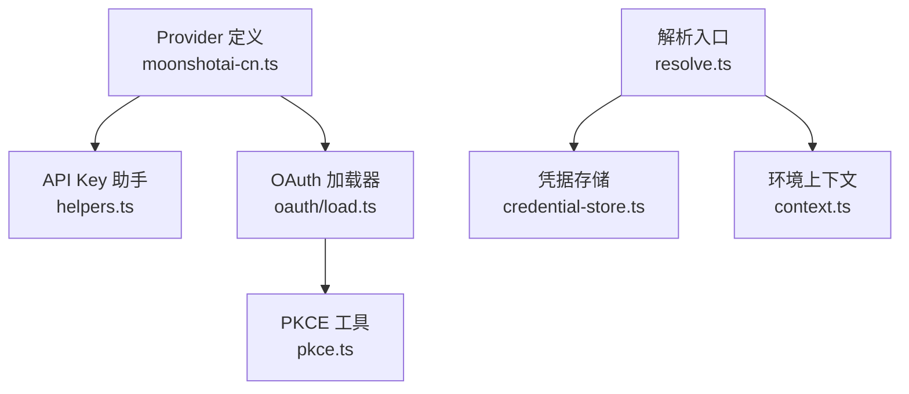
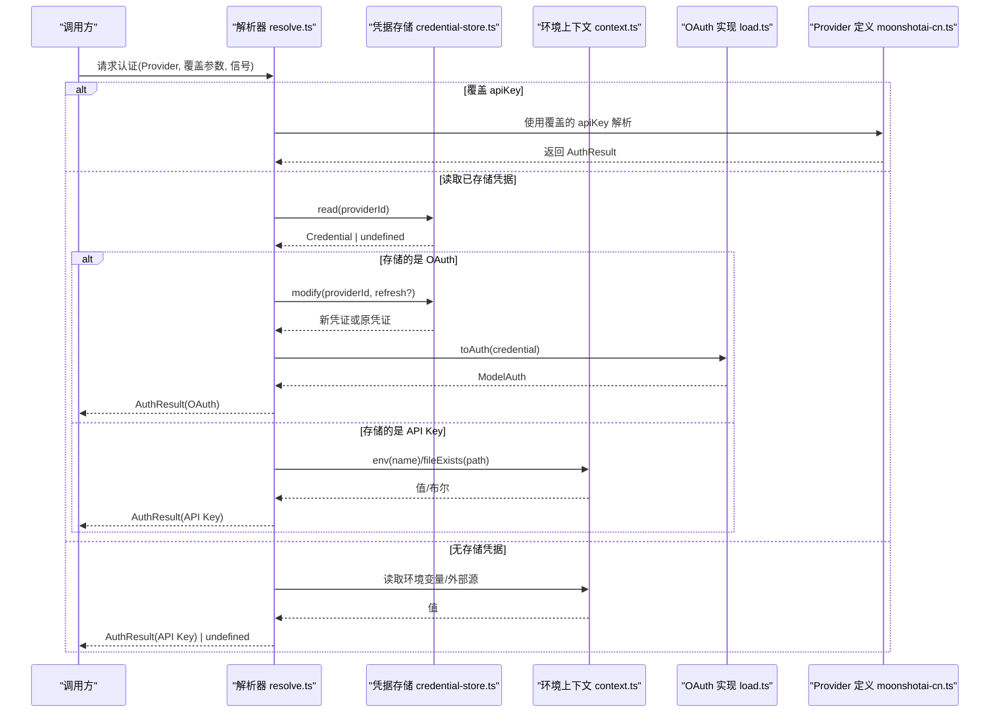
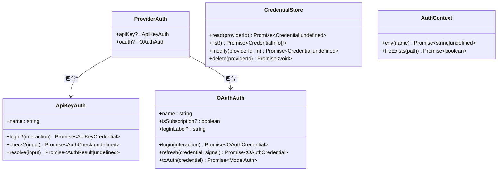
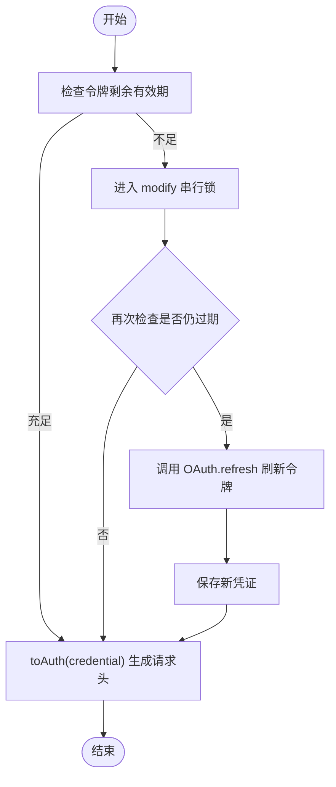
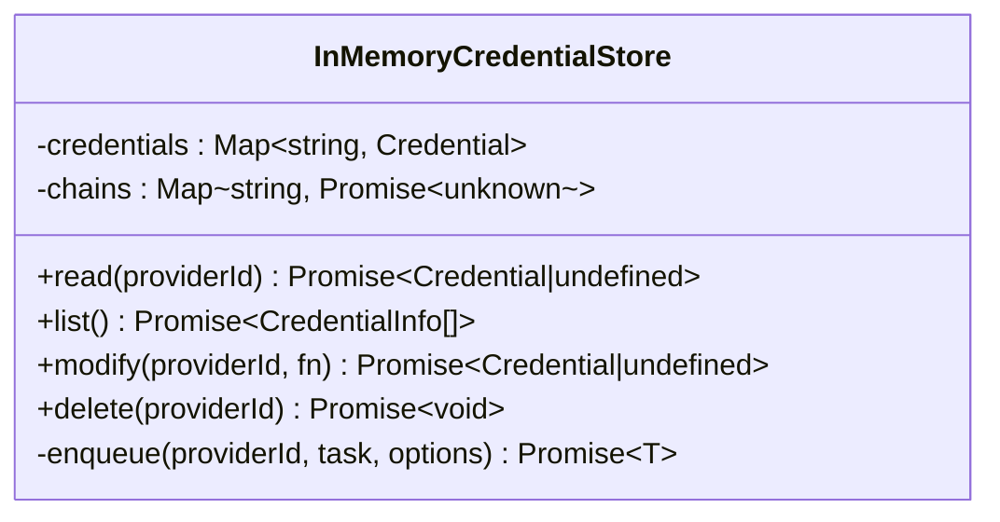
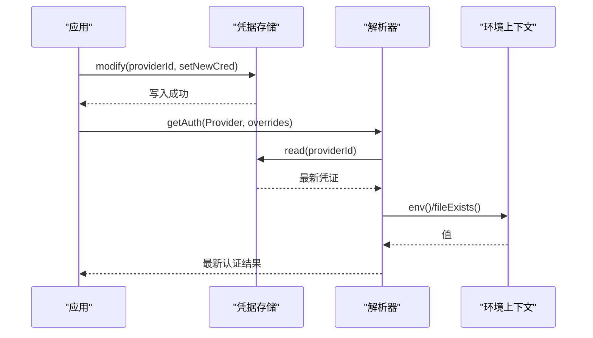
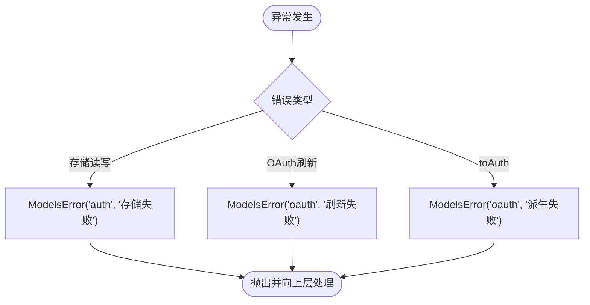
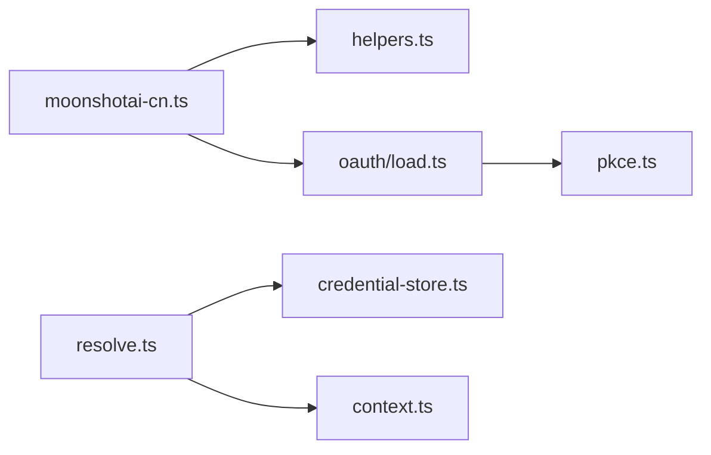

# 认证与凭据管理

<cite>
**本文引用的文件**
- [packages/ai/src/auth/types.ts](file://packages/ai/src/auth/types.ts)
- [packages/ai/src/auth/helpers.ts](file://packages/ai/src/auth/helpers.ts)
- [packages/ai/src/auth/context.ts](file://packages/ai/src/auth/context.ts)
- [packages/ai/src/auth/credential-store.ts](file://packages/ai/src/auth/credential-store.ts)
- [packages/ai/src/auth/resolve.ts](file://packages/ai/src/auth/resolve.ts)
- [packages/ai/src/auth/oauth/load.ts](file://packages/ai/src/auth/oauth/load.ts)
- [packages/ai/src/auth/oauth/pkce.ts](file://packages/ai/src/auth/oauth/pkce.ts)
- [packages/ai/src/providers/moonshotai-cn.ts](file://packages/ai/src/providers/moonshotai-cn.ts)
</cite>

## 目录
1. [简介](#简介)
2. [项目结构](#项目结构)
3. [核心组件](#核心组件)
4. [架构总览](#架构总览)
5. [详细组件分析](#详细组件分析)
6. [依赖关系分析](#依赖关系分析)
7. [性能考虑](#性能考虑)
8. [故障排查指南](#故障排查指南)
9. [结论](#结论)
10. [附录](#附录)

## 简介
本文件面向统一认证框架的设计与实现，覆盖 API Key 与 OAuth 两种认证方式、凭据存储机制、环境变量与配置文件管理、动态认证更新、多租户支持、会话级认证上下文以及认证错误处理。文档同时提供安全配置示例与常见问题解决方案，帮助开发者在 Node.js 与浏览器环境中正确集成与扩展认证能力。

## 项目结构
认证子系统位于 packages/ai/src/auth 目录下，围绕类型定义、环境上下文、凭据存储、解析流程与 OAuth 加载器组织：
- 类型与接口：统一描述凭据、认证结果、交互回调等
- 环境上下文：抽象环境变量与文件系统访问，适配 Node.js 与浏览器
- 凭据存储：默认内存实现，支持序列化写入与并发安全
- 解析流程：按优先级从覆盖参数、已存储凭据到环境/外部源解析最终请求头
- OAuth 加载器：按需懒加载各提供商的 OAuth 实现，避免将 Node 专属代码打入浏览器包
- PKCE 工具：跨平台生成 code verifier/challenge

**图示来源**
- [packages/ai/src/providers/moonshotai-cn.ts:1-15](file://packages/ai/src/providers/moonshotai-cn.ts#L1-L15)
- [packages/ai/src/auth/helpers.ts:1-60](file://packages/ai/src/auth/helpers.ts#L1-L60)
- [packages/ai/src/auth/oauth/load.ts:1-69](file://packages/ai/src/auth/oauth/load.ts#L1-L69)
- [packages/ai/src/auth/resolve.ts:1-206](file://packages/ai/src/auth/resolve.ts#L1-L206)
- [packages/ai/src/auth/credential-store.ts:1-68](file://packages/ai/src/auth/credential-store.ts#L1-L68)
- [packages/ai/src/auth/context.ts:1-46](file://packages/ai/src/auth/context.ts#L1-L46)
- [packages/ai/src/auth/oauth/pkce.ts:1-35](file://packages/ai/src/auth/oauth/pkce.ts#L1-L35)

**章节来源**
- [packages/ai/src/providers/moonshotai-cn.ts:1-15](file://packages/ai/src/providers/moonshotai-cn.ts#L1-L15)
- [packages/ai/src/auth/helpers.ts:1-60](file://packages/ai/src/auth/helpers.ts#L1-L60)
- [packages/ai/src/auth/oauth/load.ts:1-69](file://packages/ai/src/auth/oauth/load.ts#L1-L69)
- [packages/ai/src/auth/resolve.ts:1-206](file://packages/ai/src/auth/resolve.ts#L1-L206)
- [packages/ai/src/auth/credential-store.ts:1-68](file://packages/ai/src/auth/credential-store.ts#L1-L68)
- [packages/ai/src/auth/context.ts:1-46](file://packages/ai/src/auth/context.ts#L1-L46)
- [packages/ai/src/auth/oauth/pkce.ts:1-35](file://packages/ai/src/auth/oauth/pkce.ts#L1-L35)

## 核心组件
- 类型与契约
  - 模型请求认证 ModelAuth、凭据 Credential（API Key/OAuth）、认证结果 AuthResult、认证上下文 AuthContext、凭据存储 CredentialStore、API Key 认证 ApiKeyAuth、OAuth 认证 OAuthAuth、登录交互 AuthInteraction 等
- 环境上下文
  - 默认实现读取进程环境变量与检测文件存在性，浏览器中降级为不可用
- 凭据存储
  - 默认内存实现，按 Provider.id 序列化写入，保证并发安全
- 解析流程
  - 优先使用覆盖参数，其次读取已存储凭据，最后回退到环境/外部源；对 OAuth 采用“双检锁”刷新策略
- OAuth 加载器
  - 通过变量标识符动态导入各提供商 OAuth 实现，避免将 Node-only 代码打包进浏览器
- PKCE 工具
  - 基于 Web Crypto API 生成 code verifier 与 challenge，兼容 Node.js 与浏览器

**章节来源**
- [packages/ai/src/auth/types.ts:1-241](file://packages/ai/src/auth/types.ts#L1-L241)
- [packages/ai/src/auth/context.ts:1-46](file://packages/ai/src/auth/context.ts#L1-L46)
- [packages/ai/src/auth/credential-store.ts:1-68](file://packages/ai/src/auth/credential-store.ts#L1-L68)
- [packages/ai/src/auth/resolve.ts:1-206](file://packages/ai/src/auth/resolve.ts#L1-L206)
- [packages/ai/src/auth/oauth/load.ts:1-69](file://packages/ai/src/auth/oauth/load.ts#L1-L69)
- [packages/ai/src/auth/oauth/pkce.ts:1-35](file://packages/ai/src/auth/oauth/pkce.ts#L1-L35)

## 架构总览
下图展示一次模型请求的认证解析流程，包括 API Key 与 OAuth 两条路径，以及凭据存储与环境上下文的协作。

**图示来源**
- [packages/ai/src/auth/resolve.ts:50-206](file://packages/ai/src/auth/resolve.ts#L50-L206)
- [packages/ai/src/auth/credential-store.ts:9-68](file://packages/ai/src/auth/credential-store.ts#L9-L68)
- [packages/ai/src/auth/context.ts:23-46](file://packages/ai/src/auth/context.ts#L23-L46)
- [packages/ai/src/auth/oauth/load.ts:31-69](file://packages/ai/src/auth/oauth/load.ts#L31-L69)
- [packages/ai/src/providers/moonshotai-cn.ts:6-14](file://packages/ai/src/providers/moonshotai-cn.ts#L6-L14)

## 详细组件分析

### 统一认证框架设计
- 以 Provider 为中心，每个 Provider 声明其支持的认证方式（apiKey 与/或 oauth）
- 解析器统一协调：覆盖参数 > 已存储凭据 > 环境/外部源
- 凭据存储抽象：应用可注入持久化实现，默认提供内存实现
- 交互抽象：登录/选择/进度通知等通过 AuthInteraction 暴露给上层 UI

**图示来源**
- [packages/ai/src/auth/types.ts:166-241](file://packages/ai/src/auth/types.ts#L166-L241)

**章节来源**
- [packages/ai/src/auth/types.ts:1-241](file://packages/ai/src/auth/types.ts#L1-L241)

### OAuth 流程实现
- 懒加载：通过 load.ts 动态导入具体提供商实现，避免浏览器打包 Node-only 代码
- PKCE：使用 pkce.ts 生成 verifier 与 challenge，兼容 Node.js 与浏览器
- 刷新策略：解析器对即将过期的 OAuth 令牌进行“双检锁”刷新，确保并发安全与幂等
- 交互：login 通过 ProviderAuthInteraction 提示用户完成授权

**图示来源**
- [packages/ai/src/auth/resolve.ts:127-179](file://packages/ai/src/auth/resolve.ts#L127-L179)
- [packages/ai/src/auth/oauth/load.ts:31-69](file://packages/ai/src/auth/oauth/load.ts#L31-L69)
- [packages/ai/src/auth/oauth/pkce.ts:21-34](file://packages/ai/src/auth/oauth/pkce.ts#L21-L34)

**章节来源**
- [packages/ai/src/auth/resolve.ts:127-179](file://packages/ai/src/auth/resolve.ts#L127-L179)
- [packages/ai/src/auth/oauth/load.ts:1-69](file://packages/ai/src/auth/oauth/load.ts#L1-L69)
- [packages/ai/src/auth/oauth/pkce.ts:1-35](file://packages/ai/src/auth/oauth/pkce.ts#L1-L35)

### 凭据存储机制
- 默认 InMemoryCredentialStore：按 Provider.id 维护 Map，write 路径通过 promise chain 串行化，防止并发写冲突
- 读/删操作也受队列保护，确保一致性
- 应用可替换为持久化实现（如文件/数据库），只需遵循 CredentialStore 接口

**图示来源**
- [packages/ai/src/auth/credential-store.ts:9-68](file://packages/ai/src/auth/credential-store.ts#L9-L68)

**章节来源**
- [packages/ai/src/auth/credential-store.ts:1-68](file://packages/ai/src/auth/credential-store.ts#L1-L68)

### 环境变量配置与动态认证更新
- 环境变量读取：通过 AuthContext.env 抽象，默认实现读取进程环境变量，浏览器中不可用
- 覆盖参数：解析时允许传入 ProviderEnv 与 apiKey 覆盖，便于测试或多租户隔离
- 动态更新：通过 CredentialStore.modify 串行写入新凭据，配合解析器的刷新逻辑实现热更新

**图示来源**
- [packages/ai/src/auth/resolve.ts:50-117](file://packages/ai/src/auth/resolve.ts#L50-L117)
- [packages/ai/src/auth/context.ts:23-46](file://packages/ai/src/auth/context.ts#L23-L46)
- [packages/ai/src/auth/credential-store.ts:40-68](file://packages/ai/src/auth/credential-store.ts#L40-L68)

**章节来源**
- [packages/ai/src/auth/resolve.ts:50-117](file://packages/ai/src/auth/resolve.ts#L50-L117)
- [packages/ai/src/auth/context.ts:1-46](file://packages/ai/src/auth/context.ts#L1-L46)
- [packages/ai/src/auth/credential-store.ts:1-68](file://packages/ai/src/auth/credential-store.ts#L1-L68)

### 多租户支持与会话级认证上下文
- 多租户：通过覆盖参数 overrides.env 注入租户级环境变量，使同一 Provider 在不同租户下解析出不同的 baseUrl/env 等
- 会话级上下文：AuthContext 可被注入，结合覆盖参数实现会话隔离的环境读取与文件探测
- 典型用法：在请求前根据会话设置 overrides.env，解析器会将其合并到环境上下文中

**章节来源**
- [packages/ai/src/auth/resolve.ts:18-24](file://packages/ai/src/auth/resolve.ts#L18-L24)
- [packages/ai/src/auth/resolve.ts:112-117](file://packages/ai/src/auth/resolve.ts#L112-L117)

### 认证错误处理
- 统一错误类型：ModelsError，携带 code（如 auth、oauth）与原因
- 错误传播：凭据存储读写失败、OAuth 刷新失败、toAuth 派生失败均包装为 ModelsError
- 取消与超时：所有异步步骤支持 AbortSignal，OAuth 刷新内置超时保护

**图示来源**
- [packages/ai/src/auth/resolve.ts:26-42](file://packages/ai/src/auth/resolve.ts#L26-L42)
- [packages/ai/src/auth/resolve.ts:148-178](file://packages/ai/src/auth/resolve.ts#L148-L178)
- [packages/ai/src/auth/resolve.ts:195-206](file://packages/ai/src/auth/resolve.ts#L195-L206)

**章节来源**
- [packages/ai/src/auth/resolve.ts:26-42](file://packages/ai/src/auth/resolve.ts#L26-L42)
- [packages/ai/src/auth/resolve.ts:148-178](file://packages/ai/src/auth/resolve.ts#L148-L178)
- [packages/ai/src/auth/resolve.ts:195-206](file://packages/ai/src/auth/resolve.ts#L195-L206)

### 安全最佳实践
- 最小权限：仅授予必要的 API Key 与 OAuth 范围
- 密钥管理：优先使用环境变量或安全存储，避免硬编码
- 传输安全：始终使用 HTTPS 与鉴权头
- 令牌生命周期：合理设置最小有效期阈值，及时刷新
- 敏感信息脱敏：日志与 UI 不输出完整密钥
- 浏览器环境：避免引入 Node-only 模块，使用懒加载与变量标识符规避打包

**章节来源**
- [packages/ai/src/auth/oauth/load.ts:1-12](file://packages/ai/src/auth/oauth/load.ts#L1-L12)
- [packages/ai/src/auth/context.ts:11-17](file://packages/ai/src/auth/context.ts#L11-L17)
- [packages/ai/src/auth/helpers.ts:3-8](file://packages/ai/src/auth/helpers.ts#L3-L8)

## 依赖关系分析
- Provider 定义依赖 API Key 助手与 OAuth 加载器
- 解析器依赖凭据存储与环境上下文
- OAuth 实现通过加载器按需引入，降低包体积
- PKCE 工具被 OAuth 流程复用

**图示来源**
- [packages/ai/src/providers/moonshotai-cn.ts:1-15](file://packages/ai/src/providers/moonshotai-cn.ts#L1-L15)
- [packages/ai/src/auth/helpers.ts:1-60](file://packages/ai/src/auth/helpers.ts#L1-L60)
- [packages/ai/src/auth/oauth/load.ts:1-69](file://packages/ai/src/auth/oauth/load.ts#L1-L69)
- [packages/ai/src/auth/resolve.ts:1-206](file://packages/ai/src/auth/resolve.ts#L1-L206)
- [packages/ai/src/auth/credential-store.ts:1-68](file://packages/ai/src/auth/credential-store.ts#L1-L68)
- [packages/ai/src/auth/context.ts:1-46](file://packages/ai/src/auth/context.ts#L1-L46)
- [packages/ai/src/auth/oauth/pkce.ts:1-35](file://packages/ai/src/auth/oauth/pkce.ts#L1-L35)

**章节来源**
- [packages/ai/src/providers/moonshotai-cn.ts:1-15](file://packages/ai/src/providers/moonshotai-cn.ts#L1-L15)
- [packages/ai/src/auth/resolve.ts:1-206](file://packages/ai/src/auth/resolve.ts#L1-L206)

## 性能考虑
- 懒加载 OAuth：仅在首次 login/refresh/toAuth 时加载实现，减少启动与包体积开销
- 串行化写入：凭据存储按 Provider 串行化修改，避免竞态条件
- 双检锁刷新：减少不必要的网络刷新，提升高并发下的吞吐
- 超时保护：OAuth 刷新内置超时，避免长时间阻塞

[本节为通用指导，无需特定文件引用]

## 故障排查指南
- 无法解析 API Key
  - 检查环境变量是否正确设置，或通过覆盖参数传入
  - 确认 Provider 的 apiKey.resolve 是否返回有效结果
- OAuth 刷新失败
  - 检查网络与提供商服务状态
  - 查看 ModelsError 的 code 与 cause，定位具体原因
  - 确认最小有效期阈值设置是否过于严格
- 浏览器环境报错
  - 确认未引入 Node-only 模块
  - 使用懒加载与变量标识符避免打包 Node 代码
- 并发写入冲突
  - 确保通过 CredentialStore.modify 写入，不要直接操作底层存储

**章节来源**
- [packages/ai/src/auth/resolve.ts:181-193](file://packages/ai/src/auth/resolve.ts#L181-L193)
- [packages/ai/src/auth/resolve.ts:148-178](file://packages/ai/src/auth/resolve.ts#L148-L178)
- [packages/ai/src/auth/oauth/load.ts:1-12](file://packages/ai/src/auth/oauth/load.ts#L1-L12)

## 结论
该认证框架以 Provider 为中心，统一了 API Key 与 OAuth 的解析与刷新流程，提供了可扩展的凭据存储与环境上下文抽象，并通过懒加载与双检锁优化了性能与并发安全性。借助覆盖参数与可注入的上下文，系统天然支持多租户与会话级隔离。遵循安全最佳实践可有效降低风险，完善的错误处理与故障排查指引有助于快速定位问题。

## 附录
- 安全配置示例（概念性说明）
  - 环境变量：为不同环境设置独立的 API Key 与 OAuth 客户端 ID/Secret
  - 覆盖参数：在请求前根据租户注入 ProviderEnv，实现隔离
  - 最小有效期：根据业务需求调整 OAuth 最小有效期阈值
  - 日志脱敏：确保不记录完整密钥与令牌
- 常见认证问题与解决思路
  - 令牌过期：启用自动刷新并监控刷新失败告警
  - 权限不足：检查 OAuth scope 与 API Key 权限
  - 跨域/代理：确保后端转发时保留鉴权头
  - 浏览器限制：避免使用 Node-only 模块，改用兼容方案

[本节为通用指导，无需特定文件引用]