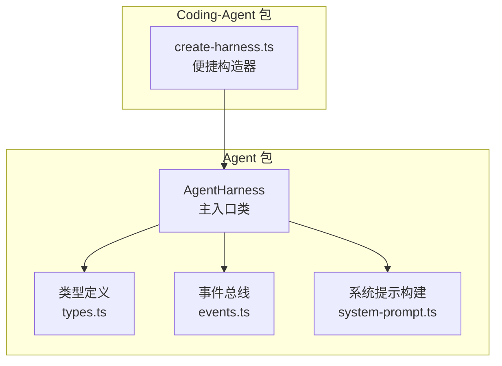
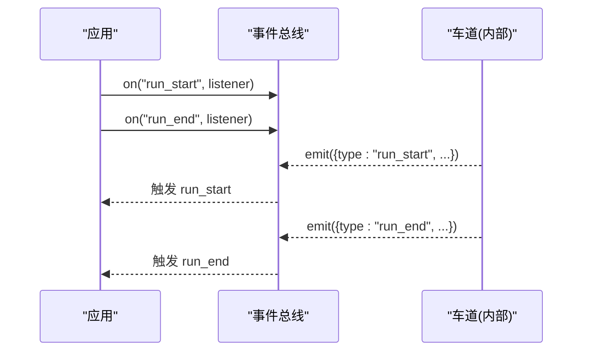
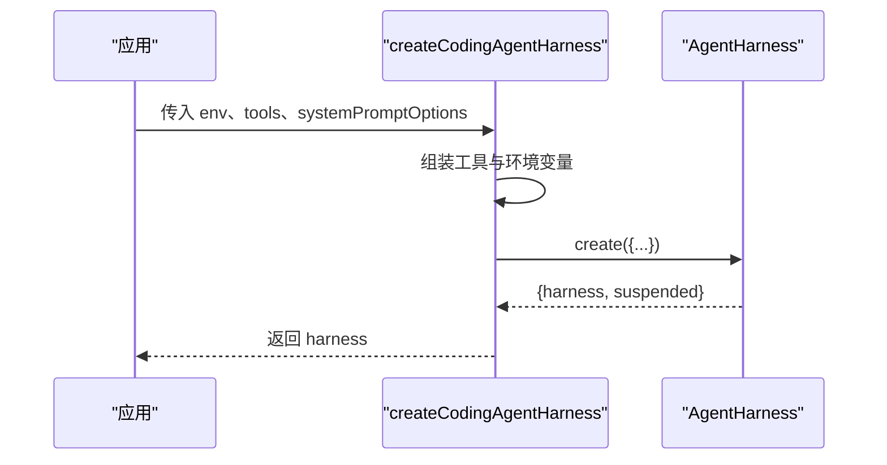
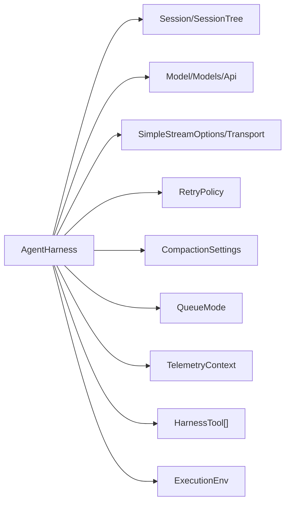

# AgentHarness 核心类

<cite>
**本文引用的文件**
- [agent-harness.ts](file://packages/agent/src/harness/agent-harness.ts)
- [types.ts](file://packages/agent/src/harness/types.ts)
- [events.ts](file://packages/agent/src/harness/events.ts)
- [system-prompt.ts](file://packages/agent/src/harness/system-prompt.ts)
- [create-harness.ts](file://packages/coding-agent/src/server/create-harness.ts)
</cite>

## 目录
1. [简介](#简介)
2. [项目结构](#项目结构)
3. [核心组件](#核心组件)
4. [架构总览](#架构总览)
5. [详细组件分析](#详细组件分析)
6. [依赖关系分析](#依赖关系分析)
7. [性能考量](#性能考量)
8. [故障排除指南](#故障排除指南)
9. [结论](#结论)
10. [附录：API 参考与使用示例](#附录api-参考与使用示例)

## 简介
AgentHarness 是代理运行时的主入口类，负责编排会话、模型调用、工具执行、队列调度、压缩（上下文压缩）与导航等能力。它通过统一的接口暴露“车道”（Lane）概念，支持并行或串行的工具执行、消息入队、运行恢复与中止、以及可观测的快照与事件系统。本文档聚焦于如何创建与配置 AgentHarness 实例，设置传输层、状态管理器、附件处理器等组件，并给出完整的 API 参考、使用示例、最佳实践与故障排除建议。

## 项目结构
围绕 AgentHarness 的核心代码主要位于 agent 包的 harness 目录中，包含运行时类型定义、事件总线、系统提示构建、以及具体的 Harness 实现。coding-agent 包提供了基于 AgentHarness 的便捷构造器，用于装配常用工具与环境变量。



图表来源
- [agent-harness.ts:305-509](file://packages/agent/src/harness/agent-harness.ts#L305-L509)
- [types.ts:1-127](file://packages/agent/src/harness/types.ts#L1-L127)
- [events.ts:1-103](file://packages/agent/src/harness/events.ts#L1-L103)
- [system-prompt.ts:1-35](file://packages/agent/src/harness/system-prompt.ts#L1-L35)
- [create-harness.ts:78-159](file://packages/coding-agent/src/server/create-harness.ts#L78-L159)

章节来源
- [agent-harness.ts:305-509](file://packages/agent/src/harness/agent-harness.ts#L305-L509)
- [types.ts:1-127](file://packages/agent/src/harness/types.ts#L1-L127)
- [events.ts:1-103](file://packages/agent/src/harness/events.ts#L1-L103)
- [system-prompt.ts:1-35](file://packages/agent/src/harness/system-prompt.ts#L1-L35)
- [create-harness.ts:78-159](file://packages/coding-agent/src/server/create-harness.ts#L78-L159)

## 核心组件
- AgentHarness：运行时主入口，封装会话、模型、工具、流式选项、重试策略、压缩设置、队列模式等，并提供 Lane 操作接口。
- 类型与资源：定义 Skill、PromptTemplate、ExecutionEnv、FileSystem、Shell、工具上下文、流选项等。
- 事件系统：提供轻量事件总线，支持 run_start/run_end 等事件监听与 watch 快照。
- 系统提示：将可用技能以 XML 片段注入系统提示，便于模型感知能力。
- 便捷构造：coding-agent 提供 createCodingAgentHarness，自动装配常用工具与环境变量。

章节来源
- [agent-harness.ts:243-345](file://packages/agent/src/harness/agent-harness.ts#L243-L345)
- [types.ts:40-127](file://packages/agent/src/harness/types.ts#L40-L127)
- [events.ts:1-103](file://packages/agent/src/harness/events.ts#L1-L103)
- [system-prompt.ts:1-35](file://packages/agent/src/harness/system-prompt.ts#L1-L35)
- [create-harness.ts:78-159](file://packages/coding-agent/src/server/create-harness.ts#L78-L159)

## 架构总览
AgentHarness 作为中心协调者，持有 Session（持久化会话）、Model（模型提供者）、Tools（工具集合）、StreamOptions（流式请求选项）、RetryPolicy（重试策略）、CompactionSettings（压缩设置）与 QueueMode（队列模式）。它对外暴露 Lane 接口，允许上层应用发起 prompt/skill/navigate/compact/resume/abort 等操作，并通过 watch 与事件系统进行可观测性。

```mermaid
classDiagram
class AgentHarness {
+name : string
+session : SessionTree
+hooks : Hooks
+events : Events
-durableSession : Session
-model : Model
-thinkingLevel : ThinkingLevel
-activeToolNames : string[]
-tools : HarnessTool[]
-resources : Resources
-streamOptions : StreamOptions
-retryPolicy : RetryPolicy
-compactionSettings : CompactionSettings
-steeringMode : QueueMode
-followUpMode : QueueMode
+create(options) Promise~{harness, suspended}~
+getLeafId() Promise~string|null~
+prompt(...) Promise~RunResult~
+skill(...) Promise~RunResult~
+promptFromTemplate(...) Promise~RunResult~
+compact(...) Promise~CompactionResult~
+navigateTree(...) Promise~NavigationResult~
+resume() Promise~ResumeResult~
+abort() Promise~AbortResult~
+steer(...) Promise~QueueResult~
+followUp(...) Promise~QueueResult~
+nextRun(...) Promise~QueueResult~
+cancelQueued(...) Promise~CancelQueuedResult~
+recordUsage(...) Promise~RecordUsageResult~
+waitForIdle() Promise~void~
+runWhenIdle(callback) Promise~void~
+peekAction() Promise~ActionInfo|undefined~
+executeAction() Promise~ActionInfo|undefined~
+runToCompletion() Promise~void~
+getModel() Promise~Model~
+setModel(model) Promise~void~
+getThinkingLevel() Promise~ThinkingLevel~
+setThinkingLevel(level) Promise~void~
+getActiveTools() Promise~string[]~
+setActiveTools(names) Promise~void~
+watch() Promise~WatchHandle~
+getTools() Promise~HarnessTool[]~
+setTools(tools, activeNames?) Promise~void~
+getResources() Promise~Resources~
+setResources(resources) Promise~void~
+getStreamOptions() Promise~StreamOptions~
+setStreamOptions(options) Promise~void~
+getRetryPolicy() Promise~RetryPolicy~
+setRetryPolicy(policy) Promise~void~
+getCompactionSettings() Promise~CompactionSettings~
+setCompactionSettings(settings) Promise~void~
+getSteeringMode() Promise~QueueMode~
+setSteeringMode(mode) Promise~void~
+getFollowUpMode() Promise~QueueMode~
+setFollowUpMode(mode) Promise~void~
+watchSession() Promise~WatchHandle~
+close() Promise~void~
}
```

图表来源
- [agent-harness.ts:243-509](file://packages/agent/src/harness/agent-harness.ts#L243-L509)

## 详细组件分析

### 初始化与生命周期管理
- 构造参数：通过 AgentHarnessOptions 传入 session、models、model、thinkingLevel、activeToolNames、tools、toolContext、systemPrompt、resources、streamOptions、retry、compaction、steeringMode、followUpMode、toolExecution、drive、toProviderMessages、entryProjectors、context 等。
- 默认值：thinkingLevel 默认为 off；activeToolNames 可从 tools 推导；streamOptions 合并默认对象；retry 默认关闭；compaction 默认启用并保留最近 token 数与预留 token；队列模式默认 one-at-a-time。
- 生命周期：
  - create：校验会话是否已有记录（若存在则抛出未实现错误），返回 harness 与任何挂起操作列表。
  - close：标记 closed，后续不可用操作将拒绝并抛出相应错误。
  - unavailable：统一拒绝未实现或已关闭的操作，抛出 HarnessNotImplemented 或 HarnessClosed。

章节来源
- [agent-harness.ts:243-345](file://packages/agent/src/harness/agent-harness.ts#L243-L345)
- [agent-harness.ts:347-357](file://packages/agent/src/harness/agent-harness.ts#L347-L357)
- [agent-harness.ts:505-508](file://packages/agent/src/harness/agent-harness.ts#L505-L508)

### 事件系统与可观测性
- 事件类型：run_start、run_end，携带 lane、runId、outcome、leafId 等信息。
- 事件总线：
  - on：按事件类型注册监听器，返回取消订阅函数。
  - emit：同步分发事件到当前监听器与所有 watcher。
  - watch：捕获快照并缓冲事件，start 后按序回放缓冲事件，再转发新事件。
- 用途：可用于监控运行开始/结束、收集指标、调试与审计。



图表来源
- [events.ts:1-103](file://packages/agent/src/harness/events.ts#L1-L103)

章节来源
- [events.ts:1-103](file://packages/agent/src/harness/events.ts#L1-L103)

### 错误处理机制
- 专用错误类型：
  - LaneBusy：车道忙，阻止并发冲突。
  - MissingIdentities：缺少身份标识（工具/模型）。
  - NoActiveRun / NoActiveOperation：无活动运行或操作。
  - NothingToResume / NothingToCompact：无可恢复/压缩项。
  - InvalidMessage / UnknownSkill / UnknownTemplate / UnknownTarget / UnknownQueueItem / LaneExists / InvalidLane：输入或目标无效。
  - Closed / HarnessFault / HarnessClosed / HarnessNotImplemented：生命周期与未实现错误。
- 结果包装：多数操作返回 ResultValue 类型，区分成功与失败，避免异常风暴，便于上层统一处理。
- 拒绝类型：每种操作有明确的 Rejected 联合类型，便于静态检查与分支处理。

章节来源
- [agent-harness.ts:28-132](file://packages/agent/src/harness/agent-harness.ts#L28-L132)

### 工具与资源管理
- 工具：
  - 注册：通过 options.tools 或 setTools 设置工具集，activeToolNames 控制激活的工具名。
  - 执行：工具执行支持顺序或并行（由 toolExecution 控制），并可带上下文 context。
  - 回放：工具可声明 replay 策略（never/safe）。
- 资源：
  - Skills：技能描述与内容，可通过 formatSkillsForSystemPrompt 注入系统提示。
  - PromptTemplates：模板名称与内容，支持显式调用。
- 上下文：
  - toolContext 可为静态对象或异步提供者，每个回合快照时解析。
  - ExecutionEnv 提供 FileSystem 与 Shell 能力，供工具与环境交互。

章节来源
- [agent-harness.ts:313-345](file://packages/agent/src/harness/agent-harness.ts#L313-L345)
- [types.ts:40-127](file://packages/agent/src/harness/types.ts#L40-L127)
- [types.ts:222-316](file://packages/agent/src/harness/types.ts#L222-L316)

### 流式请求与重试
- 流选项：
  - transport：传输层，可指定底层通信方式。
  - timeoutMs：请求超时。
  - maxRetries / maxRetryDelayMs：最大重试次数与延迟上限。
  - headers / metadata：附加请求头与元数据。
  - cacheRetention：缓存保留提示。
- 重试策略：
  - retry.enabled：是否启用重试。
  - retry.maxRetries：最大重试次数。
  - retry.baseDelayMs：基础延迟。
- 钩子：
  - streamOptionsPatch：在 provider 钩子中可对每请求进行 patch，支持 headers/metadata 的增量更新。

章节来源
- [types.ts:101-127](file://packages/agent/src/harness/types.ts#L101-L127)
- [agent-harness.ts:336-338](file://packages/agent/src/harness/agent-harness.ts#L336-L338)

### 会话与快照
- 会话：
  - durableSession：持久化会话，用于获取 leafId 等。
  - session：会话树，用于观察与操作。
- 快照：
  - LaneSnapshot：包含车道、转录、叶子节点、操作、队列、待写入、故障标志。
  - SessionSnapshot：包含所有车道信息与整体故障标志。
  - watch/watchSession：返回 WatchHandle，支持 start/unsubscribe 与快照。

章节来源
- [agent-harness.ts:307-310](file://packages/agent/src/harness/agent-harness.ts#L307-L310)
- [agent-harness.ts:167-180](file://packages/agent/src/harness/agent-harness.ts#L167-L180)
- [agent-harness.ts:440-442](file://packages/agent/src/harness/agent-harness.ts#L440-L442)
- [agent-harness.ts:502-504](file://packages/agent/src/harness/agent-harness.ts#L502-L504)

### 便捷构造与系统集成
- createCodingAgentHarness：
  - 自动装配 read/bash/edit/write 工具。
  - 注入环境变量 PI_SESSION_ID、PI_SESSION_FILE、PI_PROVIDER、PI_MODEL、PI_REASONING_LEVEL。
  - 动态生成系统提示，包含选中工具的 snippet 与 guidelines。
  - 最终调用 AgentHarness.create 完成实例化。



图表来源
- [create-harness.ts:78-159](file://packages/coding-agent/src/server/create-harness.ts#L78-L159)
- [agent-harness.ts:347-353](file://packages/agent/src/harness/agent-harness.ts#L347-L353)

章节来源
- [create-harness.ts:78-159](file://packages/coding-agent/src/server/create-harness.ts#L78-L159)
- [agent-harness.ts:347-353](file://packages/agent/src/harness/agent-harness.ts#L347-L353)

## 依赖关系分析
- AgentHarness 依赖：
  - Session/SessionTree：会话与树结构。
  - Model/Models/Api：模型与 API 抽象。
  - SimpleStreamOptions/Transport：流式请求与传输。
  - RetryPolicy：重试策略。
  - CompactionSettings：压缩设置。
  - QueueMode：队列模式。
  - TelemetryContext：遥测上下文。
- 外部集成点：
  - 工具执行：通过 HarnessTool 接口，支持自定义 execute。
  - 文件系统与 Shell：通过 ExecutionEnv 抽象，解耦具体实现。
  - 事件系统：通过 Events/HookName 扩展行为。



图表来源
- [agent-harness.ts:243-345](file://packages/agent/src/harness/agent-harness.ts#L243-L345)
- [types.ts:101-127](file://packages/agent/src/harness/types.ts#L101-L127)
- [types.ts:222-316](file://packages/agent/src/harness/types.ts#L222-L316)

章节来源
- [agent-harness.ts:243-345](file://packages/agent/src/harness/agent-harness.ts#L243-L345)
- [types.ts:101-127](file://packages/agent/src/harness/types.ts#L101-L127)
- [types.ts:222-316](file://packages/agent/src/harness/types.ts#L222-L316)

## 性能考量
- 工具执行模式：
  - sequential：顺序执行，保证严格串行，适合有副作用或依赖顺序的场景。
  - parallel：并行执行，提升吞吐，但需确保工具幂等或具备并发安全。
- 队列模式：
  - steering/followUp/nextRun：one-at-a-time 限制并发，避免过载；也可根据业务选择其他模式（如适用）。
- 压缩设置：
  - reserveTokens/keepRecentTokens：合理预留与保留 token，平衡上下文长度与成本。
- 重试策略：
  - 启用重试时需考虑指数退避与最大延迟，避免雪崩。
- 流式请求：
  - 设置合理的 timeoutMs 与 maxRetries，结合传输层优化网络开销。

[本节为通用指导，不直接分析具体文件]

## 故障排除指南
- 常见错误与处理：
  - LaneBusy：检查是否存在并发冲突，调整工具执行模式或队列模式。
  - MissingIdentities：确保工具与模型均已正确注册与提供。
  - NoActiveRun/NoActiveOperation：确认当前存在活动运行或操作后再调用相关方法。
  - NothingToResume/NothingToCompact：检查会话是否有可恢复或可压缩的内容。
  - InvalidMessage/UnknownSkill/UnknownTemplate/UnknownTarget/UnknownQueueItem：校验输入参数与目标 ID。
  - Closed/HarnessNotImplemented：确认 Harness 未关闭且对应操作已实现。
- 诊断手段：
  - 使用 watch/watchSession 获取 LaneSnapshot/SessionSnapshot，定位问题阶段。
  - 订阅事件总线，追踪 run_start/run_end，辅助定位异常路径。
  - 检查工具执行日志与返回值，确认 execute 是否抛出或返回错误。

章节来源
- [agent-harness.ts:28-132](file://packages/agent/src/harness/agent-harness.ts#L28-L132)
- [events.ts:1-103](file://packages/agent/src/harness/events.ts#L1-L103)

## 结论
AgentHarness 提供了强大的代理运行时能力，涵盖会话管理、模型调用、工具执行、队列调度、压缩与导航等。通过清晰的类型与错误体系、事件与快照的可观测性、以及灵活的配置项，开发者可以高效构建稳定可靠的代理应用。建议在生产环境中合理配置工具执行模式、队列模式、重试策略与压缩设置，并结合事件与快照进行监控与排障。

[本节为总结，不直接分析具体文件]

## 附录：API 参考与使用示例

### 创建与配置实例
- 基本步骤：
  - 准备 Session、Model、Tools、Resources、StreamOptions、RetryPolicy、CompactionSettings。
  - 调用 AgentHarness.create 获取 harness 与 suspended 列表。
  - 可选：通过 get/set 系列方法动态调整模型、思考级别、工具集、流选项、重试策略、压缩设置与队列模式。
- 便捷构造：
  - 使用 createCodingAgentHarness 自动装配常用工具与环境变量，简化集成。

章节来源
- [agent-harness.ts:347-353](file://packages/agent/src/harness/agent-harness.ts#L347-L353)
- [create-harness.ts:78-159](file://packages/coding-agent/src/server/create-harness.ts#L78-L159)

### 核心 API 速查
- 运行与控制：
  - prompt/skill/promptFromTemplate：发起运行。
  - resume/abort：恢复或中止运行。
  - waitForIdle/runWhenIdle/runToCompletion：等待空闲或运行至完成。
- 队列与导航：
  - steer/followUp/nextRun：入队引导、跟进与下次运行。
  - cancelQueued：取消队列项。
  - navigateTree：导航会话树。
- 压缩与用量：
  - compact：压缩上下文。
  - recordUsage：记录用量。
- 观察与调试：
  - watch/watchSession：获取快照与事件。
  - peekAction/executeAction：查看与执行动作。
- 配置与资源：
  - getModel/setModel、getThinkingLevel/setThinkingLevel。
  - getActiveTools/setActiveTools、getTools/setTools。
  - getResources/setResources。
  - getStreamOptions/setStreamOptions、getRetryPolicy/setRetryPolicy。
  - getCompactionSettings/setCompactionSettings。
  - getSteeringMode/setSteeringMode、getFollowUpMode/setFollowUpMode。
  - close：关闭 Harness。

章节来源
- [agent-harness.ts:271-509](file://packages/agent/src/harness/agent-harness.ts#L271-L509)

### 使用示例（路径引用）
- 基础创建与工具装配：
  - [create-harness.ts:78-159](file://packages/coding-agent/src/server/create-harness.ts#L78-L159)
- 事件监听与快照：
  - [events.ts:1-103](file://packages/agent/src/harness/events.ts#L1-L103)
- 系统提示与技能注入：
  - [system-prompt.ts:1-35](file://packages/agent/src/harness/system-prompt.ts#L1-L35)

[本节为示例指引，不直接展示代码内容]