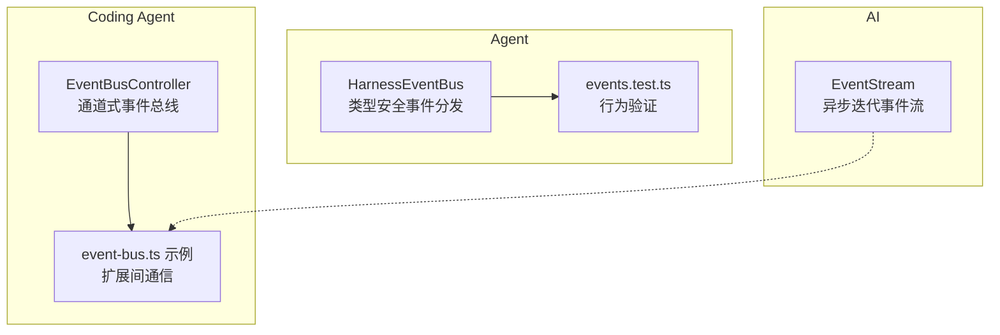
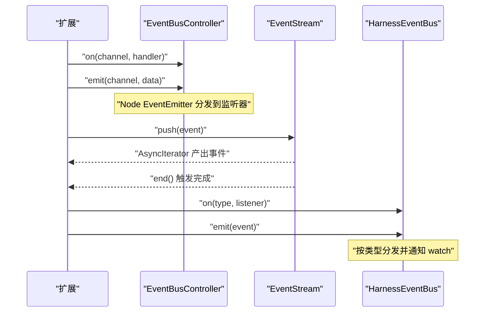
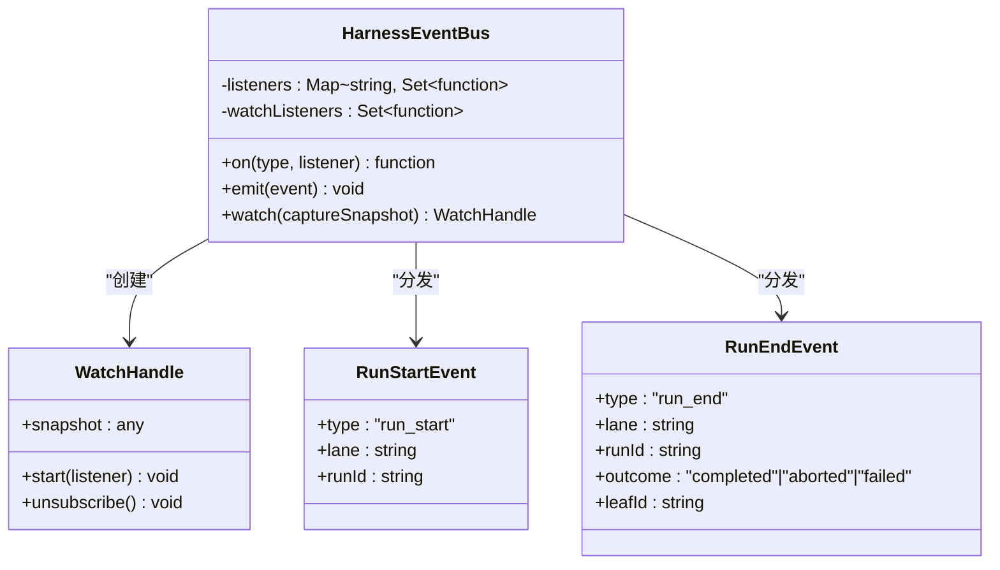
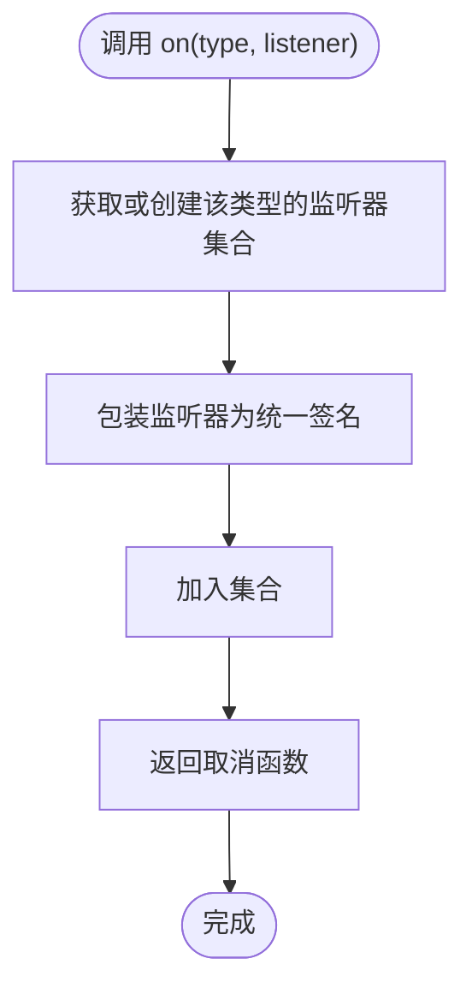
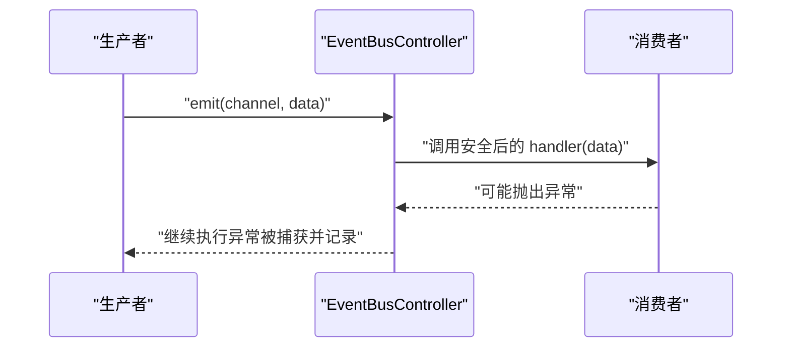
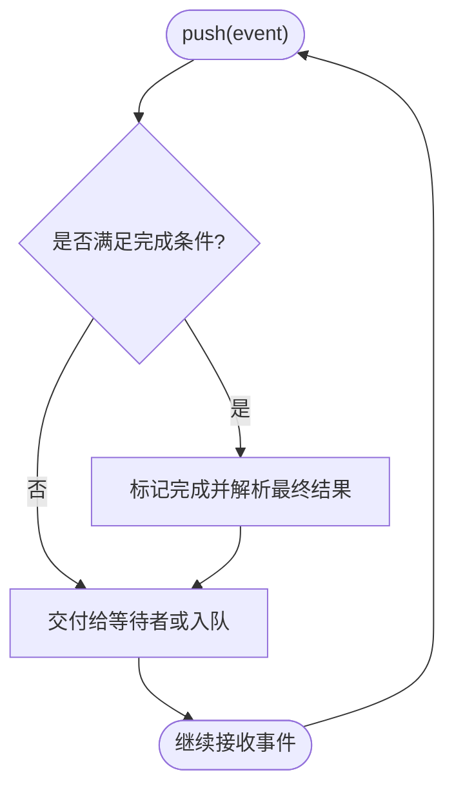
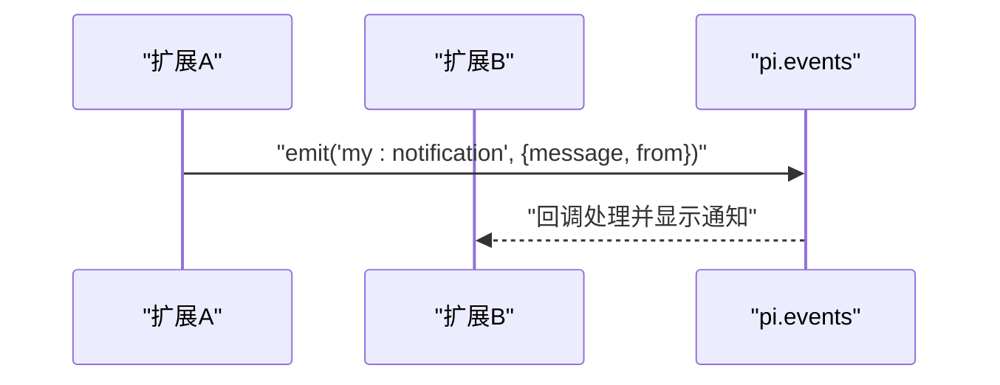
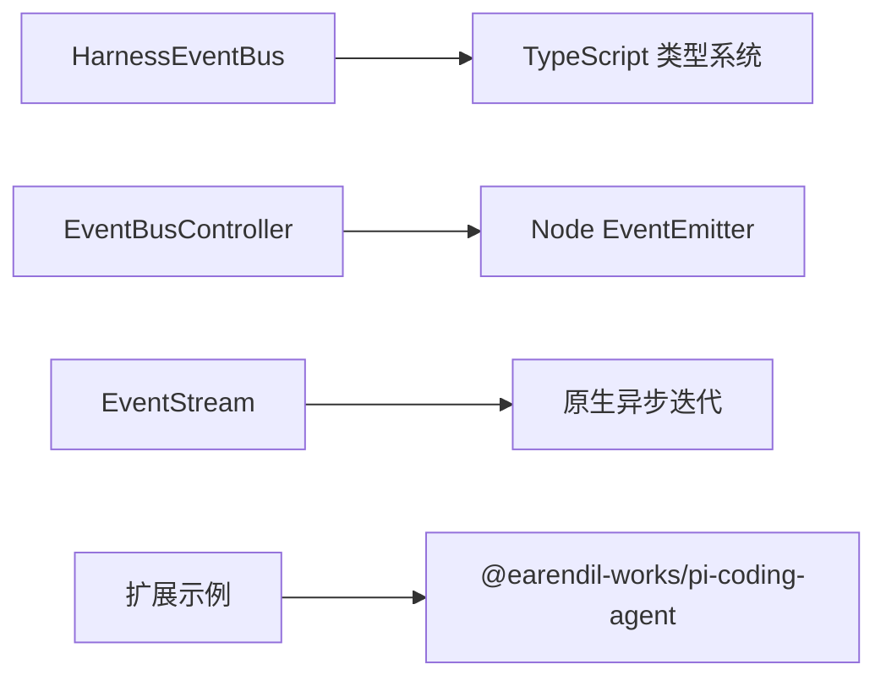

# 事件系统

<cite>
**本文引用的文件**
- [packages/agent/src/harness/events.ts](file://packages/agent/src/harness/events.ts)
- [packages/agent/test/harness/events.test.ts](file://packages/agent/test/harness/events.test.ts)
- [packages/coding-agent/src/core/event-bus.ts](file://packages/coding-agent/src/core/event-bus.ts)
- [packages/ai/src/utils/event-stream.ts](file://packages/ai/src/utils/event-stream.ts)
- [packages/coding-agent/examples/extensions/event-bus.ts](file://packages/coding-agent/examples/extensions/event-bus.ts)
</cite>

## 目录
1. [简介](#简介)
2. [项目结构](#项目结构)
3. [核心组件](#核心组件)
4. [架构总览](#架构总览)
5. [详细组件分析](#详细组件分析)
6. [依赖关系分析](#依赖关系分析)
7. [性能考量](#性能考量)
8. [故障排查指南](#故障排查指南)
9. [结论](#结论)
10. [附录](#附录)

## 简介
本仓库实现了多种事件与流式处理能力，覆盖发布订阅、事件总线、异步迭代等模式。围绕以下目标展开：
- 事件发布订阅模式：提供类型安全的监听器注册、事件分发与取消订阅。
- 事件类型定义：通过联合类型与字面量类型约束事件形态，确保编译期安全。
- 监听器管理：支持按类型监听、全局观察（watch）、快照捕获与缓冲回放。
- 异步处理：对监听器进行异步封装与错误隔离；提供异步迭代的事件流。
- 扩展点：在扩展中通过 pi.events 进行跨扩展通信。

## 项目结构
事件相关能力分布在多个包中，职责清晰：
- 测试夹具事件总线：用于运行时的轻量级事件分发与观察。
- 编码代理事件总线：基于 Node EventEmitter 的通用通道式事件总线。
- AI 模块事件流：通用的异步迭代事件流，支持完成条件与结果提取。
- 扩展示例：演示如何在扩展中使用事件总线进行跨扩展通信。

图表来源
- [packages/agent/src/harness/events.ts:1-103](file://packages/agent/src/harness/events.ts#L1-L103)
- [packages/agent/test/harness/events.test.ts:1-66](file://packages/agent/test/harness/events.test.ts#L1-L66)
- [packages/coding-agent/src/core/event-bus.ts:1-34](file://packages/coding-agent/src/core/event-bus.ts#L1-L34)
- [packages/ai/src/utils/event-stream.ts:1-89](file://packages/ai/src/utils/event-stream.ts#L1-L89)
- [packages/coding-agent/examples/extensions/event-bus.ts:1-44](file://packages/coding-agent/examples/extensions/event-bus.ts#L1-L44)

章节来源
- [packages/agent/src/harness/events.ts:1-103](file://packages/agent/src/harness/events.ts#L1-L103)
- [packages/coding-agent/src/core/event-bus.ts:1-34](file://packages/coding-agent/src/core/event-bus.ts#L1-L34)
- [packages/ai/src/utils/event-stream.ts:1-89](file://packages/ai/src/utils/event-stream.ts#L1-L89)
- [packages/coding-agent/examples/extensions/event-bus.ts:1-44](file://packages/coding-agent/examples/extensions/event-bus.ts#L1-L44)

## 核心组件
- HarnessEventBus：类型安全的发布订阅实现，支持 on、emit、watch（带快照与缓冲）。
- EventBusController：基于 Node EventEmitter 的通道式事件总线，提供 emit/on/clear。
- EventStream：通用异步迭代事件流，支持 push/end、完成判定与最终结果提取。
- 扩展事件总线示例：展示在扩展中通过 pi.events 进行事件收发。

章节来源
- [packages/agent/src/harness/events.ts:1-103](file://packages/agent/src/harness/events.ts#L1-L103)
- [packages/coding-agent/src/core/event-bus.ts:1-34](file://packages/coding-agent/src/core/event-bus.ts#L1-L34)
- [packages/ai/src/utils/event-stream.ts:1-89](file://packages/ai/src/utils/event-stream.ts#L1-L89)
- [packages/coding-agent/examples/extensions/event-bus.ts:1-44](file://packages/coding-agent/examples/extensions/event-bus.ts#L1-L44)

## 架构总览
下图展示了三类事件能力的交互关系：类型安全事件总线、通道式事件总线与异步事件流，以及它们在扩展中的使用方式。

图表来源
- [packages/coding-agent/src/core/event-bus.ts:1-34](file://packages/coding-agent/src/core/event-bus.ts#L1-L34)
- [packages/ai/src/utils/event-stream.ts:1-89](file://packages/ai/src/utils/event-stream.ts#L1-L89)
- [packages/agent/src/harness/events.ts:1-103](file://packages/agent/src/harness/events.ts#L1-L103)

## 详细组件分析

### 组件一：HarnessEventBus（类型安全事件总线）
- 事件类型：RunStartEvent、RunEndEvent，通过联合类型与字面量类型保证类型安全。
- 监听器管理：
  - on(type, listener)：按事件类型注册监听器，返回取消函数；内部维护 Map<type, Set<listener>>。
  - emit(event)：同步分发到对应类型的监听器与所有 watch 观察者。
  - watch(captureSnapshot)：创建观察句柄，支持先缓存后 start 回放，避免事件丢失。
- 设计要点：
  - 监听器包装为统一签名，便于统一管理。
  - watch 在 start 前缓冲事件，start 时一次性回放，保持顺序一致性。
  - 空监听器集合自动清理，降低内存占用。

图表来源
- [packages/agent/src/harness/events.ts:1-103](file://packages/agent/src/harness/events.ts#L1-L103)

图表来源
- [packages/agent/src/harness/events.ts:45-63](file://packages/agent/src/harness/events.ts#L45-L63)

章节来源
- [packages/agent/src/harness/events.ts:1-103](file://packages/agent/src/harness/events.ts#L1-L103)
- [packages/agent/test/harness/events.test.ts:1-66](file://packages/agent/test/harness/events.test.ts#L1-L66)

### 组件二：EventBusController（通道式事件总线）
- 通道模型：以字符串 channel 作为事件名，数据为任意对象。
- 功能：
  - emit(channel, data)：发送事件。
  - on(channel, handler)：注册监听器，返回取消函数；内部将 handler 包裹为异步安全处理器，捕获异常并记录日志。
  - clear()：移除所有监听器，释放资源。
- 适用场景：扩展之间、模块之间的松耦合通信。

图表来源
- [packages/coding-agent/src/core/event-bus.ts:1-34](file://packages/coding-agent/src/core/event-bus.ts#L1-L34)

章节来源
- [packages/coding-agent/src/core/event-bus.ts:1-34](file://packages/coding-agent/src/core/event-bus.ts#L1-L34)

### 组件三：EventStream（异步迭代事件流）
- 核心能力：
  - push(event)：推入事件，若满足完成条件则标记完成并解析最终结果。
  - end(result?)：结束流，通知所有等待的消费者。
  - AsyncIterable：支持 for-await-of 消费事件序列。
  - result()：获取最终结果的 Promise。
- 典型用法：处理长连接或流式响应，逐步消费事件并在结束时得到聚合结果。

图表来源
- [packages/ai/src/utils/event-stream.ts:21-36](file://packages/ai/src/utils/event-stream.ts#L21-L36)

章节来源
- [packages/ai/src/utils/event-stream.ts:1-89](file://packages/ai/src/utils/event-stream.ts#L1-L89)

### 组件四：扩展事件总线示例（pi.events）
- 示例说明：
  - 监听 session_start 事件，保存上下文。
  - 订阅 my:notification 事件，收到消息后通过 UI 通知。
  - 通过命令 /emit 主动发出事件，供其他扩展监听。
- 价值：演示跨扩展的事件驱动通信模式，解耦业务逻辑与 UI 展示。

图表来源
- [packages/coding-agent/examples/extensions/event-bus.ts:1-44](file://packages/coding-agent/examples/extensions/event-bus.ts#L1-L44)

章节来源
- [packages/coding-agent/examples/extensions/event-bus.ts:1-44](file://packages/coding-agent/examples/extensions/event-bus.ts#L1-L44)

## 依赖关系分析
- HarnessEventBus 依赖 TypeScript 联合类型与字面量类型，确保事件类型安全。
- EventBusController 依赖 Node.js 的 EventEmitter，提供通道式事件分发。
- EventStream 不依赖外部库，纯异步迭代实现。
- 扩展示例依赖 @earendil-works/pi-coding-agent 提供的 ExtensionAPI，用于事件总线访问。

图表来源
- [packages/agent/src/harness/events.ts:1-103](file://packages/agent/src/harness/events.ts#L1-L103)
- [packages/coding-agent/src/core/event-bus.ts:1-34](file://packages/coding-agent/src/core/event-bus.ts#L1-L34)
- [packages/ai/src/utils/event-stream.ts:1-89](file://packages/ai/src/utils/event-stream.ts#L1-L89)
- [packages/coding-agent/examples/extensions/event-bus.ts:1-44](file://packages/coding-agent/examples/extensions/event-bus.ts#L1-L44)

章节来源
- [packages/agent/src/harness/events.ts:1-103](file://packages/agent/src/harness/events.ts#L1-L103)
- [packages/coding-agent/src/core/event-bus.ts:1-34](file://packages/coding-agent/src/core/event-bus.ts#L1-L34)
- [packages/ai/src/utils/event-stream.ts:1-89](file://packages/ai/src/utils/event-stream.ts#L1-L89)
- [packages/coding-agent/examples/extensions/event-bus.ts:1-44](file://packages/coding-agent/examples/extensions/event-bus.ts#L1-L44)

## 性能考量
- 监听器集合管理：
  - 当某类型监听器数量为 0 时删除键，减少 Map 膨胀。
- 事件分发：
  - emit 为同步分发，避免阻塞链路；watch 在 start 前缓冲事件，start 时批量回放，减少多次渲染或处理开销。
- 异步处理：
  - EventBusController 将监听器包装为异步安全处理器，避免未捕获异常影响主流程。
  - EventStream 使用队列与等待者列表，按需唤醒消费者，避免忙轮询。
- 内存泄漏防护：
  - 始终保留取消函数并及时调用，或在组件销毁时清理。
  - 使用 watch.unsubscribe 停止观察，清空缓冲数组。
  - 使用 EventBusController.clear 在生命周期结束时移除所有监听器。

[本节为通用指导，无需特定文件引用]

## 故障排查指南
- 事件未到达监听器：
  - 检查是否正确调用 on 并持有取消函数；确认 emit 的事件类型与监听类型一致。
  - 对于 watch，确认已调用 start 才会开始接收实时事件；在此之前的事件会被缓冲并在 start 时回放。
- 监听器异常导致后续事件中断：
  - EventBusController 已将监听器包装为异步安全处理器，异常会被捕获并记录；如需进一步处理，可在监听器内部 try/catch。
- 内存占用增长：
  - 检查是否存在未调用的取消函数或未 unsubscribe 的 watch。
  - 确认在适当时机调用 EventBusController.clear。
- 事件顺序问题：
  - watch 在 start 前缓冲事件，start 时按顺序回放；确保在 start 之前不要期望收到实时事件。

章节来源
- [packages/agent/src/harness/events.ts:45-103](file://packages/agent/src/harness/events.ts#L45-L103)
- [packages/coding-agent/src/core/event-bus.ts:12-34](file://packages/coding-agent/src/core/event-bus.ts#L12-L34)
- [packages/ai/src/utils/event-stream.ts:21-67](file://packages/ai/src/utils/event-stream.ts#L21-L67)

## 结论
本仓库提供了多层次的事件与流式处理能力：
- 类型安全的事件总线适合需要强类型保障的场景。
- 通道式事件总线适合模块或扩展间的松耦合通信。
- 异步事件流适合处理长连接与流式数据。
结合取消订阅、缓冲回放与异步安全处理，可以在保证性能的同时有效防止内存泄漏与错误传播。

[本节为总结性内容，无需特定文件引用]

## 附录
- 常用事件类型：
  - run_start、run_end（运行生命周期事件）。
  - 自定义事件可通过联合类型扩展，保持类型安全。
- 自定义事件开发建议：
  - 定义事件接口与字面量 type 字段。
  - 在事件总线中注册监听器，并确保在合适时机取消订阅。
- 错误传播最佳实践：
  - 使用异步安全监听器包装，捕获并记录异常。
  - 在关键路径上增加重试或降级策略。
- 性能监控建议：
  - 统计事件频率与延迟，识别热点通道。
  - 对高频事件采用批处理或节流策略。

[本节为通用指导，无需特定文件引用]