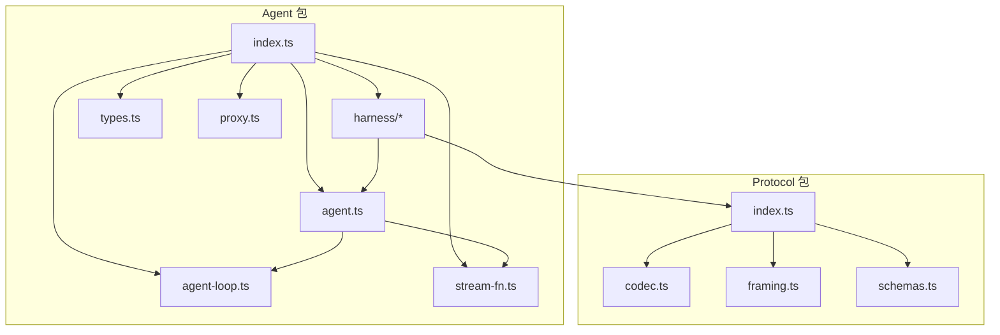
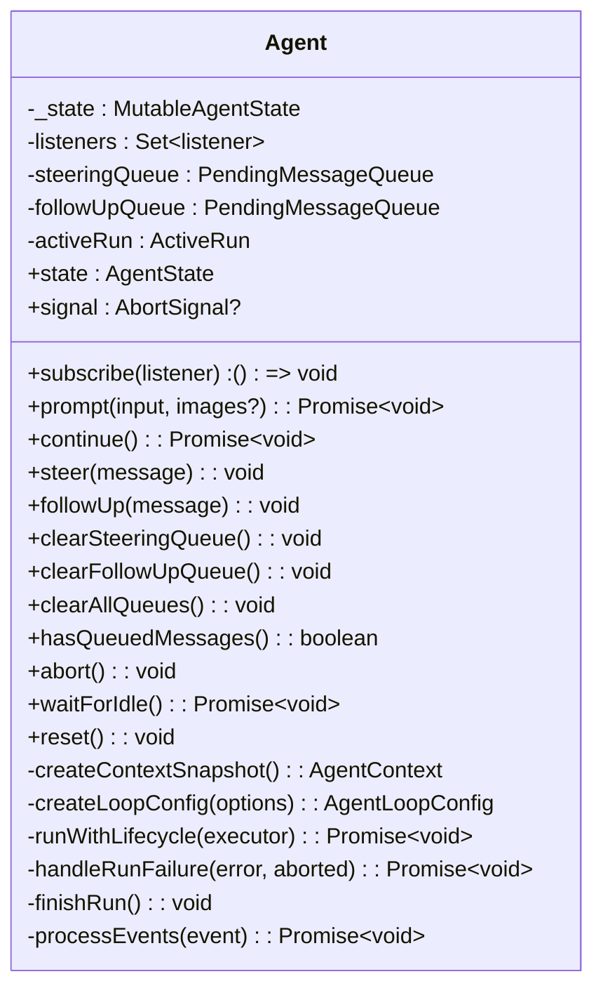
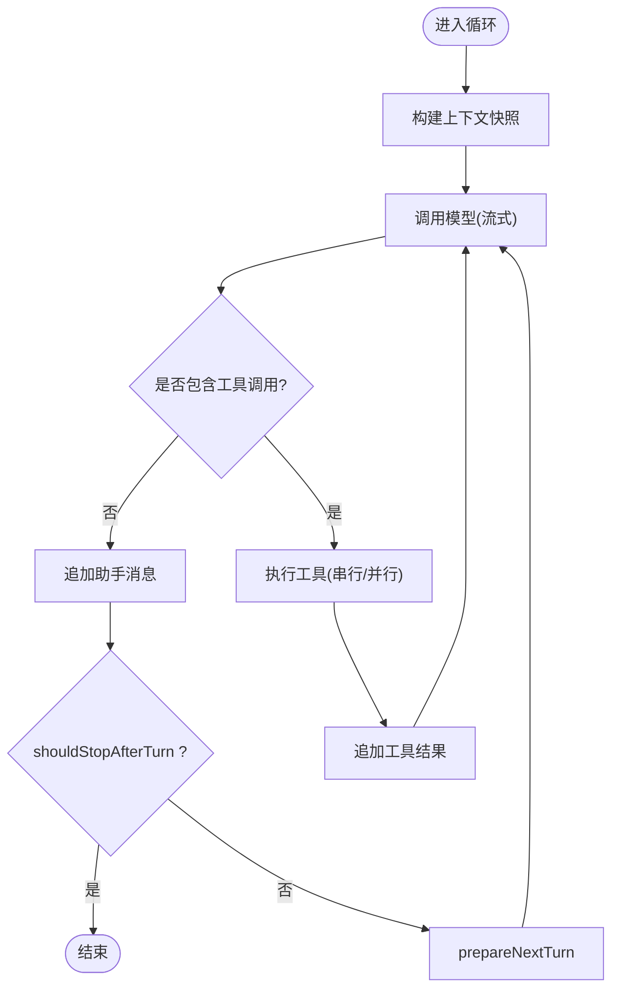
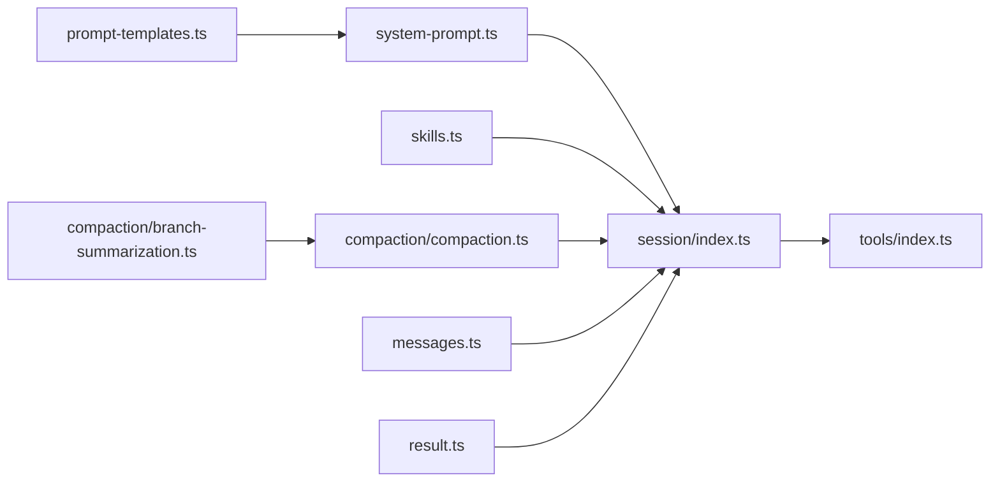
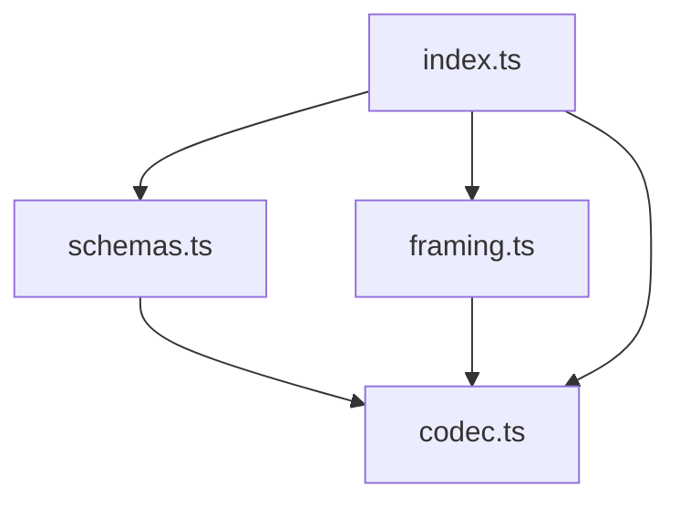
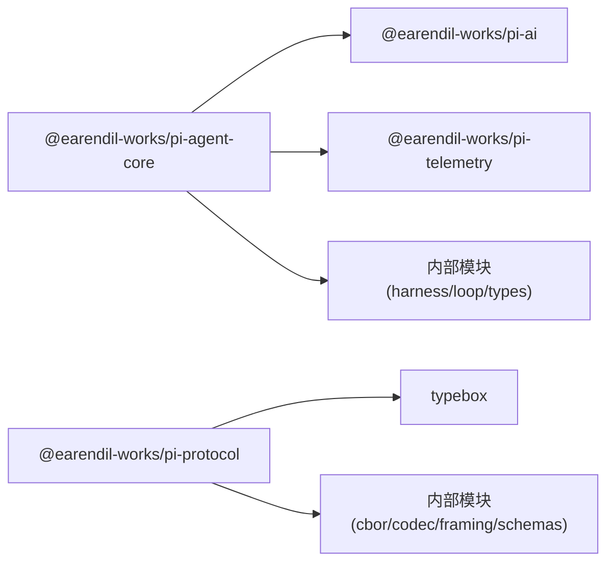

# 代理核心包 (pi-agent-core)

<cite>
**本文引用的文件**
- [packages/agent/package.json](file://packages/agent/package.json)
- [packages/protocol/package.json](file://packages/protocol/package.json)
- [packages/agent/src/index.ts](file://packages/agent/src/index.ts)
- [packages/agent/src/agent.ts](file://packages/agent/src/agent.ts)
- [packages/agent/src/types.ts](file://packages/agent/src/types.ts)
- [packages/agent/src/agent-loop.ts](file://packages/agent/src/agent-loop.ts)
- [packages/agent/src/stream-fn.ts](file://packages/agent/src/stream-fn.ts)
- [packages/agent/src/harness/agent-harness.ts](file://packages/agent/src/harness/agent-harness.ts)
- [packages/agent/src/harness/session/index.ts](file://packages/agent/src/harness/session/index.ts)
- [packages/agent/src/harness/tools/index.ts](file://packages/agent/src/harness/tools/index.ts)
- [packages/agent/src/harness/messages.ts](file://packages/agent/src/harness/messages.ts)
- [packages/agent/src/harness/result.ts](file://packages/agent/src/harness/result.ts)
- [packages/agent/src/harness/system-prompt.ts](file://packages/agent/src/harness/system-prompt.ts)
- [packages/agent/src/harness/skills.ts](file://packages/agent/src/harness/skills.ts)
- [packages/agent/src/harness/prompt-templates.ts](file://packages/agent/src/harness/prompt-templates.ts)
- [packages/agent/src/harness/compaction/compaction.ts](file://packages/agent/src/harness/compaction/compaction.ts)
- [packages/agent/src/harness/compaction/branch-summarization.ts](file://packages/agent/src/harness/compaction/branch-summarization.ts)
- [packages/agent/src/harness/telemetry.ts](file://packages/agent/src/harness/telemetry.ts)
- [packages/agent/src/proxy.ts](file://packages/agent/src/proxy.ts)
- [packages/protocol/src/index.ts](file://packages/protocol/src/index.ts)
- [packages/protocol/src/codec.ts](file://packages/protocol/src/codec.ts)
- [packages/protocol/src/framing.ts](file://packages/protocol/src/framing.ts)
- [packages/protocol/src/schemas.ts](file://packages/protocol/src/schemas.ts)
</cite>

## 目录
1. [简介](#简介)
2. [项目结构](#项目结构)
3. [核心组件](#核心组件)
4. [架构总览](#架构总览)
5. [详细组件分析](#详细组件分析)
6. [依赖关系分析](#依赖关系分析)
7. [性能考量](#性能考量)
8. [故障排除指南](#故障排除指南)
9. [结论](#结论)
10. [附录：API 参考与使用示例](#附录api-参考与使用示例)

## 简介
本包提供通用 AI Agent 运行时，包含状态管理、工具调用框架、传输抽象、附件支持、会话与压缩能力。对外暴露统一的 Agent 与 Harness 接口，便于在 Node.js 或浏览器环境中构建可插拔、可扩展的代理应用。

## 项目结构
- agent 包（@earendil-works/pi-agent-core）
  - 入口导出统一 API，聚合 Agent、循环、Harness、消息、工具、系统提示、技能、遥测等模块
  - 核心类 Agent 负责生命周期、事件、队列、错误处理与流式输出
  - 协议层通过 pi-protocol 提供传输无关的 CBOR 编解码与帧封装
- protocol 包（@earendil-works/pi-protocol）
  - 定义传输无关的消息格式、编解码器与帧边界，供上层会话与远程通信复用



图表来源
- [packages/agent/src/index.ts:1-146](file://packages/agent/src/index.ts#L1-L146)
- [packages/agent/src/agent.ts:1-593](file://packages/agent/src/agent.ts#L1-L593)
- [packages/protocol/src/index.ts:1-5](file://packages/protocol/src/index.ts#L1-L5)

章节来源
- [packages/agent/package.json:1-69](file://packages/agent/package.json#L1-L69)
- [packages/protocol/package.json:1-49](file://packages/protocol/package.json#L1-L49)

## 核心组件
- Agent：状态机与运行期控制，维护消息历史、工具集、流式消息、待执行工具调用集合；提供 prompt/continue/steer/followUp/abort/waitForIdle/reset 等生命周期方法；内置事件订阅与错误归一化。
- AgentLoop：低层循环，驱动模型交互、工具调用、消息追加与轮次结束。
- Harness：高层编排器，封装会话、工具注册、系统提示、技能、压缩、结果与遥测，提供面向应用的启动与停止流程。
- Protocol：传输无关的 CBOR 编解码与帧封装，用于远程会话与跨进程通信。

章节来源
- [packages/agent/src/agent.ts:167-593](file://packages/agent/src/agent.ts#L167-L593)
- [packages/agent/src/agent-loop.ts:1-200](file://packages/agent/src/agent-loop.ts#L1-L200)
- [packages/agent/src/harness/agent-harness.ts:1-200](file://packages/agent/src/harness/agent-harness.ts#L1-L200)
- [packages/protocol/src/index.ts:1-5](file://packages/protocol/src/index.ts#L1-L5)

## 架构总览
Agent 作为状态容器，协调消息历史与工具执行；Harness 将 Agent 与外部资源（文件系统、Shell、技能、压缩、遥测）组合成完整运行时；Protocol 提供底层消息序列化与帧边界，屏蔽传输细节。

```mermaid
sequenceDiagram
participant App as "应用"
participant Harness as "AgentHarness"
participant Agent as "Agent"
participant Loop as "AgentLoop"
participant Model as "AI 模型"
participant Tools as "工具集"
participant Proto as "Protocol(CBOR)"
App->>Harness : "创建并配置"
Harness->>Agent : "注入工具/系统提示/会话"
App->>Harness : "prompt()/run()"
Harness->>Agent : "prompt(messages)"
Agent->>Loop : "runAgentLoop(...)"
Loop->>Model : "发送上下文(经 convertToLlm)"
Model-->>Loop : "流式片段/工具调用"
Loop->>Tools : "调用工具(串行/并行)"
Tools-->>Loop : "结果"
Loop->>Proto : "可选 : 序列化为协议帧"
Loop-->>Agent : "消息/工具结果/轮次结束"
Agent-->>Harness : "事件(消息开始/更新/结束/轮次/代理结束)"
Harness-->>App : "结果/遥测/错误"
```

图表来源
- [packages/agent/src/agent.ts:409-484](file://packages/agent/src/agent.ts#L409-L484)
- [packages/agent/src/agent-loop.ts:1-200](file://packages/agent/src/agent-loop.ts#L1-L200)
- [packages/protocol/src/codec.ts:1-200](file://packages/protocol/src/codec.ts#L1-L200)
- [packages/protocol/src/framing.ts:1-200](file://packages/protocol/src/framing.ts#L1-L200)

## 详细组件分析

### Agent 类：状态管理与生命周期
- 状态字段
  - messages：对话历史
  - tools：已注册工具列表
  - systemPrompt：系统提示
  - model：当前模型配置
  - isStreaming/streamingMessage：流式输出状态
  - pendingToolCalls：待完成工具调用集合
  - errorMessage：最近一次错误信息
- 生命周期
  - prompt：标准化输入为消息数组，进入 runWithLifecycle -> runAgentLoop
  - continue：从最后一条用户/工具结果继续，自动处理 steering/follow-up 队列
  - steer/followUp：注入后续消息，支持“一次性”或“全部”模式
  - abort/waitForIdle/reset：中断、等待空闲、重置状态
- 事件系统
  - subscribe(listener)：按序 await 监听器，传入 AbortSignal
  - processEvents：内部状态归约 + 广播事件（message_start/update/end、tool_execution_start/end、turn_end、agent_end）
- 错误处理
  - handleRunFailure：将异常转为 assistant 消息并触发 message_end/turn_end/agent_end
  - finishRun：清理流式状态与活跃运行句柄



图表来源
- [packages/agent/src/agent.ts:61-95](file://packages/agent/src/agent.ts#L61-L95)
- [packages/agent/src/agent.ts:125-159](file://packages/agent/src/agent.ts#L125-L159)
- [packages/agent/src/agent.ts:167-593](file://packages/agent/src/agent.ts#L167-L593)

章节来源
- [packages/agent/src/agent.ts:97-123](file://packages/agent/src/agent.ts#L97-L123)
- [packages/agent/src/agent.ts:240-345](file://packages/agent/src/agent.ts#L240-L345)
- [packages/agent/src/agent.ts:347-484](file://packages/agent/src/agent.ts#L347-L484)
- [packages/agent/src/agent.ts:486-593](file://packages/agent/src/agent.ts#L486-L593)

### AgentLoop：循环与工具调用
- 职责
  - 接收上下文快照与配置，驱动模型流式响应
  - 解析工具调用，调度工具执行（支持串行/并行）
  - 将工具结果回写至消息历史，推进轮次直至停止条件满足
- 扩展点
  - beforeToolCall/afterToolCall：钩子拦截与审计
  - shouldStopAfterTurn：自定义停止策略
  - prepareNextTurn/prepareNextTurnWithContext：动态准备下一轮上下文
  - convertToLlm/transformContext：消息到 LLM 格式的转换与上下文变换
  - getApiKey/transport/thinkingBudgets/maxRetryDelayMs：提供者集成参数



图表来源
- [packages/agent/src/agent-loop.ts:1-200](file://packages/agent/src/agent-loop.ts#L1-L200)
- [packages/agent/src/agent.ts:445-484](file://packages/agent/src/agent.ts#L445-L484)

章节来源
- [packages/agent/src/agent-loop.ts:1-200](file://packages/agent/src/agent-loop.ts#L1-L200)
- [packages/agent/src/agent.ts:445-484](file://packages/agent/src/agent.ts#L445-L484)

### Harness：会话、工具、系统与压缩
- 会话管理
  - session/index：会话初始化、持久化、搜索与恢复
- 工具注册与调用
  - tools/index：工具注册表、上下文注入、执行模式
- 系统提示与模板
  - system-prompt/prompt-templates：系统提示组装与模板渲染
- 技能与附件
  - skills：技能发现与加载
  - messages/result：消息与结果类型、格式化
- 压缩与摘要
  - compaction/compaction：上下文压缩、令牌估算、切分点查找
  - compaction/branch-summarization：分支摘要生成与条目收集



图表来源
- [packages/agent/src/harness/session/index.ts:1-200](file://packages/agent/src/harness/session/index.ts#L1-L200)
- [packages/agent/src/harness/tools/index.ts:1-200](file://packages/agent/src/harness/tools/index.ts#L1-L200)
- [packages/agent/src/harness/system-prompt.ts:1-200](file://packages/agent/src/harness/system-prompt.ts#L1-L200)
- [packages/agent/src/harness/prompt-templates.ts:1-200](file://packages/agent/src/harness/prompt-templates.ts#L1-L200)
- [packages/agent/src/harness/skills.ts:1-200](file://packages/agent/src/harness/skills.ts#L1-L200)
- [packages/agent/src/harness/compaction/compaction.ts:1-200](file://packages/agent/src/harness/compaction/compaction.ts#L1-L200)
- [packages/agent/src/harness/compaction/branch-summarization.ts:1-200](file://packages/agent/src/harness/compaction/branch-summarization.ts#L1-L200)
- [packages/agent/src/harness/messages.ts:1-200](file://packages/agent/src/harness/messages.ts#L1-L200)
- [packages/agent/src/harness/result.ts:1-200](file://packages/agent/src/harness/result.ts#L1-L200)

章节来源
- [packages/agent/src/harness/session/index.ts:1-200](file://packages/agent/src/harness/session/index.ts#L1-L200)
- [packages/agent/src/harness/tools/index.ts:1-200](file://packages/agent/src/harness/tools/index.ts#L1-L200)
- [packages/agent/src/harness/compaction/compaction.ts:1-200](file://packages/agent/src/harness/compaction/compaction.ts#L1-L200)
- [packages/agent/src/harness/compaction/branch-summarization.ts:1-200](file://packages/agent/src/harness/compaction/branch-summarization.ts#L1-L200)

### 传输抽象与协议（pi-protocol）
- 目标：提供传输无关的二进制协议，基于 CBOR 进行消息编解码，并通过帧封装实现可靠边界
- 关键模块
  - codec：CBOR 编解码
  - framing：帧头/尾与长度编码
  - schemas：消息 Schema 定义
- 与 Agent/Harness 的关系：当需要远程会话或跨进程通信时，上层将消息序列化为协议帧，再交由具体传输（WebSocket/TCP/HTTP）承载



图表来源
- [packages/protocol/src/index.ts:1-5](file://packages/protocol/src/index.ts#L1-L5)
- [packages/protocol/src/codec.ts:1-200](file://packages/protocol/src/codec.ts#L1-L200)
- [packages/protocol/src/framing.ts:1-200](file://packages/protocol/src/framing.ts#L1-L200)
- [packages/protocol/src/schemas.ts:1-200](file://packages/protocol/src/schemas.ts#L1-L200)

章节来源
- [packages/protocol/src/index.ts:1-5](file://packages/protocol/src/index.ts#L1-L5)

### 工具注册与调用模式
- 注册：通过 Harness 工具模块集中注册，支持元数据、参数校验、上下文注入
- 调用：AgentLoop 根据工具声明解析调用，支持串行或并行执行；beforeToolCall/afterToolCall 可用于审计与缓存
- 上下文：工具可访问文件系统、Shell、技能、会话信息等资源

章节来源
- [packages/agent/src/harness/tools/index.ts:1-200](file://packages/agent/src/harness/tools/index.ts#L1-L200)
- [packages/agent/src/agent.ts:445-484](file://packages/agent/src/agent.ts#L445-L484)

### 会话状态管理
- 会话对象负责消息历史、工具集、系统提示、压缩策略、遥测上下文等
- 支持搜索、恢复、分支摘要与压缩，以控制上下文大小与成本

章节来源
- [packages/agent/src/harness/session/index.ts:1-200](file://packages/agent/src/harness/session/index.ts#L1-L200)
- [packages/agent/src/harness/compaction/compaction.ts:1-200](file://packages/agent/src/harness/compaction/compaction.ts#L1-L200)

### 配置选项与扩展点
- AgentOptions：初始状态、消息转换、上下文变换、流函数、密钥获取、负载回调、响应回调、工具前后钩子、停止策略、下一轮准备、队列模式、会话 ID、思考预算、传输、重试延迟上限、工具执行模式
- Harness 扩展：技能、系统提示模板、压缩设置、遥测 Schema、结果格式化

章节来源
- [packages/agent/src/agent.ts:97-123](file://packages/agent/src/agent.ts#L97-L123)
- [packages/agent/src/harness/telemetry.ts:1-200](file://packages/agent/src/harness/telemetry.ts#L1-L200)

### 事件系统与错误处理
- 事件：message_start/update/end、tool_execution_start/end、turn_end、agent_end
- 错误：统一转换为 assistant 消息，附带 stopReason=error 与 errorMessage；支持中止场景 stopReason=aborted
- 监听器：按序 await，携带 AbortSignal，确保取消传播

章节来源
- [packages/agent/src/agent.ts:544-593](file://packages/agent/src/agent.ts#L544-L593)

## 依赖关系分析
- Agent 依赖
  - @earendil-works/pi-ai：模型、消息、传输抽象
  - @earendil-works/pi-telemetry：遥测上下文与 Span
  - 内部模块：agent-loop、stream-fn、harness/*、types、proxy
- Protocol 依赖
  - typebox：Schema 定义
  - 内部模块：cbor、codec、framing、schemas



图表来源
- [packages/agent/package.json:37-44](file://packages/agent/package.json#L37-L44)
- [packages/protocol/package.json:41-43](file://packages/protocol/package.json#L41-L43)

章节来源
- [packages/agent/package.json:37-44](file://packages/agent/package.json#L37-L44)
- [packages/protocol/package.json:41-43](file://packages/protocol/package.json#L41-L43)

## 性能考量
- 工具执行模式：默认并行，适合 I/O 密集型工具；CPU 密集工具建议改为串行以避免争用
- 上下文压缩：启用 compaction 与分支摘要，减少 token 消耗与延迟
- 流式处理：利用 streamFn 与 onPayload/onResponse 降低首字节延迟
- 重试与超时：合理设置 maxRetryDelayMs，避免雪崩
- 传输优化：使用 pi-protocol 的 CBOR 二进制格式减少序列化开销

[本节为通用指导，不直接分析具体文件]

## 故障排除指南
- “Agent 正在处理中”错误
  - 现象：重复调用 prompt/continue 抛出错误
  - 原因：存在活跃运行；应使用 steer/followUp 排队或等待 waitForIdle
  - 解决：确保单例运行或使用队列模式
- “无法从 assistant 消息继续”
  - 现象：continue 抛出错误
  - 原因：最后一条消息角色为 assistant 且无 queued steering/follow-up
  - 解决：先 steer/followUp 或追加用户/工具结果
- 工具调用未生效
  - 检查工具注册与参数校验；确认 beforeToolCall/afterToolCall 未提前返回
- 流式输出异常
  - 检查 streamFn 默认实现与 onPayload/onResponse 回调；确认 AbortSignal 传播
- 协议帧问题
  - 检查 schema 与编解码一致性；确认帧长度与边界正确

章节来源
- [packages/agent/src/agent.ts:347-388](file://packages/agent/src/agent.ts#L347-L388)
- [packages/agent/src/agent.ts:486-527](file://packages/agent/src/agent.ts#L486-L527)
- [packages/protocol/src/codec.ts:1-200](file://packages/protocol/src/codec.ts#L1-L200)
- [packages/protocol/src/framing.ts:1-200](file://packages/protocol/src/framing.ts#L1-L200)

## 结论
pi-agent-core 提供了完整的 Agent 运行时：以 Agent 为核心状态机，Harness 为编排层，Protocol 为传输抽象。通过工具注册、会话管理、压缩与遥测，形成可扩展、高性能的代理平台。推荐结合并行工具执行与上下文压缩，以获得最佳吞吐与成本平衡。

## 附录：API 参考与使用示例

### Agent API 概览
- 构造与配置
  - new Agent(options)：传入 initialState、convertToLlm、transformContext、streamFn、getApiKey、onPayload、onResponse、beforeToolCall、afterToolCall、shouldStopAfterTurn、prepareNextTurn(s)、steeringMode、followUpMode、sessionId、thinkingBudgets、transport、maxRetryDelayMs、toolExecution
- 生命周期
  - prompt(input|messages, images?)：发起一轮或多轮对话
  - continue()：从最后一条用户/工具结果继续
  - steer(message)/followUp(message)：注入后续消息
  - clearSteeringQueue()/clearFollowUpQueue()/clearAllQueues()：清空队列
  - hasQueuedMessages()：是否有待处理消息
  - signal/waitForIdle/reset/abort()：运行期控制
- 事件
  - subscribe(listener)：订阅事件，监听器接收 AbortSignal

章节来源
- [packages/agent/src/agent.ts:97-123](file://packages/agent/src/agent.ts#L97-L123)
- [packages/agent/src/agent.ts:240-345](file://packages/agent/src/agent.ts#L240-L345)
- [packages/agent/src/agent.ts:347-484](file://packages/agent/src/agent.ts#L347-L484)
- [packages/agent/src/agent.ts:544-593](file://packages/agent/src/agent.ts#L544-L593)

### Harness API 概览
- 会话：初始化、恢复、搜索、持久化
- 工具：注册、上下文注入、执行模式
- 系统提示与模板：组装与渲染
- 技能：发现与加载
- 压缩：上下文压缩、分支摘要、令牌估算
- 结果与消息：格式化与类型定义
- 遥测：Span 与 Schema

章节来源
- [packages/agent/src/harness/session/index.ts:1-200](file://packages/agent/src/harness/session/index.ts#L1-L200)
- [packages/agent/src/harness/tools/index.ts:1-200](file://packages/agent/src/harness/tools/index.ts#L1-L200)
- [packages/agent/src/harness/system-prompt.ts:1-200](file://packages/agent/src/harness/system-prompt.ts#L1-L200)
- [packages/agent/src/harness/prompt-templates.ts:1-200](file://packages/agent/src/harness/prompt-templates.ts#L1-L200)
- [packages/agent/src/harness/skills.ts:1-200](file://packages/agent/src/harness/skills.ts#L1-L200)
- [packages/agent/src/harness/compaction/compaction.ts:1-200](file://packages/agent/src/harness/compaction/compaction.ts#L1-L200)
- [packages/agent/src/harness/compaction/branch-summarization.ts:1-200](file://packages/agent/src/harness/compaction/branch-summarization.ts#L1-L200)
- [packages/agent/src/harness/messages.ts:1-200](file://packages/agent/src/harness/messages.ts#L1-L200)
- [packages/agent/src/harness/result.ts:1-200](file://packages/agent/src/harness/result.ts#L1-L200)
- [packages/agent/src/harness/telemetry.ts:1-200](file://packages/agent/src/harness/telemetry.ts#L1-L200)

### 使用示例（路径指引）
- 基本对话流程：参考 Agent.prompt/continue 的使用位置
  - [packages/agent/src/agent.ts:347-388](file://packages/agent/src/agent.ts#L347-L388)
- 工具注册与调用：参考工具模块与循环配置
  - [packages/agent/src/harness/tools/index.ts:1-200](file://packages/agent/src/harness/tools/index.ts#L1-L200)
  - [packages/agent/src/agent.ts:445-484](file://packages/agent/src/agent.ts#L445-L484)
- 会话与压缩：参考会话与压缩模块
  - [packages/agent/src/harness/session/index.ts:1-200](file://packages/agent/src/harness/session/index.ts#L1-L200)
  - [packages/agent/src/harness/compaction/compaction.ts:1-200](file://packages/agent/src/harness/compaction/compaction.ts#L1-L200)
- 传输与协议：参考协议编解码与帧
  - [packages/protocol/src/codec.ts:1-200](file://packages/protocol/src/codec.ts#L1-L200)
  - [packages/protocol/src/framing.ts:1-200](file://packages/protocol/src/framing.ts#L1-L200)