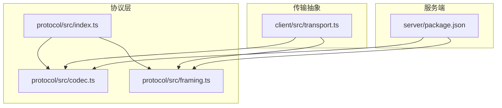
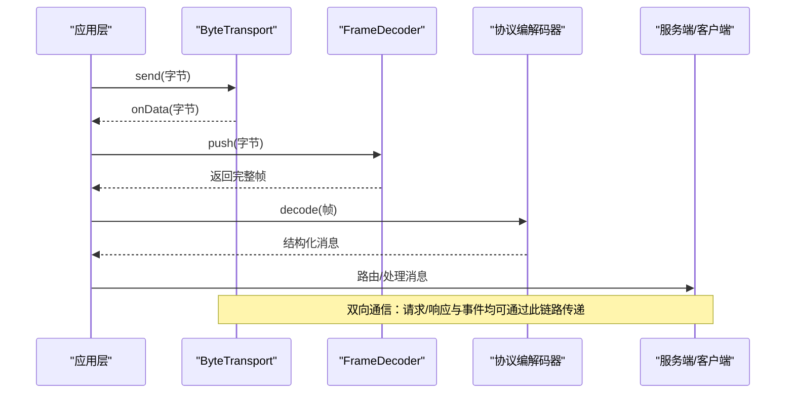
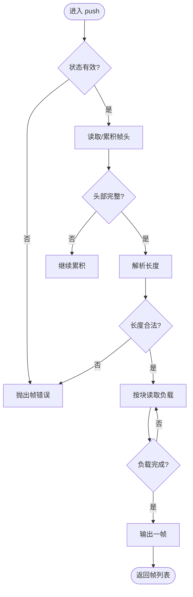
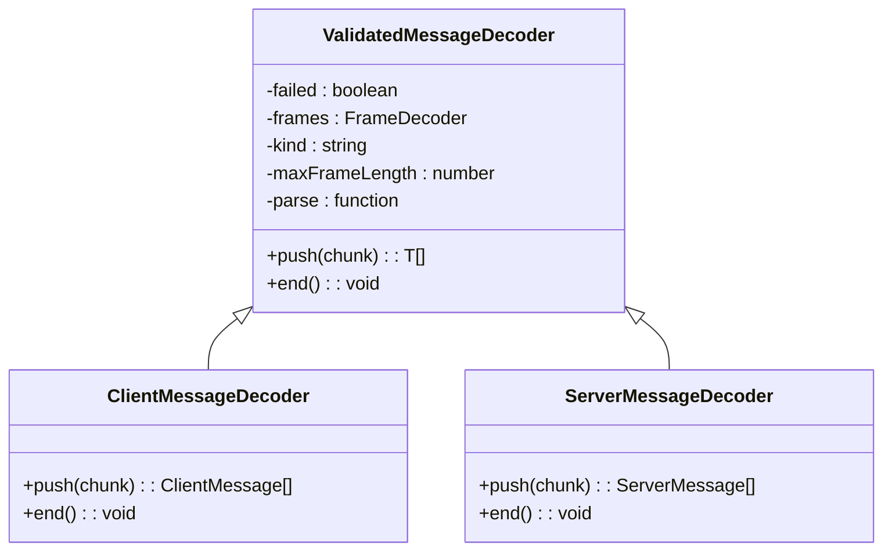
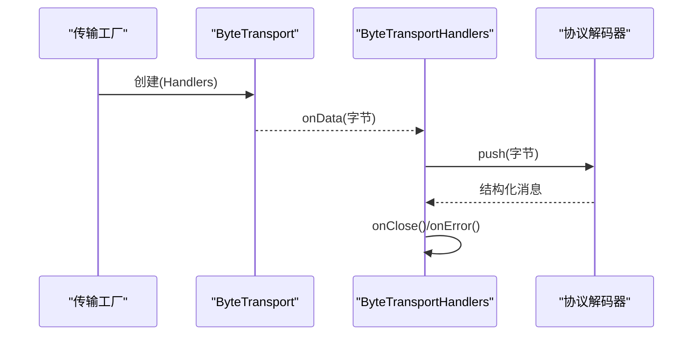
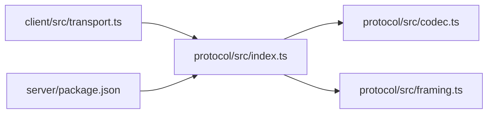

# 传输抽象层

<cite>
**本文引用的文件**
- [packages/protocol/src/index.ts](file://packages/protocol/src/index.ts)
- [packages/protocol/src/codec.ts](file://packages/protocol/src/codec.ts)
- [packages/protocol/src/framing.ts](file://packages/protocol/src/framing.ts)
- [packages/protocol/package.json](file://packages/protocol/package.json)
- [packages/client/src/transport.ts](file://packages/client/src/transport.ts)
- [packages/server/package.json](file://packages/server/package.json)
</cite>

## 目录
1. [简介](#简介)
2. [项目结构](#项目结构)
3. [核心组件](#核心组件)
4. [架构总览](#架构总览)
5. [详细组件分析](#详细组件分析)
6. [依赖关系分析](#依赖关系分析)
7. [性能考量](#性能考量)
8. [故障排查指南](#故障排查指南)
9. [结论](#结论)
10. [附录](#附录)

## 简介
本章节介绍传输抽象层的设计目标与整体思路。该抽象层将“协议编解码”和“字节流传输”解耦：协议层负责消息格式、帧封装与校验；传输层仅暴露统一的字节发送/接收接口，使上层业务（客户端/服务端）可复用同一套协议逻辑，并灵活替换底层传输介质（如 WebSocket、HTTP、IPC 等）。

- 协议层：基于 CBOR 的定长前缀帧，提供增量式解析与严格校验，确保跨语言/跨平台的一致性与安全性。
- 传输层：定义最小化的 ByteTransport 接口与工厂模式，屏蔽具体网络细节。
- 双向通信：通过独立的客户端/服务端消息类型与解码器，实现请求/响应与事件推送。
- 错误恢复：在帧边界、长度限制、协议版本与数据完整性上进行强约束，失败即快速失败，便于上层重试或降级。

## 项目结构
仓库中与传输抽象相关的关键模块分布如下：
- protocol 包：协议与帧实现（CBOR 编解码、帧封装/分帧、消息校验）。
- client 包：传输抽象接口（ByteTransport），用于连接上层会话与底层字节通道。
- server 包：服务端侧的依赖声明与扩展点（例如 unix 传输导出），为后续内置传输实现提供位置。

图表来源
- [packages/protocol/src/index.ts:1-5](file://packages/protocol/src/index.ts#L1-L5)
- [packages/protocol/src/codec.ts:1-173](file://packages/protocol/src/codec.ts#L1-L173)
- [packages/protocol/src/framing.ts:1-166](file://packages/protocol/src/framing.ts#L1-L166)
- [packages/client/src/transport.ts:1-19](file://packages/client/src/transport.ts#L1-L19)
- [packages/server/package.json:1-58](file://packages/server/package.json#L1-L58)

章节来源
- [packages/protocol/src/index.ts:1-5](file://packages/protocol/src/index.ts#L1-L5)
- [packages/client/src/transport.ts:1-19](file://packages/client/src/transport.ts#L1-L19)
- [packages/server/package.json:1-58](file://packages/server/package.json#L1-L58)

## 核心组件
本节聚焦传输抽象层的核心构件及其职责。

- 帧封装与分帧（framing）
  - 使用 4 字节大端无符号整型作为长度前缀，承载任意长度的 CBOR 负载。
  - 提供增量式 FrameDecoder，支持按块读取、自动拼接、截断检测与超限保护。
  - 默认最大帧长度为 16MB，可通过配置调整以适配不同场景。

- 协议编解码（codec）
  - 对客户端/服务端消息进行 Schema 校验与 CBOR 编解码。
  - 提供 ClientMessageDecoder/ServerMessageDecoder 增量解析器，以及 encodeClientMessage/encodeServerMessage 编码工具。
  - 统一抛出 ProtocolValidationError，便于上层捕获并处理。

- 传输抽象（client transport）
  - ByteTransport：send/close 两个方法，保证有序发送与幂等关闭。
  - ByteTransportHandlers：onData/onClose/onError 回调，驱动上层协议栈消费字节流。
  - ByteTransportFactory：创建已连接且可使用的传输实例，支持同步或异步构造。

章节来源
- [packages/protocol/src/framing.ts:1-166](file://packages/protocol/src/framing.ts#L1-L166)
- [packages/protocol/src/codec.ts:1-173](file://packages/protocol/src/codec.ts#L1-L173)
- [packages/client/src/transport.ts:1-19](file://packages/client/src/transport.ts#L1-L19)

## 架构总览
下图展示了从应用层到字节流的完整调用链：应用层通过传输工厂创建 ByteTransport，将字节送入协议解码器，解码后得到结构化消息；反之亦然。

图表来源
- [packages/client/src/transport.ts:1-19](file://packages/client/src/transport.ts#L1-L19)
- [packages/protocol/src/framing.ts:57-166](file://packages/protocol/src/framing.ts#L57-L166)
- [packages/protocol/src/codec.ts:88-173](file://packages/protocol/src/codec.ts#L88-L173)

## 详细组件分析

### 帧封装与分帧（framing）
- 设计要点
  - 固定 4 字节长度前缀，支持空负载帧。
  - 增量解析：按块推进状态机，避免一次性拷贝大对象。
  - 安全边界：拒绝超长帧、截断帧与非法输入。
- 关键流程
  - 读头：累积至 4 字节后解析长度。
  - 读体：按块写入预分配缓冲区，达到预期长度后输出完整帧。
  - 结束：检查是否残留未完成的帧头/体。

图表来源
- [packages/protocol/src/framing.ts:57-166](file://packages/protocol/src/framing.ts#L57-L166)

章节来源
- [packages/protocol/src/framing.ts:1-166](file://packages/protocol/src/framing.ts#L1-L166)

### 协议编解码（codec）
- 设计要点
  - 使用 Schema 校验消息结构，防止畸形数据进入业务层。
  - 将 CBOR 编解码与帧封装/分帧组合，形成端到端的消息管道。
  - 提供独立的消息解码器，分别处理客户端与服务端消息。
- 关键流程
  - 编码：校验 -> CBOR 编码 -> 帧封装 -> 完整性断言。
  - 解码：分帧 -> CBOR 解码 -> Schema 校验 -> 返回结构化消息。

图表来源
- [packages/protocol/src/codec.ts:88-173](file://packages/protocol/src/codec.ts#L88-L173)

章节来源
- [packages/protocol/src/codec.ts:1-173](file://packages/protocol/src/codec.ts#L1-L173)

### 传输抽象（ByteTransport）
- 设计要点
  - 极简接口：只关注字节级 I/O，不关心协议细节。
  - 顺序性：send 必须保持调用顺序，保障消息时序。
  - 幂等关闭：close 可重复调用，避免资源泄漏。
- 典型用法
  - 工厂函数创建已连接的传输实例。
  - 注册 onData/onClose/onError 回调，驱动协议栈。
  - 将收到的字节交给 FrameDecoder 与协议解码器。

图表来源
- [packages/client/src/transport.ts:1-19](file://packages/client/src/transport.ts#L1-L19)

章节来源
- [packages/client/src/transport.ts:1-19](file://packages/client/src/transport.ts#L1-L19)

### 内置传输实现与扩展点
- 当前仓库中可见的扩展点
  - server 包导出 unix 传输路径，表明可在服务端侧提供 IPC 类传输实现。
  - client 包提供传输抽象，便于在不同环境（浏览器/Node）下接入 WebSocket/HTTP/IPC 等。
- 建议的内置传输
  - WebSocket：适用于浏览器与 Node 的双向实时通信。
  - HTTP：适用于请求/响应模型或长轮询场景。
  - IPC：适用于同机进程间通信（如 Unix Domain Socket）。

章节来源
- [packages/server/package.json:1-58](file://packages/server/package.json#L1-L58)

## 依赖关系分析
- 包间依赖
  - client 依赖 protocol，用于字节流与协议编解码。
  - server 依赖 protocol，并在 package.json 中暴露 unix 传输入口，便于后续实现。
- 内部模块依赖
  - codec 依赖 framing 与 cbor/schemas，形成“帧+协议”的闭环。
  - index 聚合导出，简化上层引入。

图表来源
- [packages/client/src/transport.ts:1-19](file://packages/client/src/transport.ts#L1-L19)
- [packages/protocol/src/index.ts:1-5](file://packages/protocol/src/index.ts#L1-L5)
- [packages/server/package.json:1-58](file://packages/server/package.json#L1-L58)

章节来源
- [packages/protocol/src/index.ts:1-5](file://packages/protocol/src/index.ts#L1-L5)
- [packages/client/src/transport.ts:1-19](file://packages/client/src/transport.ts#L1-L19)
- [packages/server/package.json:1-58](file://packages/server/package.json#L1-L58)

## 性能考量
- 内存与拷贝
  - FrameDecoder 采用分块缓冲策略，减少大负载时的额外拷贝与峰值内存占用。
  - 合理设置 maxFrameLength，避免过大帧导致内存压力。
- 序列化开销
  - CBOR 适合二进制高效传输；结合 Schema 校验可减少无效数据处理。
- 背压与流控
  - 在 ByteTransport.send 中应实现背压控制，避免写队列无限增长。
  - 在 onChunk 处理中按需节流，必要时暂停上游读取。
- 并发与线程
  - 在 Node 环境中注意事件循环阻塞；在浏览器中避免主线程长时间计算。
- 监控与指标
  - 统计帧大小分布、解码耗时、错误率，指导参数调优。

[本节为通用性能建议，不直接分析具体文件]

## 故障排查指南
- 常见错误定位
  - 帧错误：长度超限、截断帧、非法输入。
  - 协议错误：Schema 校验失败、版本不匹配、CBOR 解码异常。
- 处理策略
  - 捕获 ProtocolValidationError/FrameError，记录上下文（远端地址、时间戳、首字节等）。
  - 根据错误类型决定重试、降级或断开重连。
  - 在 close/onError 中清理资源，确保不会重复释放。
- 调试技巧
  - 开启日志打印帧长度与负载大小，辅助定位超大帧问题。
  - 使用最小复现用例验证自定义传输是否正确实现顺序性与幂等关闭。

章节来源
- [packages/protocol/src/framing.ts:12-53](file://packages/protocol/src/framing.ts#L12-L53)
- [packages/protocol/src/codec.ts:18-86](file://packages/protocol/src/codec.ts#L18-L86)

## 结论
传输抽象层通过“帧+协议”的分层设计，实现了高内聚、低耦合的可插拔通信能力。ByteTransport 将网络细节完全隔离，protocol 层提供稳定、安全、高效的字节与消息处理能力。在此基础上，可便捷地实现 WebSocket、HTTP、IPC 等多种传输，并支撑双向通信与流式处理。

[本节为总结性内容，不直接分析具体文件]

## 附录

### 集成示例（概念流程）
- 客户端
  - 使用 ByteTransportFactory 创建传输实例。
  - 注册 onData/onClose/onError，将字节交给协议解码器。
  - 发送消息时先编码为字节，再调用 send。
- 服务端
  - 监听连接，创建传输实例并绑定处理器。
  - 将入站字节喂给协议解码器，路由到对应业务处理。
  - 出站消息同样先编码再发送。

[本节为概念性说明，不直接分析具体文件]

### 部署指南（概念步骤）
- 构建与发布
  - 确保 Node 版本满足要求（见包引擎声明）。
  - 构建 protocol/client/server 产物，发布到私有或公共仓库。
- 运行环境
  - 浏览器：优先使用 WebSocket 传输。
  - Node：可使用 WebSocket/HTTP/IPC，依据部署拓扑选择。
- 配置项
  - 合理设置 maxFrameLength、超时与重试策略。
  - 在生产环境启用监控与告警。

[本节为概念性说明，不直接分析具体文件]