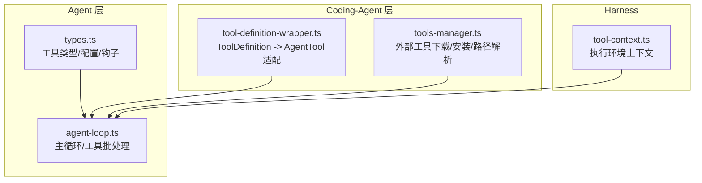
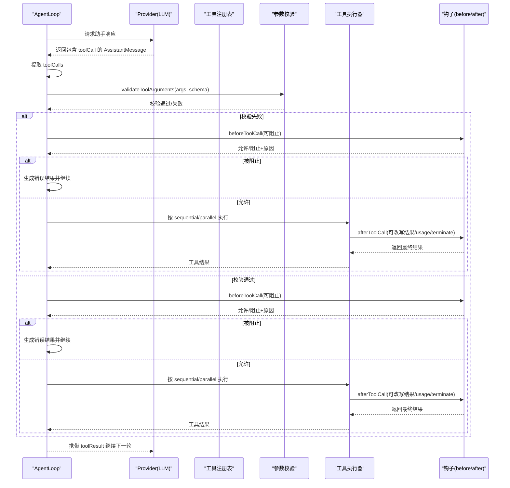
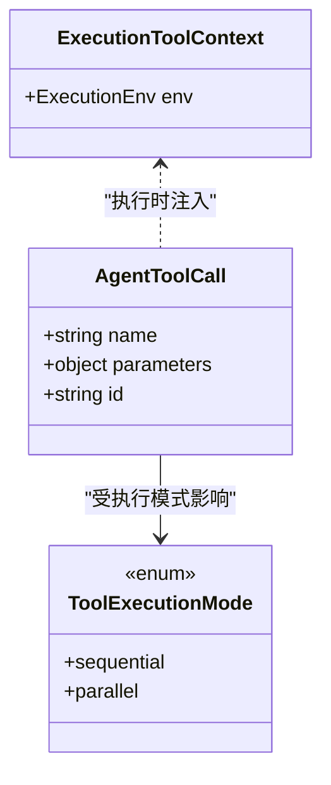
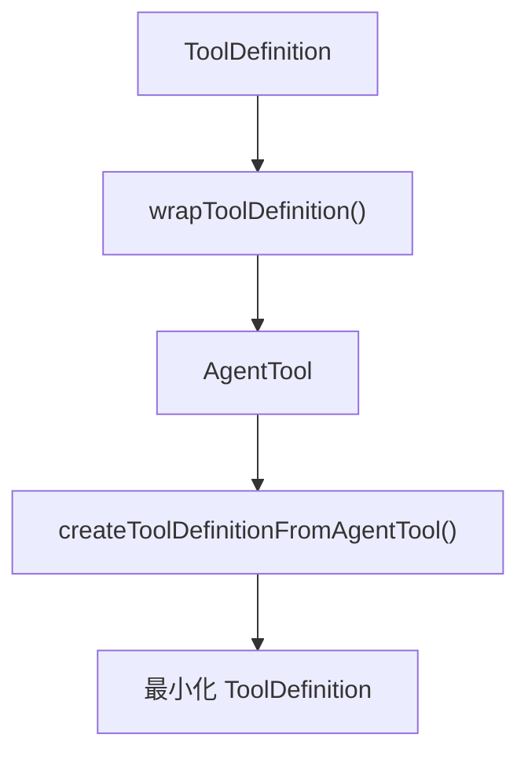
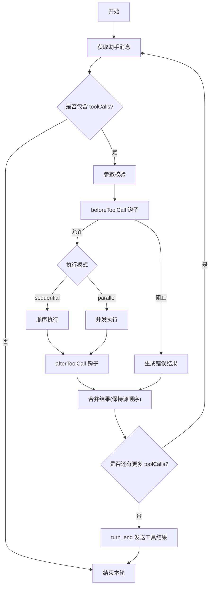
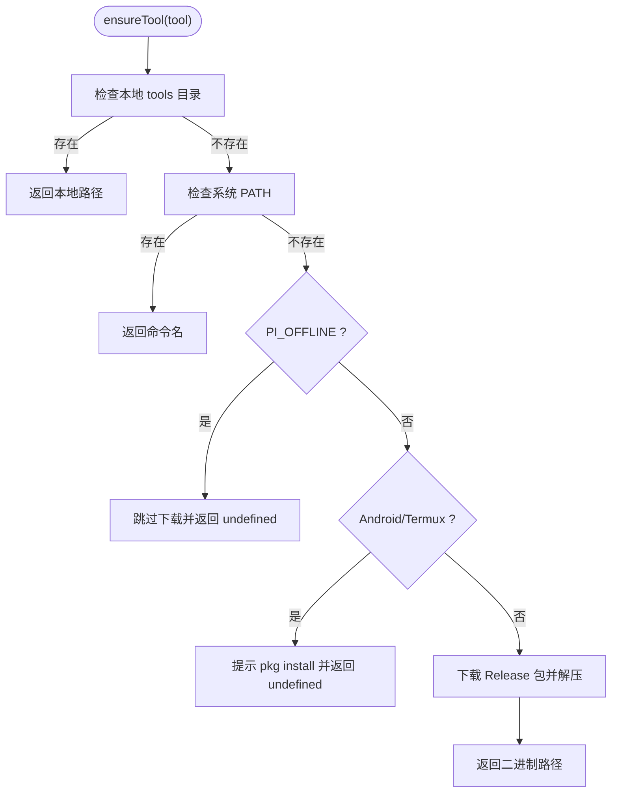
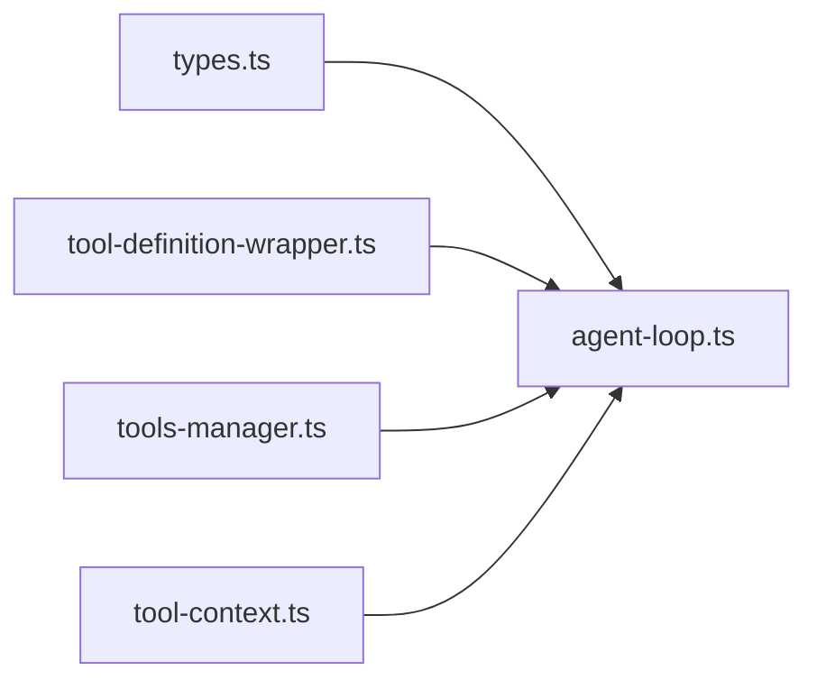

# 工具调用框架

<cite>
**本文引用的文件**
- [packages/agent/src/types.ts](file://packages/agent/src/types.ts)
- [packages/agent/src/agent-loop.ts](file://packages/agent/src/agent-loop.ts)
- [packages/coding-agent/src/core/tools/tool-definition-wrapper.ts](file://packages/coding-agent/src/core/tools/tool-definition-wrapper.ts)
- [packages/coding-agent/src/utils/tools-manager.ts](file://packages/coding-agent/src/utils/tools-manager.ts)
- [packages/agent/src/harness/tools/tool-context.ts](file://packages/agent/src/harness/tools/tool-context.ts)
</cite>

## 目录
1. [简介](#简介)
2. [项目结构](#项目结构)
3. [核心组件](#核心组件)
4. [架构总览](#架构总览)
5. [详细组件分析](#详细组件分析)
6. [依赖关系分析](#依赖关系分析)
7. [性能考量](#性能考量)
8. [故障排查指南](#故障排查指南)
9. [结论](#结论)
10. [附录](#附录)

## 简介
本文件系统化阐述“工具调用框架”的设计与实现，覆盖工具的注册机制、调用协议、参数验证、结果处理、错误处理与重试策略。重点说明 AgentTool 接口、工具执行上下文、AgentLoop 中的工具批处理流程、以及扩展点（before/after tool call）的使用方式。同时提供自定义工具开发指南、安全注意事项、性能优化建议与测试策略，并给出可操作的实践示例与最佳实践。

## 项目结构
围绕工具调用的关键代码分布在以下模块：
- agent 层：定义工具类型、执行模式、回调钩子与主循环逻辑
- coding-agent 层：将扩展定义的 ToolDefinition 适配为 AgentTool，并提供外部二进制工具管理
- harness：为内置执行类工具提供运行环境上下文

图表来源
- [packages/agent/src/types.ts:34-95](file://packages/agent/src/types.ts#L34-L95)
- [packages/agent/src/agent-loop.ts:155-220](file://packages/agent/src/agent-loop.ts#L155-L220)
- [packages/coding-agent/src/core/tools/tool-definition-wrapper.ts:1-48](file://packages/coding-agent/src/core/tools/tool-definition-wrapper.ts#L1-L48)
- [packages/coding-agent/src/utils/tools-manager.ts:85-105](file://packages/coding-agent/src/utils/tools-manager.ts#L85-L105)
- [packages/agent/src/harness/tools/tool-context.ts:1-7](file://packages/agent/src/harness/tools/tool-context.ts#L1-L7)

章节来源
- [packages/agent/src/types.ts:34-95](file://packages/agent/src/types.ts#L34-L95)
- [packages/agent/src/agent-loop.ts:155-220](file://packages/agent/src/agent-loop.ts#L155-L220)
- [packages/coding-agent/src/core/tools/tool-definition-wrapper.ts:1-48](file://packages/coding-agent/src/core/tools/tool-definition-wrapper.ts#L1-L48)
- [packages/coding-agent/src/utils/tools-manager.ts:85-105](file://packages/coding-agent/src/utils/tools-manager.ts#L85-L105)
- [packages/agent/src/harness/tools/tool-context.ts:1-7](file://packages/agent/src/harness/tools/tool-context.ts#L1-L7)

## 核心组件
- 工具类型与执行模式
  - AgentToolCall：助手消息中单个工具调用内容块
  - ToolExecutionMode：sequential（顺序）或 parallel（并行）
  - BeforeToolCallResult / AfterToolCallResult：用于拦截与改写工具执行结果
  - BeforeToolCallContext / AfterToolCallContext：钩子上下文，包含原始调用、已校验参数、当前上下文等
- 工具执行上下文
  - ExecutionToolContext：为需要文件系统/Shell 能力的内置执行工具提供 env 等运行环境
- 工具注册与适配
  - wrapToolDefinition/createToolDefinitionFromAgentTool：在扩展与核心运行时之间进行双向适配
- 工具生命周期与批处理
  - agent-loop 负责从助手消息中提取工具调用，按配置的模式执行，并在 turn_end 前汇总结果

章节来源
- [packages/agent/src/types.ts:52-123](file://packages/agent/src/types.ts#L52-L123)
- [packages/agent/src/harness/tools/tool-context.ts:1-7](file://packages/agent/src/harness/tools/tool-context.ts#L1-L7)
- [packages/coding-agent/src/core/tools/tool-definition-wrapper.ts:1-48](file://packages/coding-agent/src/core/tools/tool-definition-wrapper.ts#L1-L48)

## 架构总览
下图展示了从助手消息到工具执行再到结果回写的完整流程，包括参数校验、执行模式、错误处理与终止提示。

图表来源
- [packages/agent/src/agent-loop.ts:171-220](file://packages/agent/src/agent-loop.ts#L171-L220)
- [packages/agent/src/types.ts:34-95](file://packages/agent/src/types.ts#L34-L95)

## 详细组件分析

### 工具类型与执行上下文
- AgentToolCall：表示一次工具调用，包含名称、参数、ID 等
- ToolExecutionMode：
  - sequential：逐个准备、执行、收尾，再进入下一个
  - parallel：先顺序准备所有参数，再并发执行；完成事件按实际完成顺序发出，但最终结果仍按助手源顺序合并
- ExecutionToolContext：为需要访问文件系统/Shell 的工具提供 env 等运行环境

图表来源
- [packages/agent/src/types.ts:52-53](file://packages/agent/src/types.ts#L52-L53)
- [packages/agent/src/types.ts:34-42](file://packages/agent/src/types.ts#L34-L42)
- [packages/agent/src/harness/tools/tool-context.ts:1-7](file://packages/agent/src/harness/tools/tool-context.ts#L1-L7)

章节来源
- [packages/agent/src/types.ts:34-53](file://packages/agent/src/types.ts#L34-L53)
- [packages/agent/src/harness/tools/tool-context.ts:1-7](file://packages/agent/src/harness/tools/tool-context.ts#L1-L7)

### 工具注册与适配
- wrapToolDefinition：将扩展侧的 ToolDefinition 包装为 AgentTool，透传名称、描述、参数、执行模式、prepareArguments 与 execute
- createToolDefinitionFromAgentTool：反向将 AgentTool 转为最小化的 ToolDefinition，便于内部注册表统一以“定义优先”的方式管理

图表来源
- [packages/coding-agent/src/core/tools/tool-definition-wrapper.ts:1-48](file://packages/coding-agent/src/core/tools/tool-definition-wrapper.ts#L1-L48)

章节来源
- [packages/coding-agent/src/core/tools/tool-definition-wrapper.ts:1-48](file://packages/coding-agent/src/core/tools/tool-definition-wrapper.ts#L1-L48)

### 工具执行主循环与批处理
- 从助手消息中提取 toolCalls
- 对每个 toolCall 进行参数校验（validateToolArguments）
- 支持 beforeToolCall 拦截（block/terminate）
- 按 ToolExecutionMode 执行：
  - sequential：串行执行
  - parallel：先准备参数，再并发执行，完成后按完成顺序触发 tool_execution_end，但最终结果按源顺序合并
- 支持 afterToolCall 改写结果（content/details/isError/usage/terminate）
- 当助手输出被截断导致参数不完整时，批量失败并提示重新发起

图表来源
- [packages/agent/src/agent-loop.ts:171-220](file://packages/agent/src/agent-loop.ts#L171-L220)
- [packages/agent/src/agent-loop.ts:375-419](file://packages/agent/src/agent-loop.ts#L375-L419)
- [packages/agent/src/types.ts:34-95](file://packages/agent/src/types.ts#L34-L95)

章节来源
- [packages/agent/src/agent-loop.ts:171-220](file://packages/agent/src/agent-loop.ts#L171-L220)
- [packages/agent/src/agent-loop.ts:375-419](file://packages/agent/src/agent-loop.ts#L375-L419)
- [packages/agent/src/types.ts:34-95](file://packages/agent/src/types.ts#L34-L95)

### 外部工具管理与可用性保障
- getToolPath：优先使用本地 tools 目录的二进制，其次尝试系统 PATH 中的同名命令
- ensureTool：若未找到则自动从 GitHub Releases 下载并解压至本地 tools 目录，支持 tar.gz/zip，跨平台兼容
- 离线模式：PI_OFFLINE=1/true/yes 时跳过下载
- Termux/Android：提示通过 pkg 安装

图表来源
- [packages/coding-agent/src/utils/tools-manager.ts:85-105](file://packages/coding-agent/src/utils/tools-manager.ts#L85-L105)
- [packages/coding-agent/src/utils/tools-manager.ts:326-372](file://packages/coding-agent/src/utils/tools-manager.ts#L326-L372)

章节来源
- [packages/coding-agent/src/utils/tools-manager.ts:85-105](file://packages/coding-agent/src/utils/tools-manager.ts#L85-L105)
- [packages/coding-agent/src/utils/tools-manager.ts:326-372](file://packages/coding-agent/src/utils/tools-manager.ts#L326-L372)

## 依赖关系分析
- agent-loop 依赖 types 中定义的工具类型、执行模式与钩子上下文
- coding-agent 的 wrapper 将扩展侧 ToolDefinition 转换为 AgentTool，供 agent-loop 消费
- tools-manager 为需要外部命令的工具提供可用性与安装能力
- harness 的 ExecutionToolContext 为特定工具提供运行环境

图表来源
- [packages/agent/src/types.ts:34-95](file://packages/agent/src/types.ts#L34-L95)
- [packages/agent/src/agent-loop.ts:155-220](file://packages/agent/src/agent-loop.ts#L155-L220)
- [packages/coding-agent/src/core/tools/tool-definition-wrapper.ts:1-48](file://packages/coding-agent/src/core/tools/tool-definition-wrapper.ts#L1-L48)
- [packages/coding-agent/src/utils/tools-manager.ts:85-105](file://packages/coding-agent/src/utils/tools-manager.ts#L85-L105)
- [packages/agent/src/harness/tools/tool-context.ts:1-7](file://packages/agent/src/harness/tools/tool-context.ts#L1-L7)

章节来源
- [packages/agent/src/types.ts:34-95](file://packages/agent/src/types.ts#L34-L95)
- [packages/agent/src/agent-loop.ts:155-220](file://packages/agent/src/agent-loop.ts#L155-L220)
- [packages/coding-agent/src/core/tools/tool-definition-wrapper.ts:1-48](file://packages/coding-agent/src/core/tools/tool-definition-wrapper.ts#L1-L48)
- [packages/coding-agent/src/utils/tools-manager.ts:85-105](file://packages/coding-agent/src/utils/tools-manager.ts#L85-L105)
- [packages/agent/src/harness/tools/tool-context.ts:1-7](file://packages/agent/src/harness/tools/tool-context.ts#L1-L7)

## 性能考量
- 执行模式选择
  - 顺序模式适合有强依赖或资源竞争的工具
  - 并行模式可显著缩短整体耗时，但需确保工具幂等且无写冲突
- 参数准备阶段
  - 建议在 prepareArguments 中尽早做轻量校验，减少无效执行
- I/O 与外部命令
  - 使用 ensureTool 避免重复下载；首次安装后缓存于本地 tools 目录
  - 注意大文件解压与网络超时设置
- 结果合并与事件
  - 并行模式下 tool_execution_end 按完成顺序发出，但最终结果按助手源顺序合并，避免 UI 抖动

[本节为通用指导，不直接分析具体文件]

## 故障排查指南
- 助手输出被截断导致工具参数不完整
  - 现象：工具未被执行，收到错误结果并提示重新发起
  - 定位：检查助手消息是否达到输出限制
  - 参考：[packages/agent/src/agent-loop.ts:375-419](file://packages/agent/src/agent-loop.ts#L375-L419)
- 工具不可用或未安装
  - 现象：外部命令找不到
  - 处理：确认 PI_OFFLINE 设置；必要时手动安装或等待 ensureTool 完成
  - 参考：[packages/coding-agent/src/utils/tools-manager.ts:326-372](file://packages/coding-agent/src/utils/tools-manager.ts#L326-L372)
- 工具被 beforeToolCall 阻止
  - 现象：收到默认或自定义的阻止原因
  - 处理：检查 beforeToolCall 的 block/reason 逻辑
  - 参考：[packages/agent/src/types.ts:55-69](file://packages/agent/src/types.ts#L55-L69)
- 结果被 afterToolCall 改写
  - 现象：最终 content/details/isError/usage 与工具实际返回值不一致
  - 处理：检查 afterToolCall 的覆盖字段
  - 参考：[packages/agent/src/types.ts:71-95](file://packages/agent/src/types.ts#L71-L95)

章节来源
- [packages/agent/src/agent-loop.ts:375-419](file://packages/agent/src/agent-loop.ts#L375-L419)
- [packages/coding-agent/src/utils/tools-manager.ts:326-372](file://packages/coding-agent/src/utils/tools-manager.ts#L326-L372)
- [packages/agent/src/types.ts:55-95](file://packages/agent/src/types.ts#L55-L95)

## 结论
该工具调用框架通过清晰的类型定义、灵活的执行模式、完善的钩子机制与健壮的外部工具管理能力，提供了可扩展、可观测、可控制的工具执行体系。借助 before/after 钩子与 ToolExecutionMode，可在保证正确性的前提下最大化吞吐与稳定性。结合 ensureTool 的自动安装与缓存策略，降低了部署与维护成本。

[本节为总结性内容，不直接分析具体文件]

## 附录

### 自定义工具开发指南
- 定义工具
  - 在扩展中声明 ToolDefinition（名称、标签、描述、参数 Schema、可选 prepareArguments、executionMode、execute）
  - 使用 wrapToolDefinition 将其适配为 AgentTool，以便核心运行时识别与调度
- 参数校验
  - 使用 validateToolArguments 在工具执行前对参数进行严格校验
- 执行上下文
  - 对于需要文件系统/Shell 的工具，通过 ExecutionToolContext 注入 env 等运行环境
- 结果处理
  - 在 afterToolCall 中按需改写 content/details/isError/usage/terminate
- 安全建议
  - 限制可访问的文件系统与命令白名单
  - 对输入参数进行严格校验与转义
  - 控制并发度与超时，防止资源耗尽
- 性能优化
  - 合理选择 executionMode
  - 复用外部进程/连接，避免频繁启动
  - 利用本地缓存与预取策略
- 测试策略
  - 单元测试：覆盖参数校验、边界条件、异常分支
  - 集成测试：模拟外部命令失败、网络超时、权限不足等场景
  - 回归测试：验证 afterToolCall 改写后的结果符合预期

章节来源
- [packages/coding-agent/src/core/tools/tool-definition-wrapper.ts:1-48](file://packages/coding-agent/src/core/tools/tool-definition-wrapper.ts#L1-L48)
- [packages/agent/src/harness/tools/tool-context.ts:1-7](file://packages/agent/src/harness/tools/tool-context.ts#L1-L7)
- [packages/agent/src/types.ts:55-95](file://packages/agent/src/types.ts#L55-L95)