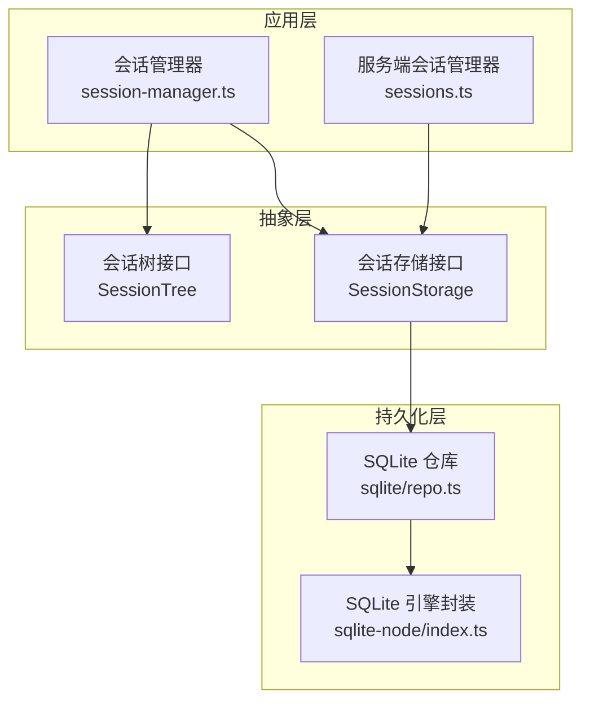
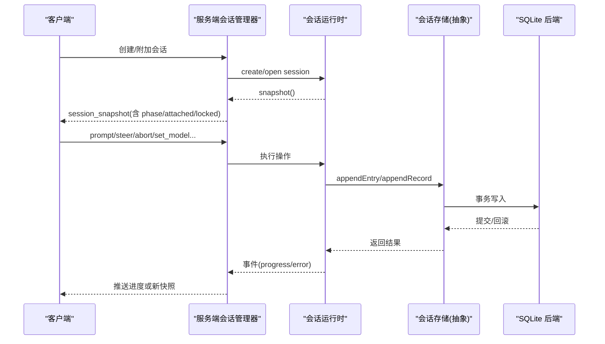
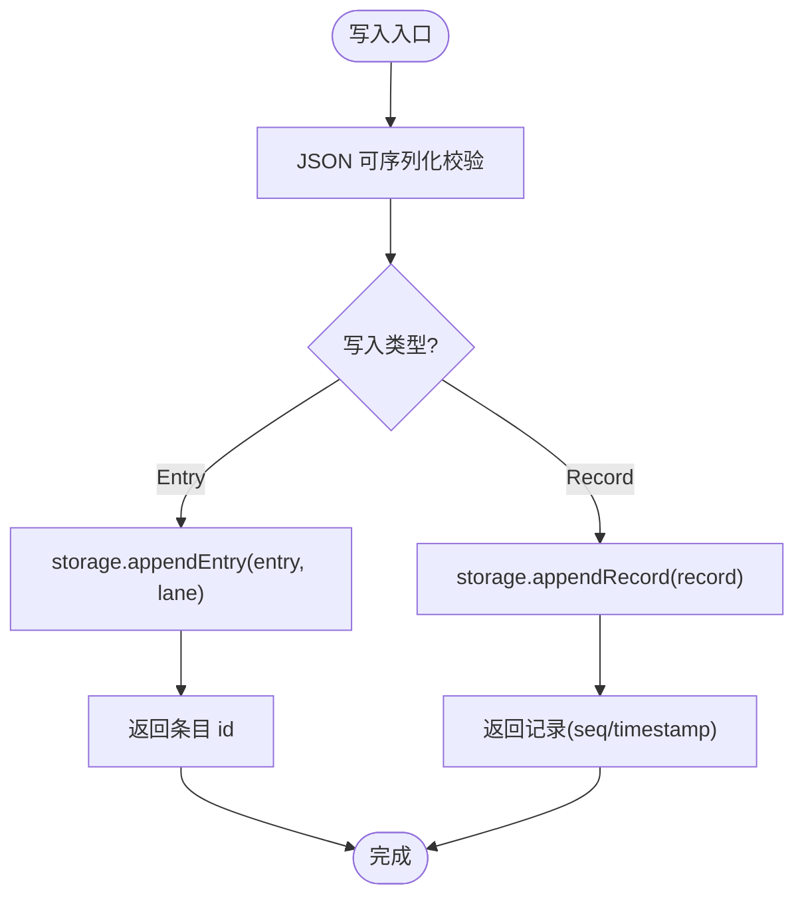
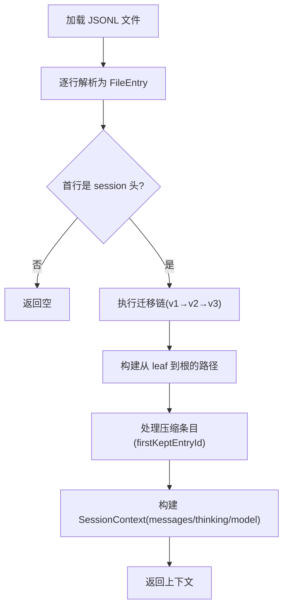
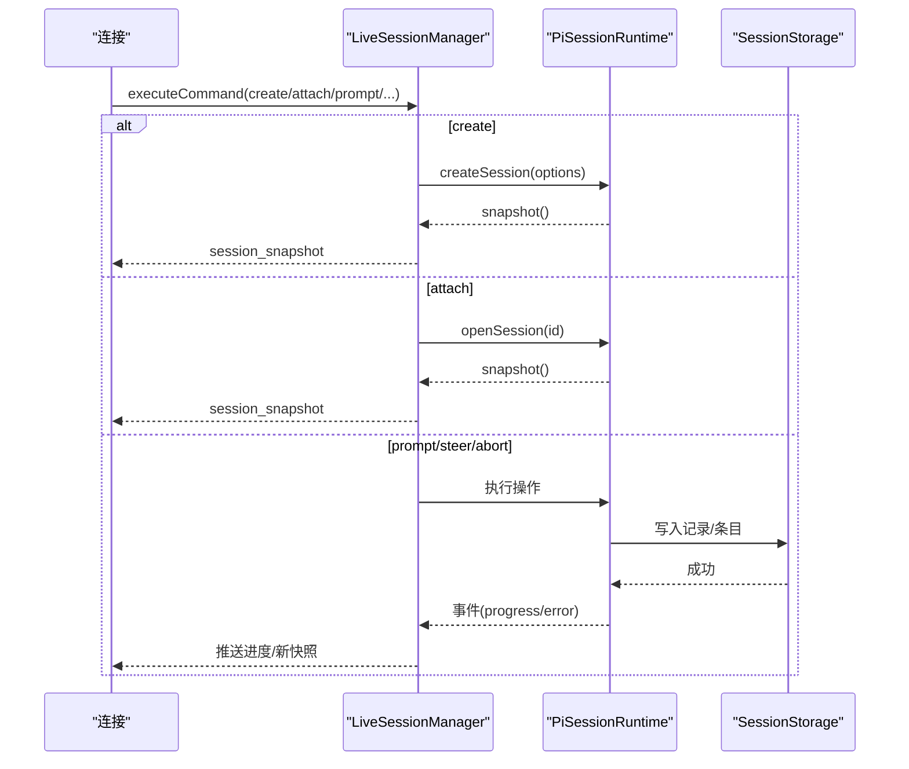
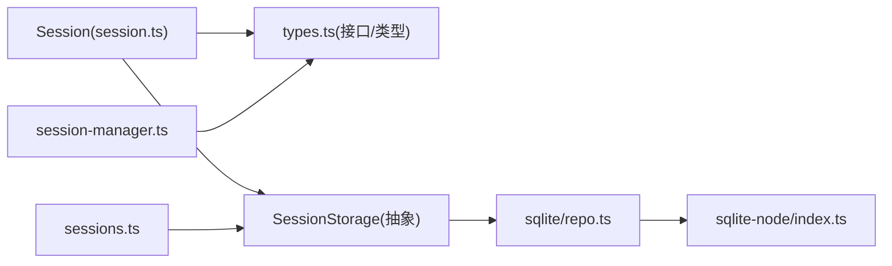

# 状态管理系统

<cite>
**本文引用的文件**
- [packages/agent/src/harness/session/types.ts](file://packages/agent/src/harness/session/types.ts)
- [packages/agent/src/harness/session/session.ts](file://packages/agent/src/harness/session/session.ts)
- [packages/coding-agent/src/core/session-manager.ts](file://packages/coding-agent/src/core/session-manager.ts)
- [packages/server/src/sessions.ts](file://packages/server/src/sessions.ts)
- [packages/session-backends/sqlite-node/src/index.ts](file://packages/session-backends/sqlite-node/src/index.ts)
- [packages/session-backends/sqlite-node/src/sqlite/index.ts](file://packages/session-backends/sqlite-node/src/sqlite/index.ts)
</cite>

## 目录
1. [简介](#简介)
2. [项目结构](#项目结构)
3. [核心组件](#核心组件)
4. [架构总览](#架构总览)
5. [详细组件分析](#详细组件分析)
6. [依赖关系分析](#依赖关系分析)
7. [性能考虑](#性能考虑)
8. [故障排查指南](#故障排查指南)
9. [结论](#结论)
10. [附录：使用示例与集成模式](#附录使用示例与集成模式)

## 简介
本文件系统性地梳理了仓库中的“状态管理系统”，围绕会话状态的结构设计、状态变更机制、持久化策略展开，重点解释 SessionState（以 SessionTree/SessionStorage 抽象为核心）的接口契约、状态同步、冲突解决、版本管理、迁移与回滚机制，并给出性能优化建议与调试技巧。同时提供完整的使用示例与集成模式，帮助读者快速理解并在实际工程中落地。

## 项目结构
该状态管理系统由多层组成：
- 会话树与存储抽象层：定义 Entry、Record、Lane、Log 等数据结构与 SessionTree/SessionStorage 接口，封装写入与查询语义。
- 会话管理器（编码侧）：负责 JSONL 格式会话文件的读写、版本迁移、上下文构建、分支摘要与压缩等。
- 服务端会话管理器：维护运行时会话生命周期、连接附着、快照广播、操作执行与终止。
- SQLite 后端：基于 Node sqlite 的持久化实现，提供事务、语句执行、迁移与仓库能力。

图表来源
- [packages/agent/src/harness/session/types.ts:290-352](file://packages/agent/src/harness/session/types.ts#L290-L352)
- [packages/agent/src/harness/session/session.ts:102-299](file://packages/agent/src/harness/session/session.ts#L102-L299)
- [packages/coding-agent/src/core/session-manager.ts:230-291](file://packages/coding-agent/src/core/session-manager.ts#L230-L291)
- [packages/server/src/sessions.ts:38-120](file://packages/server/src/sessions.ts#L38-L120)
- [packages/session-backends/sqlite-node/src/index.ts:53-100](file://packages/session-backends/sqlite-node/src/index.ts#L53-L100)
- [packages/session-backends/sqlite-node/src/sqlite/index.ts:1-19](file://packages/session-backends/sqlite-node/src/sqlite/index.ts#L1-L19)

章节来源
- [packages/agent/src/harness/session/types.ts:290-352](file://packages/agent/src/harness/session/types.ts#L290-L352)
- [packages/agent/src/harness/session/session.ts:102-299](file://packages/agent/src/harness/session/session.ts#L102-L299)
- [packages/coding-agent/src/core/session-manager.ts:230-291](file://packages/coding-agent/src/core/session-manager.ts#L230-L291)
- [packages/server/src/sessions.ts:38-120](file://packages/server/src/sessions.ts#L38-L120)
- [packages/session-backends/sqlite-node/src/index.ts:53-100](file://packages/session-backends/sqlite-node/src/index.ts#L53-L100)
- [packages/session-backends/sqlite-node/src/sqlite/index.ts:1-19](file://packages/session-backends/sqlite-node/src/sqlite/index.ts#L1-L19)

## 核心组件
- 会话树与会话存储抽象
  - SessionTree：面向读与简单写的统一视图，支持按分支查询、消息追加、标签与名称等全局事实。
  - SessionStorage：底层持久化契约，包含 Lane 管理、Entry/Record 追加、日志、统计、开放操作查询等。
- 会话类 Session：实现 SessionTree，将高层 API 委托给 Storage；提供 lane 视图、JSON 可序列化校验、游标分页等。
- 编码端会话管理器：负责 JSONL 会话文件解析、版本迁移（v1→v2→v3）、上下文构建、分支摘要与压缩、最近会话发现等。
- 服务端会话管理器 LiveSessionManager：管理运行中会话的生命周期、命令分发、快照广播、错误终止与资源回收。
- SQLite 后端：封装数据库连接、事务、语句执行，并提供仓库能力（迁移、搜索、读写）。

章节来源
- [packages/agent/src/harness/session/types.ts:290-352](file://packages/agent/src/harness/session/types.ts#L290-L352)
- [packages/agent/src/harness/session/session.ts:102-299](file://packages/agent/src/harness/session/session.ts#L102-L299)
- [packages/coding-agent/src/core/session-manager.ts:230-291](file://packages/coding-agent/src/core/session-manager.ts#L230-L291)
- [packages/server/src/sessions.ts:38-120](file://packages/server/src/sessions.ts#L38-L120)
- [packages/session-backends/sqlite-node/src/index.ts:53-100](file://packages/session-backends/sqlite-node/src/index.ts#L53-L100)

## 架构总览
系统采用“接口抽象 + 多后端”的分层架构：
- 上层通过 SessionTree/SessionStorage 进行状态读写，屏蔽具体存储细节。
- 编码端会话管理器在 JSONL 上实现轻量级持久化与迁移逻辑，适合本地开发与小规模场景。
- 服务端会话管理器协调多个客户端连接，维护运行态会话，并通过 Snapshot 事件向客户端同步状态。
- SQLite 后端提供强一致的事务与索引能力，适合高并发与复杂查询场景。

图表来源
- [packages/server/src/sessions.ts:47-120](file://packages/server/src/sessions.ts#L47-L120)
- [packages/server/src/sessions.ts:248-297](file://packages/server/src/sessions.ts#L248-L297)
- [packages/agent/src/harness/session/types.ts:290-352](file://packages/agent/src/harness/session/types.ts#L290-L352)
- [packages/session-backends/sqlite-node/src/index.ts:68-85](file://packages/session-backends/sqlite-node/src/index.ts#L68-L85)

## 详细组件分析

### 会话树与会话存储抽象（SessionTree / SessionStorage）
- 数据结构
  - Entry：消息、模型切换、思考级别变化、工具激活、压缩、分支摘要、自定义条目等。
  - Record：操作开始/结束、步骤尝试、工具调用、队列入队/取消、延迟写入、用量记录等。
  - LanePointer：每个分支的当前叶子节点指针。
  - LogItem：统一的审计日志项，涵盖 entry/record/lane/fact。
- 接口职责
  - SessionTree：提供跨分支的查询与写入口（如 appendMessage），以及全局事实（名称、标签）。
  - SessionStorage：提供更细粒度的写入（appendEntry/appendRecord）、分支扫描、开放操作查询、日志与统计。
- 复杂度与一致性
  - 序列号 seq 作为全局单调递增标识，用于游标分页与顺序读取。
  - 开放操作查询限制 limit=2，用于恢复时判断空闲/挂起/损坏。

章节来源
- [packages/agent/src/harness/session/types.ts:14-74](file://packages/agent/src/harness/session/types.ts#L14-L74)
- [packages/agent/src/harness/session/types.ts:80-215](file://packages/agent/src/harness/session/types.ts#L80-L215)
- [packages/agent/src/harness/session/types.ts:217-288](file://packages/agent/src/harness/session/types.ts#L217-L288)
- [packages/agent/src/harness/session/types.ts:290-352](file://packages/agent/src/harness/session/types.ts#L290-L352)

### 会话类 Session（实现 SessionTree）
- 功能要点
  - 通过 storage 委派所有读写操作，保证 JSON 可序列化校验。
  - 支持 lane 视图，便于对特定分支进行局部操作。
  - 提供 findEntries/findRecords/getLog 等查询，内置参数校验（limit、cursor）。
- 关键流程
  - 追加消息/自定义条目：生成 id，构造 ProvisionedEntry，委托 storage.appendEntry。
  - 追加记录：构造 NewRecord，委托 storage.appendRecord，返回带 seq/timestamp 的结果。
  - 查询：根据 query 类型与条件，调用 storage.findEntries/findRecords/findOpenOperations/getLog。

图表来源
- [packages/agent/src/harness/session/session.ts:271-299](file://packages/agent/src/harness/session/session.ts#L271-L299)
- [packages/agent/src/harness/session/session.ts:42-100](file://packages/agent/src/harness/session/session.ts#L42-L100)

章节来源
- [packages/agent/src/harness/session/session.ts:102-299](file://packages/agent/src/harness/session/session.ts#L102-L299)

### 编码端会话管理器（JSONL 持久化与迁移）
- 版本与迁移
  - CURRENT_SESSION_VERSION=3，支持 v1→v2（添加 id/parentId 树结构，转换 firstKeptEntryIndex→firstKeptEntryId）、v2→v3（重命名 hookMessage role 为 custom）。
  - migrateToCurrentVersion 串联迁移链，确保加载时数据兼容。
- 上下文构建
  - buildSessionPath：从 leafId 回溯到根，构建路径。
  - buildContextEntries：处理压缩条目，保留 firstKeptEntryId 之后的条目与压缩后内容。
  - buildSessionContext：聚合 thinkingLevel、model 与消息列表。
- 文件 I/O
  - loadEntriesFromFile：流式读取 JSONL，跳过坏行，验证首行为 session 头。
  - readSessionHeader：限制扫描字节数，安全地定位首个有效 header。
  - findMostRecentSession：按 cwd 过滤并选择最近修改的会话文件。

图表来源
- [packages/coding-agent/src/core/session-manager.ts:230-291](file://packages/coding-agent/src/core/session-manager.ts#L230-L291)
- [packages/coding-agent/src/core/session-manager.ts:325-470](file://packages/coding-agent/src/core/session-manager.ts#L325-L470)
- [packages/coding-agent/src/core/session-manager.ts:514-613](file://packages/coding-agent/src/core/session-manager.ts#L514-L613)

章节来源
- [packages/coding-agent/src/core/session-manager.ts:230-291](file://packages/coding-agent/src/core/session-manager.ts#L230-L291)
- [packages/coding-agent/src/core/session-manager.ts:325-470](file://packages/coding-agent/src/core/session-manager.ts#L325-L470)
- [packages/coding-agent/src/core/session-manager.ts:514-613](file://packages/coding-agent/src/core/session-manager.ts#L514-L613)

### 服务端会话管理器（LiveSessionManager）
- 生命周期管理
  - acquire/create：确保同一会话 ID 的唯一性，避免重复创建与竞态。
  - attach/detach：管理连接与会话的附着关系，必要时广播快照。
  - maybeDispose：当无连接且处于空闲态时释放运行时资源。
- 命令分发
  - list/create/attach/detach/prompt/steer/abort/set_model/set_thinking 等命令路由到对应运行时方法。
- 事件与快照
  - 运行时事件（progress/error）触发进度推送或终止流程。
  - broadcastSnapshot：标准化快照并推送给所有附着连接。

图表来源
- [packages/server/src/sessions.ts:47-120](file://packages/server/src/sessions.ts#L47-L120)
- [packages/server/src/sessions.ts:171-207](file://packages/server/src/sessions.ts#L171-L207)
- [packages/server/src/sessions.ts:248-297](file://packages/server/src/sessions.ts#L248-L297)

章节来源
- [packages/server/src/sessions.ts:38-120](file://packages/server/src/sessions.ts#L38-L120)
- [packages/server/src/sessions.ts:171-207](file://packages/server/src/sessions.ts#L171-L207)
- [packages/server/src/sessions.ts:248-297](file://packages/server/src/sessions.ts#L248-L297)

### SQLite 后端（事务与仓库）
- 事务封装
  - transaction：BEGIN IMMEDIATE → 执行回调 → COMMIT；异常时 ROLLBACK。
  - 禁止异步回调，确保事务内同步执行。
- 仓库导出
  - 暴露 SqliteSessionRepository、迁移、搜索后端与 SQL 工具。
- 引擎适配
  - wrapNodeSqliteDatabase/createNodeSqliteFactory：封装 node:sqlite 的 DatabaseSync 与 Statement。

章节来源
- [packages/session-backends/sqlite-node/src/index.ts:53-100](file://packages/session-backends/sqlite-node/src/index.ts#L53-L100)
- [packages/session-backends/sqlite-node/src/sqlite/index.ts:1-19](file://packages/session-backends/sqlite-node/src/sqlite/index.ts#L1-L19)

## 依赖关系分析
- 耦合与内聚
  - Session 仅依赖 SessionStorage 接口，保持高内聚与低耦合。
  - 编码端会话管理器依赖 JSONL 文件格式与迁移函数，独立于后端。
  - 服务端会话管理器依赖 PiSessionRuntime 与 SessionStorage，解耦具体持久化。
- 外部依赖
  - node:sqlite 提供本地数据库能力。
  - @earendil-works/pi-ai 提供消息与工具类型。
- 潜在循环依赖
  - 各模块通过接口与明确边界隔离，未见直接循环导入迹象。

图表来源
- [packages/agent/src/harness/session/session.ts:102-299](file://packages/agent/src/harness/session/session.ts#L102-L299)
- [packages/agent/src/harness/session/types.ts:290-352](file://packages/agent/src/harness/session/types.ts#L290-L352)
- [packages/coding-agent/src/core/session-manager.ts:230-291](file://packages/coding-agent/src/core/session-manager.ts#L230-L291)
- [packages/server/src/sessions.ts:38-120](file://packages/server/src/sessions.ts#L38-L120)
- [packages/session-backends/sqlite-node/src/index.ts:53-100](file://packages/session-backends/sqlite-node/src/index.ts#L53-L100)

章节来源
- [packages/agent/src/harness/session/session.ts:102-299](file://packages/agent/src/harness/session/session.ts#L102-L299)
- [packages/agent/src/harness/session/types.ts:290-352](file://packages/agent/src/harness/session/types.ts#L290-L352)
- [packages/coding-agent/src/core/session-manager.ts:230-291](file://packages/coding-agent/src/core/session-manager.ts#L230-L291)
- [packages/server/src/sessions.ts:38-120](file://packages/server/src/sessions.ts#L38-L120)
- [packages/session-backends/sqlite-node/src/index.ts:53-100](file://packages/session-backends/sqlite-node/src/index.ts#L53-L100)

## 性能考虑
- 游标分页与限制
  - 使用 afterSeq 与 limit 控制查询范围，避免全表扫描。
  - 分支查询默认从 leaf 向上回溯，结合 stopAtType/stopAtId 缩小范围。
- 流式读取与大文件
  - JSONL 使用缓冲与解码器分块读取，限制头部扫描字节数，防止大文件阻塞。
- 事务与原子性
  - SQLite 事务使用 BEGIN IMMEDIATE 提升并发写入性能，异常时自动回滚。
- 上下文构建优化
  - 构建路径时复用 byId 索引，减少重复查找；压缩条目仅保留必要历史。
- 并发控制
  - 服务端会话管理器限制最大并发加载会话信息数量，避免资源耗尽。

[本节为通用性能指导，不直接分析具体文件]

## 故障排查指南
- 常见错误码与异常
  - SessionError：invalid_payload、invalid_query、invalid_lane 等，检查输入合法性与 lane 存在性。
  - 服务端错误：session_locked、not_found、invalid_request，检查会话状态与连接附着。
- 迁移失败
  - 若 JSONL 首行非 session 头或损坏，loadEntriesFromFile 会返回空；检查文件完整性。
  - 迁移链 v1→v2→v3 需保证字段兼容，必要时回滚至上一版本并修复数据。
- 事务异常
  - SQLite 事务回调必须同步，否则抛出类型错误；确保回调内无异步操作。
- 调试技巧
  - 使用 getLog 获取审计日志，定位问题发生时的 entry/record/lane/fact。
  - 在服务端捕获 progress/error 事件，打印会话快照与阶段信息。
  - 对 JSONL 文件使用 parseSessionEntries 辅助解析，逐步定位坏行。

章节来源
- [packages/agent/src/harness/session/types.ts:375-394](file://packages/agent/src/harness/session/types.ts#L375-L394)
- [packages/server/src/sessions.ts:248-297](file://packages/server/src/sessions.ts#L248-L297)
- [packages/coding-agent/src/core/session-manager.ts:514-613](file://packages/coding-agent/src/core/session-manager.ts#L514-L613)
- [packages/session-backends/sqlite-node/src/index.ts:68-85](file://packages/session-backends/sqlite-node/src/index.ts#L68-L85)

## 结论
本状态管理系统通过清晰的接口抽象与分层设计，实现了可扩展的会话状态管理。SessionTree/SessionStorage 提供了统一的读写契约，编码端会话管理器与 SQLite 后端分别满足轻量与高性能场景。版本迁移与事务机制保障了数据的向后兼容与一致性。结合游标分页、流式读取与并发控制，系统在大规模会话下仍具备良好性能。建议在生产环境中优先使用 SQLite 后端，并结合审计日志与事件监控进行排障与优化。

[本节为总结性内容，不直接分析具体文件]

## 附录：使用示例与集成模式

- 基本用法（编码端 JSONL）
  - 创建会话：调用 createSession 或 openSession，获取会话句柄。
  - 写入消息：使用 appendMessage 或 appendCustomEntry，确保数据 JSON 可序列化。
  - 查询条目：使用 findEntries/findEntry，配合 type/customType/order/limit/cursor。
  - 构建上下文：调用 buildSessionContext，获取 messages/thinkingLevel/model。
  - 迁移：加载文件后自动执行迁移链，确保兼容最新版本。

- 服务端集成
  - 初始化 LiveSessionManager，注入服务方法与广播函数。
  - 处理客户端命令：create/attach/prompt/steer/abort/set_model/set_thinking。
  - 订阅运行时事件：progress 推送进度，error 触发终止流程。
  - 广播快照：每次操作完成后广播 session_snapshot，客户端据此更新 UI。

- 持久化后端选择
  - 本地开发：使用 JSONL 会话文件，便于调试与可视化。
  - 生产环境：使用 SQLite 后端，利用事务与索引提升性能与可靠性。

- 版本管理与回滚
  - 升级：增加迁移函数，确保旧数据能平滑升级到新版本。
  - 回滚：保留旧版本迁移逻辑，必要时回退代码并修复数据。

- 调试与观测
  - 启用审计日志：getLog 输出 entry/record/lane/fact，辅助定位问题。
  - 服务端监控：收集 session_snapshot 与 progress 事件，绘制会话健康度指标。

章节来源
- [packages/coding-agent/src/core/session-manager.ts:230-291](file://packages/coding-agent/src/core/session-manager.ts#L230-L291)
- [packages/coding-agent/src/core/session-manager.ts:325-470](file://packages/coding-agent/src/core/session-manager.ts#L325-L470)
- [packages/server/src/sessions.ts:47-120](file://packages/server/src/sessions.ts#L47-L120)
- [packages/server/src/sessions.ts:248-297](file://packages/server/src/sessions.ts#L248-L297)
- [packages/session-backends/sqlite-node/src/index.ts:53-100](file://packages/session-backends/sqlite-node/src/index.ts#L53-L100)