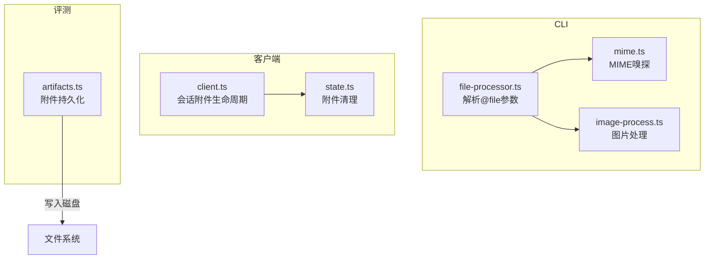
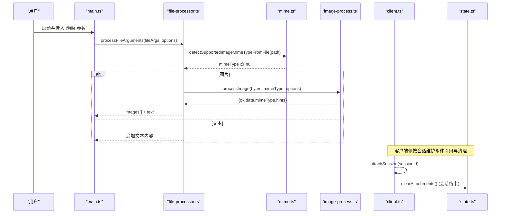
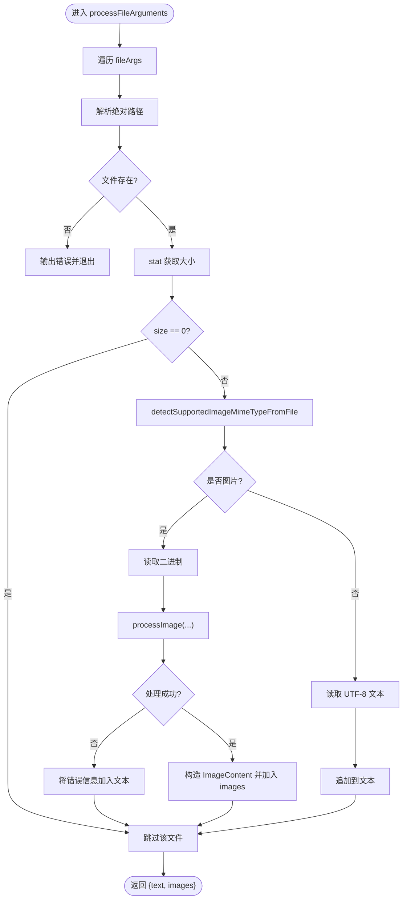
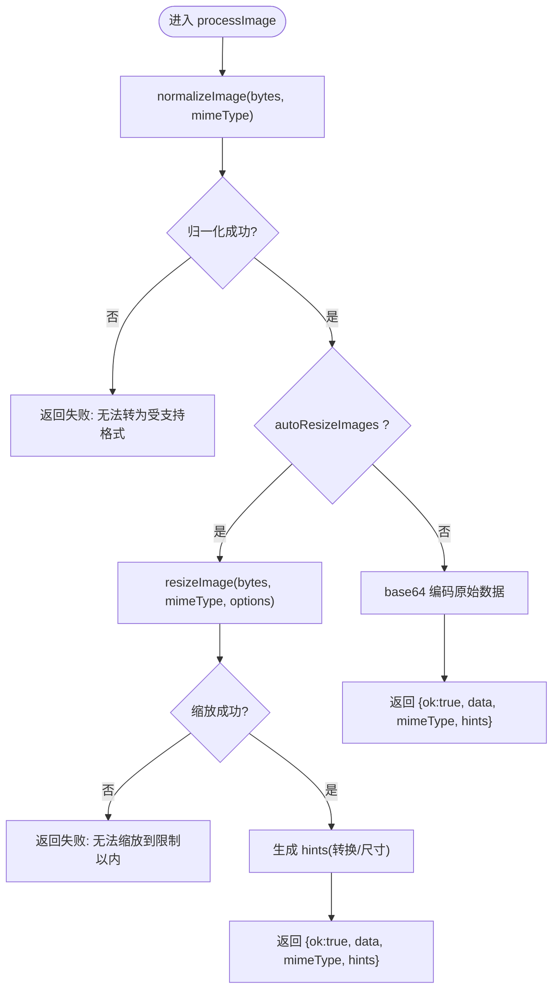
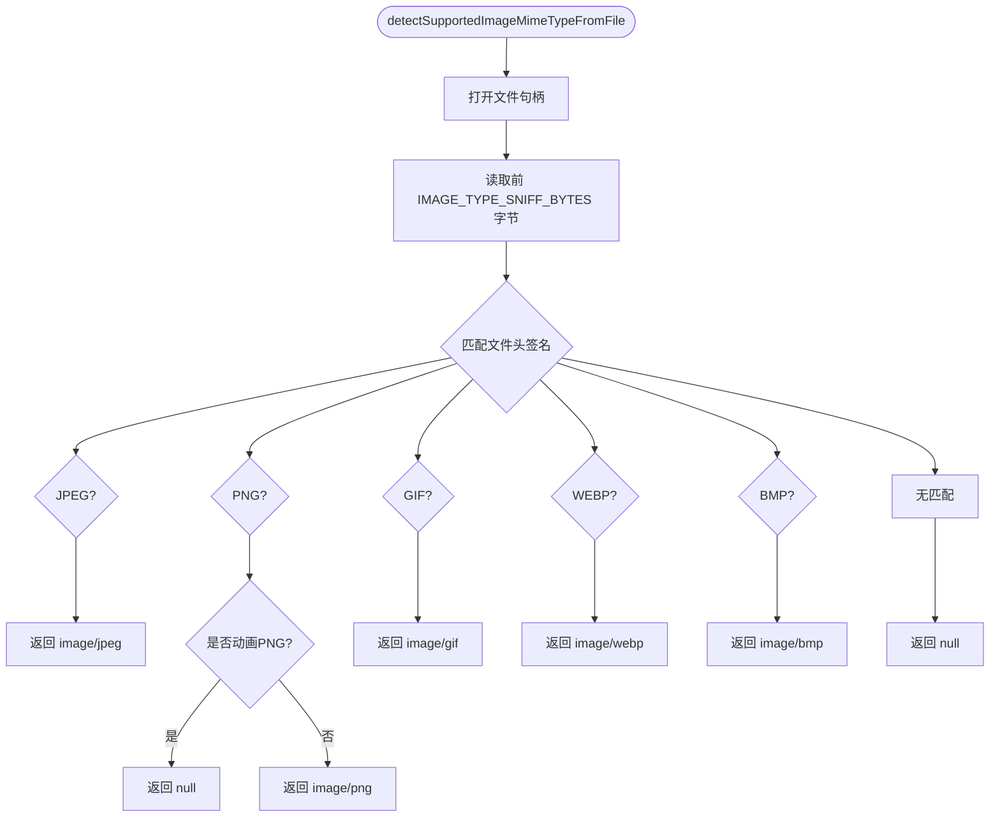
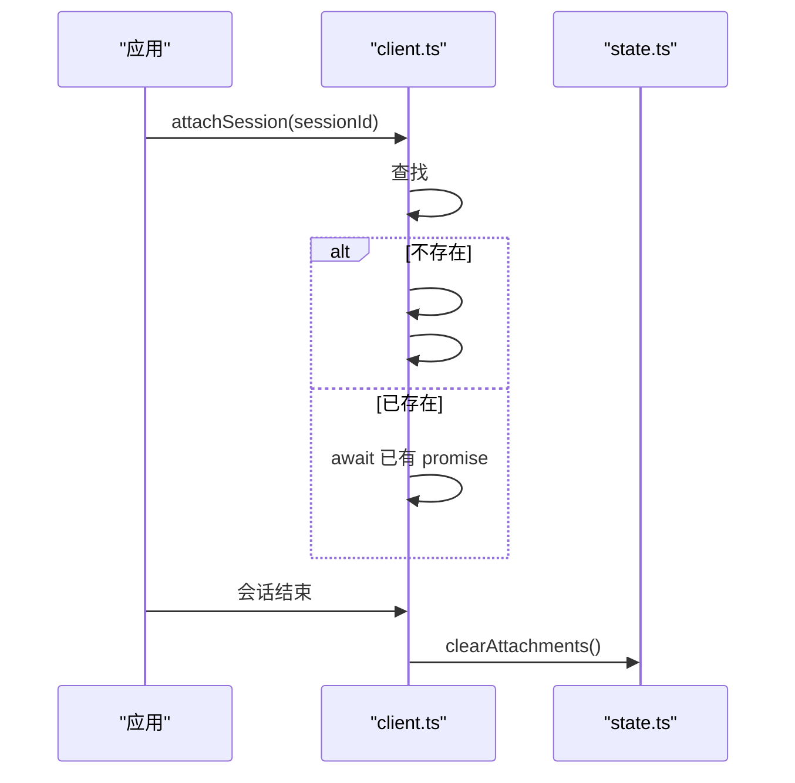
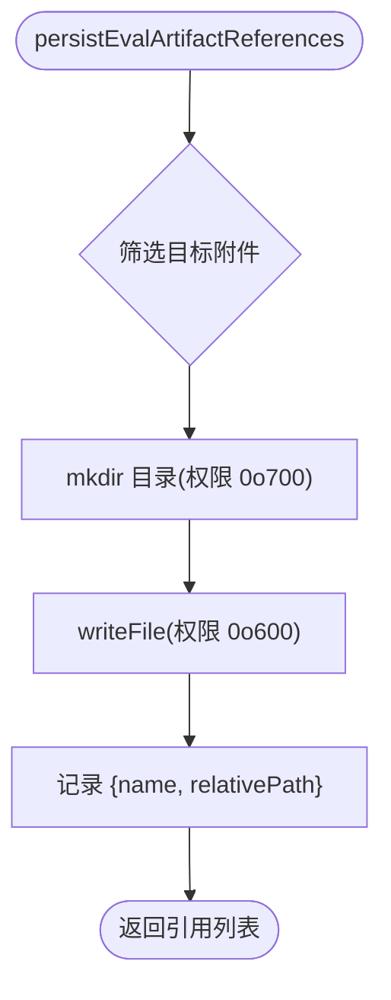
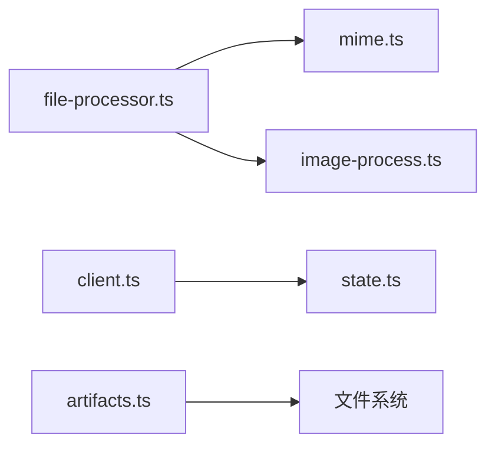

# 附件支持系统

<cite>
**本文引用的文件**
- [packages/coding-agent/src/cli/file-processor.ts](file://packages/coding-agent/src/cli/file-processor.ts)
- [packages/coding-agent/src/utils/image-process.ts](file://packages/coding-agent/src/utils/image-process.ts)
- [packages/coding-agent/src/utils/mime.ts](file://packages/coding-agent/src/utils/mime.ts)
- [packages/coding-agent/src/main.ts](file://packages/coding-agent/src/main.ts)
- [packages/client/src/client.ts](file://packages/client/src/client.ts)
- [packages/client/src/state.ts](file://packages/client/src/state.ts)
- [packages/evals/src/vitest-evals/artifacts.ts](file://packages/evals/src/vitest-evals/artifacts.ts)
</cite>

## 目录
1. [简介](#简介)
2. [项目结构](#项目结构)
3. [核心组件](#核心组件)
4. [架构总览](#架构总览)
5. [详细组件分析](#详细组件分析)
6. [依赖关系分析](#依赖关系分析)
7. [性能考虑](#性能考虑)
8. [故障排查指南](#故障排查指南)
9. [结论](#结论)
10. [附录](#附录)

## 简介
本文件面向“附件支持系统”，聚焦于文件的上传、存储、处理与下载机制，围绕以下目标展开：
- 明确 Attachment（附件）在系统中的角色与数据流
- 说明支持的图片类型、大小限制与安全校验策略
- 梳理内置处理器与可扩展的自定义处理流程
- 给出缓存策略与性能优化建议
- 提供文件处理最佳实践与安全注意事项

该系统主要覆盖 CLI 端文件解析与图片内联、客户端会话附件生命周期管理，以及评测产物中附件的持久化。

## 项目结构
与附件处理相关的关键模块分布如下：
- CLI 文件处理：将 @file 参数转换为文本内容与图片附件
- 图片处理：格式识别、转换、尺寸与体积压缩
- MIME 检测：基于文件头的安全类型嗅探
- 客户端会话：按会话维度维护附件引用与清理
- 评测产物：将测试运行中的附件落盘并生成引用

**图示来源**
- [packages/coding-agent/src/cli/file-processor.ts:1-88](file://packages/coding-agent/src/cli/file-processor.ts#L1-L88)
- [packages/coding-agent/src/utils/mime.ts:1-117](file://packages/coding-agent/src/utils/mime.ts#L1-L117)
- [packages/coding-agent/src/utils/image-process.ts:1-120](file://packages/coding-agent/src/utils/image-process.ts#L1-L120)
- [packages/client/src/client.ts:59-169](file://packages/client/src/client.ts#L59-L169)
- [packages/client/src/state.ts:29-29](file://packages/client/src/state.ts#L29-L29)
- [packages/evals/src/vitest-evals/artifacts.ts:87-113](file://packages/evals/src/vitest-evals/artifacts.ts#L87-L113)

**章节来源**
- [packages/coding-agent/src/cli/file-processor.ts:1-88](file://packages/coding-agent/src/cli/file-processor.ts#L1-L88)
- [packages/coding-agent/src/utils/mime.ts:1-117](file://packages/coding-agent/src/utils/mime.ts#L1-L117)
- [packages/coding-agent/src/utils/image-process.ts:1-120](file://packages/coding-agent/src/utils/image-process.ts#L1-L120)
- [packages/client/src/client.ts:59-169](file://packages/client/src/client.ts#L59-L169)
- [packages/client/src/state.ts:29-29](file://packages/client/src/state.ts#L29-L29)
- [packages/evals/src/vitest-evals/artifacts.ts:87-113](file://packages/evals/src/vitest-evals/artifacts.ts#L87-L113)

## 核心组件
- 文件处理器（CLI）：负责读取本地文件、判断是否为图片、构造文本与图片附件集合
- 图片处理器：对图片进行格式归一化、可选自动缩放、编码为内联数据，并生成提示
- MIME 检测器：通过文件头字节安全地识别受支持的图片类型
- 客户端会话附件管理器：按会话跟踪附件操作、去重与清理
- 评测附件持久化：将测试产物中的附件以安全权限写入磁盘并生成相对路径引用

**章节来源**
- [packages/coding-agent/src/cli/file-processor.ts:13-88](file://packages/coding-agent/src/cli/file-processor.ts#L13-L88)
- [packages/coding-agent/src/utils/image-process.ts:4-120](file://packages/coding-agent/src/utils/image-process.ts#L4-L120)
- [packages/coding-agent/src/utils/mime.ts:6-34](file://packages/coding-agent/src/utils/mime.ts#L6-L34)
- [packages/client/src/client.ts:59-169](file://packages/client/src/client.ts#L59-L169)
- [packages/evals/src/vitest-evals/artifacts.ts:51-113](file://packages/evals/src/vitest-evals/artifacts.ts#L51-L113)

## 架构总览
下图展示了从 CLI 接收 @file 参数到最终生成文本与图片附件的完整调用链，以及客户端与会话附件的生命周期管理。

**图示来源**
- [packages/coding-agent/src/main.ts:229-229](file://packages/coding-agent/src/main.ts#L229-L229)
- [packages/coding-agent/src/cli/file-processor.ts:23-88](file://packages/coding-agent/src/cli/file-processor.ts#L23-L88)
- [packages/coding-agent/src/utils/mime.ts:25-34](file://packages/coding-agent/src/utils/mime.ts#L25-L34)
- [packages/coding-agent/src/utils/image-process.ts:72-120](file://packages/coding-agent/src/utils/image-process.ts#L72-L120)
- [packages/client/src/client.ts:161-169](file://packages/client/src/client.ts#L161-L169)
- [packages/client/src/state.ts:29-29](file://packages/client/src/state.ts#L29-L29)

## 详细组件分析

### 文件处理器（CLI）
- 职责：遍历 @file 参数，解析绝对路径，跳过空文件；根据 MIME 检测结果区分图片与文本；图片走内联处理，文本直接拼接
- 关键行为：
  - 路径解析与存在性检查
  - 空文件跳过
  - 图片：读取二进制、调用图片处理器、构造 ImageContent 并收集 hints
  - 文本：UTF-8 读取并包裹为 <file> 片段
- 错误处理：找不到文件或读取失败时输出错误并退出

**图示来源**
- [packages/coding-agent/src/cli/file-processor.ts:23-88](file://packages/coding-agent/src/cli/file-processor.ts#L23-L88)

**章节来源**
- [packages/coding-agent/src/cli/file-processor.ts:23-88](file://packages/coding-agent/src/cli/file-processor.ts#L23-L88)

### 图片处理器
- 职责：将任意输入图片归一化为受支持的 MIME 类型，必要时转换为 PNG；支持自动缩放以满足内联大小限制；生成处理提示
- 关键点：
  - 支持类型：PNG、JPEG/JPG、GIF、WebP；其他类型尝试转 PNG
  - 自动缩放：当开启 autoResizeImages 时，确保尺寸与编码后体积满足限制
  - 结果：返回 ok/data/mimeType/hints 或失败消息
- 错误场景：无法转换或无法缩放到限制以内时，返回失败并附带原因

**图示来源**
- [packages/coding-agent/src/utils/image-process.ts:4-120](file://packages/coding-agent/src/utils/image-process.ts#L4-L120)

**章节来源**
- [packages/coding-agent/src/utils/image-process.ts:4-120](file://packages/coding-agent/src/utils/image-process.ts#L4-L120)

### MIME 检测器
- 职责：基于文件头字节安全识别图片类型，避免仅依赖扩展名
- 支持类型：JPEG、PNG（非动画）、GIF、WebP、BMP（受限位深）
- 实现要点：
  - 读取固定长度头部进行签名匹配
  - PNG 需进一步验证 IHDR 与动画标志
  - BMP 需校验像素数据偏移与位深范围

**图示来源**
- [packages/coding-agent/src/utils/mime.ts:25-34](file://packages/coding-agent/src/utils/mime.ts#L25-L34)
- [packages/coding-agent/src/utils/mime.ts:6-23](file://packages/coding-agent/src/utils/mime.ts#L6-L23)

**章节来源**
- [packages/coding-agent/src/utils/mime.ts:6-34](file://packages/coding-agent/src/utils/mime.ts#L6-L34)

### 客户端会话附件管理
- 职责：按会话维度维护附件操作的 Promise 引用，防止重复发起；会话结束时清理附件状态
- 关键点：
  - attachSession：若已有相同 sessionId 的待完成附件操作则复用
  - 完成后从 Map 中移除
  - clearAttachments：清空当前会话的附件状态

**图示来源**
- [packages/client/src/client.ts:59-169](file://packages/client/src/client.ts#L59-L169)
- [packages/client/src/state.ts:29-29](file://packages/client/src/state.ts#L29-L29)

**章节来源**
- [packages/client/src/client.ts:59-169](file://packages/client/src/client.ts#L59-L169)
- [packages/client/src/state.ts:29-29](file://packages/client/src/state.ts#L29-L29)

### 评测附件持久化
- 职责：将评测运行中的附件（如 session.jsonl、源码等）写入磁盘，并以安全权限创建目录与文件，生成相对路径引用
- 关键点：
  - 过滤指定类型的附件并按 runId 分组
  - 使用 SHA256(runId) 作为目录哈希，保证隔离
  - 目录权限 0o700，文件权限 0o600，最小化暴露面

**图示来源**
- [packages/evals/src/vitest-evals/artifacts.ts:87-113](file://packages/evals/src/vitest-evals/artifacts.ts#L87-L113)

**章节来源**
- [packages/evals/src/vitest-evals/artifacts.ts:87-113](file://packages/evals/src/vitest-evals/artifacts.ts#L87-L113)

## 依赖关系分析
- CLI 文件处理器依赖 MIME 检测器与图片处理器
- 图片处理器依赖格式转换与缩放能力
- 客户端会话管理与状态模块解耦，通过方法调用协作
- 评测附件持久化独立于运行时，仅在测试产物阶段生效

**图示来源**
- [packages/coding-agent/src/cli/file-processor.ts:1-88](file://packages/coding-agent/src/cli/file-processor.ts#L1-L88)
- [packages/coding-agent/src/utils/mime.ts:1-117](file://packages/coding-agent/src/utils/mime.ts#L1-L117)
- [packages/coding-agent/src/utils/image-process.ts:1-120](file://packages/coding-agent/src/utils/image-process.ts#L1-L120)
- [packages/client/src/client.ts:59-169](file://packages/client/src/client.ts#L59-L169)
- [packages/client/src/state.ts:29-29](file://packages/client/src/state.ts#L29-L29)
- [packages/evals/src/vitest-evals/artifacts.ts:87-113](file://packages/evals/src/vitest-evals/artifacts.ts#L87-L113)

**章节来源**
- [packages/coding-agent/src/cli/file-processor.ts:1-88](file://packages/coding-agent/src/cli/file-processor.ts#L1-L88)
- [packages/coding-agent/src/utils/mime.ts:1-117](file://packages/coding-agent/src/utils/mime.ts#L1-L117)
- [packages/coding-agent/src/utils/image-process.ts:1-120](file://packages/coding-agent/src/utils/image-process.ts#L1-L120)
- [packages/client/src/client.ts:59-169](file://packages/client/src/client.ts#L59-L169)
- [packages/client/src/state.ts:29-29](file://packages/client/src/state.ts#L29-L29)
- [packages/evals/src/vitest-evals/artifacts.ts:87-113](file://packages/evals/src/vitest-evals/artifacts.ts#L87-L113)

## 性能考虑
- 图片处理
  - 启用自动缩放以减少内联传输体积，避免超出提供商限制
  - 优先归一化为 PNG，减少多格式分支开销
  - 大文件读取采用分块/头部嗅探，降低内存占用
- 文件 I/O
  - 先 stat 再决定读取策略，跳过空文件减少无效 I/O
  - 评测产物落盘使用最小权限目录与文件模式，提升安全性与可审计性
- 客户端会话
  - 使用 Map 缓存同一会话的附件操作 Promise，避免重复网络请求
  - 会话结束后及时清理，防止内存泄漏

[本节为通用性能建议，不直接分析具体文件]

## 故障排查指南
- 文件未找到或不可读
  - 现象：CLI 报错并退出
  - 排查：确认路径解析正确、文件存在且可读
  - 参考位置：[packages/coding-agent/src/cli/file-processor.ts:33-46](file://packages/coding-agent/src/cli/file-processor.ts#L33-L46)、[packages/coding-agent/src/cli/file-processor.ts:74-82](file://packages/coding-agent/src/cli/file-processor.ts#L74-L82)
- 图片无法转换或无法缩放
  - 现象：返回失败消息，图片被省略
  - 排查：检查 MIME 是否受支持、是否超过尺寸/体积限制
  - 参考位置：[packages/coding-agent/src/utils/image-process.ts:78-93](file://packages/coding-agent/src/utils/image-process.ts#L78-L93)
- 客户端附件未清理
  - 现象：会话结束后仍有残留引用
  - 排查：确认调用了 clearAttachments
  - 参考位置：[packages/client/src/state.ts:29-29](file://packages/client/src/state.ts#L29-L29)
- 评测附件权限问题
  - 现象：无法写入或权限过高
  - 排查：检查目录与文件权限设置是否符合预期
  - 参考位置：[packages/evals/src/vitest-evals/artifacts.ts:105-108](file://packages/evals/src/vitest-evals/artifacts.ts#L105-L108)

**章节来源**
- [packages/coding-agent/src/cli/file-processor.ts:33-46](file://packages/coding-agent/src/cli/file-processor.ts#L33-L46)
- [packages/coding-agent/src/cli/file-processor.ts:74-82](file://packages/coding-agent/src/cli/file-processor.ts#L74-L82)
- [packages/coding-agent/src/utils/image-process.ts:78-93](file://packages/coding-agent/src/utils/image-process.ts#L78-L93)
- [packages/client/src/state.ts:29-29](file://packages/client/src/state.ts#L29-L29)
- [packages/evals/src/vitest-evals/artifacts.ts:105-108](file://packages/evals/src/vitest-evals/artifacts.ts#L105-L108)

## 结论
本附件支持系统通过“安全 MIME 嗅探 + 受支持格式归一化 + 可选自动缩放”的策略，实现了从 CLI 到客户端再到评测产物的端到端附件处理能力。其设计兼顾了安全性（文件头校验、最小权限落盘）、性能（自动缩放、Promise 缓存）与可维护性（模块化职责清晰）。在生产环境中，建议结合业务需求配置合适的缩放阈值与缓存策略，并持续监控异常日志以优化用户体验。

[本节为总结性内容，不直接分析具体文件]

## 附录

### 支持的图片类型与限制
- 支持类型：PNG、JPEG/JPG、GIF、WebP、BMP（受限位深）
- 自动缩放：默认开启，确保内联图片符合提供商的尺寸与体积限制
- 文本文件：UTF-8 读取，适合代码与文档类附件

**章节来源**
- [packages/coding-agent/src/utils/mime.ts:6-23](file://packages/coding-agent/src/utils/mime.ts#L6-L23)
- [packages/coding-agent/src/utils/image-process.ts:33-47](file://packages/coding-agent/src/utils/image-process.ts#L33-L47)
- [packages/coding-agent/src/cli/file-processor.ts:48-82](file://packages/coding-agent/src/cli/file-processor.ts#L48-L82)

### 安全验证与最佳实践
- 文件类型校验：基于文件头签名识别，避免仅依赖扩展名
- 最小权限：评测产物目录 0o700、文件 0o600
- 错误回退：无法转换或缩放时，返回失败消息并继续处理其他文件
- 资源清理：会话结束后清理附件状态，避免内存泄漏

**章节来源**
- [packages/coding-agent/src/utils/mime.ts:6-23](file://packages/coding-agent/src/utils/mime.ts#L6-L23)
- [packages/evals/src/vitest-evals/artifacts.ts:105-108](file://packages/evals/src/vitest-evals/artifacts.ts#L105-L108)
- [packages/coding-agent/src/utils/image-process.ts:78-93](file://packages/coding-agent/src/utils/image-process.ts#L78-L93)
- [packages/client/src/state.ts:29-29](file://packages/client/src/state.ts#L29-L29)