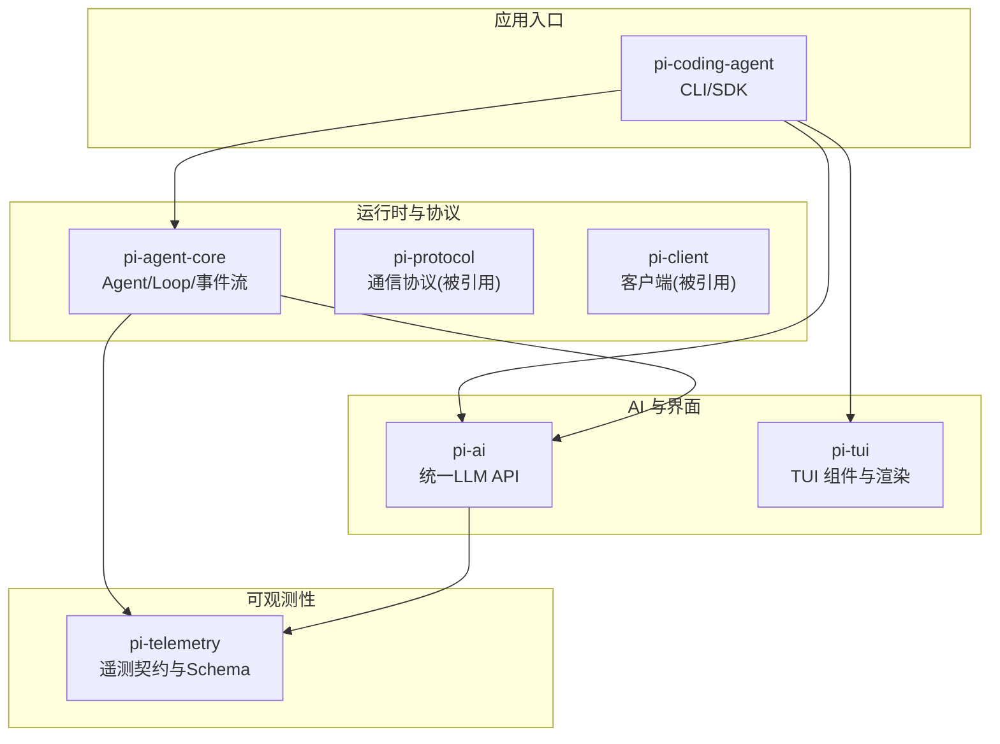
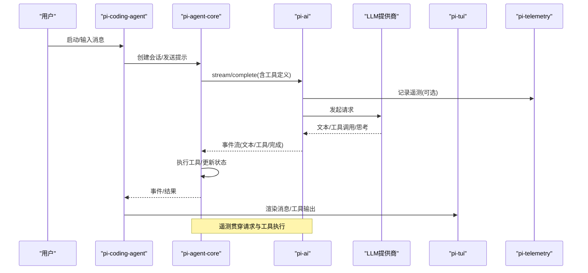
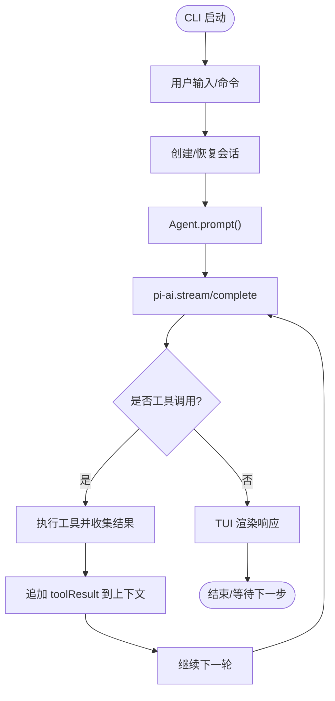
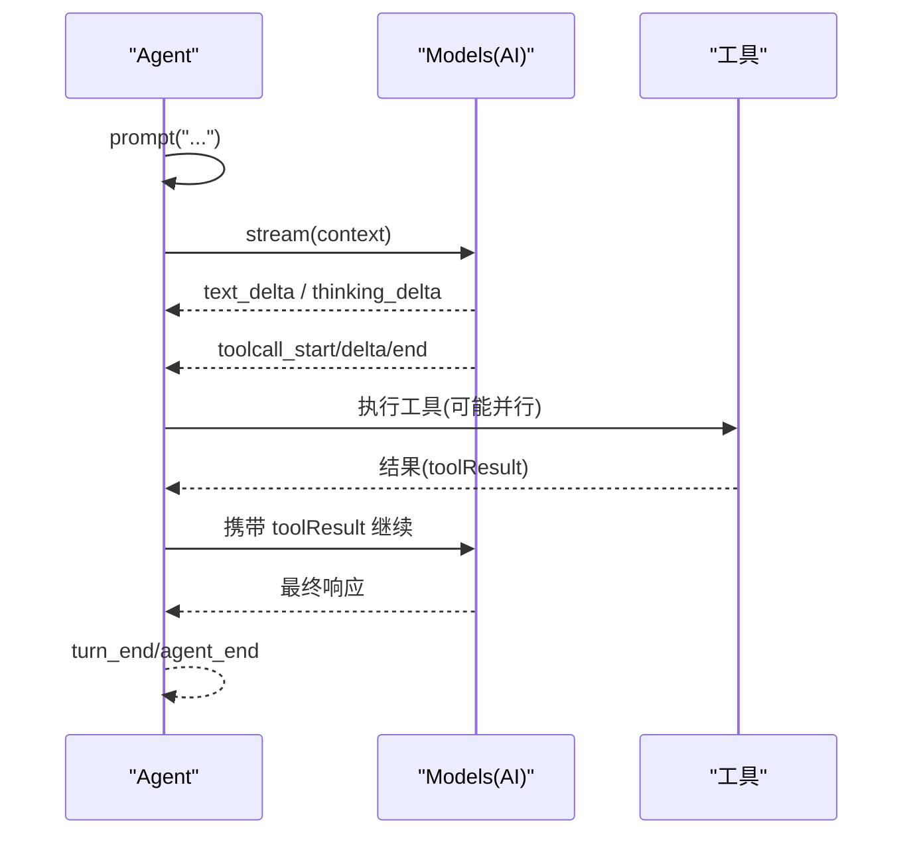
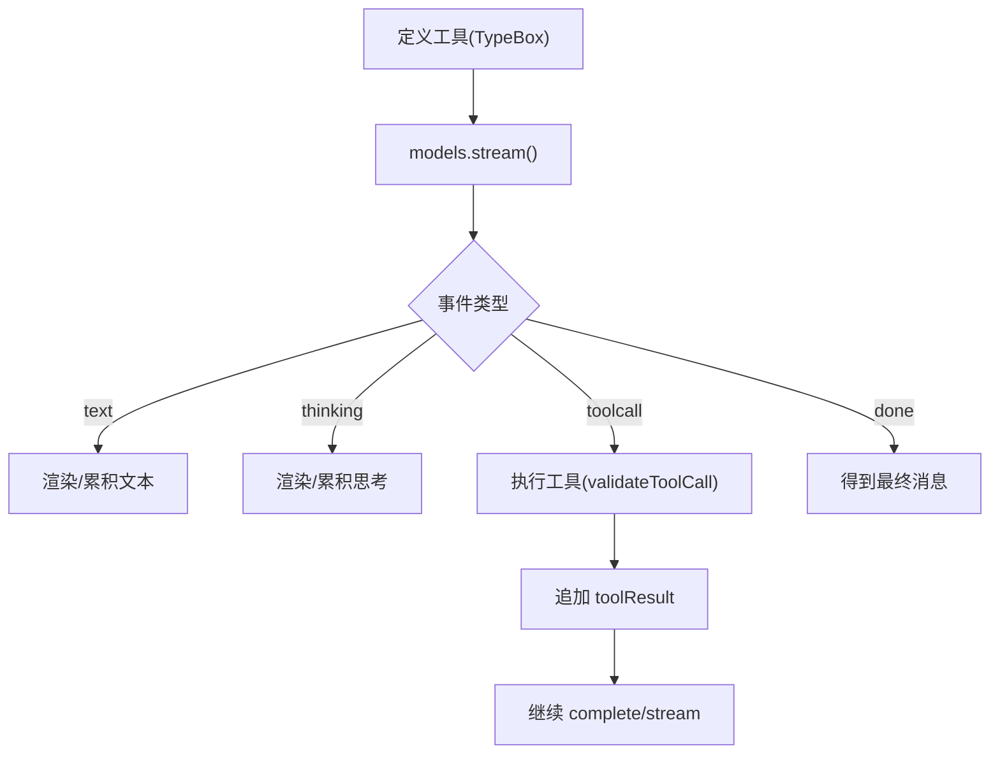
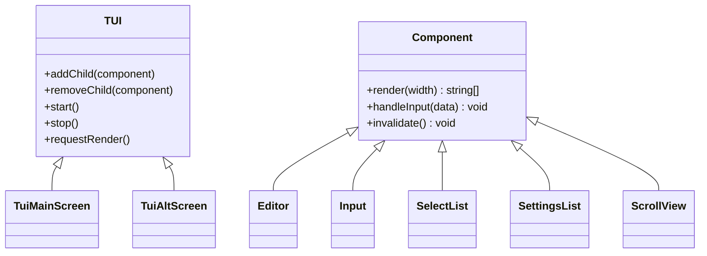
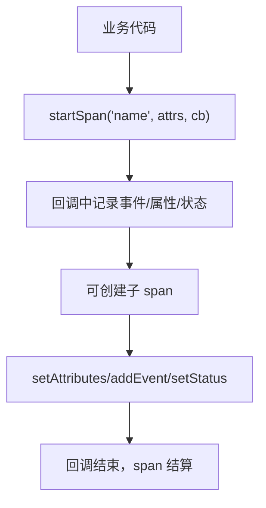
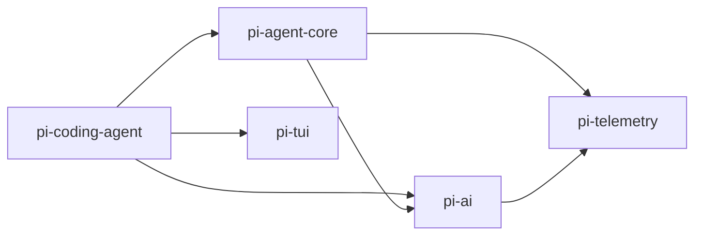

# 核心包说明

<cite>
**本文引用的文件**
- [packages/coding-agent/package.json](file://packages/coding-agent/package.json)
- [packages/coding-agent/README.md](file://packages/coding-agent/README.md)
- [packages/agent/package.json](file://packages/agent/package.json)
- [packages/agent/README.md](file://packages/agent/README.md)
- [packages/ai/package.json](file://packages/ai/package.json)
- [packages/ai/README.md](file://packages/ai/README.md)
- [packages/tui/package.json](file://packages/tui/package.json)
- [packages/tui/README.md](file://packages/tui/README.md)
- [packages/telemetry/package.json](file://packages/telemetry/package.json)
- [packages/telemetry/README.md](file://packages/telemetry/README.md)
</cite>

## 目录
1. [简介](#简介)
2. [项目结构](#项目结构)
3. [核心组件](#核心组件)
4. [架构总览](#架构总览)
5. [详细组件分析](#详细组件分析)
6. [依赖关系分析](#依赖关系分析)
7. [性能考量](#性能考量)
8. [故障排查指南](#故障排查指南)
9. [结论](#结论)
10. [附录](#附录)

## 简介
本说明文档面向 Pi Agent Harness 的核心包，聚焦以下五个关键模块：
- pi-coding-agent（交互式编码代理 CLI）：用户主要入口点，提供交互模式、会话管理、工具与扩展生态。
- pi-agent-core（代理运行时）：处理工具调用、状态管理、事件流与循环控制。
- pi-ai（统一多提供商 LLM API）：封装 OpenAI、Anthropic、Google、Bedrock 等提供商的统一接口，支持工具调用、图像输入/生成、思考/推理能力、认证与模型目录。
- pi-tui（终端 UI 库）：提供差分渲染、可替换渲染器、组件体系、覆盖层与同步输出，用于构建无闪烁的 TUI。
- pi-telemetry（遥测系统）：供应商中立的遥测契约、类型化 Schema、参考实现与测试套件，便于接入任意后端。

## 项目结构
仓库采用 monorepo 组织，核心包位于 packages 目录下，每个包独立发布并维护版本与依赖。各包通过 package.json 暴露入口与导出路径，形成清晰的边界与职责。

图表来源
- [packages/coding-agent/package.json:45-67](file://packages/coding-agent/package.json#L45-L67)
- [packages/agent/package.json:37-44](file://packages/agent/package.json#L37-L44)
- [packages/ai/package.json:62-73](file://packages/ai/package.json#L62-L73)
- [packages/tui/package.json:47-50](file://packages/tui/package.json#L47-L50)
- [packages/telemetry/package.json:1-48](file://packages/telemetry/package.json#L1-L48)

章节来源
- [packages/coding-agent/package.json:1-109](file://packages/coding-agent/package.json#L1-L109)
- [packages/agent/package.json:1-69](file://packages/agent/package.json#L1-L69)
- [packages/ai/package.json:1-101](file://packages/ai/package.json#L1-L101)
- [packages/tui/package.json:1-56](file://packages/tui/package.json#L1-L56)
- [packages/telemetry/package.json:1-48](file://packages/telemetry/package.json#L1-L48)

## 核心组件
本节逐一介绍各包的功能、API 接口、配置选项、使用示例与最佳实践。

### pi-coding-agent（交互式编码代理 CLI）
- 功能与用途
  - 提供交互式 CLI、打印模式、JSON/RPC 模式与 SDK，支持会话树、分支、压缩、上下文文件、技能、提示模板、主题与扩展。
  - 内置 read/write/edit/bash/grep/find/ls 等工具，支持按名称白名单/黑名单控制工具集。
- 主要 API/入口
  - CLI 命令：pi（二进制），支持 --provider/--model/--thinking 等参数；/login、/model、/settings、/session、/compact、/export/import 等交互命令。
  - SDK：createAgentSession、ModelRuntime、SessionManager 等，用于程序化集成。
  - RPC：--mode rpc 通过 stdin/stdout 进行 JSONL 帧通信。
- 配置选项
  - 全局与项目级 settings.json（~/.pi/agent/settings.json 与 .pi/settings.json）。
  - 环境变量：PI_CODING_AGENT_DIR、PI_OFFLINE、PI_SKIP_VERSION_CHECK、PI_TELEMETRY、VISUAL/EDITOR 等。
  - 信任策略：defaultProjectTrust、--approve/--no-approve。
- 使用示例
  - 快速开始：安装后设置 ANTHROPIC_API_KEY 或 /login 选择订阅，直接对话。
  - 非交互：pi -p "Summarize this codebase" 或管道输入 cat README.md | pi -p "..."。
  - 指定模型：pi --provider openai --model gpt-4o "Help me refactor"。
  - 只读模式：pi --tools read,grep,find,ls -p "Review the code"。
- 最佳实践
  - 使用 /compact 或自动压缩避免上下文溢出。
  - 通过 --tools/--exclude-tools 精确控制可用工具。
  - 使用 AGENTS.md/CLAUDE.md 注入项目指令，SYSTEM.md 替换系统提示。
  - 在 CI/非交互场景关闭信任提示，使用 --no-approve 或 defaultProjectTrust=never。
  - 使用 RPC 模式与非 Node 进程集成时，严格遵循 LF 分隔的 JSONL 帧。

章节来源
- [packages/coding-agent/README.md:63-141](file://packages/coding-agent/README.md#L63-L141)
- [packages/coding-agent/README.md:147-233](file://packages/coding-agent/README.md#L147-L233)
- [packages/coding-agent/README.md:236-317](file://packages/coding-agent/README.md#L236-L317)
- [packages/coding-agent/README.md:320-457](file://packages/coding-agent/README.md#L320-L457)
- [packages/coding-agent/README.md:460-491](file://packages/coding-agent/README.md#L460-L491)
- [packages/coding-agent/README.md:514-691](file://packages/coding-agent/README.md#L514-L691)
- [packages/coding-agent/package.json:1-109](file://packages/coding-agent/package.json#L1-L109)

### pi-agent-core（代理运行时）
- 功能与用途
  - 提供 Agent 类与低层 agentLoop/agentLoopContinue，管理消息转换、工具执行、事件流、转向/跟进队列、会话 ID、思考预算等。
- 核心概念
  - AgentMessage vs LLM Message：通过 convertToLlm 过滤/转换自定义消息类型。
  - 事件流：agent_start/turn_start/message_start/update/end/turn_end/agent_end，以及 tool_execution_* 事件。
  - 工具执行模式：parallel（默认）与 sequential，支持 per-tool 覆盖。
- API 与配置
  - Agent 构造：initialState(systemPrompt/model/thinkingLevel/tools/messages)、convertToLlm、transformContext、streamFn、sessionId、getApiKey、toolExecution、beforeToolCall、afterToolCall、shouldStopAfterTurn、thinkingBudgets。
  - 方法：prompt()/continue()、state 读写、abort()/waitForIdle()、subscribe()。
  - 队列：steeringMode/followUpMode、steer()/followUp()/clear*Queues()。
- 使用示例
  - 快速开始：创建 models 集合，设置 provider 与 model，new Agent({ initialState, streamFn })，subscribe 事件，await prompt("Hello!")。
  - 低层 API：直接使用 agentLoop/agentLoopContinue 获取事件流。
- 最佳实践
  - 将 UI 专用消息放入自定义类型并在 convertToLlm 中过滤。
  - 使用 beforeToolCall/afterToolCall 做权限校验与结果审计。
  - 长会话配合 shouldStopAfterTurn 触发压缩。
  - 并行工具执行提升吞吐，但注意顺序相关工具需设为 sequential。

章节来源
- [packages/agent/README.md:15-125](file://packages/agent/README.md#L15-L125)
- [packages/agent/README.md:148-175](file://packages/agent/README.md#L148-L175)
- [packages/agent/README.md:176-243](file://packages/agent/README.md#L176-L243)
- [packages/agent/README.md:245-336](file://packages/agent/README.md#L245-L336)
- [packages/agent/README.md:337-401](file://packages/agent/README.md#L337-L401)
- [packages/agent/README.md:403-510](file://packages/agent/README.md#L403-L510)
- [packages/agent/package.json:1-69](file://packages/agent/package.json#L1-L69)

### pi-ai（统一多提供商 LLM API）
- 功能与用途
  - 统一 Models 集合与 Provider 抽象，支持 OpenAI、Anthropic、Google、Bedrock 等，提供工具调用、图像输入/生成、思考/推理、认证解析、模型目录查询与刷新。
- 主要 API
  - 集合：builtinModels()/createModels()，setProvider/getModel/getModels/getProviders。
  - 流式：models.stream(model, context) 返回事件流（start/text/thinking/toolcall/done/error）。
  - 完成：models.complete(model, context) 返回最终消息。
  - 简单接口：streamSimple/completeSimple。
  - 图像：ImagesModels/builtinImagesModels().generateImages(...)。
- 认证与配置
  - 环境变量：OPENAI_API_KEY、ANTHROPIC_API_KEY、GEMINI_API_KEY 等。
  - 凭证存储：CredentialStore 接口，支持持久化与 OAuth 刷新。
  - 请求头变换：transformHeaders 在 provider auth 之后、分发之前合并/修改头部。
- 工具定义与验证
  - Tool 定义使用 TypeBox schema，支持 constrained sampling（prefer/require）、grammar tools。
  - validateToolCall 在流式 toolcall_end 时校验参数。
- 使用示例
  - 流式文本与工具调用：for await 事件，处理 text_delta/toolcall_delta/toolcall_end，追加 toolResult 继续 complete。
  - 图像输入：content 包含 image block。
  - 图像生成：ImagesModels.generateImages 返回 AssistantImages。
- 最佳实践
  - 按需引入 providers/* 以减小打包体积。
  - 对 Google 等不支持函数调用流式的提供商，注意 toolcall_delta 行为差异。
  - 使用 transformHeaders 注入追踪/租户信息。
  - 谨慎记录遥测属性，避免敏感数据。

章节来源
- [packages/ai/README.md:1-55](file://packages/ai/README.md#L1-L55)
- [packages/ai/README.md:57-91](file://packages/ai/README.md#L57-L91)
- [packages/ai/README.md:92-228](file://packages/ai/README.md#L92-L228)
- [packages/ai/README.md:230-323](file://packages/ai/README.md#L230-L323)
- [packages/ai/README.md:324-457](file://packages/ai/README.md#L324-L457)
- [packages/ai/README.md:458-672](file://packages/ai/README.md#L458-L672)
- [packages/ai/README.md:673-784](file://packages/ai/README.md#L673-L784)
- [packages/ai/package.json:1-101](file://packages/ai/package.json#L1-L101)

### pi-tui（终端用户界面库）
- 功能与用途
  - 提供 TUI 接口与可替换渲染器（主屏幕/备用屏幕），差分渲染、同步输出、覆盖层、组件体系、主题、内联图片、自动补全等。
- 核心 API
  - TUI 接口：addChild/removeChild/start/stop/requestRender/onDebug。
  - 渲染器：TuiMainScreen（保留滚动历史）、TuiAltScreen（固定视口与应用滚动）。
  - 布局：VStack/HStack/ScrollView（仅 AltScreen）。
  - 覆盖层：showOverlay/hideOverlay/hasOverlay，支持定位、尺寸、可见性回调与焦点管理。
  - 组件：Text/TruncatedText/Input/Editor/Markdown/Loader/CancellableLoader/SelectList/SettingsList/Spacer/Image/Box/Container。
  - 自动补全：CombinedAutocompleteProvider（斜杠命令+文件路径）。
  - 键检测：matchesKey/Key。
- 使用示例
  - 快速开始：ProcessTerminal + TuiMainScreen，添加 Text/Editor，设置 focus，tui.start()。
  - 编辑器：设置 onSubmit/onChange、禁用提交、自动补全提供者、动态边框颜色与内边距。
  - Markdown：主题化标题/链接/代码块等样式。
  - 列表与设置：键盘导航、Enter 选择/激活、Esc 取消。
- 最佳实践
  - render(width) 每行宽度不得超过 width，使用 truncateToWidth/wrapTextWithAnsi。
  - IME 支持：Focusable 组件需传播 focused 状态，必要时启用硬件光标。
  - 大粘贴：使用 Bracketed Paste 标记避免卡顿。
  - 性能：缓存渲染输出，仅在必要时 invalidate。

章节来源
- [packages/tui/README.md:1-54](file://packages/tui/README.md#L1-L54)
- [packages/tui/README.md:55-127](file://packages/tui/README.md#L55-L127)
- [packages/tui/README.md:128-205](file://packages/tui/README.md#L128-L205)
- [packages/tui/README.md:206-277](file://packages/tui/README.md#L206-L277)
- [packages/tui/README.md:278-599](file://packages/tui/README.md#L278-L599)
- [packages/tui/README.md:599-663](file://packages/tui/README.md#L599-L663)
- [packages/tui/README.md:664-800](file://packages/tui/README.md#L664-L800)
- [packages/tui/package.json:1-56](file://packages/tui/package.json#L1-L56)

### pi-telemetry（遥测系统）
- 功能与用途
  - 供应商中立的 TelemetryContext/TelemetrySpan 契约、NOOP 与 InMemory 参考实现、类型化 Schema、适配器一致性测试套件。
- 核心概念
  - Span/Attribute/Event/Status/Context；父子关系构成调用树。
- 核心 API
  - startSpan(name, attributes, callback(span))；span.setAttributes/addEvent/setStatus。
  - NOOP_TELEMETRY_CONTEXT：零开销占位。
  - InMemoryTelemetryContext：进程内捕获 getSpans()。
  - 类型化 Schema：defineTelemetrySchema + createTypedSpanStarter，编译期校验 span 名与属性。
- 使用示例
  - 基础：传入 TelemetryContext，startSpan 包裹异步工作，记录事件与属性。
  - 嵌套：父 span 的 childSpan 继续创建子任务。
  - 错误：显式 setStatus({ status:'error', error:{name,message} })。
- 最佳实践
  - 不持久化 span/context；避免记录敏感数据（提示、工具参数/输出、凭据等）。
  - 适配器需满足契约：单次同步调用、保持原生 span 生命周期、幂等合并属性、忽略已结算调用。
  - 使用 testing 子路径运行一致性用例确保适配器正确。

章节来源
- [packages/telemetry/README.md:1-31](file://packages/telemetry/README.md#L1-L31)
- [packages/telemetry/README.md:33-63](file://packages/telemetry/README.md#L33-L63)
- [packages/telemetry/README.md:64-133](file://packages/telemetry/README.md#L64-L133)
- [packages/telemetry/README.md:134-177](file://packages/telemetry/README.md#L134-L177)
- [packages/telemetry/README.md:178-210](file://packages/telemetry/README.md#L178-L210)
- [packages/telemetry/README.md:211-339](file://packages/telemetry/README.md#L211-L339)
- [packages/telemetry/README.md:340-392](file://packages/telemetry/README.md#L340-L392)
- [packages/telemetry/README.md:393-465](file://packages/telemetry/README.md#L393-L465)
- [packages/telemetry/package.json:1-48](file://packages/telemetry/package.json#L1-L48)

## 架构总览
下图展示核心包之间的依赖与数据流向：CLI 作为入口，驱动 Agent 运行时；Agent 通过 pi-ai 与 LLM 提供商交互；TUI 负责终端渲染；Telemetry 贯穿 AI 与 Agent 以采集指标。

图表来源
- [packages/coding-agent/package.json:45-67](file://packages/coding-agent/package.json#L45-L67)
- [packages/agent/package.json:37-44](file://packages/agent/package.json#L37-L44)
- [packages/ai/package.json:62-73](file://packages/ai/package.json#L62-L73)
- [packages/tui/package.json:47-50](file://packages/tui/package.json#L47-L50)
- [packages/telemetry/package.json:1-48](file://packages/telemetry/package.json#L1-L48)

## 详细组件分析

### 组件 A：pi-coding-agent 工作流（CLI → Agent → AI → TUI）
- 流程说明
  - 用户通过 CLI 输入消息，CLI 创建会话并调用 Agent.prompt。
  - Agent 将消息转换为 LLM 格式，调用 pi-ai 流式接口。
  - 若出现工具调用，Agent 执行工具并将结果回传，继续下一轮。
  - TUI 实时渲染消息与工具输出，支持覆盖层与编辑器等。
  - 遥测记录请求、工具执行与耗时。

图表来源
- [packages/coding-agent/README.md:460-491](file://packages/coding-agent/README.md#L460-L491)
- [packages/agent/README.md:65-125](file://packages/agent/README.md#L65-L125)
- [packages/ai/README.md:92-228](file://packages/ai/README.md#L92-L228)
- [packages/tui/README.md:18-54](file://packages/tui/README.md#L18-L54)

章节来源
- [packages/coding-agent/README.md:460-491](file://packages/coding-agent/README.md#L460-L491)
- [packages/agent/README.md:65-125](file://packages/agent/README.md#L65-L125)
- [packages/ai/README.md:92-228](file://packages/ai/README.md#L92-L228)
- [packages/tui/README.md:18-54](file://packages/tui/README.md#L18-L54)

### 组件 B：pi-agent-core 事件与工具执行
- 事件序列
  - prompt() 产生 agent_start → turn_start → message_start/end → message_update → turn_end → agent_end。
  - 工具调用期间插入 tool_execution_start/update/end，随后追加 toolResult 消息。
- 工具执行模式
  - parallel：预检工具调用顺序执行，允许并发执行，完成后按助手源顺序持久化 toolResult。
  - sequential：逐个执行，兼容旧行为。
- 钩子与停止
  - beforeToolCall/afterToolCall 可阻断或改写结果。
  - shouldStopAfterTurn 可在轮次结束后决定是否提前退出。

图表来源
- [packages/agent/README.md:65-125](file://packages/agent/README.md#L65-L125)
- [packages/agent/README.md:176-243](file://packages/agent/README.md#L176-L243)
- [packages/agent/README.md:403-510](file://packages/agent/README.md#L403-L510)

章节来源
- [packages/agent/README.md:65-125](file://packages/agent/README.md#L65-L125)
- [packages/agent/README.md:176-243](file://packages/agent/README.md#L176-L243)
- [packages/agent/README.md:403-510](file://packages/agent/README.md#L403-L510)

### 组件 C：pi-ai 工具与流式处理
- 工具定义与约束
  - 使用 TypeBox 定义参数，支持 constrained sampling 与 grammar tools。
  - validateToolCall 在 toolcall_end 时校验参数。
- 流式事件
  - text_start/delta/end、thinking_start/delta/end、toolcall_start/delta/end、done/error。
- 图像
  - 图像输入通过 content 中的 image block；图像生成通过 ImagesModels.generateImages。

图表来源
- [packages/ai/README.md:458-672](file://packages/ai/README.md#L458-L672)
- [packages/ai/README.md:673-784](file://packages/ai/README.md#L673-L784)

章节来源
- [packages/ai/README.md:458-672](file://packages/ai/README.md#L458-L672)
- [packages/ai/README.md:673-784](file://packages/ai/README.md#L673-L784)

### 组件 D：pi-tui 渲染与组件
- 渲染策略
  - 主屏幕：首次全量输出，后续增量更新；备用屏幕：固定视口与应用滚动。
  - 同步输出：CSI 2026 原子更新，避免闪烁。
- 组件与布局
  - 容器/文本/编辑器/Markdown/列表/设置/图片等；VStack/HStack/ScrollView 组合布局。
  - 覆盖层：弹窗/菜单/模态，支持定位、尺寸、可见性与焦点。
- 输入与补全
  - matchesKey/Key 识别按键；CombinedAutocompleteProvider 支持斜杠命令与文件路径。

图表来源
- [packages/tui/README.md:55-127](file://packages/tui/README.md#L55-L127)
- [packages/tui/README.md:206-277](file://packages/tui/README.md#L206-L277)
- [packages/tui/README.md:278-599](file://packages/tui/README.md#L278-L599)

章节来源
- [packages/tui/README.md:55-127](file://packages/tui/README.md#L55-L127)
- [packages/tui/README.md:206-277](file://packages/tui/README.md#L206-L277)
- [packages/tui/README.md:278-599](file://packages/tui/README.md#L278-L599)

### 组件 E：pi-telemetry 契约与 Schema
- 契约
  - TelemetryContext.startSpan(name, attrs, callback(span))；span.setAttributes/addEvent/setStatus。
  - NOOP 与 InMemory 实现；适配器需满足一致性规范。
- 类型化 Schema
  - defineTelemetrySchema + createTypedSpanStarter 提供编译期校验与推断。
  - 支持 startAttributes/endAttributes/events/status 元数据。

图表来源
- [packages/telemetry/README.md:64-133](file://packages/telemetry/README.md#L64-L133)
- [packages/telemetry/README.md:211-339](file://packages/telemetry/README.md#L211-L339)

章节来源
- [packages/telemetry/README.md:64-133](file://packages/telemetry/README.md#L64-L133)
- [packages/telemetry/README.md:211-339](file://packages/telemetry/README.md#L211-L339)

## 依赖关系分析
- 包间依赖
  - pi-coding-agent 依赖 pi-agent-core、pi-ai、pi-tui、pi-protocol、pi-client。
  - pi-agent-core 依赖 pi-ai、pi-telemetry。
  - pi-ai 依赖多个第三方 SDK（OpenAI、Anthropic、Google、Bedrock 等）与 pi-telemetry。
  - pi-tui 依赖 marked、get-east-asian-width。
  - pi-telemetry 无运行时依赖（仅开发依赖）。
- 耦合与内聚
  - 高内聚：每个包职责清晰，API 边界明确。
  - 低耦合：通过抽象（如 TelemetryContext、Models/Provider）降低耦合。
- 外部依赖
  - pi-ai 直接对接多家 LLM 提供商 SDK；pi-tui 使用 xterm/headless 进行测试。
- 潜在循环依赖
  - 当前结构为单向依赖，未见循环依赖迹象。

图表来源
- [packages/coding-agent/package.json:45-67](file://packages/coding-agent/package.json#L45-L67)
- [packages/agent/package.json:37-44](file://packages/agent/package.json#L37-L44)
- [packages/ai/package.json:62-73](file://packages/ai/package.json#L62-L73)
- [packages/tui/package.json:47-50](file://packages/tui/package.json#L47-L50)
- [packages/telemetry/package.json:1-48](file://packages/telemetry/package.json#L1-L48)

章节来源
- [packages/coding-agent/package.json:45-67](file://packages/coding-agent/package.json#L45-L67)
- [packages/agent/package.json:37-44](file://packages/agent/package.json#L37-L44)
- [packages/ai/package.json:62-73](file://packages/ai/package.json#L62-L73)
- [packages/tui/package.json:47-50](file://packages/tui/package.json#L47-L50)
- [packages/telemetry/package.json:1-48](file://packages/telemetry/package.json#L1-L48)

## 性能考量
- 流式处理：优先使用 models.stream 与 Agent 事件流，减少首屏延迟。
- 工具执行：合理选择 parallel/sequential，避免不必要的串行瓶颈。
- 上下文管理：及时压缩会话，避免上下文溢出导致失败或成本上升。
- TUI 渲染：使用差分更新与同步输出，避免全屏重绘；缓存组件渲染结果。
- 遥测：避免记录大对象或敏感数据；使用类型化 Schema 减少运行时开销。

## 故障排查指南
- 认证问题
  - 检查环境变量或凭证存储是否正确配置；使用 getAuth 诊断认证来源。
- 工具调用失败
  - 确认工具参数符合 schema；在 toolcall_end 使用 validateToolCall 捕获错误。
  - 检查 beforeToolCall/afterToolCall 是否阻断或改写结果。
- 会话上下文溢出
  - 启用自动压缩或手动 /compact；调整 thinking 级别与工具数量。
- TUI 显示异常
  - 确保 render(width) 每行不超过 width；IME 输入需实现 Focusable 并传播 focused。
  - 备用屏幕下图片兼容性：iTerm2 内联图可能回退为文本。
- 遥测数据缺失
  - 确认传入有效 TelemetryContext；适配器需满足契约；使用 InMemory 调试。

章节来源
- [packages/ai/README.md:324-457](file://packages/ai/README.md#L324-L457)
- [packages/agent/README.md:403-510](file://packages/agent/README.md#L403-L510)
- [packages/tui/README.md:206-277](file://packages/tui/README.md#L206-L277)
- [packages/telemetry/README.md:118-177](file://packages/telemetry/README.md#L118-L177)

## 结论
Pi Agent Harness 通过清晰的包边界与抽象，提供了从 CLI 到运行时、从 LLM 统一到终端界面的完整能力。推荐：
- 使用 pi-coding-agent 作为用户入口与集成点。
- 在需要细粒度控制时使用 pi-agent-core 的事件与工具机制。
- 通过 pi-ai 屏蔽提供商差异，安全地调用工具与图像能力。
- 用 pi-tui 构建高性能、无闪烁的终端界面。
- 借助 pi-telemetry 建立可观测性，适配任意后端。

## 附录
- 选择包的指导原则
  - 需要开箱即用的 CLI 与生态：选择 pi-coding-agent。
  - 需要自定义 Agent 循环与工具编排：选择 pi-agent-core。
  - 需要统一调用多家 LLM：选择 pi-ai。
  - 需要构建 TUI：选择 pi-tui。
  - 需要可插拔遥测：选择 pi-telemetry。
- 参考路径
  - CLI 快速开始与命令：[packages/coding-agent/README.md:63-141](file://packages/coding-agent/README.md#L63-L141)
  - Agent 事件与工具：[packages/agent/README.md:65-125](file://packages/agent/README.md#L65-L125)
  - AI 工具与流式：[packages/ai/README.md:458-672](file://packages/ai/README.md#L458-L672)
  - TUI 组件与布局：[packages/tui/README.md:278-599](file://packages/tui/README.md#L278-L599)
  - Telemetry 契约与 Schema：[packages/telemetry/README.md:64-133](file://packages/telemetry/README.md#L64-L133)