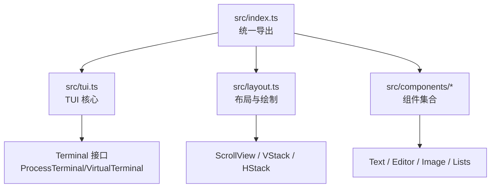
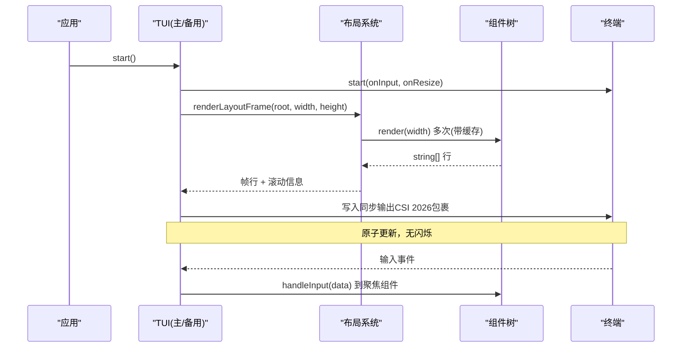
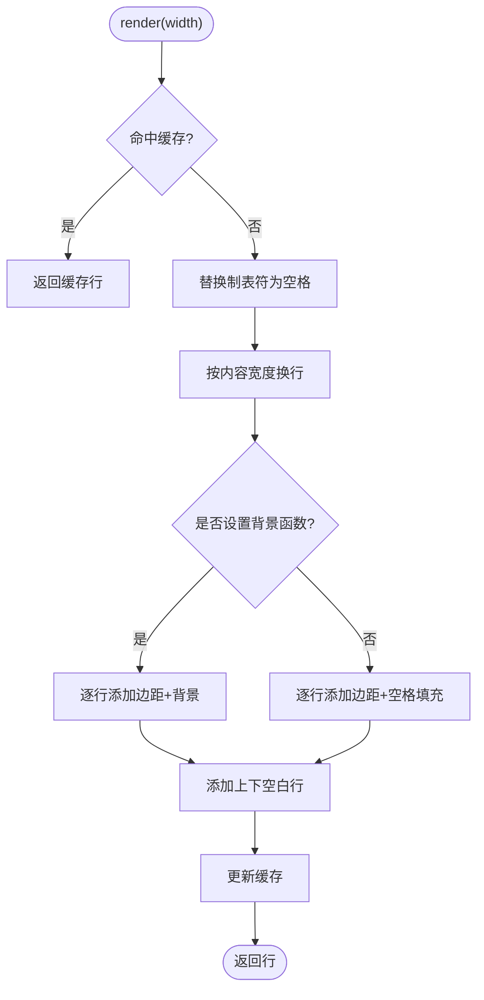
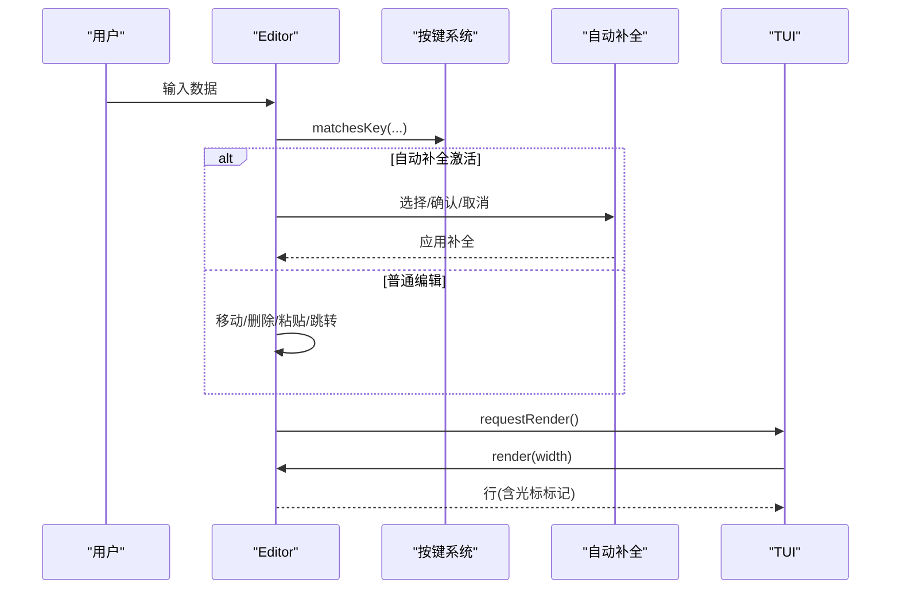
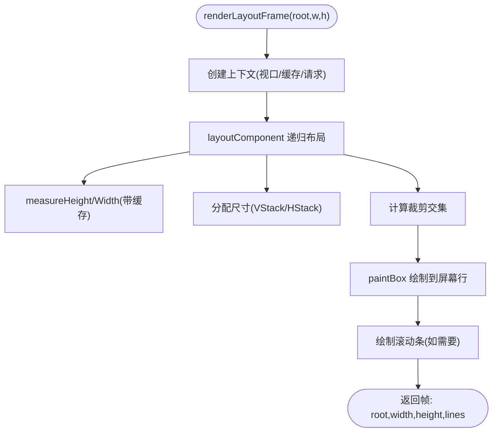
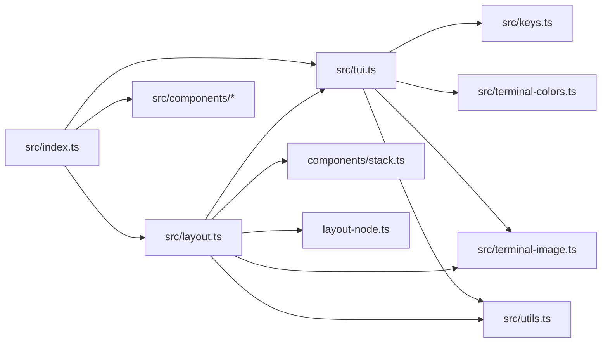

# 终端界面包 (pi-tui)

<cite>
**本文引用的文件**
- [README.md](file://packages/tui/README.md)
- [package.json](file://packages/tui/package.json)
- [index.ts](file://packages/tui/src/index.ts)
- [tui.ts](file://packages/tui/src/tui.ts)
- [layout.ts](file://packages/tui/src/layout.ts)
- [text.ts](file://packages/tui/src/components/text.ts)
- [editor.ts](file://packages/tui/src/components/editor.ts)
</cite>

## 目录
1. [简介](#简介)
2. [项目结构](#项目结构)
3. [核心组件](#核心组件)
4. [架构总览](#架构总览)
5. [详细组件分析](#详细组件分析)
6. [依赖关系分析](#依赖关系分析)
7. [性能考虑](#性能考虑)
8. [故障排查指南](#故障排查指南)
9. [结论](#结论)
10. [附录](#附录)

## 简介
pi-tui 是一个面向 Node.js 的终端用户界面（TUI）库，提供现代化的 TUI 组件与渲染引擎。其核心特性包括：
- 可插拔渲染器：统一的 TUI 接口，支持主屏幕与备用屏幕两种渲染模式
- 差分渲染：仅更新变化的行或视口行，减少输出量
- 应用级滚动：在备用屏幕中实现鼠标、触控板与键盘导航的滚动
- 同步输出：使用 CSI 2026 进行原子屏幕更新，避免闪烁
- 括号粘贴模式：正确处理大段粘贴内容
- 组件化：基于 Component 接口的简单模型
- 主题定制：组件接受主题接口以自定义样式
- 内置组件：Text、TruncatedText、Input、Editor、Markdown、Loader、SelectList、SettingsList、Spacer、Image、Box、Container、VStack、HStack、ScrollView 等
- 内联图片：在支持 Kitty 或 iTerm2 图形协议的终端中渲染图片
- 自动补全：支持路径与斜杠命令

该包适用于构建高效、无闪烁、响应式的交互式 CLI 应用。

**章节来源**
- [README.md:1-17](file://packages/tui/README.md#L1-L17)

## 项目结构
pi-tui 采用按功能划分的模块化组织方式：
- src/index.ts：统一导出所有公共 API
- src/tui.ts：核心 TUI 抽象、容器、覆盖层、焦点管理、输入监听、渲染调度
- src/layout.ts：布局系统（VStack/HStack/ScrollView）、裁剪、绘制、滚动条
- src/components/*：具体 UI 组件（文本、编辑器、列表、图片等）
- 其他工具模块：按键处理、颜色方案、图像协议、输入法光标标记等

**图示来源**
- [index.ts:1-143](file://packages/tui/src/index.ts#L1-L143)
- [tui.ts:291-329](file://packages/tui/src/tui.ts#L291-L329)
- [layout.ts:353-382](file://packages/tui/src/layout.ts#L353-L382)

**章节来源**
- [index.ts:1-143](file://packages/tui/src/index.ts#L1-L143)
- [package.json:1-56](file://packages/tui/package.json#L1-L56)

## 核心组件
- TUI 接口与渲染器
  - TUI 是共享接口，负责组件管理、焦点、覆盖层、输入、生命周期、终端查询与渲染
  - 具体实现：TuiMainScreen（主缓冲，保留滚动历史）、TuiAltScreen（固定高度视口，应用级滚动）
- 组件接口
  - render(width): 返回每行不超过 width 的行数组
  - handleInput?(data): 当组件获得焦点时接收键盘输入
  - invalidate?(): 清除缓存以便下次完整重绘
- 焦点与 IME 支持
  - Focusable 接口：focused 由 TUI 设置；组件在渲染输出中插入 CURSOR_MARKER，TUI 定位硬件光标用于 IME 候选窗口定位
- 覆盖层（Overlays）
  - showOverlay/hideOverlay：支持锚点、百分比/绝对定位、边距、可见性回调、非捕获焦点等
- 布局系统
  - VStack/HStack/ScrollView：为备用屏幕提供受限区域分配与独立滚动
- 内置组件
  - Text、TruncatedText、Input、Editor、Markdown、Loader、CancellableLoader、SelectList、SettingsList、Spacer、Image、Box、Container 等

**章节来源**
- [tui.ts:23-47](file://packages/tui/src/tui.ts#L23-L47)
- [tui.ts:57-81](file://packages/tui/src/tui.ts#L57-L81)
- [tui.ts:122-186](file://packages/tui/src/tui.ts#L122-L186)
- [tui.ts:291-329](file://packages/tui/src/tui.ts#L291-L329)
- [README.md:55-127](file://packages/tui/README.md#L55-L127)
- [README.md:206-277](file://packages/tui/README.md#L206-L277)
- [README.md:278-598](file://packages/tui/README.md#L278-L598)

## 架构总览
下图展示了 pi-tui 的核心架构：TUI 作为入口协调组件树、布局系统与终端输出；布局系统负责计算可视区域、裁剪与绘制；组件通过 render 输出 ANSI 行；TUI 将变更合并为最小输出并包裹同步输出序列以避免闪烁。

**图示来源**
- [tui.ts:691-705](file://packages/tui/src/tui.ts#L691-L705)
- [tui.ts:757-790](file://packages/tui/src/tui.ts#L757-L790)
- [layout.ts:353-382](file://packages/tui/src/layout.ts#L353-L382)
- [README.md:652-663](file://packages/tui/README.md#L652-L663)

## 详细组件分析

### 文本组件（Text）
- 功能：多行文本显示、自动换行、左右上下内边距、可选背景色函数
- 性能：缓存文本、宽度与行结果，避免重复计算
- 行为：空文本不输出；ANSI 代码保持；支持精确宽度填充

**图示来源**
- [text.ts:45-105](file://packages/tui/src/components/text.ts#L45-L105)

**章节来源**
- [text.ts:1-107](file://packages/tui/src/components/text.ts#L1-L107)

### 编辑器组件（Editor）
- 功能：多行编辑、自动补全（斜杠命令与文件路径）、大段粘贴处理、历史记录、撤销栈、字符跳转、滚动显示
- 交互：丰富的快捷键绑定（删除、移动、复制/粘贴、跳转等）
- 渲染：边框、滚动指示、光标高亮、IME 光标定位（CURSOR_MARKER）
- 性能：分段器感知粘贴标记、视觉行映射、按需滚动与可见行切片

**图示来源**
- [editor.ts:270-353](file://packages/tui/src/components/editor.ts#L270-L353)
- [editor.ts:482-601](file://packages/tui/src/components/editor.ts#L482-L601)
- [editor.ts:603-800](file://packages/tui/src/components/editor.ts#L603-L800)

**章节来源**
- [editor.ts:1-800](file://packages/tui/src/components/editor.ts#L1-L800)

### 布局系统（VStack/HStack/ScrollView）
- 功能：为备用屏幕提供受限区域的分配与滚动；支持 primary 滚动视图、滚动条绘制、Kitty 图片裁剪
- 算法：测量子组件宽高、分配尺寸、裁剪交集、绘制合成、滚动偏移调整
- 性能：渲染缓存 Map<Component, Map<width, lines[]>>；增量绘制与裁剪

**图示来源**
- [layout.ts:62-83](file://packages/tui/src/layout.ts#L62-L83)
- [layout.ts:100-241](file://packages/tui/src/layout.ts#L100-L241)
- [layout.ts:243-351](file://packages/tui/src/layout.ts#L243-L351)
- [layout.ts:353-382](file://packages/tui/src/layout.ts#L353-L382)

**章节来源**
- [layout.ts:1-411](file://packages/tui/src/layout.ts#L1-L411)

### 覆盖层（Overlays）
- 能力：多种定位策略（锚点、百分比、绝对坐标）、边距、可见性回调、非捕获焦点、焦点恢复
- 行为：隐藏/显示、聚焦/失焦、层级顺序、与基础内容的叠加合成

**章节来源**
- [tui.ts:122-186](file://packages/tui/src/tui.ts#L122-L186)
- [tui.ts:545-684](file://packages/tui/src/tui.ts#L545-L684)
- [README.md:128-205](file://packages/tui/README.md#L128-L205)

## 依赖关系分析
- 运行时依赖
  - get-east-asian-width：东亚字符宽度计算
  - marked：Markdown 解析
- 开发依赖
  - @xterm/headless：虚拟终端用于测试
  - chalk：终端颜色辅助（示例与主题）
- 内部模块依赖
  - index.ts 聚合导出各子系统
  - tui.ts 依赖 keys、terminal-colors、terminal-image、utils
  - layout.ts 依赖 components/stack、layout-node、terminal-image、tui、utils
  - components/* 依赖 tui、utils、keys、keybindings 等

**图示来源**
- [index.ts:1-143](file://packages/tui/src/index.ts#L1-L143)
- [tui.ts:5-18](file://packages/tui/src/tui.ts#L5-L18)
- [layout.ts:1-6](file://packages/tui/src/layout.ts#L1-L6)

**章节来源**
- [package.json:47-54](file://packages/tui/package.json#L47-L54)
- [index.ts:1-143](file://packages/tui/src/index.ts#L1-L143)

## 性能考虑
- 差分渲染与缓存
  - 组件级缓存：Text 缓存文本、宽度与行；布局系统对每个组件按宽度缓存行
  - 增量绘制：仅绘制可见区域与变化行，结合裁剪提升效率
- 渲染节流
  - requestRender 合并多次请求，避免频繁刷新；支持立即渲染抢占
- 同步输出
  - 使用 CSI 2026 包裹输出，确保原子更新，避免闪烁
- 输入批处理
  - StdinBuffer 支持批量分割，提高大输入场景稳定性
- 图片优化
  - Kitty 图片支持视口裁剪；iTerm2 内联图在备用模式下回退为文本占位以避免残留

**章节来源**
- [tui.ts:339-346](file://packages/tui/src/tui.ts#L339-L346)
- [tui.ts:757-790](file://packages/tui/src/tui.ts#L757-L790)
- [layout.ts:62-83](file://packages/tui/src/layout.ts#L62-L83)
- [README.md:652-663](file://packages/tui/README.md#L652-L663)

## 故障排查指南
- 行宽越界错误
  - 现象：组件 render 返回的行超过 width 导致错误
  - 解决：使用 truncateToWidth 或 wrapTextWithAnsi 保证每行宽度合规
- IME 候选窗口错位
  - 现象：中文/日文/韩文输入候选窗口位置不正确
  - 解决：实现 Focusable 并在光标处输出 CURSOR_MARKER；必要时启用硬件光标
- 覆盖层焦点丢失
  - 现象：隐藏/显示覆盖层后焦点未正确恢复
  - 解决：使用 OverlayHandle.unfocus({ target }) 明确目标或使用默认恢复策略
- 滚动异常
  - 现象：滚动条不显示或滚动位置错乱
  - 解决：检查 ScrollView 的 primary 标志与视口高度；确认布局根已设置
- 图片残留
  - 现象：备用模式下图片残留或无法裁剪
  - 解决：在 iTerm2 下使用文本占位；Kitty 下确保视口裁剪逻辑生效

**章节来源**
- [README.md:206-277](file://packages/tui/README.md#L206-L277)
- [README.md:595-598](file://packages/tui/README.md#L595-L598)
- [tui.ts:545-684](file://packages/tui/src/tui.ts#L545-L684)
- [layout.ts:243-351](file://packages/tui/src/layout.ts#L243-L351)

## 结论
pi-tui 提供了完整的终端 UI 解决方案：从组件模型、布局系统到渲染引擎与输入处理，均围绕高性能与无闪烁的目标设计。通过差分渲染、同步输出、覆盖层与主题机制，开发者可以快速构建现代化、可定制的 TUI 应用。其跨平台兼容性与无障碍支持（IME）进一步提升了用户体验。

## 附录
- 快速开始与常用 API
  - 创建终端与 TUI、添加组件、设置焦点、启动与停止
  - 备用屏幕布局：VStack/HStack/ScrollView
  - 覆盖层：showOverlay/hideOverlay 及定位选项
  - 组件：Text、Editor、Markdown、Loader、SelectList、SettingsList、Image、Box、Container、Spacer 等
  - 自动补全：CombinedAutocompleteProvider
  - 按键检测：matchesKey 与 Key 助手
  - 工具：visibleWidth、truncateToWidth、wrapTextWithAnsi
- 自定义组件开发
  - 实现 Component 接口，确保每行宽度合规
  - 如需 IME 支持，实现 Focusable 并输出 CURSOR_MARKER
  - 合理使用缓存与 invalidate
- 样式配置
  - 通过主题接口（EditorTheme、MarkdownTheme、ImageTheme 等）定制外观
- 无障碍访问
  - IME 光标定位、硬件光标开关、覆盖层焦点管理

**章节来源**
- [README.md:18-127](file://packages/tui/README.md#L18-L127)
- [README.md:278-598](file://packages/tui/README.md#L278-L598)
- [README.md:599-705](file://packages/tui/README.md#L599-L705)
- [README.md:707-792](file://packages/tui/README.md#L707-L792)