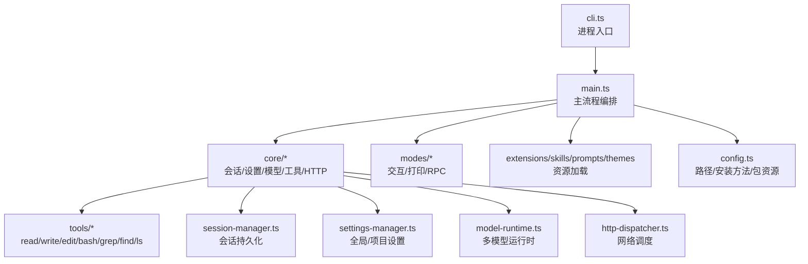
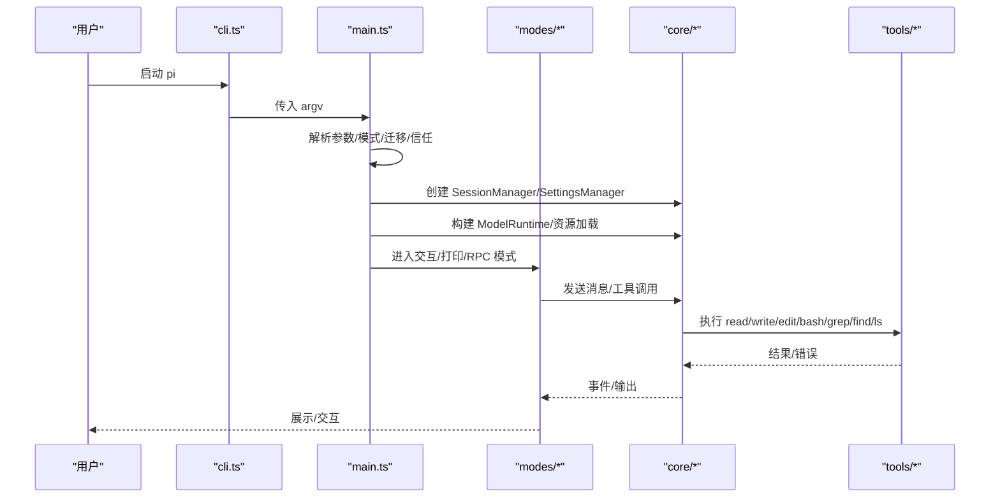
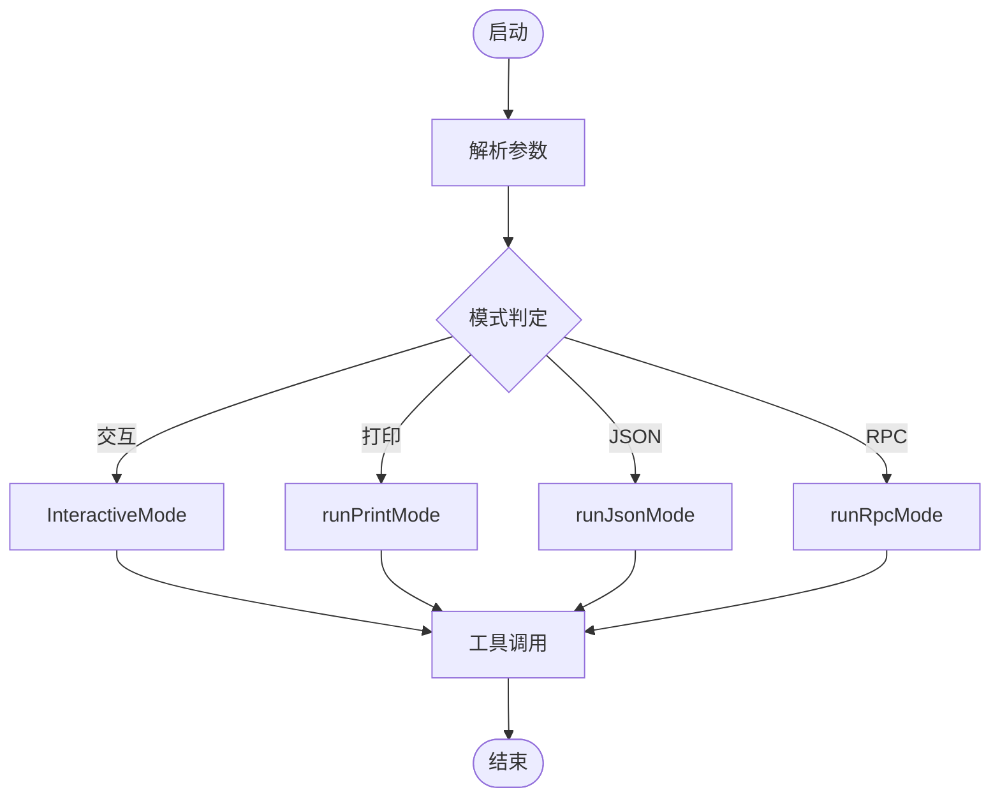
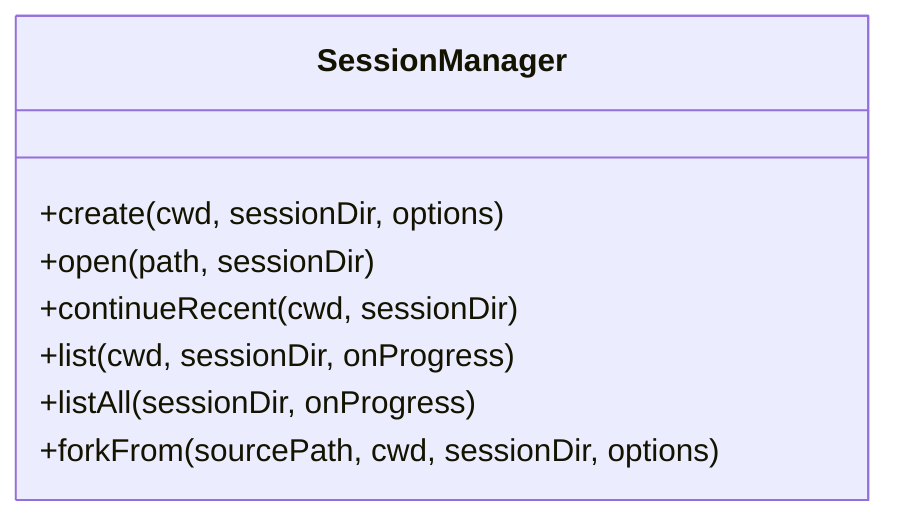
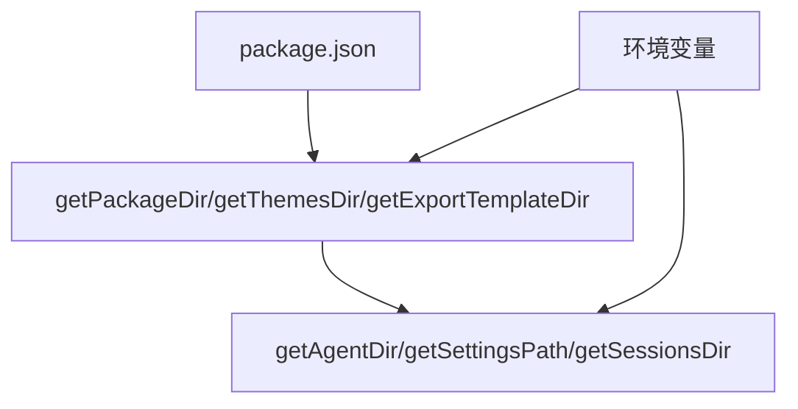
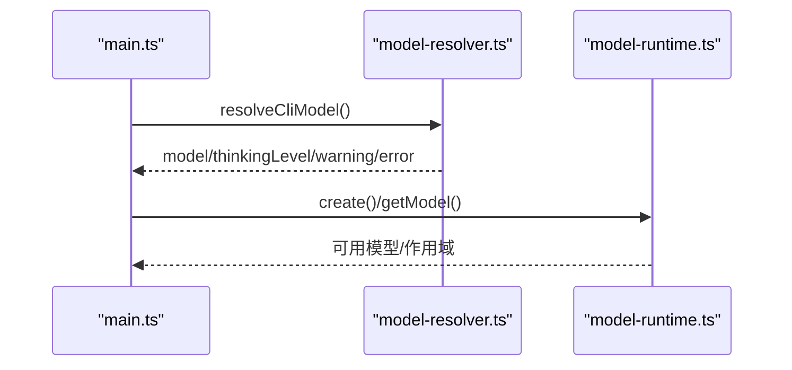
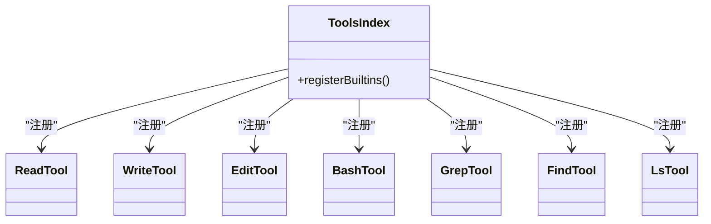
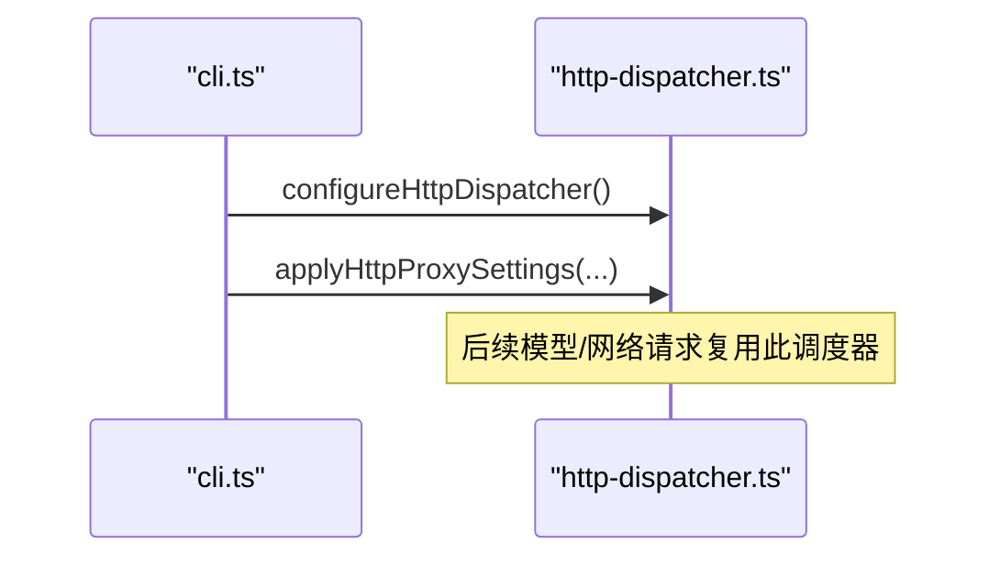
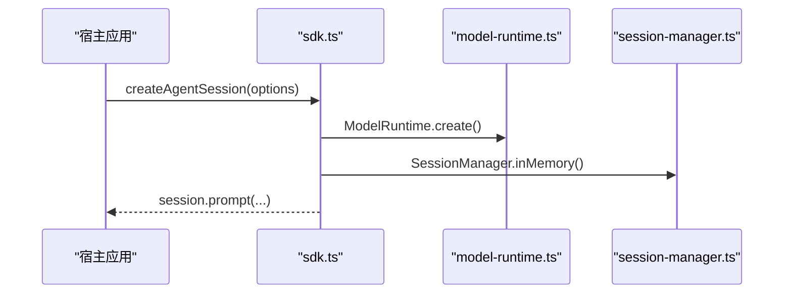
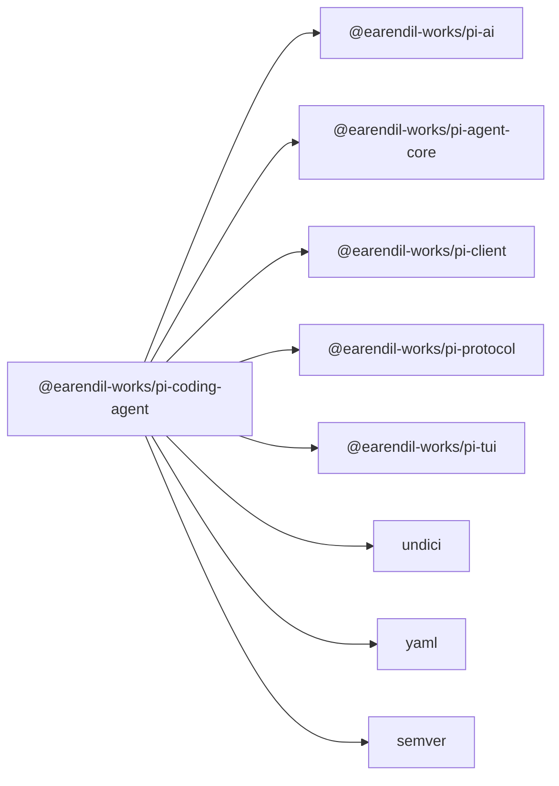

# 编码代理包 (pi-coding-agent)

<cite>
**本文引用的文件**
- [packages/coding-agent/README.md](file://packages/coding-agent/README.md)
- [packages/coding-agent/package.json](file://packages/coding-agent/package.json)
- [packages/coding-agent/src/cli.ts](file://packages/coding-agent/src/cli.ts)
- [packages/coding-agent/src/main.ts](file://packages/coding-agent/src/main.ts)
- [packages/coding-agent/src/config.ts](file://packages/coding-agent/src/config.ts)
- [packages/coding-agent/src/core/tools/index.ts](file://packages/coding-agent/src/core/tools/index.ts)
- [packages/coding-agent/src/core/tools/bash.ts](file://packages/coding-agent/src/core/tools/bash.ts)
- [packages/coding-agent/src/core/tools/read.ts](file://packages/coding-agent/src/core/tools/read.ts)
- [packages/coding-agent/src/core/tools/write.ts](file://packages/coding-agent/src/core/tools/write.ts)
- [packages/coding-agent/src/core/tools/edit.ts](file://packages/coding-agent/src/core/tools/edit.ts)
- [packages/coding-agent/src/core/tools/grep.ts](file://packages/coding-agent/src/core/tools/grep.ts)
- [packages/coding-agent/src/core/tools/find.ts](file://packages/coding-agent/src/core/tools/find.ts)
- [packages/coding-agent/src/core/tools/ls.ts](file://packages/coding-agent/src/core/tools/ls.ts)
- [packages/coding-agent/src/core/session-manager.ts](file://packages/coding-agent/src/core/session-manager.ts)
- [packages/coding-agent/src/core/settings-manager.ts](file://packages/coding-agent/src/core/settings-manager.ts)
- [packages/coding-agent/src/core/model-runtime.ts](file://packages/coding-agent/src/core/model-runtime.ts)
- [packages/coding-agent/src/core/model-resolver.ts](file://packages/coding-agent/src/core/model-resolver.ts)
- [packages/coding-agent/src/core/http-dispatcher.ts](file://packages/coding-agent/src/core/http-dispatcher.ts)
- [packages/coding-agent/src/core/sdk.ts](file://packages/coding-agent/src/core/sdk.ts)
</cite>

## 目录
1. [简介](#简介)
2. [项目结构](#项目结构)
3. [核心组件](#核心组件)
4. [架构总览](#架构总览)
5. [详细组件分析](#详细组件分析)
6. [依赖关系分析](#依赖关系分析)
7. [性能考虑](#性能考虑)
8. [故障排查指南](#故障排查指南)
9. [结论](#结论)
10. [附录：API 参考与最佳实践](#附录api-参考与最佳实践)

## 简介
pi-coding-agent 是用户与 AI 代理交互的主要入口点，提供交互式命令行界面（CLI），内置文件操作、命令执行、网络请求等工具能力，并支持会话管理、配置系统、扩展机制和多种运行模式（交互、打印、JSON、RPC）。它通过统一的模型运行时对接多家 LLM 提供商，结合可扩展的工具与技能体系，帮助用户以自然语言驱动开发工作流。

## 项目结构
该包采用分层组织方式：
- CLI 层：负责参数解析、模式选择、启动流程编排
- 核心层：会话管理、设置管理、模型运行时、HTTP 调度器、工具集、导出与 HTML 渲染等
- 模式层：交互模式、打印模式、RPC 模式
- 扩展与资源：扩展、技能、提示模板、主题、上下文文件加载
- 配置与路径：统一的路径与安装方法检测、包资源定位、用户配置目录

图表来源
- [packages/coding-agent/src/cli.ts:1-22](file://packages/coding-agent/src/cli.ts#L1-L22)
- [packages/coding-agent/src/main.ts:1-120](file://packages/coding-agent/src/main.ts#L1-L120)
- [packages/coding-agent/src/config.ts:357-567](file://packages/coding-agent/src/config.ts#L357-L567)

章节来源
- [packages/coding-agent/README.md:13-59](file://packages/coding-agent/README.md#L13-L59)
- [packages/coding-agent/package.json:1-44](file://packages/coding-agent/package.json#L1-L44)

## 核心组件
- CLI 入口与主流程：cli.ts 设置进程名与环境变量，初始化 HTTP 调度器后调用 main；main.ts 完成参数解析、模式判定、迁移、信任决策、会话创建、资源加载、模型选择与工具控制，最终进入对应模式运行。
- 会话管理：SessionManager 负责创建、打开、继续、分支、列表与 ID 解析，支持本地与全局搜索、跨项目会话引用与 fork。
- 设置管理：SettingsManager 提供全局与项目级设置合并、诊断收集、默认值与模型范围控制。
- 模型运行时：ModelRuntime 与 ModelResolver 负责模型发现、作用域匹配、思考级别与提供商选择。
- 工具集：内置 read、write、edit、bash、grep、find、ls 等工具，可通过 CLI 选项启用/禁用或白名单过滤。
- 配置系统：统一的用户配置目录、包资源路径、安装方法检测、更新指令生成。
- HTTP 调度器：基于 undici 的全局调度器配置，支持代理与传输策略。

章节来源
- [packages/coding-agent/src/cli.ts:1-22](file://packages/coding-agent/src/cli.ts#L1-L22)
- [packages/coding-agent/src/main.ts:118-133](file://packages/coding-agent/src/main.ts#L118-L133)
- [packages/coding-agent/src/core/session-manager.ts](file://packages/coding-agent/src/core/session-manager.ts)
- [packages/coding-agent/src/core/settings-manager.ts](file://packages/coding-agent/src/core/settings-manager.ts)
- [packages/coding-agent/src/core/model-runtime.ts](file://packages/coding-agent/src/core/model-runtime.ts)
- [packages/coding-agent/src/core/model-resolver.ts](file://packages/coding-agent/src/core/model-resolver.ts)
- [packages/coding-agent/src/core/tools/index.ts](file://packages/coding-agent/src/core/tools/index.ts)
- [packages/coding-agent/src/config.ts:357-567](file://packages/coding-agent/src/config.ts#L357-L567)
- [packages/coding-agent/src/core/http-dispatcher.ts](file://packages/coding-agent/src/core/http-dispatcher.ts)

## 架构总览
下图展示了从 CLI 到核心服务再到工具的调用链路与数据流向。

图表来源
- [packages/coding-agent/src/cli.ts:1-22](file://packages/coding-agent/src/cli.ts#L1-L22)
- [packages/coding-agent/src/main.ts:569-800](file://packages/coding-agent/src/main.ts#L569-L800)
- [packages/coding-agent/src/core/tools/index.ts](file://packages/coding-agent/src/core/tools/index.ts)

## 详细组件分析

### CLI 与主流程
- 进程初始化：设置进程名、环境变量、抑制警告，配置 HTTP 调度器。
- 模式判定：根据 TTY、显式模式标志决定交互/打印/JSON/RPC。
- 会话与信任：处理 --continue/--resume/--session/--fork/--no-session，解析项目信任与资源加载。
- 模型与作用域：解析 --provider/--model/--thinking/--models，应用默认模型与作用域。
- 工具控制：--tools/--exclude-tools/--no-builtin-tools/--no-tools。
- 资源加载：扩展、技能、提示模板、主题、上下文文件。
- 运行模式：进入 InteractiveMode、runPrintMode 或 runRpcMode。

图表来源
- [packages/coding-agent/src/main.ts:118-133](file://packages/coding-agent/src/main.ts#L118-L133)
- [packages/coding-agent/src/main.ts:569-800](file://packages/coding-agent/src/main.ts#L569-L800)

章节来源
- [packages/coding-agent/src/cli.ts:1-22](file://packages/coding-agent/src/cli.ts#L1-L22)
- [packages/coding-agent/src/main.ts:569-800](file://packages/coding-agent/src/main.ts#L569-L800)

### 会话管理
- 会话存储：JSONL 树形结构，支持分支与回溯。
- 会话解析：支持路径、本地 ID、全局 ID 前缀匹配。
- 分支与克隆：/tree、/fork、/clone 与 CLI --fork。
- 压缩：自动/手动 compact，保留完整历史。

图表来源
- [packages/coding-agent/src/core/session-manager.ts](file://packages/coding-agent/src/core/session-manager.ts)

章节来源
- [packages/coding-agent/README.md:236-281](file://packages/coding-agent/README.md#L236-L281)
- [packages/coding-agent/src/main.ts:245-451](file://packages/coding-agent/src/main.ts#L245-L451)

### 配置系统与路径
- 安装方法检测：bun-binary/npm/pnpm/yarn/bun/unknown，用于自更新与权限判断。
- 包资源定位：theme、export-html、assets、package.json、README、CHANGELOG。
- 用户配置目录：~/.pi/agent/*，含 settings.json、auth.json、sessions、prompts、tools、bin。
- 环境变量：PI_CODING_AGENT_DIR、PI_OFFLINE、PI_SKIP_VERSION_CHECK、PI_TELEMETRY 等。

图表来源
- [packages/coding-agent/src/config.ts:357-567](file://packages/coding-agent/src/config.ts#L357-L567)

章节来源
- [packages/coding-agent/src/config.ts:73-355](file://packages/coding-agent/src/config.ts#L73-L355)
- [packages/coding-agent/src/config.ts:357-567](file://packages/coding-agent/src/config.ts#L357-L567)

### 模型运行时与作用域
- 模型解析：支持 provider/id 与 thinking 级别简写，作用域过滤与默认模型选择。
- 提供商认证：检查凭据、刷新令牌、输出状态。
- 传输策略：SSE/WebSocket/auto 的传输偏好。

图表来源
- [packages/coding-agent/src/main.ts:468-548](file://packages/coding-agent/src/main.ts#L468-L548)
- [packages/coding-agent/src/core/model-resolver.ts](file://packages/coding-agent/src/core/model-resolver.ts)
- [packages/coding-agent/src/core/model-runtime.ts](file://packages/coding-agent/src/core/model-runtime.ts)

章节来源
- [packages/coding-agent/src/main.ts:468-548](file://packages/coding-agent/src/main.ts#L468-L548)

### 工具集（内置）
- 文件读取：read 工具
- 文件写入：write 工具
- 差异编辑：edit 工具
- 命令执行：bash 工具
- 文本搜索：grep 工具
- 目录查找：find 工具
- 目录列出：ls 工具

图表来源
- [packages/coding-agent/src/core/tools/index.ts](file://packages/coding-agent/src/core/tools/index.ts)
- [packages/coding-agent/src/core/tools/read.ts](file://packages/coding-agent/src/core/tools/read.ts)
- [packages/coding-agent/src/core/tools/write.ts](file://packages/coding-agent/src/core/tools/write.ts)
- [packages/coding-agent/src/core/tools/edit.ts](file://packages/coding-agent/src/core/tools/edit.ts)
- [packages/coding-agent/src/core/tools/bash.ts](file://packages/coding-agent/src/core/tools/bash.ts)
- [packages/coding-agent/src/core/tools/grep.ts](file://packages/coding-agent/src/core/tools/grep.ts)
- [packages/coding-agent/src/core/tools/find.ts](file://packages/coding-agent/src/core/tools/find.ts)
- [packages/coding-agent/src/core/tools/ls.ts](file://packages/coding-agent/src/core/tools/ls.ts)

章节来源
- [packages/coding-agent/README.md:578-587](file://packages/coding-agent/README.md#L578-L587)

### 网络与 HTTP 调度
- 全局调度器：在启动早期配置 undici 的 dispatcher，确保后续 SDK 请求使用统一代理/传输策略。
- 代理设置：从设置中读取 httpProxy 并应用。

图表来源
- [packages/coding-agent/src/cli.ts:17-21](file://packages/coding-agent/src/cli.ts#L17-L21)
- [packages/coding-agent/src/core/http-dispatcher.ts](file://packages/coding-agent/src/core/http-dispatcher.ts)

章节来源
- [packages/coding-agent/src/cli.ts:17-21](file://packages/coding-agent/src/cli.ts#L17-L21)
- [packages/coding-agent/src/main.ts:586-590](file://packages/coding-agent/src/main.ts#L586-L590)

### 程序化使用与 SDK
- SDK 入口：createAgentSession、ModelRuntime、SessionManager.inMemory()
- 非 Node 集成：RPC 模式，严格 LF 分隔的 JSONL 帧

图表来源
- [packages/coding-agent/src/core/sdk.ts](file://packages/coding-agent/src/core/sdk.ts)
- [packages/coding-agent/src/core/model-runtime.ts](file://packages/coding-agent/src/core/model-runtime.ts)
- [packages/coding-agent/src/core/session-manager.ts](file://packages/coding-agent/src/core/session-manager.ts)

章节来源
- [packages/coding-agent/README.md:460-491](file://packages/coding-agent/README.md#L460-L491)

## 依赖关系分析
- 内部依赖：@earendil-works/pi-ai、pi-agent-core、pi-client、pi-protocol、pi-tui
- 外部依赖：chalk、cross-spawn、diff、glob、undici、yaml、semver、typebox 等
- 可选依赖：剪贴板库
- 覆盖依赖：protobufjs、rimraf、gaxios.rimraf

图表来源
- [packages/coding-agent/package.json:45-77](file://packages/coding-agent/package.json#L45-L77)

章节来源
- [packages/coding-agent/package.json:45-77](file://packages/coding-agent/package.json#L45-L77)

## 性能考虑
- 会话压缩：长会话自动/手动压缩，减少上下文占用，避免溢出。
- 模型作用域：限制可切换模型集合，减少模型发现开销。
- 工具白名单：仅启用必要工具，降低模型调用成本。
- 传输策略：优先 SSE/WebSocket 以提升响应速度。
- 离线模式：关闭网络检查与遥测，减少启动时延。

[本节为通用指导，不直接分析具体文件]

## 故障排查指南
- 认证问题：使用 /login 或 pi auth 子命令检查凭据状态；必要时刷新令牌。
- 会话找不到：确认 --session/--fork 参数是否指向有效路径或 ID；跨项目会话需 fork。
- 工具不可用：检查 --tools/--exclude-tools/--no-builtin-tools/--no-tools 组合是否正确。
- 网络异常：检查代理设置与 PI_OFFLINE；确认 HTTP 调度器已正确配置。
- 调试日志：查看 ~/.pi/agent/pi-debug.log 获取详细日志。

章节来源
- [packages/coding-agent/src/config.ts:558-567](file://packages/coding-agent/src/config.ts#L558-L567)
- [packages/coding-agent/README.md:578-617](file://packages/coding-agent/README.md#L578-L617)

## 结论
pi-coding-agent 提供了强大的 CLI 与可扩展的代理框架，涵盖会话管理、配置系统、模型运行时与丰富的内置工具。通过清晰的模式划分与资源加载机制，用户可以在交互式、批处理与进程集成场景下高效使用 AI 代理进行开发与自动化任务。

[本节为总结性内容，不直接分析具体文件]

## 附录：API 参考与最佳实践

### 快速开始
- 安装：通过 npm 全局安装或使用官方安装脚本。
- 认证：设置 API Key 或通过订阅登录。
- 首次对话：直接输入需求，默认提供 read、write、edit、bash 四个工具。

章节来源
- [packages/coding-agent/README.md:63-93](file://packages/coding-agent/README.md#L63-L93)

### 常用命令用法
- 交互模式：直接运行 pi 或在末尾附加初始消息。
- 非交互模式：-p 或 --mode json 输出结果。
- 会话管理：--continue、--resume、--session、--fork、--no-session、--name。
- 模型选项：--provider、--model、--thinking、--models、--list-models。
- 工具选项：--tools、--exclude-tools、--no-builtin-tools、--no-tools。
- 资源选项：--extension、--skill、--prompt-template、--theme、--no-context-files。
- 其他选项：--system-prompt、--append-system-prompt、--tui-mode、--verbose、--approve/--no-approve、--help、--version。

章节来源
- [packages/coding-agent/README.md:514-663](file://packages/coding-agent/README.md#L514-L663)

### 自定义工具开发
- 通过扩展注册新工具或替换内置工具。
- 使用 SDK 暴露工具接口，并在扩展中实现逻辑。
- 将扩展放入 ~/.pi/agent/extensions/ 或 .pi/extensions/，或通过 pi package 管理。

章节来源
- [packages/coding-agent/README.md:369-399](file://packages/coding-agent/README.md#L369-L399)

### 错误处理与调试技巧
- 使用 /hotkeys 查看快捷键与帮助。
- 使用 /session 查看当前会话信息。
- 使用 /compact 压缩上下文。
- 使用 --verbose 开启详细启动日志。
- 查看调试日志文件位置。

章节来源
- [packages/coding-agent/README.md:173-204](file://packages/coding-agent/README.md#L173-L204)
- [packages/coding-agent/src/config.ts:558-567](file://packages/coding-agent/src/config.ts#L558-L567)

### 最佳实践建议
- 明确工具白名单，仅启用所需工具以降低风险与成本。
- 合理设置模型作用域，提升切换效率。
- 利用会话分支与压缩管理长对话。
- 使用扩展与技能定制工作流，保持核心最小化。
- 在生产环境考虑容器化或沙箱隔离。

[本节为通用指导，不直接分析具体文件]