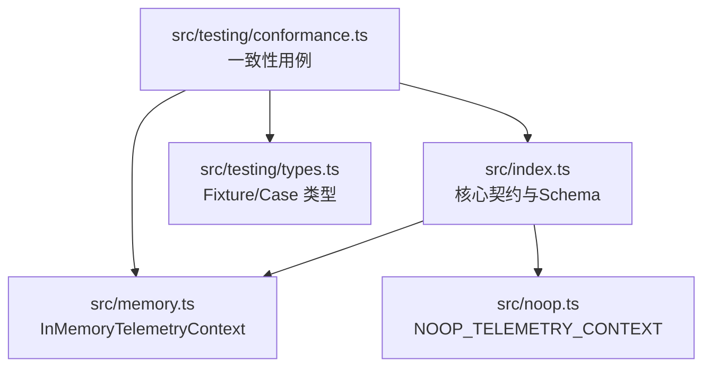
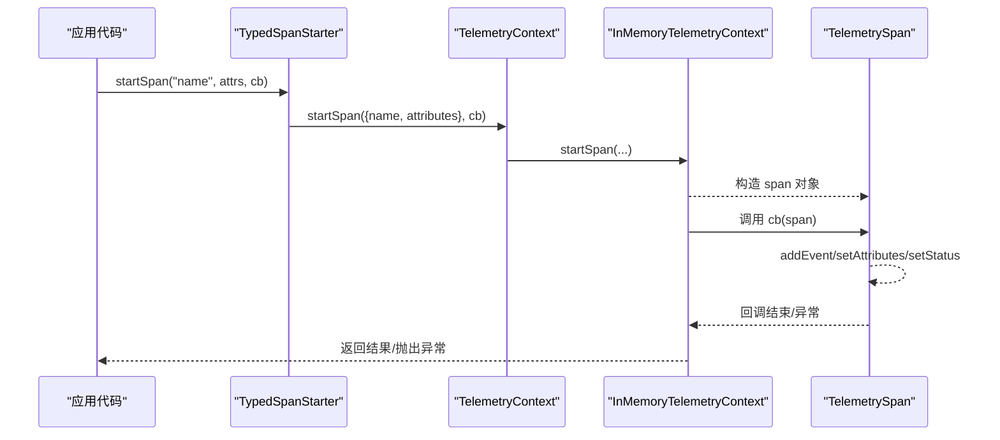
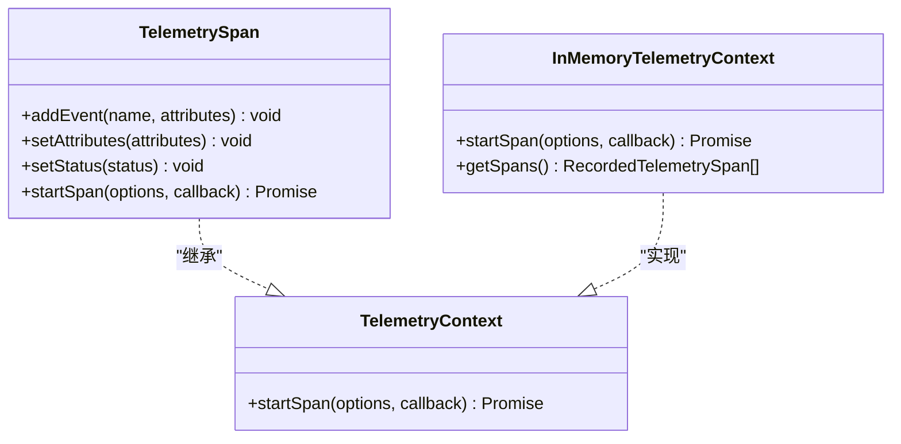
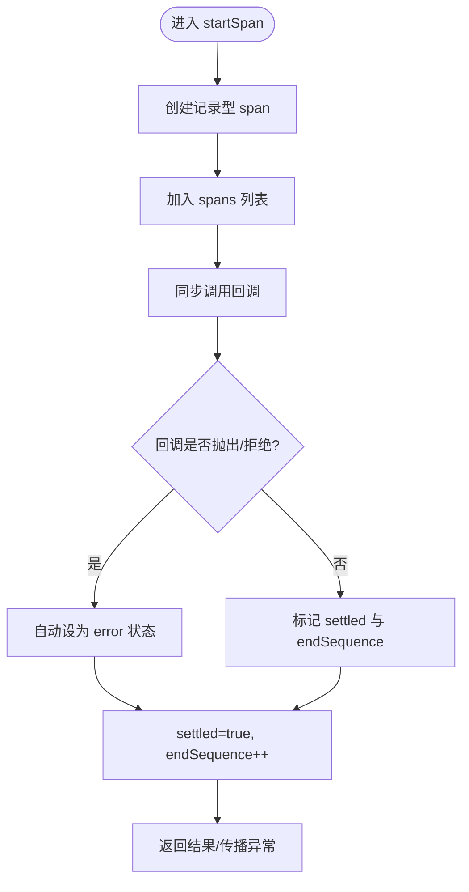
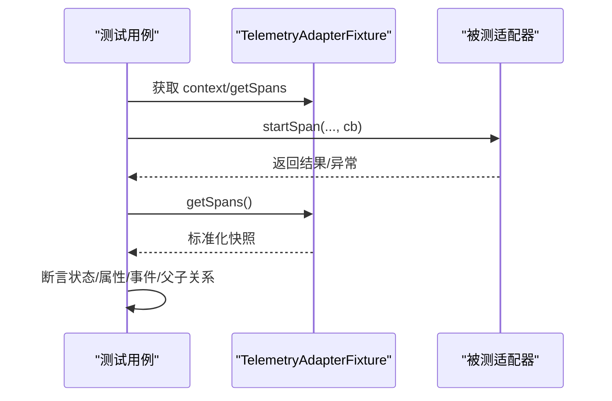
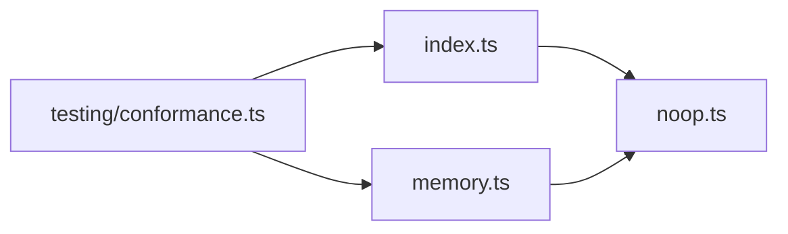

# 遥测包 (pi-telemetry)

<cite>
**本文引用的文件**
- [packages/telemetry/package.json](file://packages/telemetry/package.json)
- [packages/telemetry/README.md](file://packages/telemetry/README.md)
- [packages/telemetry/src/index.ts](file://packages/telemetry/src/index.ts)
- [packages/telemetry/src/memory.ts](file://packages/telemetry/src/memory.ts)
- [packages/telemetry/src/noop.ts](file://packages/telemetry/src/noop.ts)
- [packages/telemetry/src/testing/index.ts](file://packages/telemetry/src/testing/index.ts)
- [packages/telemetry/src/testing/conformance.ts](file://packages/telemetry/src/testing/conformance.ts)
- [packages/telemetry/src/testing/types.ts](file://packages/telemetry/src/testing/types.ts)
</cite>

## 目录
1. [简介](#简介)
2. [项目结构](#项目结构)
3. [核心组件](#核心组件)
4. [架构总览](#架构总览)
5. [详细组件分析](#详细组件分析)
6. [依赖关系分析](#依赖关系分析)
7. [性能考量](#性能考量)
8. [故障排查指南](#故障排查指南)
9. [结论](#结论)
10. [附录：API 参考与最佳实践](#附录api-参考与最佳实践)

## 简介
pi-telemetry 是一个厂商中立的遥测契约与类型化 Schema 工具集，用于在 pi 生态中统一采集性能指标、使用统计和错误追踪。它提供：
- 基于回调的 TelemetryContext / TelemetrySpan 契约；
- 共享的 NOOP_TELEMETRY_CONTEXT；
- 进程内参考实现 InMemoryTelemetryContext；
- 可序列化的 Schema 定义与 TypeScript 类型推断；
- 无导出器、无全局当前 span 状态、无后端依赖。

应用可使用内存参考实现或自行实现适配器对接 OpenTelemetry、Sentry、日志等后端。pi 各包显式传递上下文并各自维护领域 Schema。

## 项目结构
该包采用“契约 + 参考实现 + 测试套件”的分层组织：
- src/index.ts：核心契约、Schema 定义与类型推断、Typed Span Starter；
- src/memory.ts：进程内参考实现（InMemoryTelemetryContext）；
- src/noop.ts：空实现（NOOP_TELEMETRY_CONTEXT）；
- src/testing/*：适配器一致性测试套件与类型。

图表来源
- [packages/telemetry/src/index.ts:14-22](file://packages/telemetry/src/index.ts#L14-L22)
- [packages/telemetry/src/memory.ts:192-219](file://packages/telemetry/src/memory.ts#L192-L219)
- [packages/telemetry/src/noop.ts:1-21](file://packages/telemetry/src/noop.ts#L1-L21)
- [packages/telemetry/src/testing/conformance.ts:61-315](file://packages/telemetry/src/testing/conformance.ts#L61-L315)
- [packages/telemetry/src/testing/types.ts:1-19](file://packages/telemetry/src/testing/types.ts#L1-L19)

章节来源
- [packages/telemetry/package.json:1-48](file://packages/telemetry/package.json#L1-L48)
- [packages/telemetry/README.md:1-465](file://packages/telemetry/README.md#L1-L465)

## 核心组件
- TelemetryContext：通过 startSpan(name, callback) 启动一个带生命周期的 span，并在回调中传入子级 span 作为上下文。
- TelemetrySpan：记录事件、属性、状态，并可继续创建子 span。
- NOOP_TELEMETRY_CONTEXT：当不需要遥测时使用的空实现，零开销。
- InMemoryTelemetryContext：进程内参考实现，按开始顺序返回快照，便于测试与本地诊断。
- Typed Span Starter：基于 Schema 的类型安全入口，编译期校验 span 名称与属性。

章节来源
- [packages/telemetry/src/index.ts:14-22](file://packages/telemetry/src/index.ts#L14-L22)
- [packages/telemetry/src/index.ts:71-74](file://packages/telemetry/src/index.ts#L71-L74)
- [packages/telemetry/src/index.ts:324-354](file://packages/telemetry/src/index.ts#L324-L354)
- [packages/telemetry/src/noop.ts:1-21](file://packages/telemetry/src/noop.ts#L1-L21)
- [packages/telemetry/src/memory.ts:192-219](file://packages/telemetry/src/memory.ts#L192-L219)

## 架构总览
pi-telemetry 将“契约”与“实现”解耦：
- 上层业务代码仅依赖 TelemetryContext 与 TelemetrySpan；
- 通过 createTypedSpanStarter 绑定 Schema，获得类型安全的 span 启动器；
- 运行时可选择 NOOP 或 InMemory 实现；
- 自定义适配器只需实现 TelemetryContext，即可接入任意后端。

图表来源
- [packages/telemetry/src/index.ts:324-354](file://packages/telemetry/src/index.ts#L324-L354)
- [packages/telemetry/src/memory.ts:120-186](file://packages/telemetry/src/memory.ts#L120-L186)

## 详细组件分析

### 核心契约与类型推断（index.ts）
- 基础类型：AttributeValue、SpanAttributes、SpanOptions、SpanStatus。
- 接口：TelemetryContext、TelemetrySpan。
- Schema：defineTelemetrySchema 返回可序列化数据，配合 createTypedSpanStarter 生成强类型的 span 启动器。
- 类型推断：从 Schema 推导 start/end 属性、事件名与事件属性，确保编译期正确性。

图表来源
- [packages/telemetry/src/index.ts:14-22](file://packages/telemetry/src/index.ts#L14-L22)
- [packages/telemetry/src/memory.ts:192-219](file://packages/telemetry/src/memory.ts#L192-L219)

章节来源
- [packages/telemetry/src/index.ts:1-358](file://packages/telemetry/src/index.ts#L1-L358)

### 空实现（noop.ts）
- 共享不可变 span 对象；
- 同步执行回调，透传返回值与异常；
- 不记录任何遥测数据，适合禁用遥测场景。

章节来源
- [packages/telemetry/src/noop.ts:1-21](file://packages/telemetry/src/noop.ts#L1-L21)

### 进程内参考实现（memory.ts）
- 以数组存储 spans，分配递增 id 与 endSequence；
- 自动合并属性、追加事件、设置状态；
- 回调结束后根据是否异常自动设置 error 状态（除非已显式设置）；
- getSpans() 返回深拷贝快照，避免外部修改内部状态。

图表来源
- [packages/telemetry/src/memory.ts:89-99](file://packages/telemetry/src/memory.ts#L89-L99)
- [packages/telemetry/src/memory.ts:120-186](file://packages/telemetry/src/memory.ts#L120-L186)

章节来源
- [packages/telemetry/src/memory.ts:1-220](file://packages/telemetry/src/memory.ts#L1-L220)

### 适配器一致性测试（testing/*）
- conformance.ts 提供一组与测试框架无关的用例，覆盖：
  - 回调生命周期（单次同步准入、结果/拒绝值保持）；
  - 状态语义（最后写入优先、自动/显式状态）；
  - 记录行为（属性合并、事件有序、失败调用原子忽略）；
  - 父级关系（嵌套与并发父子关系、endSequence 顺序）；
  - 被动性（不可读 payload 不抛错、不影响业务）。
- types.ts 定义 Fixture 与 Case 类型。

图表来源
- [packages/telemetry/src/testing/conformance.ts:61-315](file://packages/telemetry/src/testing/conformance.ts#L61-L315)
- [packages/telemetry/src/testing/types.ts:1-19](file://packages/telemetry/src/testing/types.ts#L1-L19)

章节来源
- [packages/telemetry/src/testing/conformance.ts:1-316](file://packages/telemetry/src/testing/conformance.ts#L1-L316)
- [packages/telemetry/src/testing/types.ts:1-19](file://packages/telemetry/src/testing/types.ts#L1-L19)

## 依赖关系分析
- index.ts 暴露契约与 Schema 工具，不依赖具体后端；
- memory.ts 依赖 noop.ts 以在父 span 已 settle 时回退为 no-op；
- testing/* 依赖 index.ts 与 memory.ts 的类型与快照结构，验证适配器契约。

图表来源
- [packages/telemetry/src/index.ts:24-24](file://packages/telemetry/src/index.ts#L24-L24)
- [packages/telemetry/src/memory.ts:9-9](file://packages/telemetry/src/memory.ts#L9-L9)
- [packages/telemetry/src/testing/conformance.ts:1-8](file://packages/telemetry/src/testing/conformance.ts#L1-L8)

章节来源
- [packages/telemetry/src/index.ts:1-358](file://packages/telemetry/src/index.ts#L1-L358)
- [packages/telemetry/src/memory.ts:1-220](file://packages/telemetry/src/memory.ts#L1-L220)
- [packages/telemetry/src/testing/conformance.ts:1-316](file://packages/telemetry/src/testing/conformance.ts#L1-L316)

## 性能考量
- 无全局状态与异步本地存储：避免运行时环境耦合与额外开销；
- 记录方法同步且被动：即使底层读取失败也不影响业务逻辑；
- 属性合并与事件追加为 O(n) 操作，n 为属性/事件数量；合理控制属性基数与事件频率；
- InMemoryTelemetryContext 存储无界，生产环境应限制采样或使用适配器缓冲/丢弃策略；
- NOOP 实现零开销，适合禁用遥测或热路径旁路。

[本节为通用指导，不直接分析具体文件]

## 故障排查指南
- 回调未被调用或调用多次：检查适配器是否保证“同步单次准入”；
- 状态被意外覆盖：确认未重复 setStatus，或理解“最后写入优先”；
- 属性丢失或未合并：检查 setAttributes 调用时机与 undefined 值处理；
- 事件顺序不符预期：确认事件添加顺序与并发边界；
- 异常后状态不正确：若未显式设置状态，异常将被自动记为 error；
- 不可读 payload：适配器需静默忽略，不应中断业务。

章节来源
- [packages/telemetry/src/testing/conformance.ts:61-315](file://packages/telemetry/src/testing/conformance.ts#L61-L315)
- [packages/telemetry/src/memory.ts:78-99](file://packages/telemetry/src/memory.ts#L78-L99)

## 结论
pi-telemetry 提供了稳定、可移植、类型安全的遥测契约与工具链，使不同包可以独立定义领域 Schema 并通过统一的上下文进行观测。通过一致性测试套件，可快速验证自定义适配器的正确性。结合合理的采样与隐私策略，可在不影响性能的前提下获得高质量的观测数据。

[本节为总结，不直接分析具体文件]

## 附录：API 参考与最佳实践

### API 概览
- 核心类型与值
  - TelemetryContext：启动 span 的上下文；
  - TelemetrySpan：记录事件、属性、状态，并可创建子 span；
  - SpanOptions/SpanAttributes/AttributeValue：span 选项与属性；
  - SpanStatus：ok 或 error（含可选 name/message）；
  - NOOP_TELEMETRY_CONTEXT：空实现；
  - InMemoryTelemetryContext：进程内参考实现；
  - RecordedTelemetrySpan/RecordedTelemetryEvent：快照类型。
- Schema 与类型推断
  - defineTelemetrySchema：声明式 Schema；
  - createTypedSpanStarter：绑定上下文与 Schema，生成类型安全的 span 启动器；
  - 各类 Infer* 类型：从 Schema 推导属性与事件类型。
- 测试子路径
  - createTelemetryAdapterConformance：生成与测试框架无关的一致性用例；
  - TelemetryAdapterFixture/TelemetryAdapterConformanceCase：夹具与用例类型。

章节来源
- [packages/telemetry/src/index.ts:1-358](file://packages/telemetry/src/index.ts#L1-L358)
- [packages/telemetry/src/testing/index.ts:1-7](file://packages/telemetry/src/testing/index.ts#L1-L7)
- [packages/telemetry/src/testing/types.ts:1-19](file://packages/telemetry/src/testing/types.ts#L1-L19)

### 配置与集成要点
- 选择实现：开发/测试用 InMemoryTelemetryContext；生产可替换为自定义适配器；
- 显式传递上下文：所有需要观测的函数接收 TelemetryContext 参数，避免隐式全局；
- 使用 Schema：为每个领域定义 Schema，借助 createTypedSpanStarter 获得编译期保护；
- 适配器要求：
  - 同步单次准入回调；
  - 保持返回值与拒绝值不变；
  - 直到回调 promise 结算才结束 span；
  - 默认 ok，异常或拒绝自动 error（除非显式设置）；
  - 记录方法必须同步、被动、非抛错；
  - 结算后的调用应被忽略；
  - 捕获并抑制后端失败，不影响业务回调。

章节来源
- [packages/telemetry/README.md:118-132](file://packages/telemetry/README.md#L118-L132)
- [packages/telemetry/src/memory.ts:120-186](file://packages/telemetry/src/memory.ts#L120-L186)

### 数据导出与后端集成
- 本包不包含导出器；请实现 TelemetryContext 适配器，将 span/事件/状态映射到目标后端；
- 适配器可负责缓冲、采样、刷新、后端 ID 与上下文传播；
- 使用一致性测试套件验证适配器行为符合契约。

章节来源
- [packages/telemetry/README.md:118-132](file://packages/telemetry/README.md#L118-L132)
- [packages/telemetry/src/testing/conformance.ts:61-315](file://packages/telemetry/src/testing/conformance.ts#L61-L315)

### 隐私与安全
- 遥测为进程内诊断数据，不要持久化 span/上下文/后端对象；
- 属性值限制为基础标量与数组；避免记录提示词、完成内容、工具输入输出、文件内容、请求体、头部、凭据与自由文本错误详情，除非 Schema 与数据策略明确允许；
- 不使用 AsyncLocalStorage 或其他运行时特定上下文 API，跨 Node/Bun/浏览器/Worker 可移植。

章节来源
- [packages/telemetry/README.md:385-392](file://packages/telemetry/README.md#L385-L392)

### 最佳实践
- 在热路径使用 NOOP 或高吞吐适配器；
- 控制属性基数与事件频率，避免高基数键导致聚合成本上升；
- 使用 Schema 约束属性集合，减少漂移与误用；
- 对敏感字段标注 sensitive 元信息，由下游策略决定是否保留；
- 通过一致性测试保障适配器稳定性与可移植性。

[本节为通用指导，不直接分析具体文件]