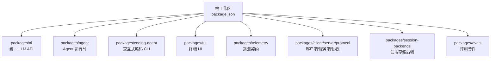
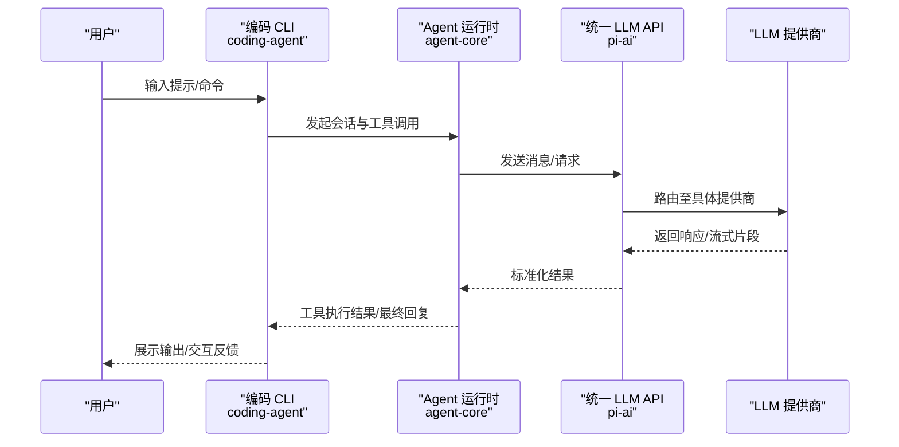
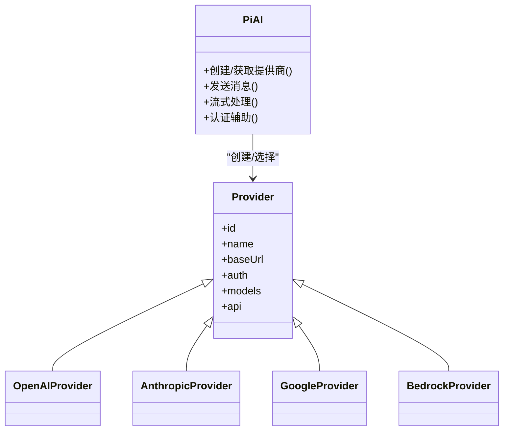
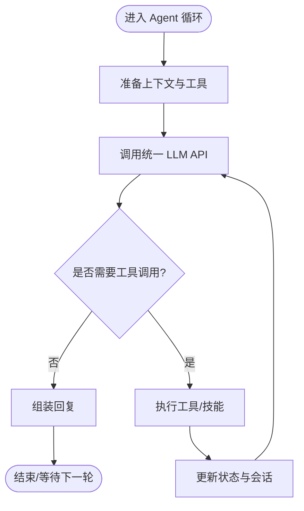
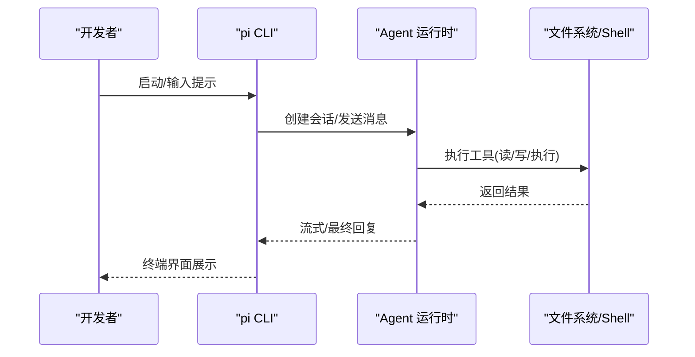
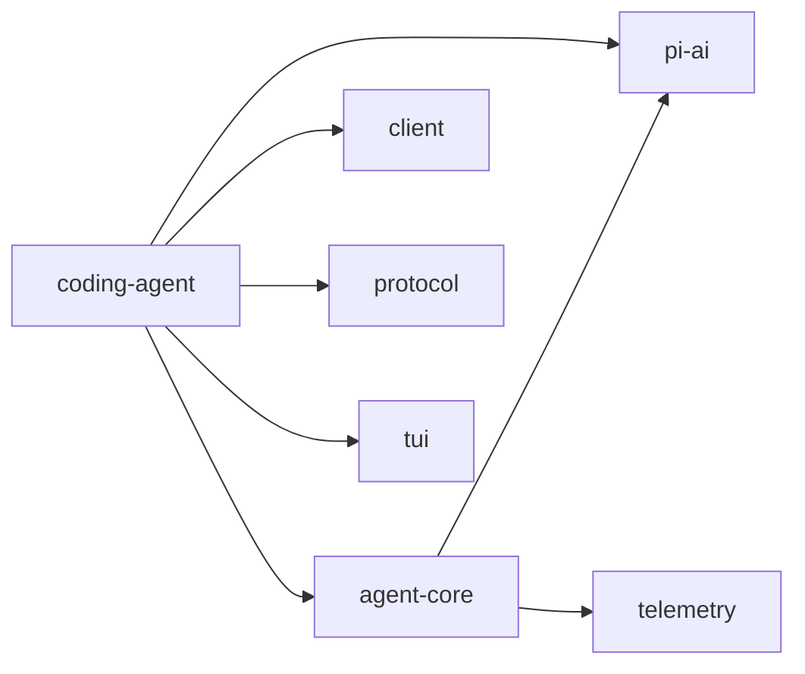

# 项目介绍与特性

<cite>
**本文引用的文件**
- [README.md](file://README.md)
- [package.json](file://package.json)
- [AGENTS.md](file://AGENTS.md)
- [CONTRIBUTING.md](file://CONTRIBUTING.md)
- [packages/agent/package.json](file://packages/agent/package.json)
- [packages/ai/package.json](file://packages/ai/package.json)
- [packages/coding-agent/package.json](file://packages/coding-agent/package.json)
- [packages/agent/src/index.ts](file://packages/agent/src/index.ts)
- [packages/ai/src/index.ts](file://packages/ai/src/index.ts)
</cite>

## 目录
1. [简介](#简介)
2. [项目结构](#项目结构)
3. [核心组件](#核心组件)
4. [架构总览](#架构总览)
5. [详细组件分析](#详细组件分析)
6. [依赖关系分析](#依赖关系分析)
7. [性能考量](#性能考量)
8. [故障排查指南](#故障排查指南)
9. [结论](#结论)
10. [附录](#附录)

## 简介
Pi Agent Harness 是一个可扩展的 AI 代理框架，专注于交互式编码助手能力。它通过统一的 LLM API 抽象层、工具调用系统、状态管理与会话管理，为个人与企业开发者提供强大的 AI 编码辅助能力，并支持自定义工具与技能扩展。项目采用 MIT 许可证开源，并提供社区资源链接（网站、文档、Discord）。

- 核心价值：以最小核心、最大可扩性为原则，将“统一模型接入 + 工具编排 + 会话与状态”作为基础能力，上层通过 CLI/TUI 提供交互体验，并通过扩展机制承载更多业务场景。
- 多提供商 LLM 支持：OpenAI、Anthropic、Google、AWS Bedrock 等，统一接口屏蔽差异。
- 工具与技能：内置读写、Bash、编辑、写入等工具，并可扩展自定义工具与技能。
- 会话与状态：提供会话生命周期管理、上下文压缩与分支摘要等能力，保障长对话与复杂任务的可控性与稳定性。
- 许可与社区：MIT 许可证；官网 pi.dev、文档 pi.dev/docs/latest、Discord 社区。

**章节来源**
- [README.md:13-36](file://README.md#L13-L36)
- [README.md:106-108](file://README.md#L106-L108)

## 项目结构
仓库采用 monorepo 组织，核心包分布在 packages 目录下，顶层脚本负责构建、发布与质量检查。

**图表来源**
- [package.json:5-13](file://package.json#L5-L13)

**章节来源**
- [package.json:1-75](file://package.json#L1-L75)

## 核心组件
- 统一 LLM API（@earendil-works/pi-ai）
  - 提供跨厂商的统一接口与自动模型发现、提供者配置、OAuth 与认证辅助、事件流与重试等通用能力。
  - 暴露 providers/* 与 api/* 子路径，便于按需加载与扩展。
- Agent 运行时（@earendil-works/pi-agent-core）
  - 提供传输抽象、工具调用、状态管理、会话 harness、消息与提示模板、压缩与分支摘要、遥测等。
  - 导出丰富的类型与工具函数，供上层应用组合使用。
- 交互式编码 CLI（@earendil-works/pi-coding-agent）
  - 面向开发者的命令行入口，集成 TUI、工具集与会话管理，支持本地二进制打包与多种运行模式。
- 终端 UI（@earendil-works/pi-tui）
  - 提供差分渲染等终端交互能力，提升交互体验。
- 遥测（@earendil-works/pi-telemetry）
  - 供应商无关的遥测契约与参考实现，用于观测与诊断。

**章节来源**
- [packages/ai/package.json:1-101](file://packages/ai/package.json#L1-L101)
- [packages/agent/package.json:1-69](file://packages/agent/package.json#L1-L69)
- [packages/coding-agent/package.json:1-109](file://packages/coding-agent/package.json#L1-L109)
- [packages/agent/src/index.ts:1-146](file://packages/agent/src/index.ts#L1-L146)
- [packages/ai/src/index.ts:1-48](file://packages/ai/src/index.ts#L1-L48)

## 架构总览
下图展示了从 CLI 到 Agent 运行时，再到统一 LLM API 的调用链路，以及工具与会话管理的参与点。

**图表来源**
- [packages/coding-agent/package.json:1-109](file://packages/coding-agent/package.json#L1-L109)
- [packages/agent/src/index.ts:1-146](file://packages/agent/src/index.ts#L1-L146)
- [packages/ai/src/index.ts:1-48](file://packages/ai/src/index.ts#L1-L48)

## 详细组件分析

### 统一 LLM API（@earendil-works/pi-ai）
- 目标：屏蔽不同 LLM 提供商的差异，提供一致的编程接口与配置方式。
- 关键能力：
  - 自动模型发现与目录生成，便于按需提供模型清单。
  - 提供商注册与工厂方法，位于 providers/*。
  - 认证与 OAuth 辅助，简化凭据管理。
  - 事件流、重试、溢出处理等通用工具。
- 扩展点：新增提供商只需在 providers/* 中实现并注册，即可被上层消费。

**图表来源**
- [packages/ai/src/index.ts:1-48](file://packages/ai/src/index.ts#L1-L48)
- [packages/ai/package.json:62-74](file://packages/ai/package.json#L62-L74)

**章节来源**
- [packages/ai/package.json:1-101](file://packages/ai/package.json#L1-L101)
- [packages/ai/src/index.ts:1-48](file://packages/ai/src/index.ts#L1-L48)

### Agent 运行时（@earendil-works/pi-agent-core）
- 目标：提供通用的 Agent 运行时，包含工具调用、状态管理、会话 harness、消息与提示模板、压缩与分支摘要、遥测等。
- 关键能力：
  - 工具与技能：导出工具集合与技能定义，便于扩展。
  - 会话与压缩：会话 harness、上下文压缩、分支摘要，控制上下文长度与成本。
  - 遥测：统一的 span/event 定义与记录，便于观测。
  - 传输抽象：解耦底层通信细节。
- 扩展点：通过实现 FileSystem、Shell、Skill 等接口，适配不同环境与业务需求。

**图表来源**
- [packages/agent/src/index.ts:43-146](file://packages/agent/src/index.ts#L43-L146)
- [packages/agent/package.json:37-44](file://packages/agent/package.json#L37-L44)

**章节来源**
- [packages/agent/package.json:1-69](file://packages/agent/package.json#L1-L69)
- [packages/agent/src/index.ts:1-146](file://packages/agent/src/index.ts#L1-L146)

### 交互式编码 CLI（@earendil-works/pi-coding-agent）
- 目标：提供面向开发者的交互式编码助手入口，集成 TUI、工具与会话管理。
- 关键能力：
  - 内置工具：读取、Bash、编辑、写入等，覆盖常见编码任务。
  - 会话管理：持久化与恢复，支持多会话与上下文切换。
  - 构建产物：支持 Node/Bun 二进制打包，便于分发与部署。
  - 扩展机制：示例与扩展点，便于集成第三方工具与服务。

**图表来源**
- [packages/coding-agent/package.json:1-109](file://packages/coding-agent/package.json#L1-L109)

**章节来源**
- [packages/coding-agent/package.json:1-109](file://packages/coding-agent/package.json#L1-L109)

### 终端 UI（@earendil-works/pi-tui）
- 目标：提供高性能的终端交互界面，支持差分渲染与主题/资源管理。
- 价值：提升交互体验，降低信息密度下的阅读负担。

**章节来源**
- [package.json:16-17](file://package.json#L16-L17)

### 遥测（@earendil-works/pi-telemetry）
- 目标：供应商无关的遥测契约与参考实现，统一事件与 Span 定义。
- 价值：便于跨组件观测、诊断与性能分析。

**章节来源**
- [packages/agent/package.json:37-44](file://packages/agent/package.json#L37-L44)
- [packages/agent/src/index.ts:3-42](file://packages/agent/src/index.ts#L3-L42)

## 依赖关系分析
- 包间依赖
  - coding-agent 依赖 agent-core、ai、client、protocol、tui 等，形成“CLI → Agent → LLM”的主链路。
  - agent-core 依赖 ai 与 telemetry，提供运行时与观测能力。
  - ai 提供 providers/* 与 api/*，屏蔽各 LLM 差异。
- 外部依赖
  - OpenAI、Anthropic、Google、AWS Bedrock 等 SDK 由 ai 包引入，统一封装。
- 版本与工程
  - 根 package.json 统一管理工作区与脚本，确保构建顺序与一致性。

**图表来源**
- [packages/coding-agent/package.json:45-67](file://packages/coding-agent/package.json#L45-L67)
- [packages/agent/package.json:37-44](file://packages/agent/package.json#L37-L44)
- [packages/ai/package.json:62-74](file://packages/ai/package.json#L62-L74)

**章节来源**
- [package.json:1-75](file://package.json#L1-L75)
- [packages/coding-agent/package.json:1-109](file://packages/coding-agent/package.json#L1-L109)
- [packages/agent/package.json:1-69](file://packages/agent/package.json#L1-L69)
- [packages/ai/package.json:1-101](file://packages/ai/package.json#L1-L101)

## 性能考量
- 上下文压缩与分支摘要：通过压缩策略与分支摘要减少上下文长度，降低 Token 消耗与延迟。
- 流式处理：利用事件流与增量输出，提升交互响应速度。
- 依赖锁定与安全：严格依赖版本锁定与审计，避免供应链风险影响稳定性。
- 构建优化：离线构建与资源拷贝，减少网络依赖与构建时间。

[本节为通用指导，不直接分析具体文件]

## 故障排查指南
- 权限与沙箱
  - 默认以启动进程的用户权限运行，如需更强隔离，建议使用容器或沙箱方案（Gondolin、Docker、OpenShell）。
- 贡献与测试
  - 提交前需运行 check 与 test，遵循贡献规范与质量门槛。
- 常见问题定位
  - 使用遥测与日志观察 Agent 循环与工具执行过程。
  - 通过 TUI 与导出功能查看会话与上下文状态。

**章节来源**
- [README.md:38-47](file://README.md#L38-L47)
- [CONTRIBUTING.md:56-67](file://CONTRIBUTING.md#L56-L67)
- [AGENTS.md:29-40](file://AGENTS.md#L29-L40)

## 结论
Pi Agent Harness 以“统一 LLM 抽象 + 可扩展 Agent 运行时 + 交互式 CLI”为核心，为企业与个人开发者提供强大且灵活的 AI 编码辅助能力。其模块化设计与严格的工程实践，使得在保持核心精简的同时，能够便捷地扩展工具、技能与提供商，满足多样化业务场景。

[本节为总结性内容，不直接分析具体文件]

## 附录
- 许可证：MIT
- 社区与资源
  - 官网：https://pi.dev
  - 文档：https://pi.dev/docs/latest
  - Discord 社区：https://discord.com/invite/3cU7Bz4UPx

**章节来源**
- [README.md:21-24](file://README.md#L21-L24)
- [README.md:106-108](file://README.md#L106-L108)