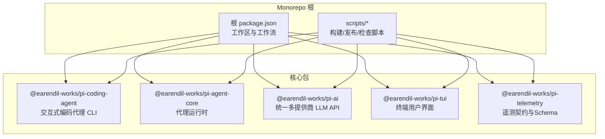
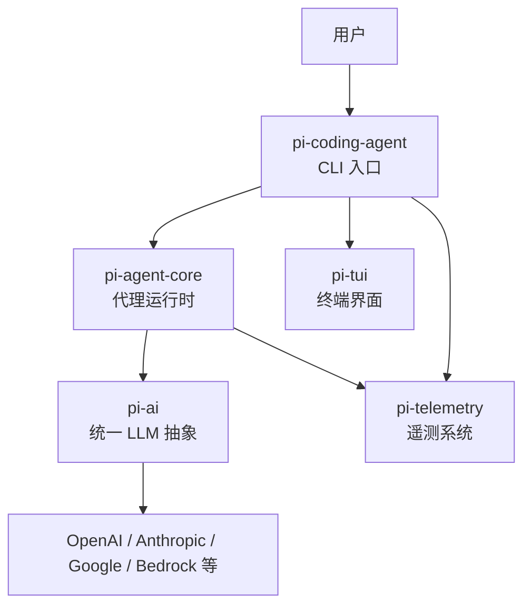
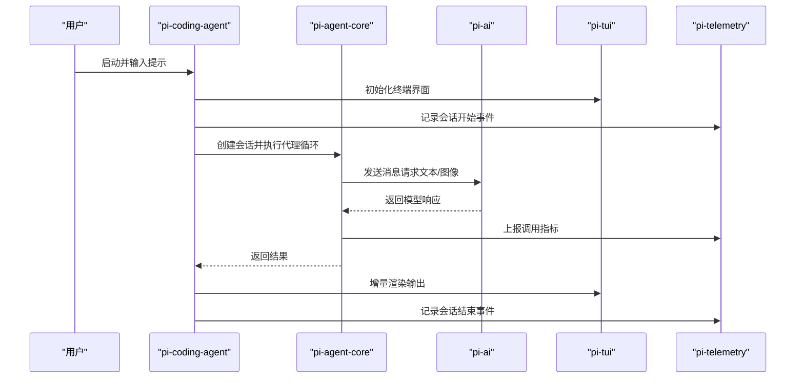
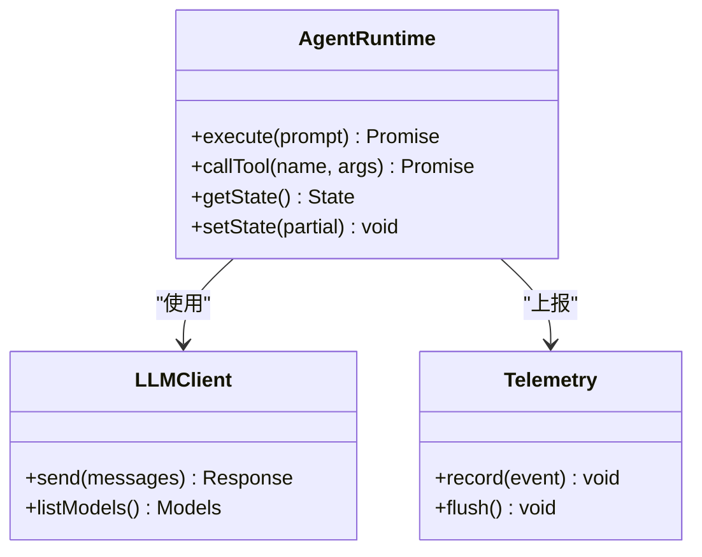
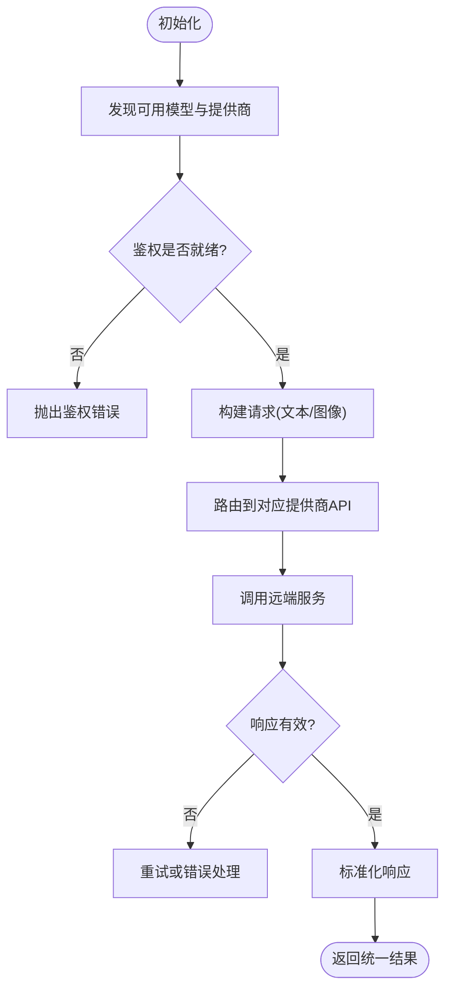
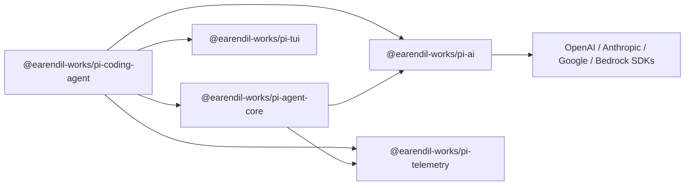

# 项目概述

<cite>
**本文引用的文件**
- [README.md](file://README.md)
- [package.json](file://package.json)
- [CONTRIBUTING.md](file://CONTRIBUTING.md)
- [AGENTS.md](file://AGENTS.md)
- [packages/coding-agent/package.json](file://packages/coding-agent/package.json)
- [packages/agent/package.json](file://packages/agent/package.json)
- [packages/ai/package.json](file://packages/ai/package.json)
- [packages/tui/package.json](file://packages/tui/package.json)
- [packages/telemetry/package.json](file://packages/telemetry/package.json)
</cite>

## 目录
1. [简介](#简介)
2. [项目结构](#项目结构)
3. [核心组件](#核心组件)
4. [架构总览](#架构总览)
5. [详细组件分析](#详细组件分析)
6. [依赖关系分析](#依赖关系分析)
7. [性能考量](#性能考量)
8. [故障排查指南](#故障排查指南)
9. [结论](#结论)
10. [附录：快速开始](#附录快速开始)

## 简介
Pi Agent Harness 是一个可扩展的 AI 代理框架，提供交互式编码代理、统一的多提供商 LLM 接入以及可插拔的代理运行时。其核心价值在于：
- 统一的 LLM 抽象层：屏蔽 OpenAI、Anthropic、Google、Bedrock 等厂商差异，提供一致的调用与模型发现能力。
- 可扩展的代理架构：通过工具调用、状态管理与传输抽象，支持在多种环境中运行（CLI、RPC、服务端）。
- 终端用户界面：基于差分渲染的高效 TUI，提升交互体验。
- 遥测系统：供应商中立的遥测契约与类型化 Schema，便于观测与诊断。

技术栈概览：
- TypeScript + Node.js/Bun 双运行时友好
- Monorepo 工作区管理（npm workspaces）
- Vitest 测试框架
- Biome 代码检查与格式化
- 构建与发布脚本链（含离线构建、二进制打包、模型数据生成）

**章节来源**
- [README.md:13-36](file://README.md#L13-L36)
- [package.json:1-13](file://package.json#L1-L13)

## 项目结构
仓库采用 monorepo 组织方式，核心包位于 packages 目录下，根级 scripts 提供构建、检查、发布等工程化脚本。关键目录与职责：
- packages/agent：代理运行时（工具调用、状态管理、传输抽象）
- packages/ai：统一多提供商 LLM API（模型注册、鉴权、图像/文本模型）
- packages/coding-agent：交互式编码代理 CLI（会话管理、工具集、模式切换）
- packages/tui：终端 UI 库（差分渲染、跨平台原生加速）
- packages/telemetry：遥测契约与类型化工具
- packages/client/server/protocol/session-backends：客户端/服务端/协议与会话后端（支撑 RPC 与服务端部署）
- scripts：工程脚本（构建、发布、模型数据生成、安全检查）

**图表来源**
- [package.json:1-13](file://package.json#L1-L13)
- [packages/coding-agent/package.json:1-13](file://packages/coding-agent/package.json#L1-L13)
- [packages/agent/package.json:1-13](file://packages/agent/package.json#L1-L13)
- [packages/ai/package.json:1-13](file://packages/ai/package.json#L1-L13)
- [packages/tui/package.json:1-13](file://packages/tui/package.json#L1-L13)
- [packages/telemetry/package.json:1-13](file://packages/telemetry/package.json#L1-L13)

**章节来源**
- [package.json:1-13](file://package.json#L1-L13)
- [README.md:26-36](file://README.md#L26-L36)

## 核心组件
- pi-coding-agent（交互式编码代理 CLI）
  - 提供 read、bash、edit、write 等工具与会话管理，支持多种模式与扩展点。
  - 作为用户入口，编排代理运行、TUI 展示与遥测上报。
- pi-agent-core（代理运行时）
  - 实现工具调用、状态管理、传输抽象与附件支持，是“智能体”的核心引擎。
- pi-ai（统一多提供商 LLM API）
  - 自动模型发现与提供商配置，封装 OpenAI、Anthropic、Google、Bedrock 等。
- pi-tui（终端用户界面）
  - 差分渲染的终端 UI 库，提供高效文本应用渲染能力。
- pi-telemetry（遥测系统）
  - 供应商中立的遥测契约、参考适配器、一致性测试与类型化 Schema。

**章节来源**
- [README.md:26-36](file://README.md#L26-L36)
- [packages/coding-agent/package.json:1-13](file://packages/coding-agent/package.json#L1-L13)
- [packages/agent/package.json:1-13](file://packages/agent/package.json#L1-L13)
- [packages/ai/package.json:1-13](file://packages/ai/package.json#L1-L13)
- [packages/tui/package.json:1-13](file://packages/tui/package.json#L1-L13)
- [packages/telemetry/package.json:1-13](file://packages/telemetry/package.json#L1-L13)

## 架构总览
整体架构围绕“CLI 入口 → 代理运行时 → 统一 LLM 抽象 → 终端界面/遥测”的分层设计，强调解耦与可扩展性。

**图表来源**
- [packages/coding-agent/package.json:45-67](file://packages/coding-agent/package.json#L45-L67)
- [packages/agent/package.json:37-44](file://packages/agent/package.json#L37-L44)
- [packages/ai/package.json:62-74](file://packages/ai/package.json#L62-L74)
- [packages/tui/package.json:47-50](file://packages/tui/package.json#L47-L50)
- [packages/telemetry/package.json:1-13](file://packages/telemetry/package.json#L1-L13)

## 详细组件分析

### pi-coding-agent（交互式编码代理 CLI）
- 角色与职责
  - 用户交互入口，负责解析命令、加载配置、启动会话、调度工具执行、渲染输出。
  - 集成 TUI 进行终端渲染，集成 Agent Core 驱动智能体循环，集成 Telemetry 上报指标。
- 关键特性
  - 工具集：read、bash、edit、write 等，配合会话上下文与权限边界。
  - 模式与扩展：支持多种交互模式与外部扩展点。
  - 二进制构建：支持 Bun 编译为独立二进制，便于分发与沙箱化部署。
- 依赖关系
  - 依赖 agent-core、ai、tui、client、protocol 等内部包，形成完整闭环。

**图表来源**
- [packages/coding-agent/package.json:45-67](file://packages/coding-agent/package.json#L45-L67)
- [packages/agent/package.json:37-44](file://packages/agent/package.json#L37-L44)
- [packages/ai/package.json:62-74](file://packages/ai/package.json#L62-L74)
- [packages/tui/package.json:47-50](file://packages/tui/package.json#L47-L50)
- [packages/telemetry/package.json:1-13](file://packages/telemetry/package.json#L1-L13)

**章节来源**
- [packages/coding-agent/package.json:1-13](file://packages/coding-agent/package.json#L1-L13)
- [packages/coding-agent/package.json:45-67](file://packages/coding-agent/package.json#L45-L67)

### pi-agent-core（代理运行时）
- 角色与职责
  - 提供通用代理能力：工具调用、状态管理、传输抽象、附件支持。
  - 与 LLM 抽象层对接，驱动智能体循环，协调会话生命周期。
- 关键特性
  - 传输抽象：支持本地进程、RPC 等多种传输方式。
  - 状态管理：会话上下文、工具调用状态、错误恢复。
  - 扩展点：插件式工具与处理器，便于生态扩展。
- 依赖关系
  - 依赖 ai（LLM 抽象）、telemetry（遥测），可选依赖 diff、yaml、typebox 等。

**图表来源**
- [packages/agent/package.json:37-44](file://packages/agent/package.json#L37-L44)
- [packages/ai/package.json:62-74](file://packages/ai/package.json#L62-L74)
- [packages/telemetry/package.json:1-13](file://packages/telemetry/package.json#L1-L13)

**章节来源**
- [packages/agent/package.json:1-13](file://packages/agent/package.json#L1-L13)
- [packages/agent/package.json:37-44](file://packages/agent/package.json#L37-L44)

### pi-ai（统一多提供商 LLM API）
- 角色与职责
  - 统一文本/图像模型接口，自动模型发现与提供商配置。
  - 封装 OpenAI、Anthropic、Google、Bedrock 等 SDK，提供一致的类型与行为。
- 关键特性
  - 提供商注册：集中式 Provider 注册表，支持动态发现。
  - 鉴权与代理：环境变量鉴权、HTTP 代理支持。
  - 模型目录：生成与维护模型清单，支持离线构建。
- 依赖关系
  - 依赖多个官方 SDK（openai、@anthropic-ai/sdk、@google/genai、@aws-sdk/client-bedrock-runtime），并通过 telemetry 上报指标。

**图表来源**
- [packages/ai/package.json:62-74](file://packages/ai/package.json#L62-L74)
- [packages/ai/package.json:50-60](file://packages/ai/package.json#L50-L60)

**章节来源**
- [packages/ai/package.json:1-13](file://packages/ai/package.json#L1-L13)
- [packages/ai/package.json:50-74](file://packages/ai/package.json#L50-L74)

### pi-tui（终端用户界面）
- 角色与职责
  - 提供差分渲染的终端 UI 能力，优化大量文本输出的性能。
  - 支持跨平台原生加速（Windows/Darwin 预编译模块）。
- 关键特性
  - 增量更新：仅重绘变化区域，减少终端刷新开销。
  - 标记与高亮：Markdown 渲染与语法高亮支持。
- 依赖关系
  - 轻量依赖 marked、get-east-asian-width，开发期使用 @xterm/headless 进行测试。

**章节来源**
- [packages/tui/package.json:1-13](file://packages/tui/package.json#L1-L13)
- [packages/tui/package.json:47-50](file://packages/tui/package.json#L47-L50)

### pi-telemetry（遥测系统）
- 角色与职责
  - 定义供应商中立的遥测契约与类型化 Schema，提供测试辅助与参考实现。
- 关键特性
  - 类型安全：基于 TypeBox 等工具保障数据结构一致性。
  - 可插拔：支持不同后端适配，便于接入第三方观测平台。
- 依赖关系
  - 无强外部依赖，保持契约层的轻量化。

**章节来源**
- [packages/telemetry/package.json:1-13](file://packages/telemetry/package.json#L1-L13)

## 依赖关系分析
各包之间的依赖关系清晰分层，CLI 作为顶层编排者，向下依赖 Agent Core、AI、TUI、Telemetry；Agent Core 依赖 AI 与 Telemetry；AI 依赖多家厂商 SDK；TUI 与 Telemetry 相对独立。

**图表来源**
- [packages/coding-agent/package.json:45-67](file://packages/coding-agent/package.json#L45-L67)
- [packages/agent/package.json:37-44](file://packages/agent/package.json#L37-L44)
- [packages/ai/package.json:62-74](file://packages/ai/package.json#L62-L74)

**章节来源**
- [packages/coding-agent/package.json:45-67](file://packages/coding-agent/package.json#L45-L67)
- [packages/agent/package.json:37-44](file://packages/agent/package.json#L37-L44)
- [packages/ai/package.json:62-74](file://packages/ai/package.json#L62-L74)

## 性能考量
- 差分渲染：TUI 通过增量更新降低终端刷新成本，适合长时间会话与大量输出场景。
- 模型数据缓存：AI 包支持离线构建与模型数据缓存，减少网络依赖与启动时间。
- 传输抽象：Agent Core 的传输层允许在不同环境（本地/RPC）下选择最优路径，避免不必要的序列化与网络开销。
- 依赖锁定与安全：根级脚本与 npm 配置确保依赖版本精确锁定，减少安装与运行时不确定性。

[本节为通用指导，不直接分析具体文件]

## 故障排查指南
- 权限与隔离
  - 默认以启动用户权限运行，如需更强边界，建议使用容器化或沙箱（Gondolin、Docker、OpenShell）。
- 构建与安装
  - 使用 npm ci --ignore-scripts 或 npm install --ignore-scripts 以避免生命周期脚本干扰。
  - 构建二进制时注意平台与模型数据参数（如 --offline-model-data）。
- 测试与检查
  - 使用 ./test.sh 运行测试（跳过需要 LLM API Key 的测试）。
  - 使用 npm run check 执行 lint、格式与类型检查。
- 常见问题定位
  - 鉴权失败：检查环境变量与提供商密钥配置。
  - 模型不可用：确认模型目录已生成且网络可达（或启用离线模式）。
  - 终端渲染异常：检查终端尺寸与 TUI 原生模块是否正确加载。

**章节来源**
- [README.md:38-47](file://README.md#L38-L47)
- [README.md:52-61](file://README.md#L52-L61)
- [CONTRIBUTING.md:56-67](file://CONTRIBUTING.md#L56-L67)

## 结论
Pi Agent Harness 通过清晰的模块化设计与统一的 LLM 抽象，提供了强大的交互式编码代理能力与可扩展的运行时。结合高效的 TUI 与遥测系统，开发者可以快速构建面向终端的智能体应用，并在多种环境中稳定运行。monorepo 与严格的依赖管理确保了项目的可维护性与安全性。

[本节为总结性内容，不直接分析具体文件]

## 附录：快速开始
- 环境要求
  - Node.js >= 22.19.0（推荐同时具备 Bun 环境用于二进制构建）
- 安装与构建
  - 安装依赖：npm install --ignore-scripts
  - 构建全部包：npm run build
  - 离线构建：npm run build:offline
- 运行与测试
  - 运行测试：./test.sh
  - 从源码运行：./pi-test.sh（可在任意目录执行）
- 基本使用
  - 启动 CLI：根据 README 指引运行 pi 命令进入交互模式或执行一次性提示。
  - 列出模型：使用提供的命令查看可用模型与提供商。
  - 设置鉴权：按提供商要求配置环境变量（如 OpenAI、Anthropic、Google、Bedrock）。

**章节来源**
- [README.md:52-61](file://README.md#L52-L61)
- [README.md:63-74](file://README.md#L63-L74)
- [AGENTS.md:29-38](file://AGENTS.md#L29-L38)